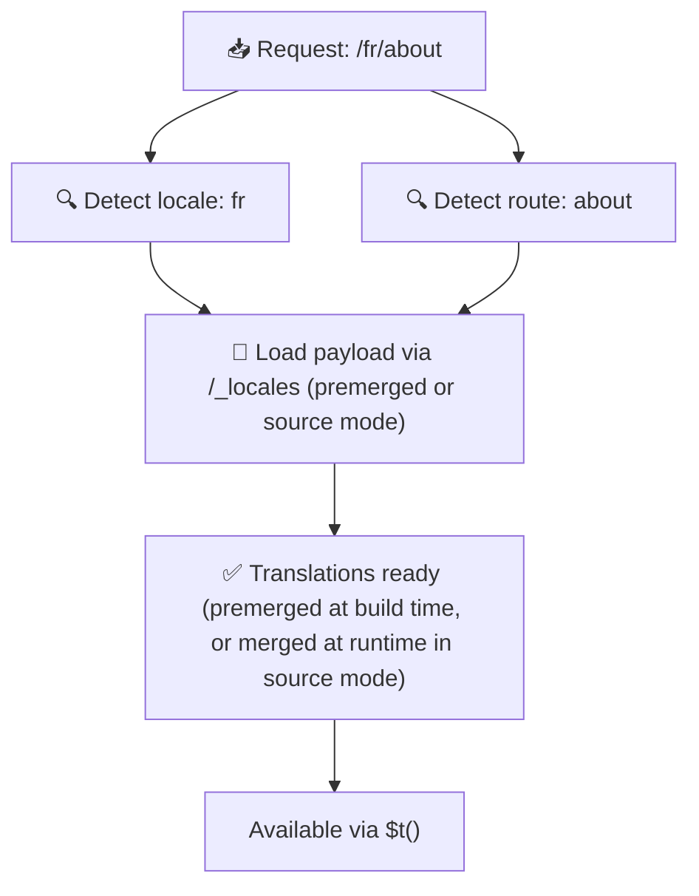

# 📂 Guia de estrutura de pastas

## 📖 Introdução

Organizar eficazmente os seus ficheiros de tradução é fundamental para manter um sistema de internacionalização (i18n) escalável e eficiente. O `Nuxt I18n Micro` simplifica este processo ao oferecer uma abordagem clara para gerir traduções ao nível da raiz e específicas por página. Este guia irá conduzi-lo pela estrutura de pastas recomendada e explicar como o `Nuxt I18n Micro` gere estas traduções.

## 🗂️ Estrutura de pastas recomendada

O `Nuxt I18n Micro` organiza as traduções em ficheiros ao nível da raiz e em ficheiros específicos por página dentro do diretório `pages`. Com `translationPayloads.mode: 'premerged'` (predefinição), as traduções ao nível da raiz são automaticamente fundidas em cada ficheiro de página em build-time, pelo que cada página tem um conjunto completo de traduções sem sobrecarga de fusão em runtime.

Com `mode: 'source'`, os ficheiros de origem permanecem separados nos assets do Nitro e são fundidos em runtime através da rota `/_locales`. Consulte [Saída de payloads serverless](/guides/performance#serverless-payload-output).

### 🔧 Estrutura básica

Segue-se um exemplo básico da estrutura de pastas que deve seguir:

```text
locales/
├── pages/
│   ├── index/
│   │   ├── en.json
│   │   ├── fr.json
│   │   └── ar.json
│   ├── about/
│   │   ├── en.json
│   │   ├── fr.json
│   │   └── ar.json
├── en.json
├── fr.json
└── ar.json

```

### 📄 Explicação da estrutura

#### 1. 🌍 Ficheiros de tradução ao nível da raiz

- **Caminho:** `/locales/\{locale\}.json` (p. ex., `/locales/en.json`)
- **Objetivo:** estes ficheiros contêm traduções partilhadas por toda a aplicação (menus de navegação, cabeçalhos, rodapés, etc.). Com `mode: 'premerged'` (predefinição), são fundidos automaticamente em cada ficheiro específico por página em build-time, para que o servidor devolva um único ficheiro pré-construído por página.

  **Conteúdo de exemplo (`/locales/en.json`):**

  ```json
  {
    "menu": {
      "home": "Home",
      "about": "About Us",
      "contact": "Contact"
    },
    "footer": {
      "copyright": "© 2024 Your Company"
    }
  }
  ```

#### 2. 📄 Ficheiros de tradução específicos por página

- **Caminho:** `/locales/pages/\{routeName\}/\{locale\}.json` (p. ex., `/locales/pages/index/en.json`)
- **Objetivo:** estes ficheiros contêm traduções específicas de páginas individuais. Com `mode: 'premerged'` (predefinição), as traduções ao nível da raiz são fundidas como base em build-time, tornando cada ficheiro de página autónomo.

  **Conteúdo de exemplo (`/locales/pages/index/en.json`):**

  ```json
  {
    "title": "Welcome to Our Website",
    "description": "We offer a wide range of products and services to meet your needs."
  }
  ```

  **Conteúdo de exemplo (`/locales/pages/about/en.json`):**

  ```json
  {
    "title": "About Us",
    "description": "Learn more about our mission, vision, and values."
  }
  ```

### 📂 Tratamento de rotas dinâmicas e caminhos aninhados

O `Nuxt I18n Micro` transforma automaticamente segmentos dinâmicos e caminhos aninhados nas rotas numa estrutura de pastas plana, utilizando uma convenção de renomeação específica. Isto garante que todas as traduções são guardadas de forma consistente e facilmente acessível.

#### Estrutura de pastas para traduções de rotas dinâmicas

Ao lidar com rotas dinâmicas, como `/products/[id]`, o módulo converte o segmento dinâmico `[id]` num formato estático dentro da estrutura de ficheiros.

**Exemplo de estrutura de pastas para rotas dinâmicas:**

Para uma rota como `/products/[id]`, os ficheiros de tradução seriam guardados numa pasta chamada `products-id`:

```text
locales/pages/
├── products-id/
│   ├── en.json
│   ├── fr.json
│   └── ar.json

```

**Exemplo de estrutura de pastas para rotas dinâmicas aninhadas:**

Para uma rota aninhada como `/products/key/[id]`, os ficheiros de tradução seriam guardados numa pasta chamada `products-key-id`:

```text
locales/pages/
├── products-key-id/
│   ├── en.json
│   ├── fr.json
│   └── ar.json

```

**Exemplo de estrutura de pastas para rotas aninhadas em vários níveis:**

Para uma rota aninhada mais complexa como `/products/category/[id]/details`, os ficheiros de tradução seriam guardados numa pasta chamada `products-category-id-details`:

```text
locales/pages/
├── products-category-id-details/
│   ├── en.json
│   ├── fr.json
│   └── ar.json

```

### 🛠 Personalizar a estrutura de diretórios

Se preferir guardar as traduções num diretório diferente, o `Nuxt I18n Micro` permite personalizar o diretório onde os ficheiros de tradução são guardados. Pode configurá-lo no seu ficheiro `nuxt.config.ts`.

**Exemplo: personalização do diretório de traduções**

```typescript
export default defineNuxtConfig({
  i18n: {
    translationDir: 'i18n', // Custom directory path
  },
})
```

Isto indicará ao `Nuxt I18n Micro` que deve procurar os ficheiros de tradução no diretório `/i18n` em vez do diretório predefinido `/locales`.

## ⚙️ Como as traduções são carregadas

### 🌍 Rotas dinâmicas de locale

O `Nuxt I18n Micro` utiliza rotas dinâmicas de locale para carregar traduções de forma eficiente. Quando um utilizador visita uma página, o módulo determina o locale adequado e carrega os ficheiros de tradução correspondentes com base na rota atual e no locale.



Por exemplo:

- Visitar `/en/index` carregará as traduções de `/locales/pages/index/en.json`.
- Visitar `/fr/about` carregará as traduções de `/locales/pages/about/fr.json`.

Este método garante que apenas as traduções necessárias são carregadas, otimizando tanto a carga do servidor como o desempenho do lado do cliente.

### 💾 Cache e pré-renderização

Para melhorar ainda mais o desempenho, o `Nuxt I18n Micro` suporta a colocação em cache e a pré-renderização dos ficheiros de tradução:

- **Cache**: uma vez carregado um ficheiro de tradução, este é colocado em cache para pedidos subsequentes, reduzindo a necessidade de obter repetidamente os mesmos dados.
- **Pré-renderização**: durante o processo de build, pode pré-renderizar ficheiros de tradução para todos os locales e rotas configurados, permitindo que sejam servidos diretamente pelo servidor sem atrasos em runtime.

## 📝 Boas práticas

### 📂 Utilize ficheiros específicos por página de forma criteriosa

Tire partido dos ficheiros específicos por página para manter as traduções organizadas. Isto mantém as traduções de cada página enxutas e rápidas de carregar, algo particularmente importante para páginas com conteúdo complexo ou volumoso.

### 🔑 Mantenha chaves de tradução consistentes

Utilize convenções de nomenclatura consistentes para as suas chaves de tradução entre ficheiros. Isto ajuda a manter a clareza e evita problemas na gestão das traduções, especialmente à medida que a aplicação cresce.

### 🗂️ Organize as traduções por contexto

Agrupe traduções relacionadas dentro dos seus ficheiros. Por exemplo, agrupe todos os rótulos de botões sob uma chave `buttons` e todos os textos relacionados com formulários sob uma chave `forms`. Isto melhora a legibilidade e facilita a gestão das traduções entre diferentes locales.

### ⚠️ Limite de profundidade de aninhamento (recomendado: 2 níveis)

Durante a navegação do lado do cliente, o `Nuxt I18n Micro` utiliza uma fusão profunda otimizada de 2 níveis para combinar as traduções das páginas de saída e de entrada. Isto garante que chaves aninhadas sobrepostas (por exemplo, ambas as páginas têm chaves em `common.*`) são preservadas durante as animações de transição.

**Isto funciona corretamente para a estrutura padrão `Secção → Chave → Valor` (2 níveis):**

```json
// Page A translations
{ "common": { "fromA": "Text A" } }

// Page B translations
{ "common": { "fromB": "Text B" } }

// During transition, both are available:
// { "common": { "fromA": "Text A", "fromB": "Text B" } }
```

**No entanto, se utilizar 3 ou mais níveis de aninhamento, chaves mais profundas poderão ser substituídas durante as transições:**

```json
// Page A translations
{ "auth": { "form": { "login": "Login" } } }

// Page B translations
{ "auth": { "form": { "register": "Register" } } }

// During transition: "login" key is lost
// { "auth": { "form": { "register": "Register" } } }
```

<Tip>

</Tip>

### 🧹 Limpe regularmente as traduções não utilizadas

Ao longo do tempo, a sua aplicação pode acumular chaves de tradução não utilizadas, especialmente se funcionalidades forem removidas ou reestruturadas. Reveja e limpe periodicamente os seus ficheiros de tradução para os manter enxutos e fáceis de manter.
