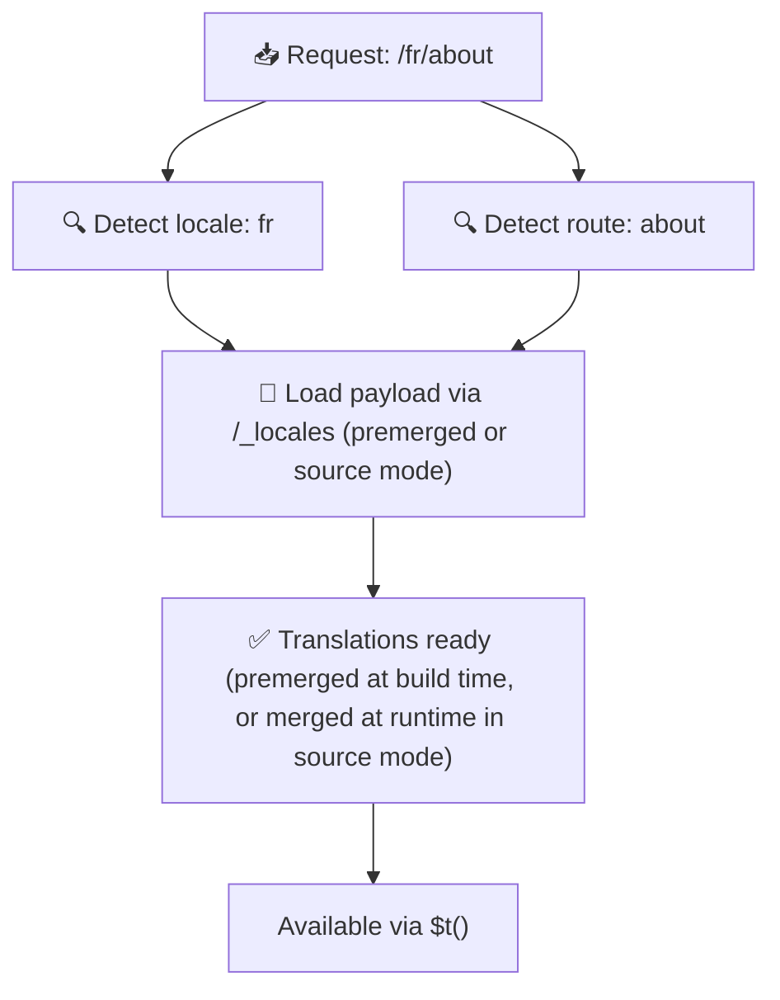

# 📂 Guia de estrutura de pastas

## 📖 Introdução

Organizar os seus ficheiros de tradução de forma eficaz é essencial para manter um sistema de internacionalização (i18n) escalável e eficiente. O `Nuxt I18n Micro` simplifica este processo oferecendo uma abordagem clara para gerir traduções de nível raiz e específicas de página. Este guia orienta-o pela estrutura de pastas recomendada e explica como o `Nuxt I18n Micro` trata destas traduções.

## 🗂️ Estrutura de pastas recomendada

O `Nuxt I18n Micro` organiza as traduções em ficheiros de nível raiz e ficheiros específicos de página dentro do diretório `pages`. Com `translationPayloads.mode: 'premerged'` (predefinição), as traduções de nível raiz são fundidas automaticamente em cada ficheiro de página em tempo de build, pelo que cada página tem um conjunto completo de traduções sem overhead de fusão em runtime.

Com `mode: 'source'`, os ficheiros de origem mantêm-se separados nos assets do Nitro e são fundidos em runtime através da rota `/_locales`. Consulte [Saída de payload serverless](/guides/performance#serverless-payload-output).

### 🔧 Estrutura básica

Segue um exemplo básico da estrutura de pastas que deve seguir:

```text
locales/
├── pages/
│   ├── index/
│   │   ├── en.json
│   │   ├── fr.json
│   │   └── ar.json
│   ├── about/
│   │   ├── en.json
│   │   ├── fr.json
│   │   └── ar.json
├── en.json
├── fr.json
└── ar.json

```

### 📄 Explicação da estrutura

#### 1. 🌍 Ficheiros de tradução de nível raiz

- **Caminho:** `/locales/\{locale\}.json` (por exemplo, `/locales/en.json`)
- **Propósito:** estes ficheiros contêm traduções partilhadas por toda a aplicação (menus de navegação, cabeçalhos, rodapés, etc.). Com `mode: 'premerged'` (predefinição), são fundidos automaticamente em cada ficheiro específico de página em tempo de build, pelo que o servidor devolve um único ficheiro pré-construído por página.

  **Exemplo de conteúdo (`/locales/en.json`):**

  ```json
  {
    "menu": {
      "home": "Home",
      "about": "About Us",
      "contact": "Contact"
    },
    "footer": {
      "copyright": "© 2024 Your Company"
    }
  }
  ```

#### 2. 📄 Ficheiros de tradução específicos de página

- **Caminho:** `/locales/pages/\{routeName\}/\{locale\}.json` (por exemplo, `/locales/pages/index/en.json`)
- **Propósito:** estes ficheiros contêm traduções específicas de páginas individuais. Com `mode: 'premerged'` (predefinição), as traduções de nível raiz são fundidas como base em tempo de build, pelo que cada ficheiro de página fica autossuficiente.

  **Exemplo de conteúdo (`/locales/pages/index/en.json`):**

  ```json
  {
    "title": "Welcome to Our Website",
    "description": "We offer a wide range of products and services to meet your needs."
  }
  ```

  **Exemplo de conteúdo (`/locales/pages/about/en.json`):**

  ```json
  {
    "title": "About Us",
    "description": "Learn more about our mission, vision, and values."
  }
  ```

### 📂 Tratamento de rotas dinâmicas e caminhos aninhados

O `Nuxt I18n Micro` transforma automaticamente segmentos dinâmicos e caminhos aninhados em rotas numa estrutura de pastas plana, seguindo uma convenção específica de renomeação. Isto garante que todas as traduções são armazenadas de forma consistente e facilmente acessível.

#### Estrutura de pastas para rotas dinâmicas

Quando trabalha com rotas dinâmicas, como `/products/[id]`, o módulo converte o segmento dinâmico `[id]` num formato estático dentro da estrutura de ficheiros.

**Exemplo de estrutura para rotas dinâmicas:**

Para uma rota como `/products/[id]`, os ficheiros de tradução seriam armazenados numa pasta chamada `products-id`:

```text
locales/pages/
├── products-id/
│   ├── en.json
│   ├── fr.json
│   └── ar.json

```

**Exemplo de estrutura para rotas dinâmicas aninhadas:**

Para uma rota aninhada como `/products/key/[id]`, os ficheiros de tradução seriam armazenados numa pasta chamada `products-key-id`:

```text
locales/pages/
├── products-key-id/
│   ├── en.json
│   ├── fr.json
│   └── ar.json

```

**Exemplo de estrutura para rotas aninhadas multinível:**

Para uma rota mais complexa como `/products/category/[id]/details`, os ficheiros de tradução seriam armazenados numa pasta chamada `products-category-id-details`:

```text
locales/pages/
├── products-category-id-details/
│   ├── en.json
│   ├── fr.json
│   └── ar.json

```

### 🛠 Personalizar a estrutura de diretórios

Se preferir armazenar as traduções num diretório diferente, o `Nuxt I18n Micro` permite personalizar onde os ficheiros são guardados. Pode configurar isto no seu ficheiro `nuxt.config.ts`.

**Exemplo: personalizar o diretório de traduções**

```typescript
export default defineNuxtConfig({
  i18n: {
    translationDir: 'i18n', // Custom directory path
  },
})
```

Isto instrui o `Nuxt I18n Micro` a procurar ficheiros de tradução no diretório `/i18n` em vez do predefinido `/locales`.

## ⚙️ Como as traduções são carregadas

### 🌍 Rotas de locale dinâmicas

O `Nuxt I18n Micro` utiliza rotas de locale dinâmicas para carregar traduções eficientemente. Quando um utilizador visita uma página, o módulo determina o locale apropriado e carrega os ficheiros de tradução correspondentes com base na rota e locale atuais.



Por exemplo:

- Visitar `/en/index` carrega as traduções de `/locales/pages/index/en.json`.
- Visitar `/fr/about` carrega as traduções de `/locales/pages/about/fr.json`.

Este método garante que só as traduções necessárias são carregadas, otimizando tanto a carga do servidor como o desempenho no cliente.

### 💾 Cache e pré-renderização

Para melhorar ainda mais o desempenho, o `Nuxt I18n Micro` suporta cache e pré-renderização dos ficheiros de tradução:

- **Cache**: uma vez carregado, um ficheiro de tradução é colocado em cache para pedidos subsequentes, reduzindo a necessidade de o obter repetidamente.
- **Pré-renderização**: durante o processo de build, pode pré-renderizar ficheiros de tradução para todos os locales e rotas configurados, permitindo que sejam servidos diretamente do servidor sem atrasos em runtime.

## 📝 Boas práticas

### 📂 Utilize ficheiros específicos de página com sensatez

Aproveite os ficheiros específicos de página para manter as traduções organizadas. Isto mantém as traduções de cada página leves e rápidas de carregar, o que é especialmente importante para páginas com conteúdo complexo ou extenso.

### 🔑 Mantenha as chaves de tradução consistentes

Utilize convenções de nomenclatura consistentes para as suas chaves de tradução entre ficheiros. Isto ajuda a manter a clareza e evita problemas na gestão de traduções à medida que a sua aplicação cresce.

### 🗂️ Organize as traduções por contexto

Agrupe traduções relacionadas dentro dos seus ficheiros. Por exemplo, agrupe todos os rótulos de botão sob uma chave `buttons` e todos os textos de formulário sob `forms`. Isto melhora a legibilidade e facilita a gestão de traduções em diferentes locales.

### ⚠️ Limite de profundidade de aninhamento (2 níveis recomendados)

Durante a navegação no cliente, o `Nuxt I18n Micro` usa um deep merge otimizado de 2 níveis para combinar traduções da página que sai e da página que entra. Isto garante que chaves aninhadas sobrepostas (por exemplo, ambas as páginas têm chaves em `common.*`) são preservadas durante as animações de transição.

**Isto funciona corretamente para a estrutura padrão `Secção → Chave → Valor` (2 níveis):**

```json
// Page A translations
{ "common": { "fromA": "Text A" } }

// Page B translations
{ "common": { "fromB": "Text B" } }

// During transition, both are available:
// { "common": { "fromA": "Text A", "fromB": "Text B" } }
```

**Contudo, se usar 3 ou mais níveis de aninhamento, chaves mais profundas podem ser sobrescritas durante as transições:**

```json
// Page A translations
{ "auth": { "form": { "login": "Login" } } }

// Page B translations
{ "auth": { "form": { "register": "Register" } } }

// During transition: "login" key is lost
// { "auth": { "form": { "register": "Register" } } }
```


### 🧹 Limpe periodicamente as traduções não utilizadas

Ao longo do tempo, a sua aplicação pode acumular chaves de tradução não utilizadas, especialmente se funcionalidades forem removidas ou reestruturadas. Reveja e limpe periodicamente os seus ficheiros de tradução para os manter leves e fáceis de manter.
