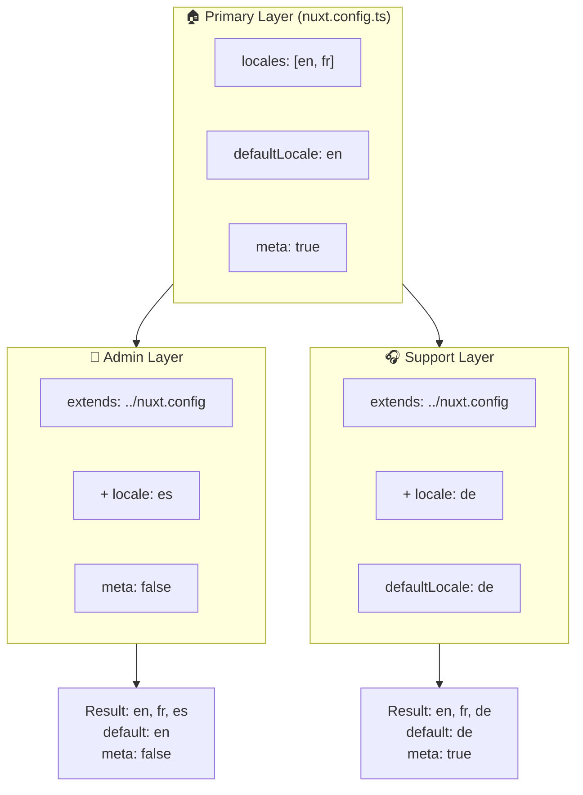

# 🗂️ Camadas no `Nuxt I18n Micro`

## 📖 Introdução às camadas

As camadas no `Nuxt I18n Micro` permitem gerir e personalizar as definições de localização de forma flexível em diferentes partes da sua aplicação. Ao definir camadas distintas, pode ajustar a configuração para diversos contextos, por exemplo, substituindo definições para secções específicas do seu site ou criando configurações base reutilizáveis que podem ser estendidas por outras partes da aplicação.

### Fluxo de herança das camadas



## 🛠️ Camada de configuração principal

A **camada de configuração principal** é onde define as definições de localização predefinidas para toda a aplicação. Esta camada é essencial, pois define a configuração global, incluindo os locales suportados, o idioma predefinido e outras definições i18n críticas.

### 📄 Exemplo: definir a camada de configuração principal

Segue-se um exemplo de como pode definir a camada de configuração principal no ficheiro `nuxt.config.ts`:

```typescript
export default defineNuxtConfig({
  i18n: {
    locales: [
      { code: 'en', iso: 'en-EN', dir: 'ltr' },
      { code: 'fr', iso: 'fr-FR', dir: 'ltr' },
      { code: 'ar', iso: 'ar-SA', dir: 'rtl' },
    ],
    defaultLocale: 'en', // The default locale for the entire app
    translationDir: 'locales', // Directory where translations are stored
    meta: true, // Automatically generate SEO-related meta tags like `alternate`
    autoDetectLanguage: true, // Automatically detect and use the user's preferred language
  },
})
```

## 🌱 Camadas filhas

As camadas filhas são utilizadas para estender ou substituir a configuração principal em partes específicas da aplicação. Por exemplo, pode querer adicionar locales suplementares ou modificar o locale predefinido para uma determinada secção do site. As camadas filhas são especialmente úteis em aplicações modulares, onde diferentes partes da aplicação podem ter requisitos de localização distintos.

### 📄 Exemplo: estender a camada principal numa camada filha

Suponha que tem uma secção do site que precisa de suportar locales adicionais, ou que quer desativar um determinado locale num contexto específico. Eis como o pode fazer, estendendo a camada de configuração principal:

```typescript
// basic/nuxt.config.ts (Primary Layer)
export default defineNuxtConfig({
  i18n: {
    locales: [
      { code: 'en', iso: 'en-EN', dir: 'ltr' },
      { code: 'fr', iso: 'fr-FR', dir: 'ltr' },
    ],
    defaultLocale: 'en',
    meta: true,
    translationDir: 'locales',
  },
})
```

```typescript
// extended/nuxt.config.ts (Child Layer)
export default defineNuxtConfig({
  extends: '../basic', // Inherit the base configuration from the 'basic' layer
  i18n: {
    locales: [
      { code: 'en', iso: 'en-EN', dir: 'ltr' }, // Inherited from the base layer
      { code: 'fr', iso: 'fr-FR', dir: 'ltr' }, // Inherited from the base layer
      { code: 'de', iso: 'de-DE', dir: 'ltr' }, // Added in the child layer
    ],
    defaultLocale: 'fr', // Override the default locale to French for this section
    autoDetectLanguage: false, // Disable automatic language detection in this section
  },
})
```

### 🌐 Utilizar camadas numa aplicação modular

Numa aplicação Nuxt de grande dimensão e modular, pode ter várias secções, cada uma com as suas próprias definições i18n. Ao tirar partido das camadas, pode manter uma estrutura de configuração limpa e escalável.

### 📄 Exemplo: configuração em camadas numa aplicação modular

Imagine que tem um site de comércio eletrónico com secções distintas, como o site principal, o painel de administração e o portal de apoio ao cliente. Cada secção pode necessitar de um conjunto diferente de locales ou de outras definições i18n.

#### **Camada principal (configuração global):**

```typescript
// nuxt.config.ts
export default defineNuxtConfig({
  i18n: {
    locales: [
      { code: 'en', iso: 'en-EN', dir: 'ltr' },
      { code: 'fr', iso: 'fr-FR', dir: 'ltr' },
    ],
    defaultLocale: 'en',
    meta: true,
    translationDir: 'locales',
    autoDetectLanguage: true,
  },
})
```

#### **Camada filha para o painel de administração:**

```typescript
// admin/nuxt.config.ts
export default defineNuxtConfig({
  extends: '../nuxt.config', // Inherit the global settings
  i18n: {
    locales: [
      { code: 'en', iso: 'en-EN', dir: 'ltr' }, // Inherited
      { code: 'fr', iso: 'fr-FR', dir: 'ltr' }, // Inherited
      { code: 'es', iso: 'es-ES', dir: 'ltr' }, // Specific to the admin panel
    ],
    defaultLocale: 'en',
    meta: false, // Disable automatic meta generation in the admin panel
  },
})
```

#### **Camada filha para o portal de apoio ao cliente:**

```typescript
// support/nuxt.config.ts
export default defineNuxtConfig({
  extends: '../nuxt.config', // Inherit the global settings
  i18n: {
    locales: [
      { code: 'en', iso: 'en-EN', dir: 'ltr' }, // Inherited
      { code: 'fr', iso: 'fr-FR', dir: 'ltr' }, // Inherited
      { code: 'de', iso: 'de-DE', dir: 'ltr' }, // Specific to the support portal
    ],
    defaultLocale: 'de', // Default to German in the support portal
    autoDetectLanguage: false, // Disable automatic language detection
  },
})
```

Neste exemplo modular:

- Cada secção (administração, apoio) tem as suas próprias definições i18n, mas todas herdam a configuração base.
- O painel de administração adiciona espanhol (`es`) como locale e desativa a geração de meta tags.
- O portal de apoio adiciona alemão (`de`) como locale e utiliza o alemão como idioma predefinido da interface.

## 📝 Boas práticas para utilizar camadas

- **🔧 Mantenha a camada principal simples:** a camada principal deve conter as definições mais utilizadas, com aplicação global à aplicação. Mantenha-a direta para garantir consistência.
- **⚙️ Utilize camadas filhas para personalizações específicas:** substitua ou estenda definições em camadas filhas apenas quando necessário. Esta abordagem evita complexidade desnecessária na configuração.
- **📚 Documente as suas camadas:** documente claramente o propósito e as especificidades de cada camada do projeto. Isto ajudará a manter a clareza e facilitará a compreensão da configuração por outras pessoas (ou pelo seu eu futuro).
