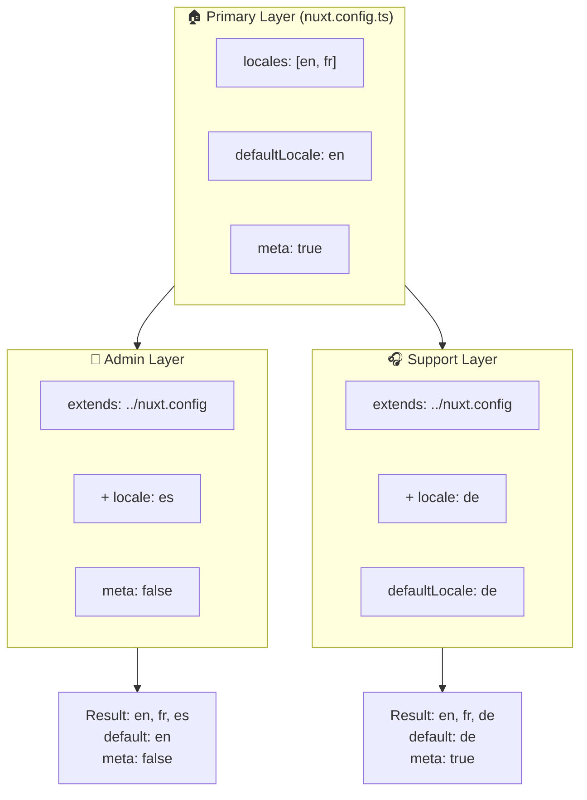

# 🗂️ Camadas no `Nuxt I18n Micro`

## 📖 Introdução às camadas

As camadas no `Nuxt I18n Micro` permitem-lhe gerir e personalizar as definições de localização de forma flexível em diferentes partes da sua aplicação. Ao definir camadas diferentes, pode ajustar a configuração para vários contextos, como substituir definições para secções específicas do seu site ou criar configurações base reutilizáveis que podem ser estendidas por outras partes da sua aplicação.

### Fluxo de herança de camadas



## 🛠️ Camada de configuração principal

A **camada de configuração principal** é onde define as definições de localização por predefinição para toda a sua aplicação. Esta camada é essencial porque define a configuração global, incluindo locales suportados, idioma predefinido e outras definições i18n críticas.

### 📄 Exemplo: definir a camada de configuração principal

Segue um exemplo de como pode definir a camada de configuração principal no seu ficheiro `nuxt.config.ts`:

```typescript
export default defineNuxtConfig({
  i18n: {
    locales: [
      { code: 'en', iso: 'en-EN', dir: 'ltr' },
      { code: 'fr', iso: 'fr-FR', dir: 'ltr' },
      { code: 'ar', iso: 'ar-SA', dir: 'rtl' },
    ],
    defaultLocale: 'en', // The default locale for the entire app
    translationDir: 'locales', // Directory where translations are stored
    meta: true, // Automatically generate SEO-related meta tags like `alternate`
    autoDetectLanguage: true, // Automatically detect and use the user's preferred language
  },
})
```

## 🌱 Camadas filhas

As camadas filhas são utilizadas para estender ou substituir a configuração principal em partes específicas da sua aplicação. Por exemplo, pode querer adicionar locales adicionais ou modificar o locale predefinido para uma secção específica do seu site. As camadas filhas são especialmente úteis em aplicações modulares onde diferentes partes podem ter requisitos de localização distintos.

### 📄 Exemplo: estender a camada principal numa camada filha

Suponha que tem uma secção do seu site que precisa de suportar locales adicionais, ou que quer desativar um determinado locale num contexto específico. Eis como pode fazer isso ao estender a camada principal:

```typescript
// basic/nuxt.config.ts (Primary Layer)
export default defineNuxtConfig({
  i18n: {
    locales: [
      { code: 'en', iso: 'en-EN', dir: 'ltr' },
      { code: 'fr', iso: 'fr-FR', dir: 'ltr' },
    ],
    defaultLocale: 'en',
    meta: true,
    translationDir: 'locales',
  },
})
```

```typescript
// extended/nuxt.config.ts (Child Layer)
export default defineNuxtConfig({
  extends: '../basic', // Inherit the base configuration from the 'basic' layer
  i18n: {
    locales: [
      { code: 'en', iso: 'en-EN', dir: 'ltr' }, // Inherited from the base layer
      { code: 'fr', iso: 'fr-FR', dir: 'ltr' }, // Inherited from the base layer
      { code: 'de', iso: 'de-DE', dir: 'ltr' }, // Added in the child layer
    ],
    defaultLocale: 'fr', // Override the default locale to French for this section
    autoDetectLanguage: false, // Disable automatic language detection in this section
  },
})
```

### 🌐 Utilizar camadas numa aplicação modular

Numa aplicação Nuxt maior e modular, pode ter várias secções, cada uma exigindo as suas próprias definições i18n. Ao aproveitar as camadas, mantém uma estrutura de configuração limpa e escalável.

### 📄 Exemplo: configuração em camadas numa aplicação modular

Imagine que tem um site de e-commerce com secções distintas, como o site principal, painel de administração e portal de apoio ao cliente. Cada secção pode precisar de um conjunto diferente de locales ou outras definições i18n.

#### **Camada principal (configuração global):**

```typescript
// nuxt.config.ts
export default defineNuxtConfig({
  i18n: {
    locales: [
      { code: 'en', iso: 'en-EN', dir: 'ltr' },
      { code: 'fr', iso: 'fr-FR', dir: 'ltr' },
    ],
    defaultLocale: 'en',
    meta: true,
    translationDir: 'locales',
    autoDetectLanguage: true,
  },
})
```

#### **Camada filha para o painel de administração:**

```typescript
// admin/nuxt.config.ts
export default defineNuxtConfig({
  extends: '../nuxt.config', // Inherit the global settings
  i18n: {
    locales: [
      { code: 'en', iso: 'en-EN', dir: 'ltr' }, // Inherited
      { code: 'fr', iso: 'fr-FR', dir: 'ltr' }, // Inherited
      { code: 'es', iso: 'es-ES', dir: 'ltr' }, // Specific to the admin panel
    ],
    defaultLocale: 'en',
    meta: false, // Disable automatic meta generation in the admin panel
  },
})
```

#### **Camada filha para o portal de apoio ao cliente:**

```typescript
// support/nuxt.config.ts
export default defineNuxtConfig({
  extends: '../nuxt.config', // Inherit the global settings
  i18n: {
    locales: [
      { code: 'en', iso: 'en-EN', dir: 'ltr' }, // Inherited
      { code: 'fr', iso: 'fr-FR', dir: 'ltr' }, // Inherited
      { code: 'de', iso: 'de-DE', dir: 'ltr' }, // Specific to the support portal
    ],
    defaultLocale: 'de', // Default to German in the support portal
    autoDetectLanguage: false, // Disable automatic language detection
  },
})
```

Neste exemplo modular:

- Cada secção (admin, support) tem as suas próprias definições i18n, mas todas herdam a configuração base.
- O painel de administração adiciona espanhol (`es`) como locale e desativa a geração de meta tags.
- O portal de apoio adiciona alemão (`de`) como locale e usa alemão por predefinição na interface do utilizador.

## 📝 Boas práticas ao utilizar camadas

- **🔧 Mantenha a camada principal simples:** a camada principal deve conter as definições mais usadas que se aplicam globalmente à sua aplicação. Mantenha-a direta para garantir consistência.
- **⚙️ Use camadas filhas para personalizações específicas:** só substitua ou estenda definições em camadas filhas quando necessário. Esta abordagem evita complexidade desnecessária na sua configuração.
- **📚 Documente as suas camadas:** documente claramente o propósito e as especificidades de cada camada no seu projeto. Isto ajudará a manter a clareza e a facilitar a compreensão da configuração por outros (ou por si no futuro).
