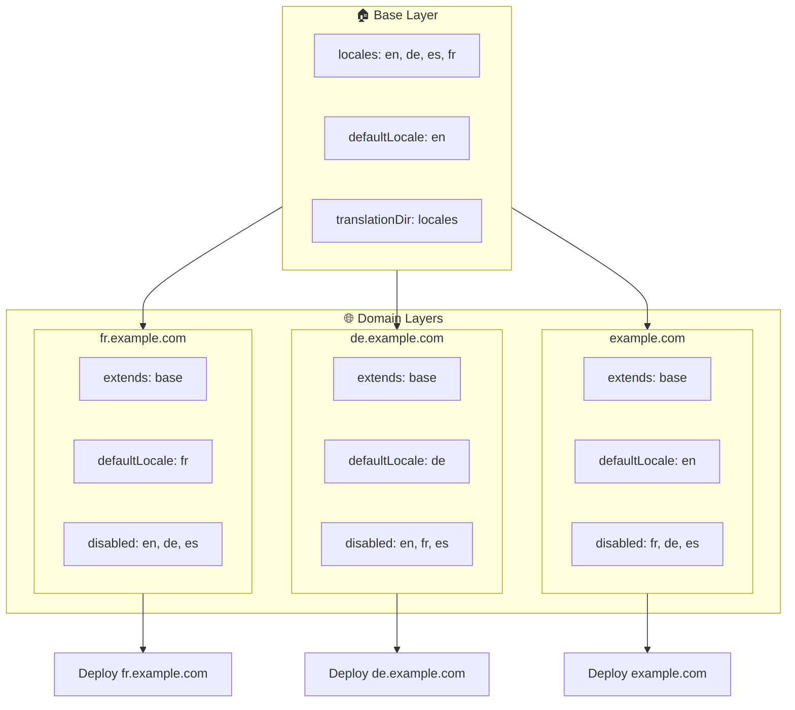

# 🌍 Configurar locales multidomínio com o `Nuxt I18n Micro` utilizando camadas

## 📝 Introdução

Ao aproveitar as camadas no `Nuxt I18n Micro`, pode criar uma configuração de localização multidomínio flexível e fácil de manter. Esta abordagem simplifica a gestão de domínios ao eliminar a necessidade de funcionalidades complexas, permite distribuir a carga de forma eficiente e reduz a complexidade do projeto. Ao executar projetos separados para diferentes locales, a sua aplicação escala e adapta-se facilmente a requisitos de locale variáveis em vários domínios, oferecendo uma solução robusta e escalável para aplicações globais.

## 🎯 Objetivo

Criar uma configuração em que diferentes domínios sirvam locales específicos através da personalização de configurações em camadas filhas. Este método aproveita o sistema de camadas do Nuxt, permitindo manter uma configuração base ao mesmo tempo que a estende ou modifica para cada domínio.

### Arquitetura multidomínio



## 🛠 Passos para implementar locales multidomínio

### 1. **Criar a camada base**

Comece por criar uma camada de configuração base que inclua todas as definições comuns de locale para a sua aplicação. Esta configuração servirá de base para outras configurações específicas de domínio.

#### **Configuração da camada base**

Crie o ficheiro de configuração base `base/nuxt.config.ts`:

```typescript
// base/nuxt.config.ts

export default defineNuxtConfig({
  i18n: {
    locales: [
      { code: 'en', iso: 'en-US', dir: 'ltr' },
      { code: 'de', iso: 'de-DE', dir: 'ltr' },
      { code: 'es', iso: 'es-ES', dir: 'ltr' },
    ],
    defaultLocale: 'en',
    translationDir: 'locales',
    meta: true,
    autoDetectLanguage: true,
  },
})
```

### 2. **Criar camadas filhas específicas de domínio**

Para cada domínio, crie uma camada filha que modifique a configuração base para atender aos requisitos específicos desse domínio. Pode desativar locales que não sejam necessários para um domínio específico.

#### **Exemplo: configuração para o domínio francês**

Crie uma configuração de camada filha para o domínio francês em `fr/nuxt.config.ts`:

```typescript
// fr/nuxt.config.ts

export default defineNuxtConfig({
  extends: '../base', // Inherit from the base configuration

  i18n: {
    locales: [
      { code: 'en', iso: 'en-US', dir: 'ltr', disabled: true }, // Disable English
      { code: 'fr', iso: 'fr-FR', dir: 'ltr' }, // Add and enable the French locale
      { code: 'de', iso: 'de-DE', dir: 'ltr', disabled: true }, // Disable German
      { code: 'es', iso: 'es-ES', dir: 'ltr', disabled: true }, // Disable Spanish
    ],
    defaultLocale: 'fr', // Set French as the default locale
    autoDetectLanguage: false, // Disable automatic language detection
  },
})
```

#### **Exemplo: configuração para o domínio alemão**

De igual modo, crie uma configuração de camada filha para o domínio alemão em `de/nuxt.config.ts`:

```typescript
// de/nuxt.config.ts

export default defineNuxtConfig({
  extends: '../base', // Inherit from the base configuration

  i18n: {
    locales: [
      { code: 'en', iso: 'en-US', dir: 'ltr', disabled: true }, // Disable English
      { code: 'fr', iso: 'fr-FR', dir: 'ltr', disabled: true }, // Disable French
      { code: 'de', iso: 'de-DE', dir: 'ltr' }, // Use the German locale
      { code: 'es', iso: 'es-ES', dir: 'ltr', disabled: true }, // Disable Spanish
    ],
    defaultLocale: 'de', // Set German as the default locale
    autoDetectLanguage: false, // Disable automatic language detection
  },
})
```

### 3. **Implementar a aplicação para cada domínio**

Implemente a aplicação com a configuração adequada para cada domínio. Por exemplo:

- Implemente a configuração da camada `fr` em `fr.example.com`.
- Implemente a configuração da camada `de` em `de.example.com`.

### 4. **Configurar vários projetos para diferentes locales**

Para cada locale e domínio, precisa de executar uma instância separada da aplicação. Isto garante que cada domínio serve a configuração de locale correta, otimizando a distribuição de carga e simplificando a estrutura do projeto. Ao executar vários projetos adaptados a cada locale, mantém uma separação limpa entre configurações e reduz a complexidade do setup global.

### 5. **Configurar o encaminhamento com base no domínio**

Garanta que o seu encaminhamento está configurado para direcionar os utilizadores para o projeto correto com base no domínio ao qual estão a aceder. Isto assegura que cada domínio serve o locale apropriado, melhorando a experiência do utilizador e mantendo consistência entre diferentes regiões.

### 6. **Implementar e verificar**

Depois de configurar as camadas e as implementar nos respetivos domínios, garanta que cada domínio serve o locale correto. Teste a aplicação minuciosamente para confirmar que o locale certo é carregado consoante o domínio.

## 📝 Boas práticas

- **Mantenha a configuração base genérica**: a configuração base deve cobrir definições gerais aplicáveis a todos os domínios.
- **Isole a lógica específica de domínio**: mantenha as configurações específicas de domínio nas respetivas camadas para preservar clareza e separação de responsabilidades.

## 🎉 Conclusão

Ao aproveitar as camadas no `Nuxt I18n Micro`, pode criar uma configuração de localização multidomínio flexível e fácil de manter. Esta abordagem elimina a necessidade de funcionalidades complexas de gestão de domínios, permite distribuir a carga eficientemente e reduz a complexidade do projeto. Executar projetos separados para diferentes locales garante que a sua aplicação escala facilmente e se adapta a diferentes requisitos de locale entre vários domínios, oferecendo uma solução robusta e escalável para aplicações globais.
