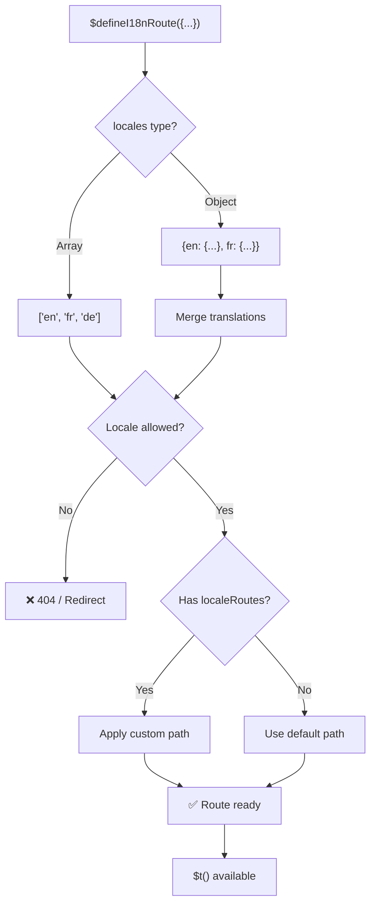
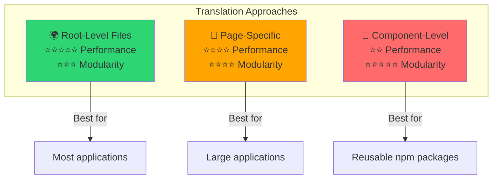

# 📖 Traduções por componente

Aprenda a definir traduções diretamente em componentes Vue com o `$defineI18nRoute`, para uma localização modular e fácil de manter.

## 📖 Visão geral

As traduções por componente no `Nuxt I18n Micro` permitem-lhe definir traduções diretamente em componentes ou páginas específicos, através da função `$defineI18nRoute`. Esta abordagem é ideal para gerir conteúdo localizado exclusivo de componentes individuais, oferecendo uma forma mais modular e fácil de manter das traduções.

## 🚀 Início rápido

### Utilização básica

```vue
<template>
  <div>
    <h1>{{ $t('greeting') }}</h1>
    <p>{{ $t('farewell') }}</p>
  </div>
</template>

<script setup lang="ts">
import { useNuxtApp } from '#imports'

const { $defineI18nRoute, $t } = useNuxtApp()

$defineI18nRoute({
  locales: {
    en: { greeting: 'Hello', farewell: 'Goodbye' },
    fr: { greeting: 'Bonjour', farewell: 'Au revoir' },
    de: { greeting: 'Hallo', farewell: 'Auf Wiedersehen' },
  },
})
</script>
```

### Configuração obrigatória (`script setup`)

O `$defineI18nRoute` é uma injeção da app Nuxt, e não uma macro global.  
Obtenha-o sempre de `useNuxtApp()` antes de o chamar.

```ts
import { useNuxtApp } from '#imports'

const { $defineI18nRoute } = useNuxtApp()
```

## 🏗️ Meta de rota em build-time

Em build-time, um unplugin do Vite analisa os ficheiros `.vue` das páginas à procura de chamadas `defineI18nRoute(...)` / `$defineI18nRoute(...)` e extrai restrições de locale, `localeRoutes` e `disableMeta` para os metadados de rota utilizados pelo `@i18n-micro/route-strategy`.

- **Build**: o unplugin (`src/unplugin-define-i18n-route.ts`) corre durante a transformação Vite e escreve `i18n-route-meta.json` no diretório de build do Nuxt.
- **Runtime**: o plugin `define` (`03.define.ts`) continua a expor `$defineI18nRoute` em `script setup` para desenvolvimento e configuração inline.

Normalmente, apenas chama `$defineI18nRoute` nas páginas — o módulo trata da extração em build-time automaticamente.

## 🔧 Função `$defineI18nRoute`

A função `$defineI18nRoute` configura o comportamento da rota com base no locale atual, oferecendo uma solução versátil para:

- Controlar o acesso a rotas específicas com base nos locales disponíveis.
- Fornecer traduções para locales específicos.
- Definir rotas personalizadas para diferentes locales.
- Controlar a geração de meta tags.

### Como funciona



### Assinatura do método

```typescript
const { $defineI18nRoute } = useNuxtApp();
$defineI18nRoute(routeDefinition: DefineI18nRouteConfig);
```

### Parâmetros

| Parâmetro      | Tipo                                       | Descrição                        |
| -------------- | ------------------------------------------ | ---------------------------------- |
| `locales`      | `string[] \| Record<string, Translations>` | Locales disponíveis para a rota    |
| `localeRoutes` | `Record<string, string>`                   | Rotas personalizadas para locales específicos |
| `disableMeta`  | `boolean \| string[]`                      | Controla a geração de meta tags i18n   |

### Descrições detalhadas dos parâmetros

#### `locales`

Define os locales disponíveis para a rota:

<CodeGroup>
```typescript Array Format
$defineI18nRoute({
  locales: ['en', 'fr', 'de'], // Simple array of locale codes
})
```

```typescript Object Format
$defineI18nRoute({
  locales: {
    en: { greeting: 'Hello', farewell: 'Goodbye' },
    fr: { greeting: 'Bonjour', farewell: 'Au revoir' },
    de: { greeting: 'Hallo', farewell: 'Auf Wiedersehen' },
    ru: {}, // Russian locale allowed but no translations provided
  },
})
```
</CodeGroup>

#### `localeRoutes`

Permite rotas personalizadas para locales específicos:

```typescript
$defineI18nRoute({
  localeRoutes: {
    en: '/welcome',
    fr: '/bienvenue',
    de: '/willkommen',
    ru: '/privet', // Custom route path for Russian locale
  },
})
```

#### `disableMeta`

Controla a geração de meta tags i18n:

<CodeGroup>
```typescript Disable All Meta
$defineI18nRoute({
  locales: ['en', 'fr', 'de'],
  disableMeta: true, // Disables all i18n meta tags
})
```

```typescript Disable Specific Locales
$defineI18nRoute({
  locales: ['en', 'fr', 'de'],
  disableMeta: ['en', 'fr'], // Only English and French won't have meta tags
})
```
</CodeGroup>

## 💡 Casos de utilização

### 1. Controlar o acesso com base em locales

Defina que locales são permitidos para determinadas rotas:

```typescript
$defineI18nRoute({
  locales: ['en', 'fr', 'de'], // Only these locales are allowed for this route
})
```

### 2. Fornecer traduções específicas do componente

Utilize o objeto `locales` para fornecer traduções específicas para cada rota:

```typescript
$defineI18nRoute({
  locales: {
    en: {
      greeting: 'Hello',
      farewell: 'Goodbye',
      description: 'Welcome to our application',
    },
    fr: {
      greeting: 'Bonjour',
      farewell: 'Au revoir',
      description: 'Bienvenue dans notre application',
    },
    de: {
      greeting: 'Hallo',
      farewell: 'Auf Wiedersehen',
      description: 'Willkommen in unserer Anwendung',
    },
  },
})
```

### 3. Encaminhamento personalizado para locales

Defina caminhos personalizados para locales específicos:

```typescript
$defineI18nRoute({
  locales: ['en', 'fr', 'de'],
  localeRoutes: {
    en: '/welcome',
    fr: '/bienvenue',
    de: '/willkommen',
  },
})
```

### 4. Desativar meta tags

Controle a geração de meta tags SEO para rotas ou locales específicos:

```typescript
// Disable meta tags for all locales
$defineI18nRoute({
  locales: ['en', 'fr', 'de'],
  disableMeta: true,
})

// Disable meta tags only for specific locales
$defineI18nRoute({
  locales: ['en', 'fr', 'de'],
  disableMeta: ['en', 'fr'],
})
```

## ✅ Formatos de configuração suportados

O parser do `$defineI18nRoute` suporta várias configurações JavaScript:

### Configurações estáticas

<CodeGroup>
```typescript Static Arrays
$defineI18nRoute({
  locales: ['en', 'de', 'fr'],
})
```

```typescript Static Objects
$defineI18nRoute({
  locales: {
    en: { greeting: 'Hello' },
    de: { greeting: 'Hallo' },
  },
  localeRoutes: {
    en: '/welcome',
    de: '/willkommen',
  },
})
```
</CodeGroup>

### Configurações dinâmicas

<CodeGroup>
```typescript Variables and Functions
const locales = ['en', 'de', 'fr']
const routes = { en: '/welcome', de: '/willkommen' }

$defineI18nRoute({
  locales: locales,
  localeRoutes: routes,
})
```

```typescript Template Literals
const prefix = 'api'

$defineI18nRoute({
  locales: [`${prefix}-en`, `${prefix}-de`],
  localeRoutes: {
    [`${prefix}-en`]: `/api/welcome`,
    [`${prefix}-de`]: `/api/willkommen`,
  },
})
```
</CodeGroup>

### Configurações avançadas

<CodeGroup>
```typescript Spread Operator
const baseLocales = ['en', 'de']
const additionalLocales = ['fr', 'es']

$defineI18nRoute({
  locales: [...baseLocales, ...additionalLocales],
})
```

```typescript Array of Objects
$defineI18nRoute({
  locales: [
    { code: 'en', name: 'English' },
    { code: 'de', name: 'German' },
  ],
})
```
</CodeGroup>

### Lógica condicional

```typescript
$defineI18nRoute({
  locales: process.env.NODE_ENV === 'production' ? ['en', 'de'] : ['en', 'de', 'fr', 'es'],
})
```

### Objetos aninhados complexos

```typescript
$defineI18nRoute({
  locales: {
    'en-us': {
      region: 'US',
      currency: 'USD',
      format: {
        date: 'MM/DD/YYYY',
        time: '12h',
      },
    },
    'de-de': {
      region: 'DE',
      currency: 'EUR',
      format: {
        date: 'DD.MM.YYYY',
        time: '24h',
      },
    },
  },
})
```

### Comentários e formatação

```typescript
$defineI18nRoute({
  // Supported locales for this component
  locales: [
    'en', // English
    'de', // German
    'fr', // French
  ],
  // Custom routes for each locale
  localeRoutes: {
    en: '/welcome',
    de: '/willkommen',
    fr: '/bienvenue',
  },
})
```

## ❌ Não suportado

O parser tem limitações e não consegue lidar com:

- **Imports externos** (declarações `import`).
- **Funções `async/await`**.
- **Métodos de classe**.
- **Controlo de fluxo complexo** (loops, try-catch, switch).
- **Arrow functions** na configuração.
- **Funções generator**.

## 📝 Exemplo completo

Segue-se um exemplo abrangente que mostra todas as funcionalidades:

```vue
<template>
  <div class="welcome-page">
    <header>
      <h1>{{ $t('title') }}</h1>
      <p>{{ $t('subtitle') }}</p>
    </header>

    <main>
      <section>
        <h2>{{ $t('features.title') }}</h2>
        <ul>
          <li v-for="feature in $t('features.list')" :key="feature">
            {{ feature }}
          </li>
        </ul>
      </section>

      <section>
        <h2>{{ $t('contact.title') }}</h2>
        <p>{{ $t('contact.description') }}</p>
        <a :href="$t('contact.email')">{{ $t('contact.email') }}</a>
      </section>
    </main>

    <footer>
      <p>{{ $t('footer.copyright') }}</p>
    </footer>
  </div>
</template>

<script setup lang="ts">
import { useNuxtApp } from '#imports'

const { $defineI18nRoute, $t } = useNuxtApp()

// Define comprehensive i18n route configuration
$defineI18nRoute({
  locales: {
    en: {
      title: 'Welcome to Our Platform',
      subtitle: 'The best solution for your needs',
      features: {
        title: 'Key Features',
        list: ['High Performance', 'Easy to Use', 'Scalable Architecture'],
      },
      contact: {
        title: 'Get in Touch',
        description: "We'd love to hear from you",
        email: 'mailto:contact@example.com',
      },
      footer: {
        copyright: '© 2024 Example Company. All rights reserved.',
      },
    },
    fr: {
      title: 'Bienvenue sur Notre Plateforme',
      subtitle: 'La meilleure solution pour vos besoins',
      features: {
        title: 'Fonctionnalités Clés',
        list: ['Haute Performance', 'Facile à Utiliser', 'Architecture Évolutive'],
      },
      contact: {
        title: 'Contactez-Nous',
        description: 'Nous aimerions avoir de vos nouvelles',
        email: 'mailto:contact@example.com',
      },
      footer: {
        copyright: '© 2024 Example Company. Tous droits réservés.',
      },
    },
    de: {
      title: 'Willkommen auf Unserer Plattform',
      subtitle: 'Die beste Lösung für Ihre Bedürfnisse',
      features: {
        title: 'Hauptfunktionen',
        list: ['Hohe Leistung', 'Einfach zu Verwenden', 'Skalierbare Architektur'],
      },
      contact: {
        title: 'Kontaktieren Sie Uns',
        description: 'Wir würden gerne von Ihnen hören',
        email: 'mailto:contact@example.com',
      },
      footer: {
        copyright: '© 2024 Example Company. Alle Rechte vorbehalten.',
      },
    },
  },
  localeRoutes: {
    en: '/welcome',
    fr: '/bienvenue',
    de: '/willkommen',
  },
  disableMeta: false, // Enable SEO meta tags
})
</script>

<style scoped>
.welcome-page {
  max-width: 800px;
  margin: 0 auto;
  padding: 2rem;
}

header {
  text-align: center;
  margin-bottom: 3rem;
}

section {
  margin-bottom: 2rem;
}

footer {
  text-align: center;
  margin-top: 3rem;
  padding-top: 2rem;
  border-top: 1px solid #eee;
}
</style>
```

## ⚡ Considerações de desempenho

Incorporar traduções em Single File Components (SFCs) pode ter impacto no desempenho:

### Problemas potenciais

- **Aumento do tamanho do ficheiro**: todos os locales ficam no SFC, ao contrário de ficheiros de tradução separados que permitem carregamento sensível ao locale.
- **Renderização mais lenta**: as traduções no ficheiro são processadas em runtime.
- **Utilização de memória**: todas as traduções são carregadas, independentemente do locale atual.

### Boas práticas

- **Utilize traduções por página** para desempenho ótimo.
- **Reserve traduções ao nível do componente** para casos específicos, como:
  - Componentes reutilizáveis publicados no npm.
  - Traduções pouco adequadas para ficheiros ao nível da raiz.
  - Componentes que precisam de ser autossuficientes.

### Desempenho vs modularidade

Equilibre as necessidades do seu projeto ao escolher uma abordagem:



| Abordagem             | Desempenho | Modularidade | Caso de uso            |
| -------------------- | ----------- | ---------- | ------------------- |
| **Ficheiros ao nível da raiz** | ⭐⭐⭐⭐⭐  | ⭐⭐⭐     | A maioria das aplicações   |
| **Específicos por página**    | ⭐⭐⭐⭐    | ⭐⭐⭐⭐   | Aplicações grandes  |
| **Ao nível do componente**  | ⭐⭐        | ⭐⭐⭐⭐⭐ | Componentes reutilizáveis |

## 🎯 Boas práticas

### 1. Mantenha as traduções próximas dos componentes

Defina as traduções diretamente no componente relevante para manter o conteúdo localizado organizado e fácil de manter.

### 2. Utilize objetos de locale para maior flexibilidade

Use o formato de objeto para a propriedade `locales` quando forem necessárias traduções específicas ou controlo de acesso baseado em locales.

### 3. Documente rotas personalizadas

Documente claramente quaisquer rotas personalizadas definidas para locales distintos, para manter a clareza e simplificar o desenvolvimento e a manutenção.

### 4. Pondere o impacto no desempenho

Avalie se as traduções ao nível do componente são necessárias para o seu caso de utilização, tendo em conta as implicações no desempenho.

### 5. Utilize TypeScript

Tire partido do TypeScript para maior segurança de tipos e suporte de IntelliSense:

```typescript
interface ComponentTranslations {
  title: string
  subtitle: string
  features: {
    title: string
    list: string[]
  }
}

$defineI18nRoute({
  locales: {
    en: {
      title: 'Welcome',
      subtitle: 'Subtitle',
      features: {
        title: 'Features',
        list: ['Feature 1', 'Feature 2'],
      },
    } as ComponentTranslations,
  },
})
```

## 📚 Tópicos relacionados

- **[Início rápido](/quickstart)** - Configuração básica e ajustes.
- **[Referência da API](/api/methods)** - Documentação completa dos métodos.
- **[Exemplos](/examples)** - Exemplos de utilização em contextos reais.

## Resumo

A funcionalidade de traduções por componente, alimentada pela função `$defineI18nRoute`, oferece uma forma poderosa e flexível de gerir a localização na sua aplicação Nuxt. Ao permitir que o conteúdo localizado e o encaminhamento sejam definidos ao nível do componente, ajuda a criar uma experiência altamente personalizada e centrada no utilizador, adaptada às preferências linguísticas e regionais do seu público.

Escolha a abordagem que melhor se adapta às necessidades do seu projeto, tendo em conta os requisitos de desempenho e as preocupações de manutenção.
