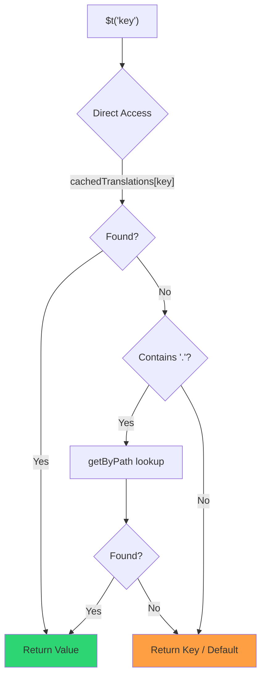

# 🚀 Guia de desempenho

## 📖 Introdução

O `Nuxt I18n Micro` foi concebido a pensar no desempenho, oferecendo uma melhoria significativa face aos módulos de internacionalização (i18n) tradicionais, como o `nuxt-i18n`. Este guia apresenta uma análise aprofundada dos benefícios de desempenho da utilização do `Nuxt I18n Micro` e da forma como se compara com outras soluções.

## 🤔 Porquê focar-se no desempenho?

Em projetos de grande escala e ambientes com muito tráfego, os estrangulamentos de desempenho podem levar a tempos de build lentos, maior utilização de memória e tempos de resposta do servidor deficientes. Estes problemas tornam-se mais evidentes com configurações i18n complexas, que envolvem grandes ficheiros de tradução. O `Nuxt I18n Micro` foi construído para responder diretamente a estes desafios, otimizando a velocidade, a eficiência de memória e o impacto mínimo no tamanho do bundle da aplicação.

## 📊 Comparação de desempenho

Realizámos uma série de testes em fixtures idênticos através de `pnpm test:performance` (`pnpm -C scripts cli performance`) contra o **`@nuxtjs/i18n@10.6.0`**. Metodologia completa e gráficos: [Resultados dos testes de desempenho](/guides/performance-results).

Perfil predefinido do CLI: **4 locales** × **2 páginas** (`index`, `page`) × ~10 mil chaves folha do índice. Aumente `--locales` / `--keys` para uma carga de deteção de regressões mais pesada. O relatório separa **código**, **traduções** (incluindo `chunks/raw/*` do `@nuxtjs/i18n`) e **total** de saída implementável.

```bash
pnpm test:performance
pnpm -C scripts cli performance --only micro --skip-stress
pnpm -C scripts cli performance --locales 12 --keys 100000 --runs 3
```

### ⏱️ Tempo de build e consumo de recursos

<Accordion title="**@nuxtjs/i18n v10.6**">
- **Bundle de código**: 2,16 MB
- **Traduções**: 7,21 MB (chunks de mensagens + payloads de locale)
- **Total implementável**: 9,37 MB
- **Utilização máxima de memória**: 1821 MB
- **Tempo decorrido**: 8,34s (média de 3)
</Accordion>

<Tip>
- **Bundle de código**: 1,74 MB — **~19% menos código do que `@nuxtjs/i18n` v10.6**
- **Traduções**: 6,8 MB (JSON carregado de forma preguiçosa)
- **Total implementável**: 8,54 MB
- **Utilização máxima de memória**: 1065 MB — **~41% menos memória do que `@nuxtjs/i18n` v10.6**
- **Tempo decorrido**: 5,34s — **~36% mais rápido do que `@nuxtjs/i18n` v10.6** (≈ base plain-nuxt)
</Tip>

> Documentos mais antigos que mostravam “code ≈ 15 MB / translations 0 B” do `@nuxtjs/i18n` contabilizavam os ficheiros de mensagens em `chunks/raw` como código da aplicação. O classificador atual separa-os; a diferença no **código** é menor, e o micro continua à frente em tempo de build, RSS de pico e testes de carga.

Consulte o [relatório completo de benchmark](/guides/performance-results) para gráficos, resultados do Autocannon e detalhes dos fixtures.

### 🌐 Desempenho do servidor sob carga

Artillery (6s@6 + 60s@60) e Autocannon (10c / 10s), média de 3 execuções consecutivas por fixture.

<Accordion title="**@nuxtjs/i18n v10.6**">
- **Pedidos por segundo (Artillery)**: 143 [#/sec]
- **Tempo médio de resposta**: 956 ms
- **Autocannon RPS / latência média**: 72 / 139 ms
</Accordion>

<Tip>
- **Pedidos por segundo (Artillery)**: 275 [#/sec] — **~93% mais do que `@nuxtjs/i18n` v10.6**
- **Tempo médio de resposta**: 483 ms — **~49% mais rápido do que `@nuxtjs/i18n` v10.6**
- **Autocannon RPS / latência média**: 162 / 62 ms
</Tip>

### 📈 Comparação visual

<Note>
Gráfico interativo omitido nos documentos Mintlify. Consulte as tabelas de benchmark nesta página ou os [documentos VitePress](https://s00d.github.io/nuxt-i18n-micro/guide/performance-results) para o gráfico: `chart`.
</Note>

<Note>
Gráfico interativo omitido nos documentos Mintlify. Consulte as tabelas de benchmark nesta página ou os [documentos VitePress](https://s00d.github.io/nuxt-i18n-micro/guide/performance-results) para o gráfico: `chart`.
</Note>

| Métrica          | @nuxtjs/i18n v10.6 | i18n-micro | Melhoria        |
| --------------- | ------------------ | ---------- | ------------------ |
| Tempo de build      | 8,34s              | 5,34s      | **~36% mais rápido**    |
| Memória (build)  | 1821 MB           | 1065 MB   | **~41% menos**      |
| Bundle de código     | 2,16 MB            | 1,74 MB    | **~19% menor**   |
| Tempo de resposta   | 956 ms             | 483 ms     | **~49% mais rápido**    |
| RPS (Artillery) | 143                | 275        | **~93% mais**      |

### 🔍 Interpretação dos resultados

Face à versão atual do `@nuxtjs/i18n` **v10.6** (perfil predefinido do CLI, média de 3):

- 🗜️ **Grafo de código menor**: ~1,74 MB vs ~2,16 MB, uma vez que os chunks de mensagens deixam de ser rotulados incorretamente como “código”.
- 🧠 **RSS de build inferior**: pico de ~1,1 GB vs ~1,8 GB.
- 🕒 **Builds mais rápidos**: ~5,3s vs ~8,3s (o micro iguala a base plain-Nuxt neste perfil).
- ⚡ **Muito melhor sob carga**: ~275 vs ~143 RPS em Artillery, ~162 vs ~72 RPS em Autocannon, com latência média inferior.

Os números absolutos diferem de tabelas publicadas anteriormente (dicionários mais pequenos, Nuxt mais antigo e uma repartição injusta de “0 B translations” para o `@nuxtjs/i18n`). A direção mantém-se: o micro continua à frente no custo de build e no débito de pedidos.

## ⚙️ Principais otimizações

### 🛠️ Desenho minimalista

O `Nuxt I18n Micro` é construído em torno de uma arquitetura minimalista, com um núcleo pequeno e pacotes de estratégia dedicados. Isto reduz a sobrecarga e simplifica a lógica interna, resultando em melhor desempenho.

### 🚦 Encaminhamento eficiente

Na v3, a geração de rotas e a lógica de caminhos em runtime foram divididas em pacotes dedicados, para uma otimização de tree-shaking ideal:

- **`@i18n-micro/route-strategy`** — geração de rotas em build-time: estende as páginas Nuxt com rotas localizadas. Apenas a estratégia selecionada (`no_prefix`, `prefix`, `prefix_except_default`, `prefix_and_default`) é incluída.
- **`@i18n-micro/path-strategy`** — resolução de caminhos, redirecionamentos e geração de ligações em runtime. Utiliza funções puras e sinalizadores de contexto pré-computados para minimizar alocações em caminhos críticos. Exportações por subcaminho (`/prefix`, `/no-prefix`, etc.) garantem que apenas a implementação escolhida é empacotada.

Esta abordagem mantém a configuração de encaminhamento leve e garante uma resolução de rotas rápida, independentemente do número de locales.

### 📂 Carregamento simplificado de traduções

O módulo suporta apenas ficheiros JSON para traduções, com uma separação clara entre ficheiros globais e específicos por página. Isto garante que apenas os dados de tradução necessários são carregados em cada momento, melhorando ainda mais o desempenho.

### 🔒 Cache singleton no GlobalThis

A partir da v3.0.0, o módulo utiliza um padrão singleton em `globalThis` com `Symbol.for` para garantir uma única instância de cache em todo o processo Node.js. Isto evita:

- Duplicação de cache quando o mesmo módulo é empacotado várias vezes.
- Recriação de objetos por pedido, que provoca pressão de recolha de lixo.
- Fugas de memória por instâncias de cache órfãs.

```mermaid
flowchart LR
    subgraph Process["Node.js Process"]
        G["globalThis[Symbol.for('CACHE')]"]

        subgraph R1["SSR Request 1"]
            P1[Plugin Instance] --> G
        end

        subgraph R2["SSR Request 2"]
            P2[Plugin Instance] --> G
        end

        subgraph R3["SSR Request 3"]
            P3[Plugin Instance] --> G
        end
    end

    G --> Cache["Single Map Instance"]
    Cache --> D1["en:index → translations"]
    Cache --> D2["en:about → translations"
```

```typescript
// Internal implementation pattern
const CACHE_KEY = Symbol.for('__NUXT_I18N_STORAGE_CACHE__')
if (!globalThis[CACHE_KEY]) {
  globalThis[CACHE_KEY] = new Map()
}
```

### ⚡ Função de tradução otimizada (tFast)

A função `$t()` utiliza uma estratégia de pesquisa direta, otimizada para velocidade:

1. **Contexto pré-computado**: o locale e o nome da rota são calculados uma vez durante a navegação, e não em cada chamada `$t()`.
2. **Pesquisa numa única origem**: todas as traduções (raiz + específicas de página + fallback) são pré-fundidas em build-time num único ficheiro por página — não é necessária pesquisa em camadas.
3. **Fusão profunda cumulativa na navegação**: ao navegar dentro do mesmo locale, as novas traduções de página são fundidas em profundidade (2 níveis) no dicionário ativo, para que as chaves da página anterior permaneçam visíveis durante as animações de transição — mesmo quando as páginas partilham prefixos aninhados sobrepostos (p. ex., ambas têm chaves em `common.*`).
4. **Recolha de lixo através de `page:transition:finish`**: depois de a animação de transição ficar totalmente concluída, o dicionário fundido é substituído pelas traduções limpas apenas da nova página, libertando a memória das chaves da página anterior.
5. **Acesso direto a propriedades**: utiliza `obj[key]` em vez de pesquisas em `Map` nos caminhos críticos.



```typescript
// Simplified lookup logic — single active dictionary
let val = cachedTranslations[key]
if (val === undefined && key.includes('.')) {
  val = getByPath(cachedTranslations, key)
}
```

### 💉 Carregamento no lado do servidor (sem embed HTML)

As traduções carregadas durante o SSR permanecem na **memória do servidor** para uso de `$t` durante a renderização. **Não** são copiadas para `nuxtApp.payload` / o documento HTML (mesma ideia do `@nuxtjs/i18n` com `experimental.preload: false`).

No cliente, `01.plugin.ts` faz `await` a `switchContext`, que carrega `/\{apiBaseUrl\}/:page/:locale/data.json` antes de a aplicação continuar — um pedido, em vez de um blob inline de 8 MB.

O `NuxtI18n` continua a manter o dicionário fundido ativo (`cachedTranslations`) para `$t()` / `$has()`. As navegações no mesmo locale fazem deep-merge dos chunks de página até que `page:transition:finish` limpe as chaves obsoletas.

#### Situação atual

Os valores abaixo são lidos do ficheiro de budget que o `pnpm run budget:payload` mede e faz cumprir.

{/* generated:payload-budget — do not edit; run `pnpm run docs:generate` */}

Medido em `playground` para `/`, `/de`:

| Medição | Tamanho |
| --- | --- |
| Fontes de tradução no disco | 15,2 MB |
| Servidas como ficheiros de payload separados | 76,3 MB |
| Maior `__NUXT_DATA__` inline | 6,9 MB |
| Assets do cliente | 449,5 KB |

O playground transporta um dicionário deliberadamente sobredimensionado, pelo que estes não são valores expectáveis numa aplicação real — são um ponto fixo de referência. O budget falha quando crescem inesperadamente, o que é a forma de detetar uma alteração acidental ao conteúdo transportado no payload.

{/* /generated:payload-budget */}

### 💾 Cache e pré-renderização

As traduções passam por várias caches, e saber qual delas respondeu a um pedido é a diferença entre uma sessão de depuração de cinco minutos e outra de cinco horas. Existem quatro, pela ordem em que um pedido as encontra:

| Camada | Onde | Duração | Limpa por |
| --- | --- | --- | --- |
| Navegador / CDN | `Cache-Control` em `/\{apiBaseUrl\}/**` | `httpCacheDuration`, `immutable` | um novo `?v=` — ou seja, um deploy que alterou traduções |
| Cache de rota Nitro | `routeRules['/\{apiBaseUrl\}/**'].cache` | 60 s, stale-while-revalidate | reinício do servidor |
| Loader do servidor | `CacheControl` em processo, chave `locale:routeName` | tempo de vida do processo, ou `cacheTtl` | reinício do servidor, HMR em dev |
| Store do cliente | `translationStorage` + o chunk ativo em `NuxtI18n` | tempo de vida da página | recarregamento |

Duas regras impedem que se contradigam:

- **A cache de rota do Nitro só existe quando existe `?v=`.** Com um cache-buster, cada URL é único ao seu conteúdo, pelo que colocá-lo em cache no servidor não corre risco de ficar obsoleto. Defina `dateBuild: 0` e essa camada é desativada, porque o URL passa a ser estável e a resposta indica `must-revalidate` — uma cache do lado do servidor responderia a partir de uma entrada obsoleta até um minuto e, silenciosamente, iria contrariá-la.
- **`immutable` também exige `?v=`.** Sem um buster, o cabeçalho é `public, max-age=0, must-revalidate`, independentemente do que diga `httpCacheDuration`: um `max-age` longo num URL que nunca muda fixa a primeira resposta que o navegador viu.

<Warning>
Com `translationPayloads.publicAssets` (predefinição em modo premerged), os payloads são copiados para `public/<apiBaseUrl>/\{page\}/\{locale\}/data.json`. Uma plataforma que sirva esse diretório por si própria (Cloudflare Pages, Firebase Hosting, `npx serve`) aplica os seus próprios cabeçalhos — o cabeçalho `routeRules` do Nitro só chega a respostas que passam pelo servidor. Defina a política de cache desses ficheiros estáticos na configuração da própria plataforma.
</Warning>

🏁 **Pré-renderização**: em modo premerged, o `publicAssets` já escreve a árvore de URL do cliente em `public/`. Opte por `prerenderRoutes` apenas se necessitar que o Nitro materialize rotas de handler quando essa cópia estiver desativada.

### 🗜️ Payloads públicos comprimidos

Quando `nitro.compressPublicAssets` está ativado, os payloads de tradução copiados para o diretório público recebem também irmãos `.gz` e `.br`:

```ts
export default defineNuxtConfig({
  nitro: { compressPublicAssets: true },
})
```

O Nitro comprime assets públicos antes do hook que copia os payloads, portanto, sem esta opção, estes seriam a única parte não comprimida de um build estático. O módulo não ativa por si a compressão — apenas aplica a definição que escolheu. A seleção por codificação (`\{ gzip: true, brotli: false \}`) é respeitada.

Payload do índice do playground: 6 651 984 B em bruto, 1 012 831 B em gzip, 821 617 B em brotli.

### ☁️ Saída de payloads serverless

Em **Node**, o SSR lê o JSON de tradução a partir de `public/<apiBaseUrl>` (`readFile`, sem `serverAssets` do Nitro / `raw:` do Rollup). No **Edge**, o `serverAssets` do Nitro inclui a mesma árvore (prefira `mode: 'source'` para catálogos grandes).

```typescript
export default defineNuxtConfig({
  i18n: {
    translationPayloads: {
      serverAssets: true, // default — Node → public copy; Edge → serverAssets embed
      publicAssets: true, // default in premerged mode
    },
  },
})
```

Utilize `translationPayloads.mode: 'source'` para embeds Edge compactos (e cópias públicas compactas opcionais):

```typescript
export default defineNuxtConfig({
  i18n: {
    translationPayloads: {
      mode: 'source',
    },
  },
})
```

O `mode: 'source'` mantém os ficheiros de origem fundidos por camadas de forma compacta e funde raiz/página/fallback em runtime através da rota incorporada `/_locales` (ou `assets:i18n` em Edge). Por predefinição, desativa as cópias de assets públicos e as rotas de payload pré-renderizadas.

<Warning>
`prerenderRoutes` tem `false` como predefinição. Com `mode: 'source'`, `publicAssets` também tem `false` como predefinição. Alojamento puramente estático sem um runtime Nitro/edge não consegue, portanto, carregar traduções no cliente, a menos que ative uma destas saídas, mantenha `serverHandler` disponível em runtime ou aloje payloads externamente.

O modo premerged predefinido + `publicAssets` já coloca `/\{apiBaseUrl\}/\{page\}/\{locale\}/data.json` em `public/`, pelo que hosts estáticos podem servir fetchs do cliente sem Nitro.
</Warning>

<Warning>
Definir `apiBaseServerHost` ou `apiBaseClientHost` desloca o serviço de payloads para essa origem, o que traz requisitos próprios — consulte [Configuração → Hosts CDN externos](/guides/configuration#external-cdn-hosts).
</Warning>

Ou desative saídas HTTP/públicas individuais e aloje os payloads externamente:

```typescript
export default defineNuxtConfig({
  i18n: {
    apiBaseClientHost: 'https://cdn.example.com',
    apiBaseServerHost: 'https://cdn.example.com',
    translationPayloads: {
      serverHandler: false,
      publicAssets: false,
      prerenderRoutes: false,
    },
  },
})
```

Mantenha `serverHandler` ativado quando depender da rota local incorporada `/\{apiBaseUrl\}/:page/:locale/data.json`. Desative-a quando os payloads forem alojados externamente e `apiBaseServerHost` apontar para essa origem externa. Ative `prerenderRoutes` apenas quando necessitar que o Nitro materialize rotas de payload estáticas e o `publicAssets` ainda não as tenha escrito.

Durante o build, o módulo avisa quando a saída de payload gerada excede `translationPayloads.warnFileCount` (predefinição 500) ou `translationPayloads.warnSizeBytes` (predefinição 10 MB). Também avisa quando todas as saídas locais estão desativadas sem hosts de payload externos configurados.

## 📝 Dicas para maximizar o desempenho

Seguem-se algumas dicas para tirar o melhor desempenho do `Nuxt I18n Micro`:

- 📉 **Limite os dados de locale**: inclua apenas os locales de que necessita no seu projeto, para manter o tamanho do bundle reduzido.
- 🗂️ **Utilize traduções específicas por página**: organize os ficheiros de tradução por página para evitar carregar dados desnecessários.
- 💾 **Ative a cache**: tire partido das funcionalidades de cache para reduzir a carga do servidor e melhorar os tempos de resposta.
- 🏁 **Tire partido da pré-renderização**: pré-renderize as suas traduções para acelerar os carregamentos de página e reduzir a sobrecarga em runtime.

Para resultados detalhados dos testes de desempenho, consulte os [Resultados dos testes de desempenho](/guides/performance-results).
