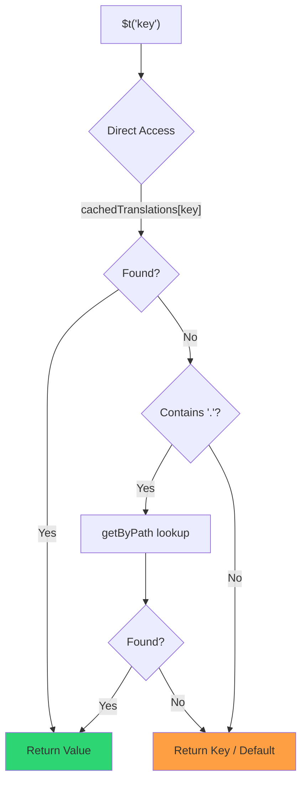

# 🚀 Guia de desempenho

## 📖 Introdução

O `Nuxt I18n Micro` foi concebido com o desempenho em mente, oferecendo uma melhoria significativa face a módulos tradicionais de internacionalização como o `nuxt-i18n`. Este guia apresenta uma visão detalhada dos benefícios de desempenho de usar o `Nuxt I18n Micro` e da comparação com outras soluções.

## 🤔 Porquê focar-se no desempenho?

Em projetos de larga escala e ambientes com muito tráfego, gargalos de desempenho podem levar a tempos de build lentos, maior uso de memória e piores tempos de resposta do servidor. Estes problemas tornam-se mais acentuados em setups i18n complexos com ficheiros de tradução grandes. O `Nuxt I18n Micro` foi construído para responder diretamente a estes desafios, otimizando velocidade, eficiência de memória e impacto mínimo no tamanho do bundle da sua aplicação.

## 📊 Comparação de desempenho

Realizámos uma série de testes em fixtures idênticas através de `pnpm test:performance` (`pnpm -C scripts cli performance`) face ao **`@nuxtjs/i18n@10.6.0`**. Metodologia completa e gráficos: [Resultados dos testes de desempenho](/guides/performance-results).

Perfil predefinido da CLI: **4 locales** × **2 páginas** (`index`, `page`) × ~10 mil chaves-folha no index. Aumente `--locales` / `--keys` para uma carga mais pesada de "radar de regressão". O relatório separa **código**, **traduções** (incluindo `@nuxtjs/i18n` `chunks/raw/*`) e a **saída total** implementável.

```bash
pnpm test:performance
pnpm -C scripts cli performance --only micro --skip-stress
pnpm -C scripts cli performance --locales 12 --keys 100000 --runs 3
```

### ⏱️ Tempo de build e consumo de recursos

<Accordion title="**@nuxtjs/i18n v10.6**">
- **Bundle de código**: 2,16 MB
- **Traduções**: 7,21 MB (chunks de mensagens + payloads de locale)
- **Total implementável**: 9,37 MB
- **Uso máx. de memória**: 1821 MB
- **Tempo decorrido**: 8,34s (média de 3)
</Accordion>

<Tip>
- **Bundle de código**: 1,74 MB — **~19% menos código do que `@nuxtjs/i18n` v10.6**
- **Traduções**: 6,8 MB (JSON carregado sob demanda)
- **Total implementável**: 8,54 MB
- **Uso máx. de memória**: 1065 MB — **~41% menos memória do que `@nuxtjs/i18n` v10.6**
- **Tempo decorrido**: 5,34s — **~36% mais rápido do que `@nuxtjs/i18n` v10.6** (≈ linha base do plain-nuxt)
</Tip>

> Docs antigos que mostravam `@nuxtjs/i18n` "code ≈ 15 MB / translations 0 B" contavam ficheiros de mensagens `chunks/raw` como código de aplicação. O classificador atual separa-os; a diferença em **código** é menor, e o micro continua na frente em tempo de build, RSS de pico e testes de carga.

Consulte o [relatório de benchmark completo](/guides/performance-results) para gráficos, resultados do Autocannon e detalhes das fixtures.

### 🌐 Desempenho do servidor sob carga

Artillery (6s@6 + 60s@60) e Autocannon (10c / 10s), média de 3 execuções consecutivas por fixture.

<Accordion title="**@nuxtjs/i18n v10.6**">
- **Pedidos por segundo (Artillery)**: 143 [#/seg]
- **Tempo médio de resposta**: 956 ms
- **RPS/latência média do Autocannon**: 72 / 139 ms
</Accordion>

<Tip>
- **Pedidos por segundo (Artillery)**: 275 [#/seg] — **~93% mais do que `@nuxtjs/i18n` v10.6**
- **Tempo médio de resposta**: 483 ms — **~49% mais rápido do que `@nuxtjs/i18n` v10.6**
- **RPS/latência média do Autocannon**: 162 / 62 ms
</Tip>

### 📈 Comparação visual

<Note>
Gráfico interativo omitido nos docs Mintlify. Consulte as tabelas de benchmark ou os [docs VitePress](https://s00d.github.io/nuxt-i18n-micro/guide/performance-results) para o gráfico: `chart`.
</Note>

<Note>
Gráfico interativo omitido nos docs Mintlify. Consulte as tabelas de benchmark ou os [docs VitePress](https://s00d.github.io/nuxt-i18n-micro/guide/performance-results) para o gráfico: `chart`.
</Note>

| Métrica         | @nuxtjs/i18n v10.6 | i18n-micro | Melhoria           |
| --------------- | ------------------ | ---------- | ------------------ |
| Tempo de build  | 8,34s              | 5,34s      | **~36% mais rápido**  |
| Memória (build) | 1821 MB            | 1065 MB    | **~41% menos**     |
| Bundle de código | 2,16 MB           | 1,74 MB    | **~19% mais pequeno** |
| Tempo de resposta | 956 ms          | 483 ms     | **~49% mais rápido** |
| RPS (Artillery) | 143                | 275        | **~93% mais**      |

### 🔍 Interpretação dos resultados

Face ao `@nuxtjs/i18n` **v10.6** atual (perfil predefinido da CLI, média de 3):

- 🗜️ **Grafo de código menor**: ~1,74 MB vs ~2,16 MB assim que os chunks de mensagens deixam de ser mal rotulados como "code".
- 🧠 **RSS de build menor**: pico de ~1,1 GB vs ~1,8 GB.
- 🕒 **Builds mais rápidas**: ~5,3s vs ~8,3s (o micro iguala a linha base do plain-Nuxt neste perfil).
- ⚡ **Muito melhor sob carga**: ~275 vs ~143 RPS Artillery, ~162 vs ~72 RPS Autocannon, menor latência média.

Os números absolutos diferem de tabelas antigas publicadas (dicionários mais pequenos, Nuxt antigo e uma divisão injusta de "0 B translations" para `@nuxtjs/i18n`). A direção é a mesma: o micro mantém-se à frente em custo de build e taxa de pedidos.

## ⚙️ Otimizações principais

### 🛠️ Design minimalista

O `Nuxt I18n Micro` é construído em torno de uma arquitetura minimalista, com um núcleo pequeno e pacotes de estratégia dedicados. Isto reduz overhead e simplifica a lógica interna, melhorando o desempenho.

### 🚦 Encaminhamento eficiente

Na v3, a geração de rotas e a lógica de caminho em runtime são divididas em pacotes dedicados para ótimo tree-shaking:

- **`@i18n-micro/route-strategy`** — geração de rotas em tempo de build: estende as páginas Nuxt com rotas localizadas. Apenas a estratégia selecionada (`no_prefix`, `prefix`, `prefix_except_default`, `prefix_and_default`) é incluída.
- **`@i18n-micro/path-strategy`** — resolução de caminhos em runtime, redirecionamentos e geração de ligações. Usa funções puras e flags de contexto pré-computadas para minimizar alocações em caminhos frequentes. As exportações de subpath (`/prefix`, `/no-prefix`, etc.) garantem que apenas a implementação escolhida é incluída no bundle.

Esta abordagem mantém a configuração de encaminhamento leve e garante uma resolução rápida de rotas independentemente do número de locales.

### 📂 Carregamento simplificado de traduções

O módulo suporta apenas ficheiros JSON para traduções, com uma clara separação entre ficheiros globais e específicos de página. Isto garante que apenas os dados de tradução necessários são carregados a qualquer momento, melhorando ainda mais o desempenho.

### 🔒 Cache singleton em globalThis

A partir da v3.0.0, o módulo usa um padrão singleton em `globalThis` com `Symbol.for` para garantir uma única instância de cache em todo o processo Node.js. Isto previne:

- Duplicação de cache quando o mesmo módulo é incluído no bundle várias vezes
- Recriação de objetos por pedido, que causa pressão no garbage collector
- Fugas de memória de instâncias de cache órfãs

```mermaid
flowchart LR
    subgraph Process["Node.js Process"]
        G["globalThis[Symbol.for('CACHE')]"]

        subgraph R1["SSR Request 1"]
            P1[Plugin Instance] --> G
        end

        subgraph R2["SSR Request 2"]
            P2[Plugin Instance] --> G
        end

        subgraph R3["SSR Request 3"]
            P3[Plugin Instance] --> G
        end
    end

    G --> Cache["Single Map Instance"]
    Cache --> D1["en:index → translations"]
    Cache --> D2["en:about → translations"
```

```typescript
// Internal implementation pattern
const CACHE_KEY = Symbol.for('__NUXT_I18N_STORAGE_CACHE__')
if (!globalThis[CACHE_KEY]) {
  globalThis[CACHE_KEY] = new Map()
}
```

### ⚡ Função de tradução otimizada (tFast)

A função `$t()` usa uma estratégia de lookup direto otimizada para velocidade:

1. **Contexto pré-computado**: locale e nome de rota são calculados uma vez durante a navegação, não em cada chamada `$t()`
2. **Lookup de fonte única**: todas as traduções (raiz + específicas de página + fallback) são pré-fundidas em tempo de build num único ficheiro por página. Não é necessária pesquisa em camadas
3. **Deep merge cumulativo na navegação**: ao navegar dentro do mesmo locale, as novas traduções de página são fundidas em profundidade (2 níveis) no dicionário ativo, para que as chaves da página anterior permaneçam visíveis durante as animações de transição — mesmo quando as páginas partilham prefixos aninhados sobrepostos (por exemplo, ambas com chaves em `common.*`)
4. **Garbage collection via `page:transition:finish`**: depois de a transição estar totalmente concluída, o dicionário fundido é substituído pelas traduções limpas apenas da nova página, libertando memória das chaves antigas
5. **Acesso direto a propriedades**: usa `obj[key]` em vez de lookups em `Map` para caminhos frequentes



```typescript
// Simplified lookup logic — single active dictionary
let val = cachedTranslations[key]
if (val === undefined && key.includes('.')) {
  val = getByPath(cachedTranslations, key)
}
```

### 💉 Carga do lado do servidor (sem incorporação em HTML)

As traduções carregadas durante o SSR permanecem em **memória do servidor** para o `$t` durante a renderização. **Não** são copiadas para `nuxtApp.payload` / o documento HTML (mesma ideia do `@nuxtjs/i18n` com `experimental.preload: false`).

No cliente, `01.plugin.ts` aguarda `switchContext`, que carrega `/\{apiBaseUrl\}/:page/:locale/data.json` antes de a aplicação continuar. Um pedido, não um blob inline de 8 MB.

O `NuxtI18n` mantém o dicionário fundido ativo (`cachedTranslations`) para `$t()` / `$has()`. Navegações no mesmo locale fazem deep merge dos chunks de página até `page:transition:finish` limpar as chaves antigas.

#### Situação atual

Os números abaixo são lidos do ficheiro de orçamento que `pnpm run budget:payload` mede e impõe.

{/* generated:payload-budget — do not edit; run `pnpm run docs:generate` */}

Medido no `playground` em `/`, `/de`:

| Medição | Tamanho |
| --- | --- |
| Fontes de tradução em disco | 15,2 MB |
| Servidas como ficheiros de payload separados | 76,3 MB |
| Maior `__NUXT_DATA__` inline | 6,9 MB |
| Assets de cliente | 449,5 KB |

O playground carrega um dicionário deliberadamente sobredimensionado, pelo que estes não são valores de esperar numa aplicação real. São um ponto fixo contra o qual medir. O orçamento falha quando crescem inesperadamente, o que é como se apercebe de uma alteração acidental do que o payload transporta.

{/* /generated:payload-budget */}

### 💾 Cache e pré-renderização

As traduções passam por várias caches, e saber qual respondeu a um pedido é a diferença entre uma sessão de depuração de cinco minutos e de cinco horas. Existem quatro, pela ordem em que um pedido as encontra:

| Camada | Onde | Tempo de vida | Limpo por |
| --- | --- | --- | --- |
| Navegador / CDN | `Cache-Control` em `/\{apiBaseUrl\}/**` | `httpCacheDuration`, `immutable` | um novo `?v=`, isto é, um deploy que mudou traduções |
| Cache de rota Nitro | `routeRules['/\{apiBaseUrl\}/**'].cache` | 60 s, stale-while-revalidate | reinício do servidor |
| Loader do servidor | `CacheControl` em processo, com chave `locale:routeName` | tempo de vida do processo, ou `cacheTtl` | reinício do servidor, HMR em dev |
| Store do cliente | `translationStorage` + o chunk ativo em `NuxtI18n` | tempo de vida da página | reload |

Duas regras evitam que se contradigam:

- **A cache de rota do Nitro existe apenas quando `?v=` existe.** Com um cache-buster, cada URL é único para o seu conteúdo, pelo que colocá-lo em cache do lado do servidor está livre de "staleness". Defina `dateBuild: 0` e essa camada é desligada, porque o URL é então estável e a resposta diz `must-revalidate`. Uma cache do lado do servidor responderia com uma entrada desatualizada por até um minuto e derrotaria silenciosamente esse mecanismo.
- **`immutable` também exige `?v=`.** Sem um buster, o cabeçalho é `public, max-age=0, must-revalidate`, independentemente do que diga `httpCacheDuration`. Um `max-age` longo num URL que nunca muda fixa a primeira resposta que um browser recebeu.

<Warning>
Com `translationPayloads.publicAssets` (predefinição no modo premerged), os payloads são copiados para `public/<apiBaseUrl>/\{page\}/\{locale\}/data.json`. Uma plataforma que sirva esse diretório por si (Cloudflare Pages, Firebase Hosting, `npx serve`) aplica os seus próprios cabeçalhos. O cabeçalho do `routeRules` do Nitro só chega a respostas que passem pelo servidor. Defina a política de cache para esses ficheiros estáticos na configuração da própria plataforma.
</Warning>

🏁 **Pré-renderização**: no modo premerged, `publicAssets` já escreve a árvore de URLs de cliente em `public/`. Ative `prerenderRoutes` apenas se precisar que o Nitro materialize rotas do handler quando essa cópia estiver desativada.

### 🗜️ Payloads públicos comprimidos

Quando `nitro.compressPublicAssets` está ativado, os payloads de tradução copiados para o diretório público recebem também pares `.gz` e `.br`:

```ts
export default defineNuxtConfig({
  nitro: { compressPublicAssets: true },
})
```

O Nitro comprime os assets públicos antes do hook que copia os payloads, pelo que sem isto seriam a única parte não comprimida de um build estático. O módulo não ativa a compressão por si só — apenas aplica a definição que escolheu. A seleção por codificação (`\{ gzip: true, brotli: false \}`) é respeitada.

Payload de index no playground: 6 651 984 B raw, 1 012 831 B gzip, 821 617 B brotli.

### ☁️ Saída de payload serverless

Em **Node**, o SSR lê JSON de tradução de `public/<apiBaseUrl>` (`readFile`, sem `serverAssets` do Nitro / `raw:` do Rollup). Em **Edge**, `serverAssets` do Nitro incorpora a mesma árvore (prefira `mode: 'source'` para catálogos grandes).

```typescript
export default defineNuxtConfig({
  i18n: {
    translationPayloads: {
      serverAssets: true, // default — Node → public copy; Edge → serverAssets embed
      publicAssets: true, // default in premerged mode
    },
  },
})
```

Use `translationPayloads.mode: 'source'` para embeds Edge compactos (e cópias públicas compactas opcionais):

```typescript
export default defineNuxtConfig({
  i18n: {
    translationPayloads: {
      mode: 'source',
    },
  },
})
```

`mode: 'source'` mantém os ficheiros de origem fundidos em camadas compactos e funde raiz/página/fallback em runtime através da rota `/_locales` incorporada (ou `assets:i18n` no Edge). Por predefinição, desativa cópias de assets públicos e rotas de payload pré-renderizadas.

<Warning>
`prerenderRoutes` fica em `false` por predefinição. Com `mode: 'source'`, `publicAssets` também fica em `false` por predefinição. Alojamento estático puro sem runtime Nitro/Edge não conseguirá, portanto, carregar traduções no cliente a menos que ative uma destas saídas, mantenha `serverHandler` disponível em runtime ou aloje payloads externamente.

O modo premerged predefinido + `publicAssets` já coloca `/\{apiBaseUrl\}/\{page\}/\{locale\}/data.json` em `public/`, pelo que hosts estáticos podem servir os fetches do cliente sem Nitro.
</Warning>

<Warning>
Definir `apiBaseServerHost` ou `apiBaseClientHost` move o serviço de payloads para essa origem, o que tem os seus próprios requisitos. Consulte [Configuração → Hosts CDN externos](/guides/configuration#external-cdn-hosts).
</Warning>

Ou desative saídas HTTP/públicas individuais e aloje payloads externamente:

```typescript
export default defineNuxtConfig({
  i18n: {
    apiBaseClientHost: 'https://cdn.example.com',
    apiBaseServerHost: 'https://cdn.example.com',
    translationPayloads: {
      serverHandler: false,
      publicAssets: false,
      prerenderRoutes: false,
    },
  },
})
```

Mantenha `serverHandler` ativado quando depender da rota local incorporada `/\{apiBaseUrl\}/:page/:locale/data.json`. Desative-a quando os payloads estiverem alojados externamente e `apiBaseServerHost` apontar para essa origem externa. Ative `prerenderRoutes` apenas quando precisar que o Nitro materialize rotas de payload estáticas e `publicAssets` não as tenha já escrito.

Durante o build, o módulo avisa quando a saída de payload gerada ultrapassa `translationPayloads.warnFileCount` (predefinição 500) ou `translationPayloads.warnSizeBytes` (predefinição 10 MB). Também avisa quando todas as saídas locais estão desativadas sem hosts externos de payload configurados.

## 📝 Dicas para maximizar o desempenho

Eis algumas dicas para tirar o melhor desempenho do `Nuxt I18n Micro`:

- 📉 **Limite os dados de locale**: inclua apenas os locales que precisa no seu projeto para manter o bundle pequeno.
- 🗂️ **Utilize traduções específicas de página**: organize os seus ficheiros de tradução por página para evitar carregar dados desnecessários.
- 💾 **Ative a cache**: aproveite as funcionalidades de cache para reduzir a carga do servidor e melhorar os tempos de resposta.
- 🏁 **Aproveite a pré-renderização**: pré-renderize as suas traduções para acelerar o carregamento das páginas e reduzir overhead em runtime.

Para resultados detalhados dos testes de desempenho, consulte os [Resultados dos testes de desempenho](/guides/performance-results).
