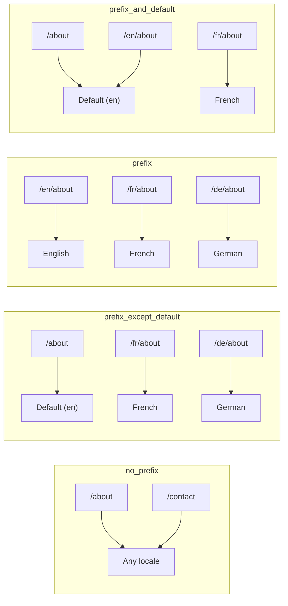
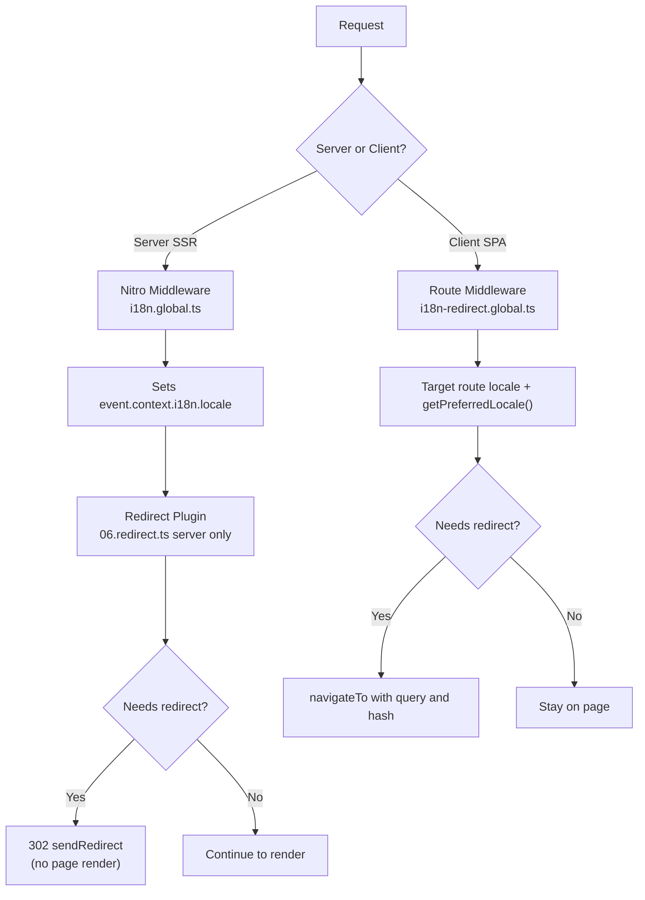

# 🗂️ Estratégias de encaminhamento no Nuxt I18n Micro

## 📖 Visão geral

O Nuxt I18n Micro controla a forma como os prefixos de locale aparecem nos URLs através da opção `strategy`. Nos bastidores, dois pacotes implementam isto:

- **`@i18n-micro/route-strategy`** — geração de rotas em build-time (estende as páginas Nuxt com rotas localizadas).
- **`@i18n-micro/path-strategy`** — resolução de caminhos, redirecionamentos, atributos de SEO e geração de ligações em runtime.

O módulo Nuxt seleciona a classe de estratégia correta em build-time e cria um alias através de `#i18n-strategy`, de modo a que apenas a implementação escolhida seja empacotada.

## 🚦 Estratégias disponíveis

{/* generated:option:strategy — do not edit; run `pnpm run docs:generate` */}

**Tipo** `Strategies` · **Predefinição** `'prefix_except_default'`

Estratégia de encaminhamento de URL para prefixos de locale.

- `'no_prefix'` — sem locale no URL; locale guardado em cookie.
- `'prefix_except_default'` — prefixa todos os locales exceto o predefinido.
- `'prefix'` — prefixa sempre, incluindo o locale predefinido.
- `'prefix_and_default'` — como `prefix`, mas o locale predefinido também é acessível sem prefixo.

{/* /generated:option:strategy */}

### Comparação de estratégias



### 🛑 `no_prefix`

Os URLs não têm segmento de locale. O locale é determinado por cookies, pelo estado de `useI18nLocale()` ou pela deteção do navegador.

- **Rotas**: `/about`, `/contact` — o mesmo padrão de URL para todos os locales (sem prefixos `/en/`, `/fr/`).
- **Persistência de locale**: através de `localeCookie` (definido automaticamente como `'user-locale'` se não for especificado).
- **Caminhos personalizados**: suportados via [`globalLocaleRoutes`](/guides/configuration#globallocaleroutes) e [`defineI18nRoute`](/guides/custom-locale-routes) — os slugs localizados são gerados sem adicionar um prefixo de locale aos URLs (p. ex. `/about` vs `/ueber-uns`). Rotas aninhadas, aliases e restrições por locale são mais simples do que em `prefix_except_default`.

<Tip>
Ao utilizar `no_prefix`, `localeCookie` é automaticamente definido como `'user-locale'` se não for especificado. É necessário porque o URL não contém informação de locale.
</Tip>

```typescript
i18n: {
  strategy: 'no_prefix'
  // localeCookie is automatically set to 'user-locale'
}
```

### 🚧 `prefix_except_default`

Todas as rotas têm um prefixo de locale **exceto** o locale predefinido.

- **Locale predefinido**: `/about`, `/contact`.
- **Outros locales**: `/fr/about`, `/de/contact`.
- **Locale predefinido com prefixo devolve 404**: `/en/about` → 404 (quando `en` é o predefinido).

```typescript
i18n: {
  strategy: 'prefix_except_default' // This is the default
}
```

### 🌍 `prefix`

Todas as rotas têm um prefixo de locale, incluindo o locale predefinido.

- **Todos os locales**: `/en/about`, `/fr/about`, `/de/about`.
- **Raiz `/`**: redireciona para `/\{locale\}/` com base na preferência do utilizador.

```typescript
i18n: {
  strategy: 'prefix'
}
```

### 🔄 `prefix_and_default`

O locale predefinido está disponível com e sem prefixo. Os locales não predefinidos têm sempre prefixo.

- **Locale predefinido**: tanto `/about` como `/en/about` são válidos.
- **Outros locales**: `/fr/about`, `/de/about`.
- **Sem redirecionamento a partir de `/`**: tanto `/` como `/en/` servem o locale predefinido.

```typescript
i18n: {
  strategy: 'prefix_and_default'
}
```

## 🔀 Arquitetura de redirecionamentos (v3)

Na v3, a lógica de redirecionamento está dividida em duas camadas para desempenho ótimo:

### Como funciona



### Lado do servidor (sem flash)

1. O **middleware Nitro** (`i18n.global.ts`) é executado primeiro — deteta o locale a partir do URL, cookie ou cabeçalho `Accept-Language` e define `event.context.i18n.locale`.
2. O **plugin de redirecionamento** (`06.redirect.ts`, apenas servidor) verifica se o caminho atual necessita de redirecionamento através de `i18nStrategy.getClientRedirect()` e emite um 302 **antes** de qualquer renderização de página.
3. Isto evita o “flash de erro”, em que os utilizadores vêem por instantes uma página errada antes de serem redirecionados.

### Lado do cliente (navegação SPA)

1. O middleware global de rota (`i18n-redirect.global.ts`) é executado em cada navegação do cliente quando `redirects` está ativado.
2. Deriva o locale preferido a partir da **rota de destino** e faz fallback para `useI18nLocale().getPreferredLocale()`.
3. Utiliza `i18nStrategy.getClientRedirect()` para decidir se é necessário um redirecionamento.
4. Preserva `query` e `hash` no redirecionamento.

### Ordem de prioridade do locale

No servidor, o plugin de redirecionamento determina o locale preferido nesta ordem:

1. **`useState('i18n-locale')`** — prioridade máxima (definido programaticamente via `useI18nLocale().setLocale()`).
2. **Cookie** — se `localeCookie` estiver configurado.
3. **Cabeçalho `Accept-Language`** — se `autoDetectLanguage: true`.
4. **`defaultLocale`** — fallback final.

No cliente, o middleware de rota prefere o locale da rota de destino, utilizando depois a mesma cadeia de fallback estado/cookie.

### Comportamento de redirecionamento por estratégia

| Estratégia                | Comportamento de `GET /`                              | Cookie necessário? |
| ----------------------- | --------------------------------------------- | ---------------- |
| `no_prefix`             | Sem redirecionamento (locale a partir do cookie/estado)        | Definido automaticamente         |
| `prefix`                | 302 → `/\{locale\}/`                            | Recomendado      |
| `prefix_except_default` | 302 → `/\{locale\}/` se locale ≠ predefinido        | Recomendado      |
| `prefix_and_default`    | Sem redirecionamento (`/` e `/\{locale\}/` válidos) | Opcional         |

### Desativar redirecionamentos

```typescript
i18n: {
  redirects: false // Disables automatic locale redirects
}
```

Quando `redirects: false`, os redirecionamentos automáticos de locale ficam desativados:

- **Servidor**: o plugin de redirecionamento (`06.redirect.ts`, apenas servidor) mantém-se registado mas ignora a lógica de redirecionamento. Continua a efetuar **verificações 404** para prefixos de locale inválidos (p. ex. `/xx/about` onde `xx` não é um locale válido) e **sincronização de cookie** a partir do prefixo do URL (p. ex. visitar `/fr/about` sincroniza o cookie para `fr`).
- **Cliente**: o middleware global de rota `i18n-redirect` **não é registado** — sem auto-redirecionamentos em SPA.

## 🍪 Persistência de locale baseada em cookie

<Warning>
Ao utilizar `prefix` ou `prefix_except_default` com `redirects: true` (predefinição), **deve** definir `localeCookie` para que os redirecionamentos funcionem corretamente. Sem um cookie, o plugin de redirecionamento não consegue lembrar-se da preferência de locale do utilizador entre recarregamentos de página.

```typescript
i18n: {
  strategy: 'prefix_except_default',
  localeCookie: 'user-locale' // Required for redirects to work properly
}
```
</Warning>

**Como funciona o `localeCookie` na v3:**

- Gerido internamente por `useI18nLocale()` — **não o defina manualmente** via `useCookie()`.
- Quando um utilizador visita um URL prefixado (p. ex. `/fr/about`), o cookie é sincronizado automaticamente para `fr`.
- Na próxima visita a `/`, o valor do cookie é utilizado para redirecionar para `/\{locale\}/`.
- Se o cookie contiver um locale inválido (não presente na lista de `locales`), faz fallback para `defaultLocale`.

| Estratégia                | Predefinição de `localeCookie` | Notas                                |
| ----------------------- | ---------------------- | ------------------------------------ |
| `no_prefix`             | Automático: `'user-locale'`  | Obrigatório; definido automaticamente          |
| `prefix`                | `null` (desativado)      | Defina `'user-locale'` para redirecionamentos |
| `prefix_except_default` | `null` (desativado)      | Defina `'user-locale'` para redirecionamentos |
| `prefix_and_default`    | `null` (desativado)      | Opcional                             |

## 🔍 `autoDetectLanguage` e `autoDetectPath`

### `autoDetectLanguage`

{/* generated:option:autoDetectLanguage — do not edit; run `pnpm run docs:generate` */}

**Tipo** `boolean` · **Predefinição** `true`

Deteta automaticamente o idioma preferido do utilizador a partir do cabeçalho HTTP `Accept-Language`.
Usado em conjunto com `autoDetectPath` para decidir quando a deteção ocorre.

{/* /generated:option:autoDetectLanguage */}

A verificação corre no middleware do servidor e é um fallback: um cookie ou um estado existente têm precedência.

```typescript
i18n: {
  autoDetectLanguage: true
}
```

### `autoDetectPath`

{/* generated:option:autoDetectPath — do not edit; run `pnpm run docs:generate` */}

**Tipo** `string` · **Predefinição** `'/'`

Onde podem correr redirecionamentos de preferência baseada em cookie / Accept-Language (quando `redirects` está ativado).

- `'/'` — apenas `/` (deep links no locale predefinido permanecem acessíveis; predefinição).
- `'no_prefix'` — apenas caminhos sem prefixo de locale.
- `'*'` — todos os caminhos, incluindo a reescrita de um prefixo de locale explícito
  (p. ex. `/fr/about` → `/de/about` quando o cookie prefere `de`).

- qualquer outra string — correspondência exata de caminho (p. ex. `'/welcome'`).

A limpeza específica de estratégias prefixadas (p. ex. `/en` → `/` em `prefix_except_default`) não é filtrada.

{/* /generated:option:autoDetectPath */}

```typescript
i18n: {
  autoDetectPath: '/' // Default: only root
  // autoDetectPath: '*' // All paths — redirects even /fr/about to /de/about
}
```

<Warning>
Com `autoDetectPath: '*'`, mesmo URLs com prefixo de locale explícito (p. ex. `/fr/about`) serão redirecionados se o locale preferido do utilizador for diferente. Isto pode ser útil em configurações baseadas em domínio, mas pode confundir utilizadores que partilhem URLs.
</Warning>

Com o `autoDetectPath: '/'` predefinido e um cookie de locale:

| pedido | cookie | resultado |
| --- | --- | --- |
| `/` | `de` | 302 → `/de` |
| `/about` | `de` | 200, locale predefinido (sem reescrita) |

```typescript
i18n: {
  localeCookie: 'user-locale',
  strategy: 'prefix_except_default',
  // Default — remember language on entry, keep deep links stable
  autoDetectPath: '/',
  // Or redirect on every unprefixed path (but not /de/… → /fr/…):
  // autoDetectPath: 'no_prefix',
}
```

## ⚠️ Problemas conhecidos e boas práticas

### 1. Divergência de hidratação na estratégia `no_prefix`

Ao utilizar `no_prefix`, o locale é determinado dinamicamente. Se o servidor e o cliente discordarem quanto ao locale, verá uma divergência de hidratação.

**Solução**: utilize `useI18nLocale().setLocale()` num plugin de servidor (com `order: -10`) para definir o locale antes da inicialização do i18n:

```ts
// plugins/i18n-loader.server.ts
export default defineNuxtPlugin({
  name: 'i18n-custom-loader',
  enforce: 'pre',
  order: -10,
  setup() {
    const { setLocale } = useI18nLocale()
    setLocale('ja') // Your detection logic here
  },
})
```

Consulte [Deteção de idioma personalizada](/guides/custom-language-detection) para exemplos detalhados.

### 2. Utilize rotas nomeadas com `localeRoute`

O encaminhamento baseado em caminho pode causar problemas na resolução de rotas:

```typescript
// May cause issues
$localeRoute('/page')

// Preferred approach
$localeRoute({ name: 'page' })
```

### 3. Utilizar `pages: false` com i18n

Ao utilizar o Nuxt com `pages: false`:

```typescript
export default defineNuxtConfig({
  pages: false,
  i18n: {
    strategy: 'no_prefix', // Recommended
    disablePageLocales: true, // Required
    localeCookie: 'user-locale', // Required for persistence
  },
})
```

**Limitações com `pages: false`:**

- Sem redirecionamentos automáticos.
- Sem deteção de locale baseada em URL.
- A alternância de locale do lado do cliente exige um recarregamento de página ou um carregamento manual das traduções.

### 4. Tratamento de cookies inválidos

Se um cookie contiver um locale inválido (não presente na lista `locales`), o módulo faz fallback de forma graciosa para `defaultLocale`. Não são lançados erros.

## 📝 Resumo de boas práticas

| Recomendação            | Detalhes                                                                             |
| ------------------------- | ----------------------------------------------------------------------------------- |
| **Definir `localeCookie`**    | Defina sempre nas estratégias de prefixo com `redirects: true`                             |
| **Utilizar `useI18nLocale()`** | A forma centralizada de gerir o estado do locale (substitui `useState`/`useCookie` manuais) |
| **Utilizar rotas nomeadas**      | `$localeRoute(\{ name: 'page' \})` em vez de `$localeRoute('/page')`                       |
| **Locale programático**   | Utilize `useI18nLocale().setLocale()` num plugin de servidor com `order: -10`              |
| **Evitar cookies manuais**  | Não utilize `useCookie('user-locale')` diretamente — `useI18nLocale()` gere isto      |
