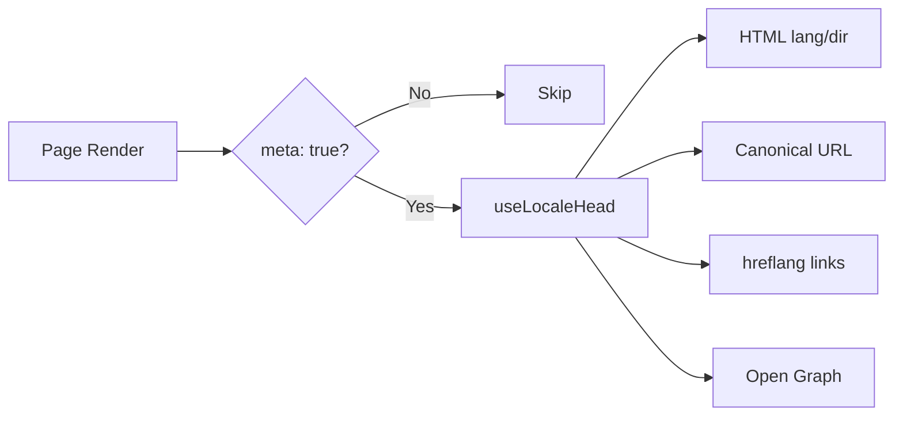

# 🌐 Guia de SEO para o Nuxt I18n Micro

## 📖 Introdução

Um SEO (Search Engine Optimization) eficaz é essencial para garantir que o seu site multilingue é acessível e visível para utilizadores em todo o mundo através dos motores de busca. O `Nuxt I18n Micro` simplifica a gestão de SEO para sites multilingues, gerando automaticamente as meta tags e atributos essenciais que informam os motores de busca sobre a estrutura e o conteúdo do seu site.

Este guia explica como o `Nuxt I18n Micro` gere o SEO para melhorar a visibilidade do seu site e a experiência do utilizador, sem necessitar de configuração adicional.

## ⚙️ Gestão automática de SEO

### Fluxo de geração de meta SEO



**Tags geradas:**

| Tag             | Exemplo                                                  |
| --------------- | -------------------------------------------------------- |
| Atributos HTML | `<html lang="en" dir="ltr">`                             |
| Canónico       | `<link rel="canonical" href="...">`                      |
| hreflang        | `<link rel="alternate" hreflang="en" href="...">`        |
| x-default       | `<link rel="alternate" hreflang="x-default" href="...">` |
| Open Graph      | `<meta property="og:locale" content="en_US">`            |

#### `og` por locale (`og:locale` vs BCP 47)

`<html lang>` e `hreflang` utilizam **BCP 47** através de `locale.iso` (p. ex. `ar-AE`).  
O Open Graph exige **`language_TERRITORY`** com um **underscore** (`ar_AE`), de acordo com o [protocolo OG](https://ogp.me/).

Por predefinição, `og:locale` é derivado de `iso` quando o mapeamento é inequívoco (`en-US` → `en_US`).  
Defina explicitamente uma string **`og`** quando precisar de um valor personalizado (p. ex. `zh-Hans` → `zh_CN`).  
Se não estiver disponível nem um `og`, nem um `iso` convertível, as tags `og:locale` não são geradas — em desenvolvimento, aparece um aviso na consola (respeita `missingWarn`).

```typescript
i18n: {
  meta: true,
  locales: [
    { code: 'ar', iso: 'ar-AE', og: 'ar_AE', dir: 'rtl' },
    { code: 'en', iso: 'en-US' }, // og:locale → en_US
    { code: 'zh', iso: 'zh-Hans', og: 'zh_CN' }, // script tags need explicit og
  ],
}
```

### 🔑 Funcionalidades-chave de SEO

Quando a opção `meta` está ativada no `Nuxt I18n Micro`, o módulo gere automaticamente os seguintes aspetos de SEO:

1. **🌍 Atributos de idioma e direção**:
   - O módulo define os atributos `lang` e `dir` na tag `<html>` de acordo com o locale atual e a direção do texto (p. ex., `ltr` para inglês ou `rtl` para árabe).

2. **🔗 URLs canónicos**:
   - O módulo gera uma ligação canónica (`<link rel="canonical">`) para cada página, garantindo que os motores de busca reconhecem a versão principal do conteúdo.

3. **🌐 Ligações de idiomas alternativos (`hreflang`)**:
   - O módulo gera automaticamente tags `<link rel="alternate" hreflang="">` para todos os locales disponíveis. Isto ajuda os motores de busca a perceberem que versões linguísticas do seu conteúdo estão disponíveis, melhorando a experiência para audiências globais.
   - Cada locale emite **uma** tag: `hreflang = iso || code`. Quando `iso` está definido, o `code` de encaminhamento nunca é utilizado como `hreflang` (para que chaves de mercado como `mx` não se tornem tags de idioma inválidas).
   - A opção `hreflangBaseLanguage: true` também emite uma tag apenas de idioma derivada de `iso` (p. ex. `es-ES` → `es`), atribuída ao primeiro locale regional em `locales`.

4. **🌏 Hreflang `x-default`**:
   - O módulo gera automaticamente uma tag `<link rel="alternate" hreflang="x-default">` apontando para o URL do locale predefinido. Isto indica aos motores de busca que URL mostrar aos utilizadores cujo idioma não corresponde a nenhum dos locales definidos. Não é necessária configuração adicional — funciona automaticamente quando `meta: true` está definido.

5. **🔖 Metadados Open Graph**:
   - O módulo gera meta tags Open Graph (`og:locale`, `og:url`, etc.) para cada locale, o que é particularmente útil para partilha em redes sociais e indexação por motores de busca.

### 🛠️ Configuração

Para ativar estas funcionalidades de SEO, garanta que a opção `meta` está definida como `true` no seu ficheiro `nuxt.config.ts`:

```typescript
export default defineNuxtConfig({
  modules: ['nuxt-i18n-micro'],
  i18n: {
    locales: [
      { code: 'en', iso: 'en-US', dir: 'ltr' },
      { code: 'fr', iso: 'fr-FR', dir: 'ltr' },
      { code: 'ar', iso: 'ar-SA', dir: 'rtl' },
    ],
    defaultLocale: 'en',
    translationDir: 'locales',
    meta: true, // Enables automatic SEO management
  },
})
```

### 🌍 `metaBaseUrl` dinâmico para implementações multi-domínio

Quando `metaBaseUrl` não está definido, os URLs absolutos de SEO são resolvidos pela seguinte ordem (#240):

1. `site.url` do [`nuxt-site-config`](https://nuxtseo.com/docs/site-config) (se esse módulo estiver presente — p. ex. via `@nuxtjs/seo`).
2. Caso contrário, o hostname do pedido atual (`useRequestURL()` / `window.location.origin`).

O fallback para a origem do pedido respeita os cabeçalhos de reverse-proxy (`X-Forwarded-Host`, `X-Forwarded-Proto`), pelo que funciona corretamente atrás de nginx, Cloudflare, AWS ALB e proxies semelhantes.

Isto significa que aplicações que já definem `site.url` para sitemap / robots / schema.org **não** precisam de declarar `metaBaseUrl` uma segunda vez:

```typescript
export default defineNuxtConfig({
  site: {
    url: process.env.NUXT_SITE_URL, // also used by micro for canonical / og:url / hreflang
  },
  i18n: {
    meta: true,
    // metaBaseUrl omitted — picks up site.url, then request origin
  },
})
```

Sem `site.url`, uma única instância de aplicação pode ainda servir **vários domínios** com tags SEO corretas para cada um, através da origem do pedido:

```typescript
export default defineNuxtConfig({
  i18n: {
    meta: true,
    // metaBaseUrl is undefined by default — resolved dynamically from the request
  },
})
```

Por exemplo, um pedido a `https://site-a.com/en/about` produzirá:

```html
<link rel="canonical" href="https://site-a.com/en/about" /> <meta property="og:url" content="https://site-a.com/en/about" />
```

Enquanto a mesma aplicação a servir `https://site-b.com/en/about` produzirá:

```html
<link rel="canonical" href="https://site-b.com/en/about" /> <meta property="og:url" content="https://site-b.com/en/about" />
```

Se necessitar de um URL base fixo que se sobreponha sempre ao `site.url`, passe uma string estática:

```typescript
metaBaseUrl: 'https://example.com'
```

### 🔍 Lista branca de query para o canónico

Por predefinição, os parâmetros de query são removidos do canónico e do `og:url` para evitar conteúdo duplicado. Pode incluir numa lista branca parâmetros específicos que devem ser preservados:

```typescript
i18n: {
  canonicalQueryWhitelist: ['page', 'sort', 'filter', 'search', 'q', 'query', 'tag']
}
```

Apenas os parâmetros listados em `canonicalQueryWhitelist` aparecem nos URLs canónicos. Todos os outros parâmetros de query (p. ex., tracking, IDs de sessão) são removidos.

### 🚫 Desativar meta tags por página

Pode desativar a geração de meta tags de SEO para páginas específicas com `defineI18nRoute()`:

```vue
<script setup>
// Disable all SEO meta tags for this page
defineI18nRoute({
  disableMeta: true,
})
</script>
```

Também pode desativar as meta apenas para locales específicos:

```vue
<script setup>
// Disable meta tags only for English locale on this page
defineI18nRoute({
  disableMeta: ['en'],
})
</script>
```

Quando `disableMeta` está ativo, não são gerados `hreflang`, `canonical`, `og:locale`, `og:url` nem `x-default` para a página/locale afetada.

### 🔇 Locales desativados

Locales com `disabled: true` são automaticamente excluídos da geração de qualquer tag de SEO — não são criados `hreflang`, `og:locale:alternate` nem ligações alternativas para eles:

```typescript
i18n: {
  locales: [
    { code: 'en', iso: 'en-US' },
    { code: 'fr', iso: 'fr-FR', disabled: true }, // excluded from SEO tags
  ]
}
```

### 🙈 Locales opt-out (`seo: false`)

Para locales que devem permanecer encaminháveis e traduzidos, mas não devem aparecer nas tags de descoberta entre locales, defina `seo: false`. Esses locales são omitidos dos alternates `hreflang` e do `og:locale:alternate`. Se o locale **predefinido** configurado tiver `seo: false`, também não é emitida a ligação `x-default`.

```typescript
i18n: {
  locales: [
    { code: 'en', iso: 'en-US' },
    { code: 'ru', iso: 'ru-RU', seo: false }, // internal / non-indexed locale
  ]
}
```

### 📌 Comportamento por estratégia

| Estratégia                | Ligações hreflang   | x-default             | canonical      | og:url |
| ----------------------- | ---------------- | --------------------- | -------------- | ------ |
| `prefix`                | ✅ Todos os locales   | ✅ URL do locale predefinido | ✅ URL atual | ✅     |
| `prefix_except_default` | ✅ Todos os locales   | ✅ URL sem prefixo     | ✅ URL atual | ✅     |
| `prefix_and_default`    | ✅ Todos os locales   | ✅ URL do locale predefinido | ✅ URL atual | ✅     |
| `no_prefix`             | ❌ Não gerado | ❌ Não gerado      | ✅ URL atual | ✅     |

Para a estratégia `no_prefix`, são gerados apenas os atributos `canonical`, `og:url`, `og:locale` e `html` (`lang`, `dir`). Não são geradas ligações de idiomas alternativos (`hreflang`) nem `x-default`, porque não existem URLs distintos por locale.

## Substituições ao nível da página (`useI18nHead`)

Para **artigos, guias ou qualquer conteúdo de CMS** em que não existam todos os locales ou os URLs venham de uma API, utilize [`useI18nHead`](/api/composables/use-i18n-head) na página em vez de um plugin i18n head personalizado.

### Artigo com traduções parciais

```vue
<script setup lang="ts">
const article = await loadArticle()
// article.locales = { en: '...', de: '...' } — only translated locales

useI18nHead({
  meta: [{ property: 'og:title', content: article.title }],
  replace: {
    hreflang: Object.entries(article.locales).map(([locale, href]) => ({
      rel: 'alternate',
      hreflang: locale,
      href,
    })),
    ogAlternates: Object.keys(article.locales),
  },
})
</script>
```

### Slugs por locale com `$setI18nRouteParams`

Quando os slugs diferem por idioma, defina primeiro os parâmetros da rota e depois substitua os alternates por URLs reais:

```vue
<script setup lang="ts">
const { $defineI18nRoute, $setI18nRouteParams } = useNuxtApp()
const { data: article } = await useFetch(`/api/articles/${slug}`)

$defineI18nRoute({
  localeRoutes: { en: '/blog/[slug]', de: '/de/blog/[slug]' },
})

$setI18nRouteParams({
  en: { slug: article.value.slugEn },
  de: { slug: article.value.slugDe },
})

useI18nHead({
  replace: {
    hreflang: ['en', 'de'].map((locale) => ({
      rel: 'alternate',
      hreflang: locale,
      href: article.value.urls[locale],
    })),
    ogAlternates: ['en', 'de'],
  },
})
</script>
```

### Origem HTTPS atrás de um proxy

Para URLs absolutos corretos em SSR sem um composable de origem personalizado:

```ts
i18n: {
  meta: true,
  metaBaseUrl: undefined,
  metaTrustForwardedHost: true,
  metaTrustForwardedProto: true,
}
```

Mais exemplos (substituição de canónico, `x-default`, fetch reativo, helpers partilhados): [Composable useI18nHead](/api/composables/use-i18n-head).

### ⚠️ Barra final

O módulo gera URLs canónicos e `hreflang` com base no caminho real de `useRoute().fullPath`. Se a sua aplicação utilizar barras finais (p. ex., através de `router.options` do Nuxt), os URLs gerados refletirão isso. Contudo, `$switchLocalePath` pode normalizar caminhos e remover barras finais. Se a consistência da barra final for crítica para o seu SEO, verifique se os URLs gerados correspondem à estrutura de URLs da sua aplicação.

### 🎯 Benefícios

Ao ativar a opção `meta`, beneficia de:

- **📈 Melhores rankings nos motores de busca**: os motores de busca conseguem indexar melhor o seu site, compreendendo as relações entre diferentes versões linguísticas.
- **👥 Melhor experiência do utilizador**: os utilizadores recebem a versão de idioma correta com base nas suas preferências, conduzindo a uma experiência mais personalizada.
- **🔧 Menos configuração manual**: o módulo trata das tarefas de SEO automaticamente, libertando-o da necessidade de adicionar manualmente meta tags e atributos relacionados com SEO.

## 🔗 Nuxt SEO (`@nuxtjs/seo`)

O [`@nuxtjs/seo`](https://nuxtseo.com/) inclui sitemap, robots, schema.org, imagens OG e módulos relacionados. Integra-se com o **nuxt-i18n-micro** através do [`nuxt-site-config`](https://nuxtseo.com/docs/site-config/guides/i18n) (v4+).

### Requisitos

- **`@nuxtjs/seo` 3+** (as versões atuais usam `nuxt-site-config` 4+, que regista o plugin `nuxt-site-config:i18n` para o micro).
- **`i18n.meta: true`** (recomendado — o micro fornece tags de head sensíveis ao locale; o Nuxt SEO adiciona sitemap, schema.org, etc.).

### Ordem dos módulos

Liste **nuxt-i18n-micro antes de `@nuxtjs/seo`** para que o site config consiga ler a sua configuração de locale:

```typescript
export default defineNuxtConfig({
  modules: ['nuxt-i18n-micro', '@nuxtjs/seo'],
  site: {
    url: 'https://example.com',
    name: 'My Site',
  },
  i18n: {
    meta: true,
    defaultLocale: 'en',
    locales: [
      { code: 'en', iso: 'en-US' },
      { code: 'de', iso: 'de-DE' },
    ],
  },
})
```

### Nome e descrição do site traduzidos

O Nuxt Site Config lê chaves de tradução opcionais dos seus ficheiros de locale:

```json
{
  "nuxtSiteConfig": {
    "name": "My Site",
    "description": "My site description"
  }
}
```

Os valores por locale em `locales/en.json`, `locales/de.json`, etc. são adotados automaticamente.

### Resolução de problemas

Se vir `Plugin nuxt-seo:defaults depends on nuxt-site-config:i18n but they are not registered`, atualize o **`@nuxtjs/seo` para 3+** (consulte a [issue #133](https://github.com/s00d/nuxt-i18n-micro/issues/133)). O `nuxt-site-config` 3.x mais antigo apenas ligava o i18n para o `@nuxtjs/i18n`, e não para o micro.

Mais: [Guia i18n do Sitemap](https://nuxtseo.com/docs/sitemap/guides/i18n), [Guia i18n do Site Config](https://nuxtseo.com/docs/site-config/guides/i18n).
