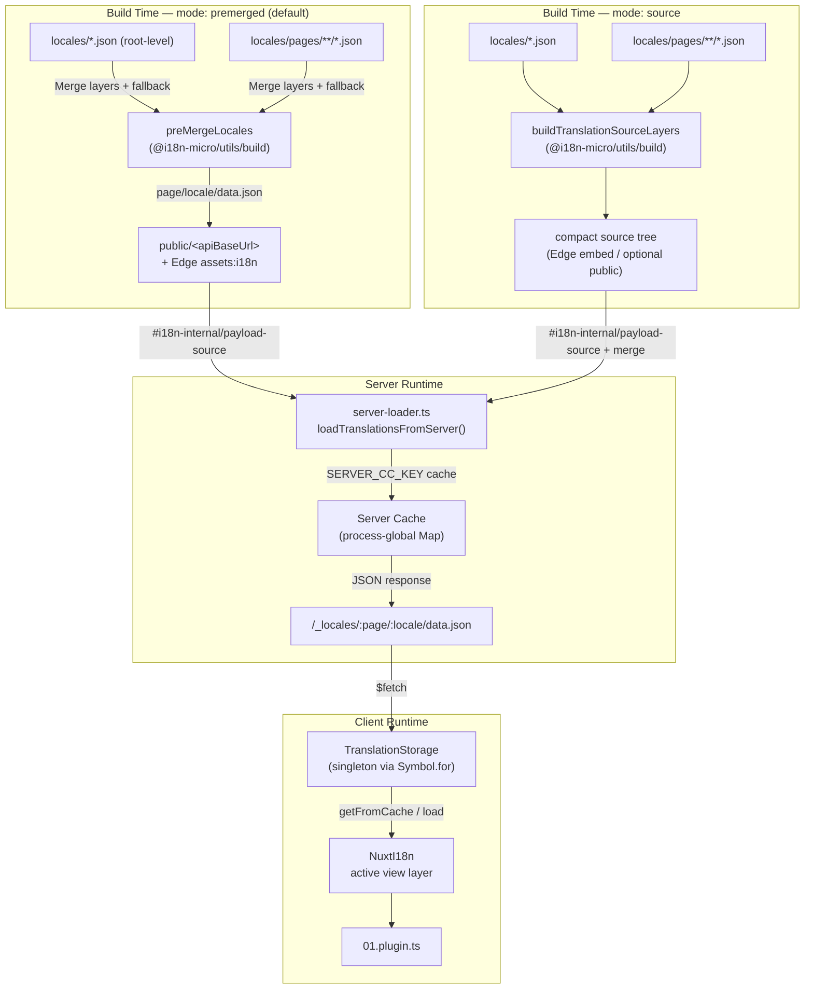

# 🗄️ Arhitectura cache-ului și stocării traducerilor

## 📖 Prezentare generală

Nuxt I18n Micro v3 folosește o arhitectură de cache pe mai multe niveluri pentru traduceri. Încărcarea payloadului depinde de `translationPayloads.mode`:

- **`premerged`** (implicit) — fișierele root, page, fallback și layer sunt îmbinate la build time prin `@i18n-micro/utils/build` în `\{page\}/\{locale\}/data.json`
- **`source`** — fișierele sursă compacte sunt păstrate pentru îmbinare la runtime prin `@i18n-micro/utils/source-loader` și `@i18n-micro/utils/merge-source` (Edge le integrează în Nitro `serverAssets`; Node le citește din `public/` când sunt copiate)

Această pagină descrie cum funcționează cache-ul încorporat și cum să îl extinzi pentru cazuri de utilizare personalizate (unelte admin, API-uri externe, invalidarea cache-ului).

## 📊 Prezentare generală a arhitecturii

### Flux de date



## 🧱 Componente principale

### 1. `TranslationStorage` (Client + Server)

**Fișier**: `src/runtime/utils/storage.ts`

O clasă singleton care oferă stocare unificată a traducerilor atât pentru client, cât și pentru server. Folosește `Symbol.for('__NUXT_I18N_STORAGE_CACHE__')` pe `globalThis` pentru a asigura că există o singură instanță, chiar și atunci când sunt încărcate mai multe bundle-uri.

**Metode principale:**

| Metodă                              | Descriere                                                                    |
| ----------------------------------- | ---------------------------------------------------------------------------- |
| `getFromCache(locale, routeName?)`  | Verificare sincronă: returnează datele cache-uite în memorie, sau `null`     |
| `load(locale, routeName?, options)` | Încărcare async cu cache: verifică mai întâi cache-ul, apoi face fetch prin `$fetch` |
| `clear()`                           | Golește întregul cache                                                       |

**Formatul cheii de cache**: `\{locale\}:\{routeName\}` (de ex., `en:index`, `fr:about`)

```typescript
import { translationStorage } from '../utils/storage'

// Synchronous cache check
const cached = translationStorage.getFromCache('en', 'index')

// Async load (with automatic caching)
const result = await translationStorage.load('en', 'index', {
  apiBaseUrl: '_locales',
  baseURL: '/',
  dateBuild: '2024-01-01',
})
// result.data — merged translations
// result.cacheKey — cache key used
```

### ⚙️ Cache busting determinist (`i18n.dateBuild`)

Implicit, acest modul generează `dateBuild` în timpul build-ului folosind `Date.now()`. Este apoi integrat în `#build/i18n.strategy.mjs` generat și folosit ca parametru query (`?v=...`) pentru a invalida cache-urile de fetch al traducerilor după rebuild-uri.

Dacă ai nevoie de build-uri reproductibile (de exemplu, pentru a îmbunătăți rata de hit al cache-ului de chunk-uri în deploymenturile rolling), setează o valoare stabilă în `nuxt.config`:

```ts
export default defineNuxtConfig({
  i18n: {
    // Any stable string/number (git SHA, CI build number, release tag, etc.)
    dateBuild: process.env.GIT_SHA ?? 'local-dev',
  },
})
```

### 2. `loadTranslationsFromServer()` (doar server)

**Fișier**: `src/runtime/server/utils/server-loader.ts`

Încarcă traducerile pentru un locale/page și cache-uiește rezultatul îmbinat într-un map `CacheControl` global pentru proces, indexat după `@i18n-micro/hmr/cache-keys` (`SERVER_CC_KEY`).

Comportament: SSR încarcă din `#i18n-internal/payload-source` — **Node** `readFile` sub `public/<apiBaseUrl>` (`\{page\}/\{locale\}/data.json` în modul premerged), **Edge** `assets:i18n`. `premerged` citește un fișier; `source` îmbină root/page/fallback prin `@i18n-micro/utils/source-loader`.

```typescript
import { loadTranslationsFromServer } from '../server/utils/server-loader'

// Returns { data: Translations, json: string }
const { data, json } = await loadTranslationsFromServer('en', 'index')
```

### 3. Încărcare pe client (fără HTML embed)

Dicționarele **nu** sunt scrise în `nuxtApp.payload`. Serverul le păstrează în memorie pentru randarea SSR;
pluginul din client face `await` pe `switchContext`, care încarcă `/\{apiBaseUrl\}/:page/:locale/data.json`
(aceeași poziție implicită ca `@nuxtjs/i18n` cu `experimental.preload: false`).

`NuxtI18n` deține dicționarul activ la nivel de vizualizare folosit de `$t()` și `$has()`. `NuxtTranslationLoader` comută contextul de locale/route și îmbină chunk-urile în acel nivel.

### 4. Ruta API a serverului

**Rută**: `/_locales/\{page\}/\{locale\}/data.json`

**Fișier**: `src/runtime/server/routes/i18n.ts`

Această rută Nitro servește traduceri îmbinate pentru modul de payload activ. Ea apelează `loadTranslationsFromServer()` și returnează rezultatul ca JSON.

În producție setează, de asemenea:

```http
Cache-Control: public, max-age={httpCacheDuration}, immutable
```

Valoarea implicită pentru `httpCacheDuration` este `31536000` (1 an). Aceasta este sigură deoarece clienții solicită payloadurile cu cache-busting `?v=\{dateBuild\}`. Setează `httpCacheDuration: 0` pentru a omite header-ul. Header-ul nu este aplicat în dezvoltare.

## 📥 Extindere: încărcare personalizată a traducerilor

### Citire din cache (rută de server)

```ts
// server/api/i18n/load-cache.[post].ts
import { defineEventHandler, readBody } from 'h3'
import { loadTranslationsFromServer } from '#imports'

export default defineEventHandler(async (event) => {
  const { page, locale } = await readBody<{ page: string; locale: string }>(event)
  const { data } = await loadTranslationsFromServer(locale, page)
  return { locale, page, data }
})
```

### Actualizarea traducerilor (fișier + invalidare cache)

```ts
// server/api/i18n/update.[post].ts
import { defineEventHandler, readBody, createError } from 'h3'
import { join } from 'node:path'
import { readFile, writeFile } from 'node:fs/promises'
import { deepMergeTranslations } from '@i18n-micro/utils/deep-merge'

export default defineEventHandler(async (event) => {
  const { path, updates } = await readBody<{ path: string; updates: Record<string, unknown> }>(event)

  if (!path || !updates) {
    throw createError({ statusCode: 400, statusMessage: 'Missing path or updates' })
  }

  const fullPath = join('locales', path)
  let existing: Record<string, unknown> = {}

  try {
    const content = await readFile(fullPath, 'utf-8')
    existing = JSON.parse(content) as Record<string, unknown>
  } catch {
    // File does not exist — create new
  }

  const merged = deepMergeTranslations(existing, updates)
  await writeFile(fullPath, JSON.stringify(merged, null, 2), 'utf-8')

  return { success: true, path, updated: merged }
})
```

<Tip>

</Tip>

## 🧹 Golirea cache-ului

### Golirea cache-ului programatic (client)

Folosește metoda încorporată `$clearCache`:

```vue
<script setup>
const { $clearCache } = useNuxtApp()

// Clears both TranslationStorage and plugin-level cache
$clearCache()
</script>
```

### Comportamentul cache-ului de server

Cache-ul de pe server (`loadTranslationsFromServer`) este global pentru proces și persistă până când:

- Procesul serverului repornește
- Este detectat un nou deployment (valoare `dateBuild` diferită)

Pentru mediile serverless, fiecare cold start are un cache proaspăt.

## ⚙️ Configurare pentru serverless

Pentru medii serverless (Cloudflare Workers, AWS Lambda), cache-ul încorporat folosește obiecte `Map` în memorie. Nu este necesară nicio configurație externă de stocare pentru cache-ul de traduceri în sine.

Cu toate acestea, stocarea Nitro pentru fișierele sursă de traduceri poate necesita configurare:

```ts
export default defineNuxtConfig({
  nitro: {
    storage: {
      // Only needed if default file-system storage is unavailable
      'assets:server': {
        driver: 'cloudflare-kv-binding',
        binding: 'MY_KV_NAMESPACE',
      },
    },
  },
})
```

## 💡 Diferențe cheie față de v2

| Aspect             | v2                              | v3                                                                       |
| ------------------ | ------------------------------- | ------------------------------------------------------------------------ |
| Cache client       | `useStorage('cache')`           | Singleton `TranslationStorage` (Symbol.for pe globalThis)                |
| Transfer SSR       | Runtime config                  | Chunk-uri complete prin `payload.data` (v3.0 folosea `useState`)         |
| Cache server       | Nitro cache storage             | `Map` global de proces prin `Symbol.for`                                 |
| Logică de îmbinare | Pe client                       | Build-time (`premerged`) sau runtime (`source`) prin `@i18n-micro/utils/*` |
| Format cheie cache | `i18n:merged:\{page\}:\{locale\}` | `\{locale\}:\{routeName\}`                                               |

## 📚 Similar

- [Performance Guide](/guides/performance) — Cum influențează cache-ul performanța
- [Server-Side Translations](/guides/server-side-translations) — Utilizarea traducerilor în rutele de server
- [Firebase Deployment](/guides/firebase) — Considerații de cache specifice deploymentului
