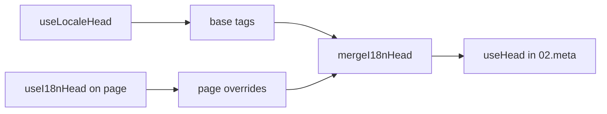

# Composable-ul `useI18nHead`

`useI18nHead` îți permite să personalizezi etichetele SEO i18n **per pagină** fără un plugin de meta personalizat. Când `meta: true`, modulul îmbină intrarea ta peste ieșirea din [`useLocaleHead`](/api/composables/use-locale-head).

Cazuri tipice:

- **Articole CMS / blog** — doar unele locale sunt traduse; URL-urile alternative diferă pe limbă (slug-uri sau căi diferite).
- **Canonical dinamic** — URL-ul canonic trebuie să corespundă URL-ului articolului din API, nu cu `$switchLocalePath`.
- **Open Graph suplimentar** — `og:title`, `og:description`, `og:image` alături de `og:locale` / `og:url` auto-generate.
- **Control parțial** — păstrează canonical și `og:url` generate de modul, dar înlocuiește doar `hreflang` și `og:locale:alternate`.

---

## Semnătură

{/* generated:symbol:useI18nHead — do not edit; run `pnpm run docs:generate` */}

```ts
useI18nHead(input?: MaybeRefOrGetter<I18nHeadInput | null>): { pageHead: any; resetPageHead: () => void }
```

Înregistrează suprascrieri la nivel de pagină pentru etichetele head SEO i18n.
Îmbinate peste ieșirea `useLocaleHead` de către plugin-ul `02.meta`.

| Parametru | Tip | Descriere |
| --- | --- | --- |
| `input` *(opțional)* | `MaybeRefOrGetter<I18nHeadInput \| null>` |  |

{/* /generated:symbol:useI18nHead */}

## Cum se încadrează în pipeline



Apelezi `useI18nHead` într-o componentă de pagină. Plugin-ul `02.meta` aplică suprascrierile după fiecare `updateMeta()` (schimbare de rută, `$setI18nRouteParams`, `page:finish` pe client).

---

## Exemplul 1 — Articol cu traduceri doar în anumite locale

Un model comun: API-ul returnează ce locale există și URL-urile lor absolute sau relative.

```ts
interface Article {
  title: string
  slug: string
  /** Locale code → page URL (absolute or site-relative) */
  locales: Record<string, string>
}
```

```vue
<script setup lang="ts">
const route = useRoute()
const { data: article } = await useFetch<Article>(`/api/articles/${route.params.slug}`)

const localeCodes = computed(() => Object.keys(article.value?.locales ?? {}))

useI18nHead(() => {
  if (!article.value) return null

  return {
    meta: [
      { property: 'og:title', content: article.value.title },
      { property: 'og:type', content: 'article' },
    ],
    replace: {
      hreflang: localeCodes.value.map((locale) => ({
        rel: 'alternate',
        hreflang: locale,
        href: article.value!.locales[locale]!,
      })),
      ogAlternates: localeCodes.value,
    },
  }
})
</script>
```

`ogAlternates` preia **coduri de locale** din configurația ta `i18n.locales`. Valorile pentru `og:locale:alternate` sunt rezolvate prin `locale.og` sau `iso` (format Open Graph `en_US`).

---

## Exemplul 2 — Articol cu slug-uri per locale (`$defineI18nRoute` + `$setI18nRouteParams`)

Când URL-urile sunt construite din template-uri de rută localizate și parametri dinamici:

```vue
<script setup lang="ts">
const { $defineI18nRoute, $setI18nRouteParams } = useNuxtApp()
const route = useRoute()

const { data: article } = await useFetch(`/api/articles/${route.params.slug}`)

$defineI18nRoute({
  localeRoutes: {
    en: '/blog/[slug]',
    de: '/de/blog/[slug]',
    fr: '/fr/blog/[slug]',
  },
})

if (article.value) {
  $setI18nRouteParams({
    en: { slug: article.value.slugEn },
    de: { slug: article.value.slugDe },
    fr: { slug: article.value.slugFr },
  })

  const availableLocales = article.value.availableLocales as string[]

  useI18nHead({
    meta: [{ property: 'og:title', content: article.value.title }],
    replace: {
      hreflang: availableLocales.map((locale) => ({
        rel: 'alternate',
        hreflang: locale,
        href: article.value!.urls[locale],
      })),
      ogAlternates: availableLocales,
    },
  })
}
</script>
```

Alternativele generate de modul ar lista **toate** localele configurate. `replace.hreflang` limitează etichetele la localele care au efectiv o traducere.

---

## Exemplul 3 — `x-default` personalizat pentru URL-ul articolului din locale-ul implicit

În mod implicit, `x-default` indică URL-ul locale-ului implicit din `$switchLocalePath`. Pentru articole, îndreaptă-l către URL-ul traducerii implicite:

```vue
<script setup lang="ts">
const { $defaultLocale } = useNuxtApp()
const article = await loadArticle()

const defaultLocale = $defaultLocale() ?? 'en'
const defaultHref = article.locales[defaultLocale]

useI18nHead({
  replace: {
    hreflang: Object.entries(article.locales).map(([locale, href]) => ({
      rel: 'alternate',
      hreflang: locale,
      href,
    })),
    xDefault: defaultHref ? { rel: 'alternate', hreflang: 'x-default', href: defaultHref } : false,
    ogAlternates: Object.keys(article.locales),
  },
})
</script>
```

---

## Exemplul 4 — Înlocuiește canonical și `og:url` din datele API

Când canonical-ul trebuie să corespundă unui URL furnizat de CMS (multi-domeniu, cale personalizată sau URL absolut pregătit):

```vue
<script setup lang="ts">
const article = await loadArticle()
const canonical = article.canonicalUrl // e.g. https://www.example.com/en/blog/my-post

useI18nHead({
  replace: {
    canonical,
    ogUrl: canonical,
    hreflang: buildAlternateLinks(article),
    ogAlternates: Object.keys(article.locales),
  },
  meta: [
    { property: 'og:title', content: article.title },
    { name: 'description', content: article.excerpt },
  ],
})
</script>
```

---

## Exemplul 5 — Păstrează canonical / `og:url` auto, înlocuiește doar alternativele

Dacă `$switchLocalePath` + `$setI18nRouteParams` produc deja canonical și `og:url` corecte, înlocuiește doar etichetele de descoperire:

```vue
<script setup lang="ts">
const article = await loadArticle()

useI18nHead({
  replace: {
    hreflang: buildAlternateLinks(article),
    ogAlternates: Object.keys(article.locales),
  },
})
</script>
```

---

## Exemplul 6 — Head complet pentru o pagină de detaliu de conținut (meta + link-uri)

Model similar cu împărțirea „meta paginii" și „link-uri alternative" în helper-i separați, combinate într-un singur apel:

```vue
<script setup lang="ts">
const article = await loadArticle()
const alternates = Object.entries(article.locales).map(([locale, href]) => ({
  rel: 'alternate' as const,
  hreflang: locale,
  href: normalizeSeoUrl(href), // strip ?query and #hash if needed
}))

useI18nHead({
  meta: [
    { property: 'og:title', content: article.title },
    { property: 'og:description', content: article.description },
    { property: 'og:image', content: article.imageUrl },
    { name: 'twitter:card', content: 'summary_large_image' },
    { name: 'twitter:title', content: article.title },
  ],
  replace: {
    canonical: article.canonicalUrl,
    ogUrl: article.canonicalUrl,
    hreflang: alternates,
    ogAlternates: Object.keys(article.locales),
  },
})
</script>
```

```ts
/** Remove query and hash — useful when CMS URLs must be clean for SEO */
function normalizeSeoUrl(href: string): string {
  try {
    const url = new URL(href, 'https://placeholder.local')
    url.search = ''
    url.hash = ''
    return href.startsWith('http') ? url.href : `${url.pathname}`
  } catch {
    return href.split(/[?#]/)[0] ?? href
  }
}
```

---

## Exemplul 7 — Două tipuri de conținut, același model (news vs guides)

Aceeași formă de API, nume de rute diferite. Refolosește un mic helper:

```ts
// composables/useArticleHead.ts
import type { I18nHeadInput } from '@i18n-micro/types'

interface LocalizedContent {
  title: string
  locales: Record<string, string>
  canonicalUrl?: string
}

export function buildArticleHead(content: LocalizedContent): I18nHeadInput {
  const localeCodes = Object.keys(content.locales)
  const canonical = content.canonicalUrl ?? content.locales.en

  return {
    meta: [{ property: 'og:title', content: content.title }],
    replace: {
      canonical,
      ogUrl: canonical,
      hreflang: localeCodes.map((locale) => ({
        rel: 'alternate',
        hreflang: locale,
        href: content.locales[locale]!,
      })),
      ogAlternates: localeCodes,
    },
  }
}
```

```vue
<!-- pages/blog/[slug].vue -->
<script setup lang="ts">
const article = await loadArticle()
useI18nHead(buildArticleHead(article))
</script>
```

```vue
<!-- pages/guides/[slug].vue -->
<script setup lang="ts">
const guide = await loadGuide()
useI18nHead(buildArticleHead(guide))
</script>
```

---

## Exemplul 8 — Dezactivează alternativele încorporate, furnizează propria listă

Echivalent cu dezactivarea generatorului de hreflang al modulului și transmiterea unei liste personalizate (fără seturi de alternative duplicate):

```vue
<script setup lang="ts">
const article = await loadArticle()

useI18nHead({
  disable: ['hreflang', 'x-default', 'og-alternates'],
  link: Object.entries(article.locales).map(([locale, href]) => ({
    rel: 'alternate',
    hreflang: locale,
    href,
  })),
  replace: {
    ogAlternates: Object.keys(article.locales),
  },
})
</script>
```

Sau preferă `replace.hreflang` fără `disable` — înlocuiește toate link-urile `rel="alternate"` într-un singur pas.

---

## Exemplul 9 — Pagină de landing: doar OG suplimentar, păstrează toate etichetele i18n

```vue
<script setup lang="ts">
const { t } = useI18n()

useI18nHead({
  meta: [
    { property: 'og:title', content: t('landing.ogTitle') },
    { property: 'og:description', content: t('landing.ogDescription') },
  ],
})
</script>
```

---

## Exemplul 10 — Pagină de produs: dezactivează hreflang pentru un singur experiment de locale

```vue
<script setup lang="ts">
useI18nHead({
  disable: ['hreflang', 'x-default'],
  // canonical, og:locale, og:url still generated
})
</script>
```

---

## Exemplul 11 — Actualizări reactive după fetch pe client

```vue
<script setup lang="ts">
const article = ref<Article | null>(null)

onMounted(async () => {
  article.value = await $fetch('/api/articles/latest')
})

useI18nHead(() => {
  if (!article.value) return null
  return {
    meta: [{ property: 'og:title', content: article.value.title }],
    replace: {
      hreflang: Object.entries(article.value.locales).map(([locale, href]) => ({
        rel: 'alternate',
        hreflang: locale,
        href,
      })),
    },
  }
})
</script>
```

Head-ul se împrospătează la `page:finish` și când starea `pageHead` se schimbă.

---

## Exemplul 12 — Origine HTTPS în spatele unui proxy invers

Dacă anterior rezolvai un composable de „origine publică" pentru URL-uri absolute canonical / alternative, folosește în schimb configurația de modul:

```ts
// nuxt.config.ts
export default defineNuxtConfig({
  i18n: {
    meta: true,
    // undefined = origin from current request (multi-domain friendly)
    metaBaseUrl: undefined,
    metaTrustForwardedHost: true,
    metaTrustForwardedProto: true,
  },
})
```

Apoi transmite **căi sau URL-uri complete** în `replace.hreflang` / `replace.canonical`. Modulul folosește `useRequestURL` cu `X-Forwarded-Host` / `X-Forwarded-Proto` pe SSR.

---

## Referință API

### `meta`

Etichete `<meta>` suplimentare. Dedublate după `id`, `property` sau `name`.

### `link`

Etichete `<link>` suplimentare. Dedublate după `id` sau `rel` + `hreflang`.

### `htmlAttrs`

Îmbinate în atributele `<html>` din `useLocaleHead` (`lang`, `dir`).

### `replace`

| Cheie          | Tip                       | Efect                                          |
| -------------- | ------------------------- | ---------------------------------------------- |
| `canonical`    | `string \| false`         | Înlocuiește sau elimină link-ul canonical      |
| `hreflang`     | `I18nHeadLink[] \| false` | Înlocuiește sau elimină toate link-urile `rel="alternate"` |
| `xDefault`     | `I18nHeadLink \| false`   | Înlocuiește sau elimină `hreflang="x-default"` |
| `ogLocale`     | `string \| false`         | Înlocuiește sau elimină `og:locale`            |
| `ogUrl`        | `string \| false`         | Înlocuiește sau elimină `og:url`               |
| `ogAlternates` | `string[] \| false`       | Reconstruiește `og:locale:alternate` pentru coduri de locale |

### `disable`

| Valoare         | Elimină                                     |
| --------------- | ------------------------------------------- |
| `hreflang`      | Link-urile alternative de locale (nu `x-default`) |
| `x-default`     | Link-ul `hreflang="x-default"`              |
| `canonical`     | Link-ul canonical                           |
| `og`            | `og:locale` și `og:url`                     |
| `og-alternates` | Etichetele `og:locale:alternate`            |
| `html`          | `lang` / `dir` pe `<html>`                  |

---

## `useLocaleHead` vs `useI18nHead`

| Composable      | Scop                    | Când să folosești                          |
| --------------- | ----------------------- | ------------------------------------------ |
| `useLocaleHead` | Global / head manual    | `meta: false`, `useHead` personalizat complet |
| `useI18nHead`   | Suprascrieri per pagină | `meta: true`, personalizează pagini specifice |

Când `meta: true`, **nu** ai nevoie de `useLocaleHead` pe paginile care folosesc doar `useI18nHead`.

---

## Migrare de la un plugin i18n de head personalizat

Multe proiecte întrețin un plugin personalizat care:

- îmbină link-uri alternative specifice paginii dintr-o stare partajată;
- filtrează intrări regionale duplicate `hreflang`;
- normalizează valorile `og:locale`;
- elimină șirurile de interogare din URL-urile SEO.

Poți înlocui acest lucru cu `useI18nHead` pe fiecare pagină de conținut și valorile implicite ale modulului.

| Abordarea anterioară                                  | Cu `useI18nHead`                                    |
| ----------------------------------------------------- | --------------------------------------------------- |
| Stare partajată + „ce locale există pentru acest articol" | `replace: \{ ogAlternates: localeCodes \}`            |
| Helper separat care construiește link-uri `rel="alternate"` | `replace: \{ hreflang: links \}`                      |
| Plugin personalizat care îmbină starea paginii în head | Îmbinare încorporată în `02.meta`                   |
| „Origine publică" personalizată pentru URL-uri absolute | `metaBaseUrl` + antete forwarded (vezi exemplul 12) |
| `og:locale` scurt (`en` în loc de `en_US`)            | Setează `locale.og` sau folosește `iso` → `en_US` (protocol OG) |

**`hreflang` din `iso`:** fiecare locale emite o alternativă cu `hreflang = iso || code`. Codul de rutare `code` nu este folosit niciodată când `iso` este setat (evită etichete invalide precum `hreflang="mx"`). Activează fallback-urile de limbă simplă (`es-ES` → și `es`) cu `hreflangBaseLanguage: true`. Derivate din `iso`, nu din `code`. Pentru liste complet personalizate, folosește `replace.hreflang`.

**JSON-LD:** `useI18nHead` nu generează date structurate. Păstrează `useHead(\{ script: [...] \})` sau un helper JSON-LD dedicat alături.

---

## Vezi și

- [Ghid SEO](/guides/seo) — generarea automată de meta și suprascrieri la nivel de pagină
- [`useLocaleHead`](/api/composables/use-locale-head) — API de head de nivel scăzut
