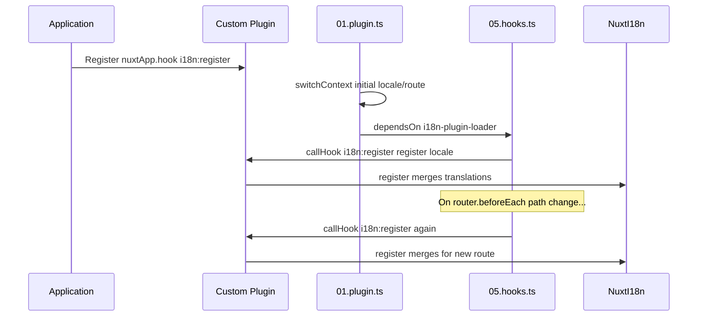

# 📢 Evenimente

## 🔄 `i18n:register`

Evenimentul `i18n:register` din `Nuxt I18n Micro` permite adăugarea dinamică de traduceri în contextul i18n al aplicației tale, făcând procesul de internaționalizare fluid și flexibil. Acest eveniment îți permite să integrezi traduceri noi după cum este necesar, îmbunătățind capacitățile de localizare ale aplicației tale.

### 📝 Detalii despre eveniment

- **Scop**:
  - Permite încorporarea dinamică de traduceri suplimentare în setul existent pentru un anumit locale.

- **Payload**:
  - **`register`**:
    - O funcție furnizată de eveniment care primește două argumente:
      - **`translations`** (`Translations`):
        - Un obiect care conține perechi cheie-valoare reprezentând traducerile, organizate în conformitate cu interfața `Translations`.
      - **`locale`** (`string`, opțional):
        - Codul locale-ului (de exemplu, `'en'`, `'ru'`) pentru care sunt înregistrate traducerile. Implicit este locale-ul furnizat de eveniment dacă nu este specificat.

- **Comportament**:
  - Atunci când este declanșată, funcția `register` îmbină noile traduceri în contextul curent pentru locale-ul specificat, actualizând traducerile disponibile în întreaga aplicație.

### ⏱️ Când se declanșează

Plugin-ul de hook-uri al modulului (`05.hooks.ts`, `dependsOn: ['i18n-plugin-loader']`) apelează `nuxtApp.callHook('i18n:register', …)`:

1. **O singură dată la pornire** — după ce plugin-ul principal i18n (`01.plugin.ts`) a încărcat traducerile pentru ruta inițială
2. **La navigare** — în `router.beforeEach` când se schimbă calea, sau la fiecare navigare când `strategy: 'no_prefix'`

Înregistrează listener-ul într-un plugin Nuxt normal cu `nuxtApp.hook('i18n:register', …)`. Plugin-ul de hook-uri rulează după ce loader-ul este gata, așa că callback-ul tău este invocat atunci când traducerile trebuie extinse.

Setează `hooks: false` în `nuxt.config` pentru a dezactiva apelurile automate `i18n:register` (vezi [Configurare — `hooks`](/guides/configuration#hooks)).

### 💡 Exemplu de utilizare

Următorul exemplu demonstrează cum să folosești evenimentul `i18n:register` pentru a adăuga dinamic traduceri:

```typescript
nuxt.hook('i18n:register', async (register: (translations: unknown, locale?: string) => void, locale: string) => {
  register(
    {
      greeting: 'Hello',
      farewell: 'Goodbye',
    },
    locale,
  )
})
```

### 🛠️ Explicație



- **Declanșarea evenimentului**:
  - Plugin-ul de hook-uri (`05.hooks.ts`) declanșează `i18n:register` după ce loader-ul principal este gata și la navigările relevante.

- **Adăugarea traducerilor**:
  - Exemplul înregistrează traduceri în engleză pentru `"greeting"` și `"farewell"`.
  - Funcția `register` îmbină aceste traduceri în setul existent pentru locale-ul furnizat.

### 🔗 Beneficii cheie

- **Actualizări dinamice**:
  - Actualizează sau adaugă traduceri cu ușurință, fără a fi nevoie să reimplementezi întreaga aplicație.

- **Flexibilitate de localizare**:
  - Suportă ajustări de localizare în timp real în funcție de nevoile utilizatorului sau ale aplicației.

Utilizând evenimentul `i18n:register`, poți asigura că strategia de localizare a aplicației tale rămâne flexibilă și adaptabilă, îmbunătățind experiența generală a utilizatorului.

---

## 🛠️ Modificarea traducerilor cu plugin-uri

Pentru a modifica dinamic traducerile în aplicația ta Nuxt, este recomandat să folosești plugin-uri. Plugin-urile oferă o modalitate structurată de a gestiona actualizările de localizare, în special atunci când lucrezi cu module sau fișiere de traducere externe.

### **Înregistrarea plugin-ului**

Dacă folosești un modul, înregistrează plugin-ul unde vor avea loc modificările de traducere adăugându-l la configurația modulului tău:

```javascript
addPlugin({
  src: resolve('./plugins/extend_locales'),
})
```

Acesta înregistrează plugin-ul localizat la `./plugins/extend_locales`, care va gestiona încărcarea și înregistrarea dinamică a traducerilor.

### **Implementarea plugin-ului**

În plugin, poți gestiona modificările de locale. Iată un exemplu de implementare într-un plugin Nuxt:

```typescript
import { defineNuxtPlugin } from '#app'

export default defineNuxtPlugin(async (nuxtApp) => {
  // Function to load translations from JSON files and register them
  const loadTranslations = async (lang: string) => {
    try {
      const translations = await import(`../locales/${lang}.json`)
      return translations.default
    } catch (error) {
      console.error(`Error loading translations for language: ${lang}`, error)
      return null
    }
  }

  // Hook into the 'i18n:register' event to dynamically add translations
  // eslint-disable-next-line @typescript-eslint/ban-ts-comment
  // @ts-expect-error
  nuxtApp.hook('i18n:register', async (register: (translations: unknown, locale?: string) => void, locale: string) => {
    const translations = await loadTranslations(locale)
    if (translations) {
      register(translations, locale)
    }
  })
})
```

### 📝 Explicație detaliată

1. **Încărcarea traducerilor**:

- Funcția `loadTranslations` importă dinamic fișierele de traducere pe baza locale-ului. Fișierele sunt așteptate a fi în directorul `locales` și denumite conform codurilor de locale (de exemplu, `en.json`, `de.json`).
- La încărcarea cu succes, traducerile sunt returnate; în caz contrar, este înregistrată o eroare.

2. **Înregistrarea traducerilor**:

- Plugin-ul se conectează la evenimentul `i18n:register` folosind `nuxtApp.hook`.
- Când evenimentul este declanșat, funcția `register` este apelată cu traducerile încărcate și locale-ul corespunzător.
- Aceasta îmbină noile traduceri în contextul i18n pentru locale-ul specificat, actualizând traducerile disponibile în întreaga aplicație.

### 🔗 Beneficiile utilizării plugin-urilor pentru modificarea traducerilor

- **Separarea preocupărilor**:
  - Încapsulează logica de localizare separat de codul principal al aplicației, făcând gestionarea și mentenanța mai ușoare.

- **Dinamic și scalabil**:
  - Prin încărcarea și înregistrarea dinamică a traducerilor, poți actualiza conținutul fără a necesita o reimplementare completă a aplicației, ceea ce este deosebit de util pentru aplicațiile cu conținut actualizat frecvent sau multilingv.

- **Flexibilitate îmbunătățită de localizare**:
  - Plugin-urile îți permit să modifici sau să extinzi traducerile după cum este necesar, oferind o strategie de localizare mai adaptabilă și mai receptivă, care să răspundă preferințelor utilizatorului sau cerințelor de business.

Adoptând această abordare, poți extinde și modifica eficient localizarea aplicației tale printr-un proces structurat și mentenabil folosind plugin-uri, păstrând internaționalizarea adaptivă la nevoile în schimbare și îmbunătățind experiența generală a utilizatorului.
