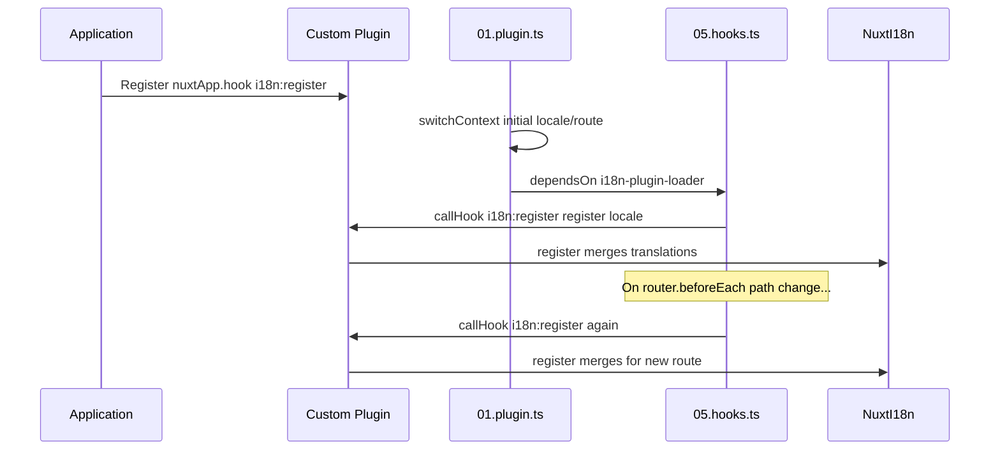

# 📢 Evenimente

## 🔄 `i18n:register`

Evenimentul `i18n:register` din `Nuxt I18n Micro` permite adăugarea dinamică a traducerilor la contextul i18n al aplicației tale, făcând procesul de internaționalizare fluid și flexibil. Acest eveniment îți permite să integrezi traduceri noi după nevoie, îmbunătățind capabilitățile de localizare ale aplicației.

### 📝 Detalii eveniment

- **Scop**:
  - Permite încorporarea dinamică a traducerilor suplimentare în setul existent pentru un locale specific.

- **Payload**:
  - **`register`**:
    - O funcție oferită de eveniment care preia două argumente:
      - **`translations`** (`Translations`):
        - Un obiect care conține perechi cheie-valoare reprezentând traduceri, organizate conform interfeței `Translations`.
      - **`locale`** (`string`, opțional):
        - Codul locale-ului (de ex. `'en'`, `'ru'`) pentru care sunt înregistrate traducerile. Dacă nu este specificat, se folosește locale-ul furnizat de eveniment.

- **Comportament**:
  - Când este declanșată, funcția `register` îmbină noile traduceri în contextul curent pentru locale-ul specificat, actualizând traducerile disponibile în întreaga aplicație.

### ⏱️ Când se declanșează

Pluginul de hook-uri al modulului (`05.hooks.ts`, `dependsOn: ['i18n-plugin-loader']`) apelează `nuxtApp.callHook('i18n:register', …)`:

1. **O dată la pornire** — după ce pluginul principal i18n (`01.plugin.ts`) a încărcat traducerile pentru ruta inițială
2. **La navigare** — în `router.beforeEach` când calea se schimbă, sau la fiecare navigare când `strategy: 'no_prefix'`

Înregistrează listener-ul într-un plugin Nuxt normal cu `nuxtApp.hook('i18n:register', …)`. Pluginul de hook-uri rulează după ce loaderul este gata, deci callback-ul tău este invocat când traducerile trebuie extinse.

Setează `hooks: false` în `nuxt.config` pentru a dezactiva apelurile automate `i18n:register` (vezi [Configuration — `hooks`](/guides/configuration#hooks)).

### 💡 Exemplu de utilizare

Exemplul următor demonstrează cum să folosești evenimentul `i18n:register` pentru a adăuga dinamic traduceri:

```typescript
nuxt.hook('i18n:register', async (register: (translations: unknown, locale?: string) => void, locale: string) => {
  register(
    {
      greeting: 'Hello',
      farewell: 'Goodbye',
    },
    locale,
  )
})
```

### 🛠️ Explicație



- **Declanșarea evenimentului**:
  - Pluginul de hook-uri (`05.hooks.ts`) declanșează `i18n:register` după ce loaderul principal este gata și la navigările relevante.

- **Adăugarea traducerilor**:
  - Exemplul înregistrează traduceri în engleză pentru `"greeting"` și `"farewell"`.
  - Funcția `register` îmbină aceste traduceri în setul existent pentru locale-ul furnizat.

### 🔗 Avantaje cheie

- **Actualizări dinamice**:
  - Actualizează sau adaugă cu ușurință traduceri fără a fi nevoie să redistribui întreaga aplicație.

- **Flexibilitate de localizare**:
  - Suportă ajustări de localizare în timp real bazate pe nevoile utilizatorului sau ale aplicației.

Folosind evenimentul `i18n:register`, poți asigura ca strategia de localizare a aplicației tale să rămână flexibilă și adaptabilă, îmbunătățind experiența generală a utilizatorului.

---

## 🛠️ Modificarea traducerilor cu plugin-uri

Pentru a modifica traducerile dinamic în aplicația Nuxt, se recomandă utilizarea plugin-urilor. Plugin-urile oferă o modalitate structurată de a gestiona actualizările de localizare, mai ales când se lucrează cu module sau fișiere de traducere externe.

### **Înregistrarea plugin-ului**

Dacă folosești un modul, înregistrează plugin-ul unde vor avea loc modificările de traducere, adăugându-l în configurația modulului tău:

```javascript
addPlugin({
  src: resolve('./plugins/extend_locales'),
})
```

Acest lucru înregistrează plugin-ul aflat la `./plugins/extend_locales`, care va gestiona încărcarea și înregistrarea dinamică a traducerilor.

### **Implementarea plugin-ului**

În plugin, poți gestiona modificările de locale. Iată un exemplu de implementare într-un plugin Nuxt:

```typescript
import { defineNuxtPlugin } from '#app'

export default defineNuxtPlugin(async (nuxtApp) => {
  // Function to load translations from JSON files and register them
  const loadTranslations = async (lang: string) => {
    try {
      const translations = await import(`../locales/${lang}.json`)
      return translations.default
    } catch (error) {
      console.error(`Error loading translations for language: ${lang}`, error)
      return null
    }
  }

  // Hook into the 'i18n:register' event to dynamically add translations
  // eslint-disable-next-line @typescript-eslint/ban-ts-comment
  // @ts-expect-error
  nuxtApp.hook('i18n:register', async (register: (translations: unknown, locale?: string) => void, locale: string) => {
    const translations = await loadTranslations(locale)
    if (translations) {
      register(translations, locale)
    }
  })
})
```

### 📝 Explicație detaliată

1. **Încărcarea traducerilor**:

- Funcția `loadTranslations` importă dinamic fișierele de traducere pe baza locale-ului. Fișierele sunt așteptate să fie în directorul `locales` și denumite după codurile de locale (de ex., `en.json`, `de.json`).
- La încărcare reușită, traducerile sunt returnate; altfel, este înregistrată o eroare.

2. **Înregistrarea traducerilor**:

- Plugin-ul se conectează la evenimentul `i18n:register` folosind `nuxtApp.hook`.
- Când evenimentul este declanșat, funcția `register` este apelată cu traducerile încărcate și locale-ul corespunzător.
- Aceasta îmbină noile traduceri în contextul i18n pentru locale-ul specificat, actualizând traducerile disponibile în întreaga aplicație.

### 🔗 Beneficiile utilizării plugin-urilor pentru modificări de traducere

- **Separarea responsabilităților**:
  - Încapsulează logica de localizare separat de codul principal al aplicației, făcând gestionarea și mentenanța mai ușoare.

- **Dinamic și scalabil**:
  - Prin încărcarea și înregistrarea dinamică a traducerilor, poți actualiza conținutul fără a necesita o redistribuire completă a aplicației, ceea ce este util în special pentru aplicații cu conținut frecvent actualizat sau multilingv.

- **Flexibilitate de localizare îmbunătățită**:
  - Plugin-urile îți permit să modifici sau să extinzi traducerile după nevoie, oferind o strategie de localizare mai adaptabilă și mai receptivă care să corespundă preferințelor utilizatorului sau cerințelor de business.

Adoptând această abordare, poți extinde și modifica eficient localizarea aplicației tale printr-un proces structurat și mentenabil folosind plugin-uri, menținând internaționalizarea adaptivă la nevoile în schimbare și îmbunătățind experiența generală a utilizatorului.
