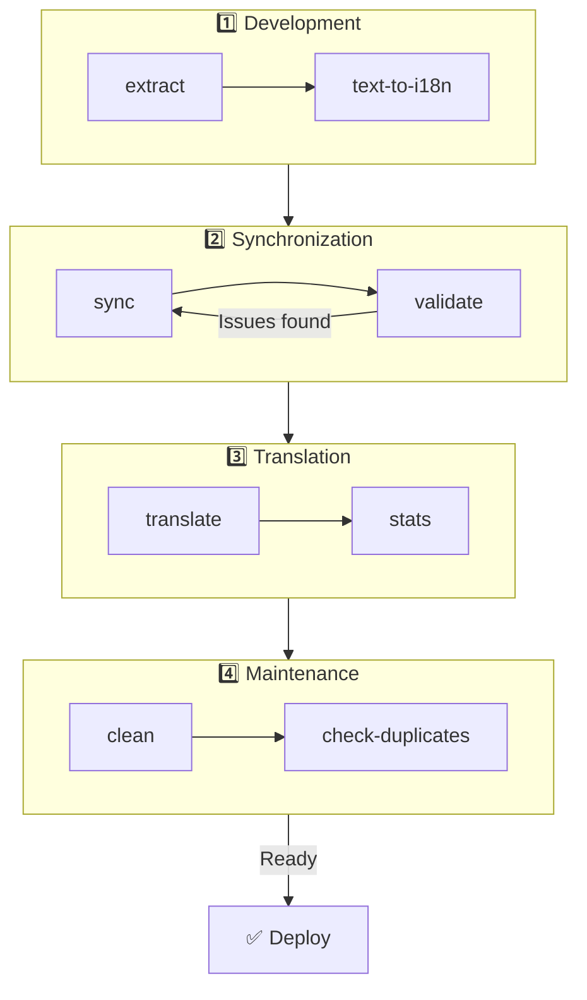

# 🌐 Ghid nuxt-i18n-micro-cli

## 📖 Introducere

`nuxt-i18n-micro-cli` este un instrument de linie de comandă conceput pentru a simplifica procesul de localizare și internaționalizare în proiectele Nuxt.js care folosesc modulul `nuxt-i18n-micro` (Nuxt I18n Micro). Oferă utilitare pentru extragerea cheilor de traducere din codebase-ul tău, gestionarea fișierelor de traducere, sincronizarea traducerilor între locale și automatizarea procesului de traducere folosind servicii externe.

Acest ghid te va conduce prin instalarea, configurarea și utilizarea `nuxt-i18n-micro-cli` pentru a gestiona eficient traducerile proiectului tău. Pachetul pe [npmjs.com](https://www.npmjs.com/package/nuxt-i18n-micro-cli).

## 🔧 Instalare și configurare

### 📦 Instalarea nuxt-i18n-micro-cli

Instalează global sau ca dependință de dezvoltare în proiectul tău Nuxt (recomandat pentru CI):

```bash
# global
npm install -g nuxt-i18n-micro-cli

# sau per proiect
pnpm add -D nuxt-i18n-micro-cli
pnpm exec i18n-micro text-to-i18n --dryRun
```

Folosește **`nuxt-i18n-micro-cli` ≥ 2.1.1** dacă proiectul tău folosește directorul `app/` din Nuxt 4 (`app/pages`, `app/components`, …). Versiunile mai vechi ale CLI-ului scanau doar `pages/` la rădăcina proiectului.

### 🛠 Inițializare în proiectul tău

După instalare, poți rula comenzile `i18n-micro` în directorul proiectului tău Nuxt.js.

Asigură-te că proiectul tău este configurat cu `nuxt-i18n-micro` și are configurația necesară în `nuxt.config.ts` (sau `nuxt.config.js`).

### 📄 Argumente comune

- `--cwd`: Specifică directorul de lucru curent (implicit `.`).
- `--logLevel`: Setează nivelul de log (`silent`, `info`, `verbose`).
- `--translationDir`: Directorul care conține fișierele JSON de traducere (implicit: `locales`).

## 📊 Prezentare generală a fluxului CLI



### Pașii fluxului

| Fază              | Comenzi                     | Scop                                       |
| ----------------- | --------------------------- | ------------------------------------------ |
| **Dezvoltare**    | `extract`, `text-to-i18n`   | Găsește și extrage cheile de traducere     |
| **Sincronizare**  | `sync`, `validate`          | Asigură că toate locale-urile au aceleași chei |
| **Traducere**     | `translate`, `stats`        | Traduce automat cheile lipsă               |
| **Mentenanță**    | `clean`, `check-duplicates` | Menține traducerile ordonate               |

## 📋 Comenzi

### 🔄 Comanda `text-to-i18n`

Pachet CLI: [`nuxt-i18n-micro-cli`](https://www.npmjs.com/package/nuxt-i18n-micro-cli)

**Descriere**: Scanează fișiere Vue/TS/JS pentru șiruri hardcodate vizibile utilizatorului, le înlocuiește cu `$t('...')` și îmbină cheile noi în fișierul tău JSON de traducere. Rulează din **rădăcina proiectului Nuxt** (unde se află `nuxt.config`).

**Utilizare**:

```bash
i18n-micro text-to-i18n [options]
```

**Opțiuni**:

| Opțiune                 | Implicit          | Descriere                                                             |
| ----------------------- | ----------------- | --------------------------------------------------------------------- |
| `--translationFile`     | `locales/en.json` | Fișier JSON pentru cheile noi (relativ la rădăcina proiectului).      |
| `--path`                | —                 | Procesează un singur fișier sau director (de ex. `app/pages/about.vue`). |
| `--context`             | —                 | Prefix pentru chei (de ex. `auth` → `auth.*`).                        |
| `--dryRun`              | `false`           | Previzualizează fără a scrie fișiere.                                 |
| `--verbose`             | `false`           | Logging suplimentar.                                                  |
| `--interactive`         | `false`           | Confirmă sau editează fiecare cheie înainte de aplicare.              |
| `--extractOnlyDirs`     | `plugins`         | Directoare unde cheile sunt extrase, dar fișierele sursă **nu** sunt rescrise. |
| `--extractOnlyPatterns` | —                 | Modele de tip glob doar pentru extragere (de ex. `**/*.plugin.ts`).   |

**Exemplu**:

```bash
i18n-micro text-to-i18n --translationFile locales/en.json --context auth --dryRun
```

#### Ce foldere sunt scanate?

<Info>
Începând cu CLI **v2.1.1**, `text-to-i18n` scanează atât folderele clasice din rădăcină, cât și echivalentele `app/*`. Rulează comanda din **rădăcina proiectului** — nu face `cd app`.
</Info>

Colectează `*.vue`, `*.js` și `*.ts` din:

| Nuxt 3 (rădăcina proiectului) | Nuxt 4 (directorul `app/`) |
| ----------------------------- | -------------------------- |
| `pages/`                      | `app/pages/`               |
| `components/`                 | `app/components/`          |
| `plugins/`                    | `app/plugins/`             |
| `layouts/`                    | `app/layouts/`             |

Alte foldere (`server/`, `composables/`, `middleware/`, …) sunt omise dacă nu folosești `--path`. Pentru Nuxt 4, rulează din rădăcina proiectului (nu e nevoie să faci `cd app`). Potrivește `i18n.translationDir` în `--translationFile` dacă nu este `locales/`.

```bash
i18n-micro text-to-i18n --path app/pages
```

#### Cum funcționează

1. Colectează fișiere din directoarele de mai sus (sau din `--path`).
2. Înlocuiește literale / text din template cu `$t('generated.key')` (`plugins/` este doar pentru extragere, implicit).
3. Îmbină cheile noi în `--translationFile` fără a elimina intrările existente.

**Exemple de transformări**:

Înainte:

```vue
<template>
  <div>
    <h1>Welcome to our site</h1>
    <p>Please sign in to continue</p>
  </div>
</template>
```

După:

```vue
<template>
  <div>
    <h1>{{ $t('pages.home.welcome_to_our_site') }}</h1>
    <p>{{ $t('pages.home.please_sign_in') }}</p>
  </div>
</template>
```

**Bune practici**: rulează mai întâi în mod dry run; fă commit înainte de o rulare completă; aliniază `--translationFile` cu `i18n.translationDir` din `nuxt.config`; păstrează `--extractOnlyDirs plugins` pentru codul de bootstrap.

**Limitări**: pachet npm separat (nu este inclus în modul); nu citește automat `nuxt.config`; produce la ieșire `$t(...)`; șirurile dinamice complexe pot necesita `extract` / `search`.

### 📊 Comanda `stats`

**Descriere**: Comanda `stats` este folosită pentru a afișa statistici de traducere pentru fiecare locale în proiectul tău Nuxt.js. Te ajută să înțelegi progresul traducerilor tale, arătând câte chei sunt traduse comparativ cu numărul total de chei disponibile.

**Utilizare**:

```bash
i18n-micro stats [options]
```

**Opțiuni**:

- `--full`: Afișează doar statisticile combinate ale traducerilor (implicit: `false`).

**Exemplu**:

```bash
i18n-micro stats --full
```

### 🌍 Comanda `translate`

**Descriere**: Comanda `translate` traduce automat cheile lipsă folosind servicii externe de traducere. Această comandă simplifică procesul de traducere folosind API-uri de la servicii precum Google Translate, DeepL și altele pentru a completa traducerile lipsă.

**Utilizare**:

```bash
i18n-micro translate [options]
```

**Opțiuni**:

- `--service`: Serviciul de traducere folosit (de ex., `google`, `deepl`, `yandex`). Dacă nu este specificat, comanda îți va cere să alegi unul.
- `--token`: Cheia API corespunzătoare serviciului de traducere ales. Dacă nu este furnizată, ți se va cere să o introduci.
- `--options`: Opțiuni suplimentare pentru serviciul de traducere, sub formă de perechi cheie:valoare, separate prin virgule (de ex., `model:gpt-3.5-turbo,max_tokens:1000`).
- `--replace`: Traduce toate cheile, înlocuind traducerile existente (implicit: `false`).

**Exemplu**:

```bash
i18n-micro translate --service deepl --token YOUR_DEEPL_API_KEY
```

#### 🌐 Servicii de traducere suportate

Comanda `translate` suportă mai multe servicii de traducere. Unele dintre serviciile suportate sunt:

- **Google Translate** (`google`)
- **DeepL** (`deepl`)
- **Yandex Translate** (`yandex`)
- **OpenAI** (`openai`)
- **Azure Translator** (`azure`)
- **IBM Watson** (`ibm`)
- **Baidu Translate** (`baidu`)
- **LibreTranslate** (`libretranslate`)
- **MyMemory** (`mymemory`)
- **Lingva Translate** (`lingvatranslate`)
- **Papago** (`papago`)
- **Tencent Translate** (`tencent`)
- **Systran Translate** (`systran`)
- **Yandex Cloud Translate** (`yandexcloud`)
- **ModernMT** (`modernmt`)
- **Lilt** (`lilt`)
- **Unbabel** (`unbabel`)
- **Reverso Translate** (`reverso`)

#### ⚙️ Configurarea serviciilor

Unele servicii necesită configurări specifice sau chei API. Când folosești comanda `translate`, poți specifica serviciul și furniza `--token` (cheia API) și `--options` suplimentare, dacă este necesar.

De exemplu:

```bash
i18n-micro translate --service openai --token YOUR_OPENAI_API_KEY --options openaiModel:gpt-3.5-turbo,max_tokens:1000
```

### 🛠️ Comanda `extract`

**Descriere**: Extrage cheile de traducere din codebase-ul tău și le organizează pe domenii.

**Utilizare**:

```bash
i18n-micro extract [options]
```

**Opțiuni**:

- `--prod, -p`: Rulează în mod producție.

**Exemplu**:

```bash
i18n-micro extract
```

### 🔄 Comanda `sync`

**Descriere**: Sincronizează fișierele de traducere între locale, asigurând că toate locale-urile au aceleași chei.

**Utilizare**:

```bash
i18n-micro sync [options]
```

**Exemplu**:

```bash
i18n-micro sync
```

### ✅ Comanda `validate`

**Descriere**: Validează fișierele de traducere pentru chei lipsă sau în plus, comparat cu locale-ul de referință.

**Utilizare**:

```bash
i18n-micro validate [options]
```

**Exemplu**:

```bash
i18n-micro validate
```

### 🧹 Comanda `clean`

**Descriere**: Elimină cheile de traducere neutilizate din fișierele de traducere.

**Utilizare**:

```bash
i18n-micro clean [options]
```

**Exemplu**:

```bash
i18n-micro clean
```

### 📤 Comanda `import`

**Descriere**: Convertește fișierele PO înapoi în format JSON și le salvează în directorul de traduceri.

**Utilizare**:

```bash
i18n-micro import [options]
```

**Opțiuni**:

- `--potsDir`: Directorul care conține fișiere PO (implicit: `pots`).

**Exemplu**:

```bash
i18n-micro import --potsDir pots
```

### 📥 Comanda `export`

**Descriere**: Exportă traducerile în fișiere PO pentru gestionarea traducerilor externe.

**Utilizare**:

```bash
i18n-micro export [options]
```

**Opțiuni**:

- `--potsDir`: Directorul în care se salvează fișierele PO (implicit: `pots`).

**Exemplu**:

```bash
i18n-micro export --potsDir pots
```

### 🗂️ Comanda `export-csv`

**Descriere**: Comanda `export-csv` exportă cheile și valorile de traducere din fișierele JSON, inclusiv căile fișierelor, într-un format CSV. Această comandă este utilă pentru echipele care preferă să lucreze cu datele de traducere în programe de calcul tabelar.

**Utilizare**:

```bash
i18n-micro export-csv [options]
```

**Opțiuni**:

- `--csvDir`: Directorul în care vor fi salvate fișierele CSV exportate.
- `--delimiter`: Specifică un delimitator pentru fișierul CSV (implicit: `,`).

**Exemplu**:

```bash
i18n-micro export-csv --csvDir csv_files
```

### 📑 Comanda `import-csv`

**Descriere**: Comanda `import-csv` importă date de traducere din fișiere CSV, actualizând fișierele JSON corespunzătoare. Este utilă pentru aplicarea actualizărilor de traducere în masă din foi de calcul.

**Utilizare**:

```bash
i18n-micro import-csv [options]
```

**Opțiuni**:

- `--csvDir`: Directorul care conține fișierele CSV de importat.
- `--delimiter`: Specifică un delimitator folosit în fișierul CSV (implicit: `,`).

**Exemplu**:

```bash
i18n-micro import-csv --csvDir csv_files
```

### 🧾 Comanda `diff`

**Descriere**: Compară fișierele de traducere între locale-ul implicit și alte locale din același director (inclusiv subdirectoare). Comanda identifică cheile lipsă și valorile lor din locale-ul implicit comparativ cu alte locale, facilitând urmărirea progresului traducerilor sau a discrepanțelor.

**Utilizare**:

```bash
i18n-micro diff [options]
```

**Exemplu**:

```bash
i18n-micro diff
```

### 🔍 Comanda `check-duplicates`

**Descriere**: Comanda `check-duplicates` verifică valori de traducere duplicate în cadrul fiecărui locale, în toate fișierele de traducere, atât la nivel root, cât și cele specifice paginilor. Se asigură că diferite chei din aceeași limbă nu împart valori identice de traducere, ajutând la menținerea clarității și consistenței traducerilor.

**Utilizare**:

```bash
i18n-micro check-duplicates [options]
```

**Exemplu**:

```bash
i18n-micro check-duplicates
```

**Cum funcționează**:

- Comanda verifică atât fișierele de traducere root, cât și cele specifice paginilor pentru fiecare locale.
- Dacă o valoare de traducere apare în mai multe locuri (fie în cadrul traducerilor root, fie între diferite pagini), aceasta raportează valorile duplicate împreună cu fișierul și cheia unde se găsesc.
- Dacă nu se găsesc duplicate, comanda confirmă că locale-ul nu conține valori de traducere duplicate.

Această comandă ajută la asigurarea că cheile de traducere mențin valori unice, prevenind repetițiile accidentale în cadrul aceluiași locale.

### 🔄 Comanda `replace-values`

**Descriere**: Comanda `replace-values` îți permite să efectuezi înlocuiri în masă ale valorilor de traducere în toate locale-urile. Suportă atât înlocuiri text simple, cât și înlocuiri avansate folosind expresii regulate (regex). Poți folosi și grupuri de captură în modelele regex și să le referi în șirul de înlocuire, ceea ce o face ideală pentru scenarii de înlocuire mai complexe.

**Utilizare**:

```bash
i18n-micro replace-values [options]
```

**Opțiuni**:

- `--search`: Textul sau modelul regex de căutat în traduceri. Această opțiune este obligatorie.
- `--replace`: Textul de înlocuire care va fi folosit pentru traducerile găsite. Această opțiune este obligatorie.
- `--useRegex`: Activează căutarea folosind un model regex (implicit: `false`).

**Exemplul 1**: Înlocuire simplă

Înlocuiește șirul „Hello” cu „Hi” în toate locale-urile:

```bash
i18n-micro replace-values --search "Hello" --replace "Hi"
```

**Exemplul 2**: Înlocuire cu regex

Activează căutarea regex și înlocuiește orice șir care începe cu „Hello” urmat de cifre (de ex., „Hello123”) cu „Hi” în toate locale-urile:

```bash
i18n-micro replace-values --search "Hello\\d+" --replace "Hi" --useRegex
```

**Exemplul 3**: Utilizarea grupurilor de captură regex

Folosește grupuri de captură pentru a insera dinamic o parte din șirul potrivit în înlocuire. De exemplu, înlocuiește „Hello [name]” cu „Hi [name]” păstrând intact numele:

```bash
i18n-micro replace-values --search "Hello (\\w+)" --replace "Hi $1" --useRegex
```

În acest caz, `$1` se referă la primul grup de captură, care se potrivește cu partea `[name]` după „Hello”. Înlocuirea va păstra numele din șirul original.

**Cum funcționează**:

- Comanda scanează toate fișierele de traducere (atât globale, cât și cele specifice paginilor).
- Când se găsește o potrivire pe baza șirului de căutare sau modelului regex, înlocuiește textul potrivit cu înlocuirea furnizată.
- Când folosești regex, grupurile de captură pot fi folosite în șirul de înlocuire referindu-le cu `$1`, `$2` etc.
- Toate modificările sunt înregistrate, arătând calea fișierului, cheia de traducere și starea înainte/după a valorii traducerii.

**Logging**:
Pentru fiecare înlocuire, comanda înregistrează detalii inclusiv:

- Locale-ul și calea fișierului
- Cheia de traducere modificată
- Valoarea veche și valoarea nouă după înlocuire
- Dacă se folosește regex cu grupuri de captură, log-urile vor arăta potrivirile grupurilor și modul în care au fost înlocuite.

Aceasta îți permite să urmărești exact unde și ce modificări au fost făcute în timpul operațiunii de înlocuire, oferind un istoric clar al modificărilor din fișierele tale de traducere.

## 🛠 Exemple

- **Extragerea traducerilor**:

  ```bash
  i18n-micro extract
  ```

- **Traducerea cheilor lipsă folosind Google Translate**:

  ```bash
  i18n-micro translate --service google --token YOUR_GOOGLE_API_KEY
  ```

- **Traducerea tuturor cheilor, înlocuind traducerile existente**:

  ```bash
  i18n-micro translate --service deepl --token YOUR_DEEPL_API_KEY --replace
  ```

- **Validarea fișierelor de traducere**:

  ```bash
  i18n-micro validate
  ```

- **Curățarea cheilor de traducere neutilizate**:

  ```bash
  i18n-micro clean
  ```

- **Sincronizarea fișierelor de traducere**:

  ```bash
  i18n-micro sync
  ```

## ⚙️ Ghid de configurare

`nuxt-i18n-micro-cli` se bazează pe configurația i18n din Nuxt.js din `nuxt.config.ts` (sau `nuxt.config.js`). Asigură-te că ai modulul `nuxt-i18n-micro` instalat și configurat.

### 🔑 Exemplu nuxt.config.js

```ts
export default defineNuxtConfig({
  modules: ['nuxt-i18n-micro'],
  i18n: {
    locales: [
      { code: 'en', iso: 'en-US' },
      { code: 'fr', iso: 'fr-FR' },
    ],
    defaultLocale: 'en',
    fallbackLocale: 'en',
    translationDir: 'locales', // sau 'app/locales' pentru colocare cu Nuxt 4
  },
})
```

Asigură-te că `translationDir` se potrivește cu directorul folosit de `nuxt-i18n-micro-cli` (implicit este `locales`).

## 📝 Bune practici

### 🔑 Denumire consistentă a cheilor

Asigură-te că cheile de traducere sunt consistente și descriptive pentru a evita confuzia și duplicarea.

### 🧹 Mentenanță regulată

Folosește comanda `clean` în mod regulat pentru a elimina cheile de traducere neutilizate și a păstra fișierele tale de traducere curate.

### 🛠 Automatizează fluxul de traducere

Integrează comenzile `nuxt-i18n-micro-cli` în fluxul tău de dezvoltare sau în pipeline-ul CI/CD pentru a automatiza extragerea, traducerea, validarea și sincronizarea fișierelor de traducere.

### 🛡️ Securizează cheile API

Atunci când folosești servicii de traducere care necesită chei API, asigură-te că cheile tale sunt păstrate în siguranță și nu sunt commit-uite în sistemele de control al versiunilor. Ia în considerare folosirea variabilelor de mediu sau a soluțiilor sigure de gestionare a cheilor.

## 📞 Suport și contribuții

Dacă întâmpini probleme sau ai sugestii de îmbunătățire, nu ezita să contribui la proiect sau să deschizi un issue în repository-ul proiectului.

---

Urmând acest ghid, vei putea gestiona eficient traducerile în proiectul tău Nuxt.js folosind `nuxt-i18n-micro-cli`, eficientizând eforturile de internaționalizare și asigurând o experiență fluidă pentru utilizatorii din diferite locale.
