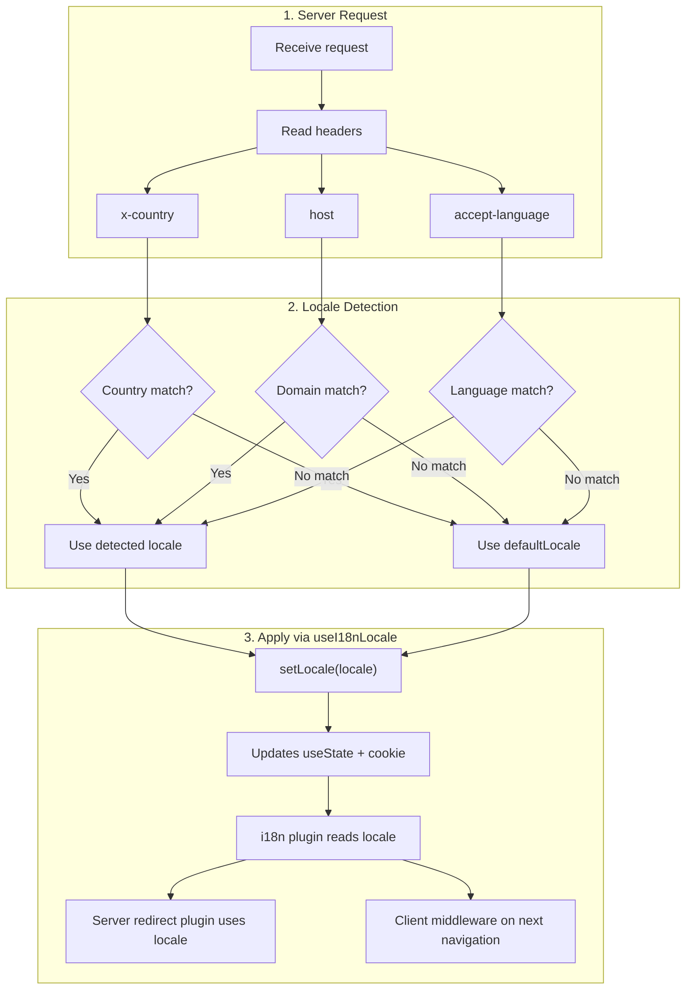

# 🔧 Detectare personalizată a limbii în Nuxt I18n Micro

## 📖 Prezentare generală

Nuxt I18n Micro v3 oferă un composable centralizat — `useI18nLocale()` — pentru toată gestionarea locale-ului. Acesta înlocuiește pattern-urile manuale `useState`/`useCookie` din v2. Folosind `useI18nLocale().setLocale()` într-un plugin de server, poți implementa orice logică personalizată de detectare, păstrând compatibilitatea totală cu sistemele de redirecționare și cookie-uri ale modulului.

## 🏗️ Arhitectură

```mermaid
flowchart TB
    subgraph Plugins["Plugin Execution Order"]
        A["Your plugin<br/>order: -10"] -->|setLocale()| B["01.plugin.ts<br/>order: -5"]
        B --> C["06.redirect.ts server<br/>order: 10"]
    end

    subgraph Client["Client SPA Navigation"]
        D["i18n-redirect.global.ts<br/>route middleware"]
    end

    subgraph State["Locale State"]
        E["useState('i18n-locale')"]
        F["localeCookie"]
    end

    A -->|"setLocale() updates both"| E
    A -->|"setLocale() updates both"| F
    B -->|reads| E
    C -->|reads| E
    C -->|reads| F
    D -->|reads target route +| E
```

**Principiu cheie**: Apelează `useI18nLocale().setLocale()` într-un plugin de server cu `order: -10`. Acest lucru actualizează atomic atât `useState('i18n-locale')`, cât și cookie-ul de locale, astfel încât plugin-ul i18n (`order: -5`) și plugin-ul de redirecționare de server (`order: 10`) să vadă locale-ul corect la prima cerere SSR. Redirecționările automate pe partea de client rulează în middleware-ul global de rută la navigările ulterioare.

## 🛠️ Dezactivarea detectării automate încorporate

Dacă vrei control total asupra detectării locale-ului, dezactivează mecanismul încorporat:

```ts
export default defineNuxtConfig({
  i18n: {
    autoDetectLanguage: false,
  },
})
```

## ✨ Exemplu: Detectare server-side cu `useI18nLocale`

Aceasta este **abordarea recomandată** pentru toate strategiile.

### Pasul 1: Configurează `nuxt.config.ts`

```ts
export default defineNuxtConfig({
  modules: ['nuxt-i18n-micro'],
  i18n: {
    strategy: 'no_prefix', // Works with ANY strategy
    defaultLocale: 'en',
    localeCookie: 'user-locale',
    autoDetectLanguage: false,
    locales: [
      { code: 'en', iso: 'en-US' },
      { code: 'de', iso: 'de-DE' },
      { code: 'ja', iso: 'ja-JP' },
    ],
  },
})
```

### Pasul 2: Creează `plugins/i18n-loader.server.ts`

```ts
import { defineNuxtPlugin, useRequestHeaders } from '#imports'

export default defineNuxtPlugin({
  name: 'i18n-custom-loader',
  enforce: 'pre',
  order: -10, // Execute BEFORE the i18n plugin (which has order -5)

  setup() {
    const { setLocale } = useI18nLocale()
    const headers = useRequestHeaders(['host', 'x-country', 'accept-language'])
    let detectedLocale = 'en'

    // --- YOUR DETECTION LOGIC ---

    // Example 1: By domain
    const host = headers['host']
    if (host?.includes('example.de')) {
      detectedLocale = 'de'
    }
    // Example 2: By custom header
    else if (headers['x-country'] === 'JP') {
      detectedLocale = 'ja'
    }
    // Example 3: By Accept-Language header
    else if (headers['accept-language']?.includes('de')) {
      detectedLocale = 'de'
    }

    // --- APPLY THE LOCALE ---
    setLocale(detectedLocale)
  },
})
```

### Cum funcționează



1. **Plugin-ul rulează primul** (`order: -10`) — detectează locale-ul din header-e, domeniu sau alte surse
2. **`setLocale()` actualizează ambele** — `useState('i18n-locale')` și cookie-ul — asigurând vizibilitatea imediată pentru toate plugin-urile ulterioare
3. **Plugin-ul i18n** (`order: -5`) citește locale-ul și încarcă traducerile corecte
4. **Plugin-ul de redirecționare de server** (`order: 10`) folosește locale-ul pentru deciziile de redirecționare pe SSR
5. **Middleware-ul de rută pe client** (`i18n-redirect`) aplică redirecționările la navigarea SPA, când locale-ul din URL nu se potrivește preferinței

## 🌐 Comportament specific strategiei

`useI18nLocale().setLocale()` funcționează cu **toate strategiile**. Comportamentul de redirecționare depinde de strategie:

<Tip>
| Strategie | Efectul `setLocale('de')` |
|----------|---------------------------|
| `no_prefix` | Randează în germană, fără schimbare de URL |
| `prefix` | 302 → `/de/` (redirecționare pe partea de server) |
| `prefix_except_default` | 302 → `/de/` dacă `de` ≠ implicit; fără redirecționare dacă `de` = implicit |
| `prefix_and_default` | Fără redirecționare (atât `/`, cât și `/de/` sunt valide) |
</Tip>

**Note importante:**

- Detectarea locale-ului bazată pe cookie este dezactivată implicit (`localeCookie: null`)
- Setează `localeCookie: 'user-locale'` pentru a activa persistența prin cookie
- Dacă valoarea din cookie/stare nu se află în lista `locales`, se face fallback la `defaultLocale`

## 🏢 Avansat: Detectare bazată pe domeniu

Pentru configurări multi-domeniu, unde fiecare domeniu servește un locale diferit:

```ts
import { defineNuxtPlugin, useRequestHeaders } from '#imports'

export default defineNuxtPlugin({
  name: 'i18n-domain-loader',
  enforce: 'pre',
  order: -10,

  setup() {
    const { setLocale } = useI18nLocale()
    const headers = useRequestHeaders(['host'])
    const host = headers['host'] || ''

    let detectedLocale = 'en'

    if (host.endsWith('.de') || host.includes('german.')) {
      detectedLocale = 'de'
    } else if (host.endsWith('.fr') || host.includes('french.')) {
      detectedLocale = 'fr'
    } else if (host.endsWith('.jp') || host.includes('japanese.')) {
      detectedLocale = 'ja'
    }

    setLocale(detectedLocale)
  },
})
```

## 🔄 Avansat: Respectarea preferinței utilizatorului

Dacă utilizatorii pot schimba manual limba, respectă alegerea lor în locul detectării automate:

```ts
import { defineNuxtPlugin, useRequestHeaders } from '#imports'

export default defineNuxtPlugin({
  name: 'i18n-smart-loader',
  enforce: 'pre',
  order: -10,

  setup() {
    const { getLocale, setLocale } = useI18nLocale()

    // If user already has a preference (from cookie), respect it
    if (getLocale()) {
      return
    }

    // Otherwise, detect locale from headers
    const headers = useRequestHeaders(['accept-language'])
    let detectedLocale = 'en'

    const acceptLanguage = headers['accept-language'] || ''
    if (acceptLanguage.includes('de')) {
      detectedLocale = 'de'
    } else if (acceptLanguage.includes('ja')) {
      detectedLocale = 'ja'
    }

    setLocale(detectedLocale)
  },
})
```

## ⚙️ Plugin-uri doar pentru server sau doar pentru client

Folosește [convențiile de denumire a fișierelor din Nuxt](https://nuxt.com/docs/getting-started/directory-structure#plugins) pentru a controla unde rulează plugin-ul tău:

- **Doar server**: `i18n-loader.server.ts` — rulează doar în timpul SSR (recomandat pentru detectarea bazată pe header-e)
- **Doar client**: `i18n-loader.client.ts` — rulează doar în browser (pentru detectare bazată pe `localStorage` sau DOM)

<Tip>

</Tip>

## ✅ Rezumat

| Funcționalitate                                | Descriere                                                       |
| -------------------------------------- | ----------------------------------------------------------------- |
| `useI18nLocale().setLocale()`          | Actualizează atomic `useState` + cookie; funcționează cu toate strategiile |
| `useI18nLocale().getLocale()`          | Returnează locale-ul curent din stare sau cookie                       |
| `useI18nLocale().getPreferredLocale()` | Returnează locale-ul preferat (validat față de lista `locales`)       |
| Plugin `order: -10`                    | Asigură că plugin-ul tău rulează înainte de inițializarea i18n               |
| `enforce: 'pre'`                       | Rulează în grupul de plugin-uri „pre”                                    |

**NU:**

- Folosi `useCookie('user-locale')` direct — `useI18nLocale()` gestionează cookie-urile intern
- Folosi `useState('i18n-locale')` direct — folosește `useI18nLocale().setLocale()` în schimb
- Seta `order` >= -5 — plugin-ul tău trebuie să ruleze înainte de plugin-ul i18n
