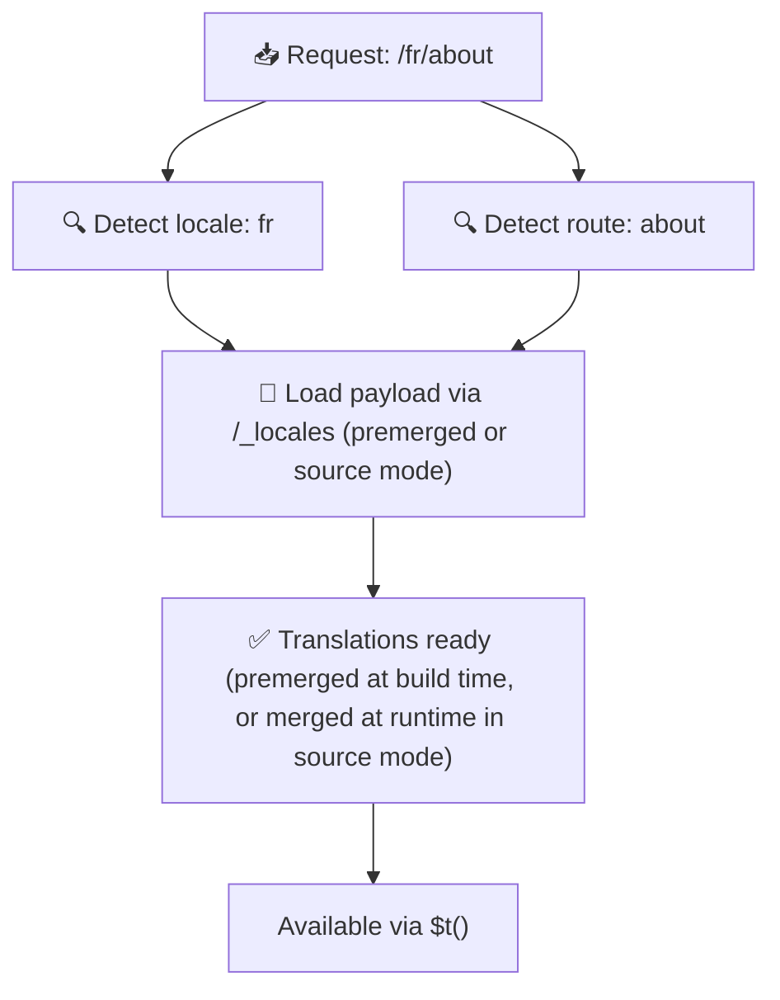

# 📂 Ghid pentru structura folderelor

## 📖 Introducere

Organizarea eficientă a fișierelor de traducere este esențială pentru menținerea unui sistem de internaționalizare (i18n) scalabil și eficient. `Nuxt I18n Micro` simplifică acest proces, oferind o abordare clară pentru gestionarea traducerilor la nivel root și a celor specifice paginii. Acest ghid te va ghida prin structura recomandată a folderelor și va explica cum gestionează `Nuxt I18n Micro` aceste traduceri.

## 🗂️ Structura recomandată a folderelor

`Nuxt I18n Micro` organizează traducerile în fișiere la nivel root și fișiere specifice paginii, în directorul `pages`. Cu `translationPayloads.mode: 'premerged'` (implicit), traducerile la nivel root sunt îmbinate automat în fiecare fișier de pagină la momentul build-ului, astfel încât fiecare pagină să aibă un set complet de traduceri, fără overhead de îmbinare la runtime.

Cu `mode: 'source'`, fișierele sursă rămân separate în asset-urile Nitro și sunt îmbinate la runtime prin ruta `/_locales`. Vezi [Serverless Payload Output](/guides/performance#serverless-payload-output).

### 🔧 Structura de bază

Iată un exemplu de bază al structurii de foldere pe care ar trebui să o urmezi:

```text
locales/
├── pages/
│   ├── index/
│   │   ├── en.json
│   │   ├── fr.json
│   │   └── ar.json
│   ├── about/
│   │   ├── en.json
│   │   ├── fr.json
│   │   └── ar.json
├── en.json
├── fr.json
└── ar.json

```

### 📄 Explicarea structurii

#### 1. 🌍 Fișiere de traducere la nivel root

- **Cale:** `/locales/\{locale\}.json` (de exemplu, `/locales/en.json`)
- **Scop:** Aceste fișiere conțin traduceri partajate în întreaga aplicație (meniuri de navigare, header-e, footer-e, etc.). Cu `mode: 'premerged'` (implicit), sunt îmbinate automat în fiecare fișier specific paginii la momentul build-ului, astfel încât serverul să returneze un singur fișier pre-construit per pagină.

  **Exemplu de conținut (`/locales/en.json`):**

  ```json
  {
    "menu": {
      "home": "Home",
      "about": "About Us",
      "contact": "Contact"
    },
    "footer": {
      "copyright": "© 2024 Your Company"
    }
  }
  ```

#### 2. 📄 Fișiere de traducere specifice paginii

- **Cale:** `/locales/pages/\{routeName\}/\{locale\}.json` (de exemplu, `/locales/pages/index/en.json`)
- **Scop:** Aceste fișiere conțin traduceri specifice unor pagini individuale. Cu `mode: 'premerged'` (implicit), traducerile la nivel root sunt îmbinate ca bază la momentul build-ului, astfel încât fiecare fișier de pagină devine autonom.

  **Exemplu de conținut (`/locales/pages/index/en.json`):**

  ```json
  {
    "title": "Welcome to Our Website",
    "description": "We offer a wide range of products and services to meet your needs."
  }
  ```

  **Exemplu de conținut (`/locales/pages/about/en.json`):**

  ```json
  {
    "title": "About Us",
    "description": "Learn more about our mission, vision, and values."
  }
  ```

### 📂 Gestionarea rutelor dinamice și a căilor imbricate

`Nuxt I18n Micro` transformă automat segmentele dinamice și căile imbricate din rute într-o structură plată de foldere, folosind o convenție specifică de redenumire. Astfel se asigură că toate traducerile sunt stocate într-o manieră consistentă și ușor accesibilă.

#### Structura folderului de traducere pentru rute dinamice

Când lucrezi cu rute dinamice, precum `/products/[id]`, modulul convertește segmentul dinamic `[id]` într-un format static, în structura fișierelor.

**Exemplu de structură de foldere pentru rute dinamice:**

Pentru o rută precum `/products/[id]`, fișierele de traducere ar fi stocate într-un folder numit `products-id`:

```text
locales/pages/
├── products-id/
│   ├── en.json
│   ├── fr.json
│   └── ar.json

```

**Exemplu de structură de foldere pentru rute dinamice imbricate:**

Pentru o rută imbricată precum `/products/key/[id]`, fișierele de traducere ar fi stocate într-un folder numit `products-key-id`:

```text
locales/pages/
├── products-key-id/
│   ├── en.json
│   ├── fr.json
│   └── ar.json

```

**Exemplu de structură de foldere pentru rute imbricate pe mai multe niveluri:**

Pentru o rută imbricată mai complexă, precum `/products/category/[id]/details`, fișierele de traducere ar fi stocate într-un folder numit `products-category-id-details`:

```text
locales/pages/
├── products-category-id-details/
│   ├── en.json
│   ├── fr.json
│   └── ar.json

```

### 🛠 Personalizarea structurii directoarelor

Dacă preferi să stochezi traducerile într-un alt director, `Nuxt I18n Micro` îți permite să personalizezi directorul în care sunt stocate fișierele de traducere. Poți configura acest lucru în fișierul `nuxt.config.ts`.

**Exemplu: Personalizarea directorului de traduceri**

```typescript
export default defineNuxtConfig({
  i18n: {
    translationDir: 'i18n', // Custom directory path
  },
})
```

Acest lucru îi va instrui `Nuxt I18n Micro` să caute fișierele de traducere în directorul `/i18n` în loc de directorul implicit `/locales`.

## ⚙️ Cum sunt încărcate traducerile

### 🌍 Rute dinamice de locale

`Nuxt I18n Micro` folosește rute dinamice de locale pentru a încărca traducerile eficient. Când un utilizator vizitează o pagină, modulul determină locale-ul potrivit și încarcă fișierele de traducere corespunzătoare, pe baza rutei curente și a locale-ului.



De exemplu:

- Vizitarea `/en/index` va încărca traducerile din `/locales/pages/index/en.json`.
- Vizitarea `/fr/about` va încărca traducerile din `/locales/pages/about/fr.json`.

Această metodă asigură că sunt încărcate doar traducerile necesare, optimizând atât sarcina serverului, cât și performanța pe partea de client.

### 💾 Caching și pre-rendering

Pentru a îmbunătăți și mai mult performanța, `Nuxt I18n Micro` suportă caching-ul și pre-render-ul fișierelor de traducere:

- **Caching**: Odată ce un fișier de traducere este încărcat, este pus în cache pentru cererile ulterioare, reducând nevoia de a prelua repetat aceleași date.
- **Pre-rendering**: În timpul procesului de build, poți pre-renda fișierele de traducere pentru toate locale-urile și rutele configurate, permițând ca ele să fie servite direct de pe server, fără întârzieri la runtime.

## 📝 Bune practici

### 📂 Folosește cu înțelepciune fișierele specifice paginii

Folosește fișierele specifice paginii pentru a menține traducerile organizate. Acest lucru păstrează traducerile fiecărei pagini reduse și rapide la încărcare, ceea ce este important în special pentru paginile cu conținut complex sau mare.

### 🔑 Păstrează cheile de traducere consistente

Folosește convenții consistente de denumire pentru cheile tale de traducere între fișiere. Acest lucru ajută la menținerea clarității și previne problemele în gestionarea traducerilor, mai ales pe măsură ce aplicația ta crește.

### 🗂️ Organizează traducerile după context

Grupează traducerile aferente în fișierele tale. De exemplu, grupează toate etichetele de butoane sub o cheie `buttons` și toate textele legate de formulare sub o cheie `forms`. Acest lucru nu doar că îmbunătățește lizibilitatea, dar face și gestionarea traducerilor între diferite locale-uri mai ușoară.

### ⚠️ Limita de adâncime a imbricării (2 niveluri recomandate)

În timpul navigării pe partea de client, `Nuxt I18n Micro` folosește o îmbinare optimizată la adâncimea de 2 niveluri pentru a combina traducerile din paginile de ieșire și de intrare. Acest lucru asigură că cheile imbricate care se suprapun (de exemplu, ambele pagini au chei sub `common.*`) sunt păstrate în timpul animațiilor de tranziție.

**Acest lucru funcționează corect pentru structura standard `Secțiune → Cheie → Valoare` (2 niveluri):**

```json
// Page A translations
{ "common": { "fromA": "Text A" } }

// Page B translations
{ "common": { "fromB": "Text B" } }

// During transition, both are available:
// { "common": { "fromA": "Text A", "fromB": "Text B" } }
```

**Totuși, dacă folosești 3 sau mai multe niveluri de imbricare, cheile mai profunde pot fi suprascrise în timpul tranzițiilor:**

```json
// Page A translations
{ "auth": { "form": { "login": "Login" } } }

// Page B translations
{ "auth": { "form": { "register": "Register" } } }

// During transition: "login" key is lost
// { "auth": { "form": { "register": "Register" } } }
```

<Tip>

</Tip>

### 🧹 Curăță regulat traducerile neutilizate

Cu timpul, aplicația ta ar putea acumula chei de traducere neutilizate, mai ales dacă funcționalități sunt eliminate sau restructurate. Verifică și curăță periodic fișierele tale de traducere pentru a le menține reduse și ușor de întreținut.
