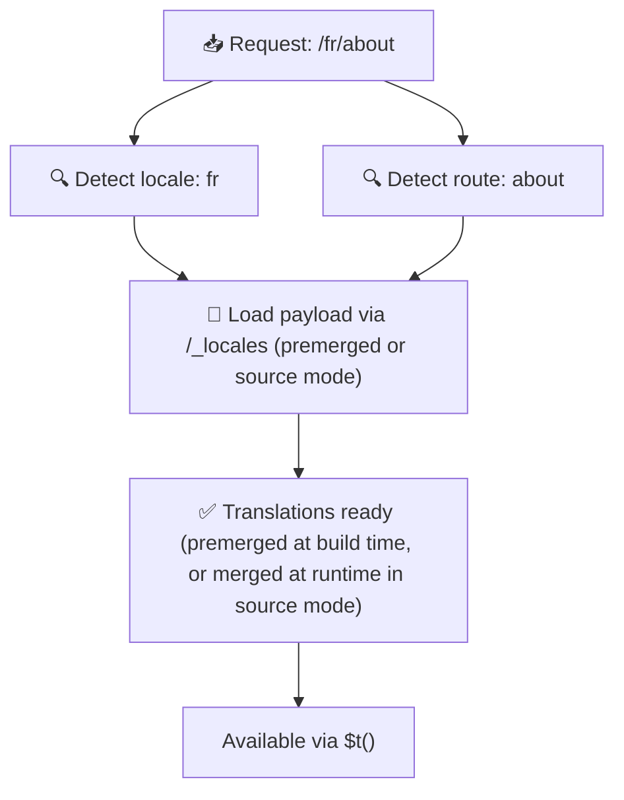

# 📂 Ghid pentru structura folderelor

## 📖 Introducere

Organizarea eficientă a fișierelor de traducere este esențială pentru menținerea unui sistem de internaționalizare (i18n) scalabil și eficient. `Nuxt I18n Micro` simplifică acest proces oferind o abordare clară pentru gestionarea traducerilor la nivel de rădăcină și a celor specifice paginii. Acest ghid te va conduce prin structura de foldere recomandată și va explica cum gestionează `Nuxt I18n Micro` aceste traduceri.

## 🗂️ Structura de foldere recomandată

`Nuxt I18n Micro` organizează traducerile în fișiere la nivel de rădăcină și fișiere specifice paginii în directorul `pages`. Cu `translationPayloads.mode: 'premerged'` (implicit), traducerile la nivel de rădăcină sunt îmbinate automat în fiecare fișier de pagină la build, așa că fiecare pagină are un set complet de traduceri fără overhead de îmbinare la runtime.

Cu `mode: 'source'`, fișierele sursă rămân separate în asset-urile Nitro și sunt îmbinate la runtime prin ruta `/_locales`. Vezi [Output payload serverless](/guides/performance#serverless-payload-output).

### 🔧 Structura de bază

Iată un exemplu de bază al structurii de foldere pe care ar trebui să o urmezi:

```text
locales/
├── pages/
│   ├── index/
│   │   ├── en.json
│   │   ├── fr.json
│   │   └── ar.json
│   ├── about/
│   │   ├── en.json
│   │   ├── fr.json
│   │   └── ar.json
├── en.json
├── fr.json
└── ar.json

```

### 📄 Explicația structurii

#### 1. 🌍 Fișiere de traducere la nivel de rădăcină

- **Cale:** `/locales/\{locale\}.json` (de exemplu, `/locales/en.json`)
- **Scop:** Aceste fișiere conțin traduceri partajate în întreaga aplicație (meniuri de navigare, antete, subsoluri etc.). Cu `mode: 'premerged'` (implicit), ele sunt îmbinate automat în fiecare fișier specific paginii la build, așa că serverul returnează un singur fișier pre-construit per pagină.

  **Exemplu de conținut (`/locales/en.json`):**

  ```json
  {
    "menu": {
      "home": "Home",
      "about": "About Us",
      "contact": "Contact"
    },
    "footer": {
      "copyright": "© 2024 Your Company"
    }
  }
  ```

#### 2. 📄 Fișiere de traducere specifice paginii

- **Cale:** `/locales/pages/\{routeName\}/\{locale\}.json` (de exemplu, `/locales/pages/index/en.json`)
- **Scop:** Aceste fișiere conțin traduceri specifice paginilor individuale. Cu `mode: 'premerged'` (implicit), traducerile la nivel de rădăcină sunt îmbinate ca bază la build, astfel încât fiecare fișier de pagină devine autonom.

  **Exemplu de conținut (`/locales/pages/index/en.json`):**

  ```json
  {
    "title": "Welcome to Our Website",
    "description": "We offer a wide range of products and services to meet your needs."
  }
  ```

  **Exemplu de conținut (`/locales/pages/about/en.json`):**

  ```json
  {
    "title": "About Us",
    "description": "Learn more about our mission, vision, and values."
  }
  ```

### 📂 Gestionarea rutelor dinamice și a căilor imbricate

`Nuxt I18n Micro` transformă automat segmentele dinamice și căile imbricate din rute într-o structură de foldere plată folosind o convenție specifică de redenumire. Astfel toate traducerile sunt stocate într-un mod consistent și ușor accesibil.

#### Structura de foldere pentru traduceri de rute dinamice

Când te confrunți cu rute dinamice, cum ar fi `/products/[id]`, modulul convertește segmentul dinamic `[id]` într-un format static în cadrul structurii de fișiere.

**Exemplu de structură de foldere pentru rute dinamice:**

Pentru o rută precum `/products/[id]`, fișierele de traducere ar fi stocate într-un folder numit `products-id`:

```text
locales/pages/
├── products-id/
│   ├── en.json
│   ├── fr.json
│   └── ar.json

```

**Exemplu de structură de foldere pentru rute dinamice imbricate:**

Pentru o rută imbricată precum `/products/key/[id]`, fișierele de traducere ar fi stocate într-un folder numit `products-key-id`:

```text
locales/pages/
├── products-key-id/
│   ├── en.json
│   ├── fr.json
│   └── ar.json

```

**Exemplu de structură de foldere pentru rute imbricate pe mai multe niveluri:**

Pentru o rută imbricată mai complexă precum `/products/category/[id]/details`, fișierele de traducere ar fi stocate într-un folder numit `products-category-id-details`:

```text
locales/pages/
├── products-category-id-details/
│   ├── en.json
│   ├── fr.json
│   └── ar.json

```

### 🛠 Personalizarea structurii directoarelor

Dacă preferi să stochezi traducerile într-un director diferit, `Nuxt I18n Micro` îți permite să personalizezi directorul în care sunt stocate fișierele de traducere. Poți configura acest lucru în fișierul tău `nuxt.config.ts`.

**Exemplu: Personalizarea directorului de traduceri**

```typescript
export default defineNuxtConfig({
  i18n: {
    translationDir: 'i18n', // Custom directory path
  },
})
```

Aceasta va instrui `Nuxt I18n Micro` să caute fișierele de traducere în directorul `/i18n` în loc de directorul implicit `/locales`.

## ⚙️ Cum sunt încărcate traducerile

### 🌍 Rute dinamice pentru locale

`Nuxt I18n Micro` folosește rute dinamice pentru locale pentru a încărca traducerile eficient. Când un utilizator vizitează o pagină, modulul determină locale-ul potrivit și încarcă fișierele de traducere corespunzătoare pe baza rutei și locale-ului curent.



De exemplu:

- Vizitarea `/en/index` va încărca traducerile din `/locales/pages/index/en.json`.
- Vizitarea `/fr/about` va încărca traducerile din `/locales/pages/about/fr.json`.

Această metodă asigură că doar traducerile necesare sunt încărcate, optimizând atât sarcina serverului, cât și performanța pe client.

### 💾 Caching și pre-render

Pentru a îmbunătăți și mai mult performanța, `Nuxt I18n Micro` suportă caching-ul și pre-render-ul fișierelor de traducere:

- **Caching**: Odată ce un fișier de traducere este încărcat, este stocat în cache pentru cererile ulterioare, reducând nevoia de a prelua în mod repetat aceleași date.
- **Pre-render**: În timpul procesului de build, poți pre-render fișierele de traducere pentru toate localele și rutele configurate, permițându-le să fie servite direct de pe server fără întârzieri la runtime.

## 📝 Bune practici

### 📂 Folosește cu înțelepciune fișierele specifice paginii

Utilizează fișierele specifice paginii pentru a menține traducerile organizate. Aceasta păstrează traducerile fiecărei pagini reduse și rapid de încărcat, ceea ce este deosebit de important pentru paginile cu conținut complex sau mare.

### 🔑 Păstrează consistența cheilor de traducere

Folosește convenții de denumire consistente pentru cheile de traducere în toate fișierele. Aceasta ajută la menținerea clarității și previne problemele la gestionarea traducerilor, mai ales pe măsură ce aplicația ta crește.

### 🗂️ Organizează traducerile după context

Grupează traducerile înrudite împreună în fișierele tale. De exemplu, grupează toate etichetele butoanelor sub o cheie `buttons` și toate textele legate de formulare sub o cheie `forms`. Acest lucru nu numai că îmbunătățește lizibilitatea, ci face și mai ușoară gestionarea traducerilor între diferite locale.

### ⚠️ Limita de adâncime a imbricării (2 niveluri recomandate)

În timpul navigării pe client, `Nuxt I18n Micro` folosește o îmbinare profundă optimizată pe 2 niveluri pentru a combina traducerile din paginile care pleacă și care intră. Aceasta asigură că cheile imbricate care se suprapun (de exemplu, ambele pagini au chei sub `common.*`) sunt păstrate în timpul animațiilor de tranziție.

**Aceasta funcționează corect pentru structura standard `Secțiune → Cheie → Valoare` (2 niveluri):**

```json
// Page A translations
{ "common": { "fromA": "Text A" } }

// Page B translations
{ "common": { "fromB": "Text B" } }

// During transition, both are available:
// { "common": { "fromA": "Text A", "fromB": "Text B" } }
```

**Totuși, dacă folosești 3+ niveluri de imbricare, cheile mai adânci pot fi suprascrise în timpul tranzițiilor:**

```json
// Page A translations
{ "auth": { "form": { "login": "Login" } } }

// Page B translations
{ "auth": { "form": { "register": "Register" } } }

// During transition: "login" key is lost
// { "auth": { "form": { "register": "Register" } } }
```


### 🧹 Curăță regulat traducerile neutilizate

În timp, aplicația ta ar putea acumula chei de traducere neutilizate, mai ales dacă anumite funcționalități sunt eliminate sau restructurate. Revizuiește și curăță periodic fișierele tale de traducere pentru a le menține concise și mentenabile.
