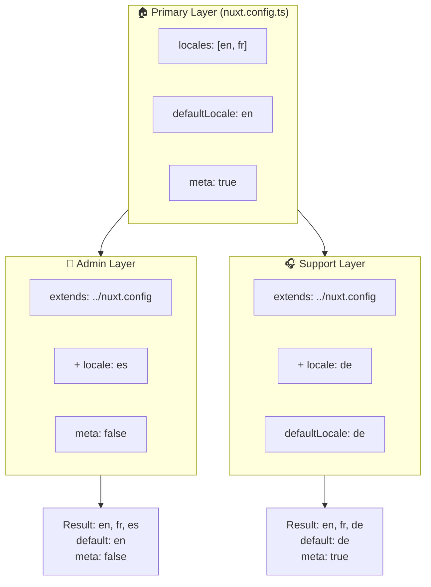

# 🗂️ Straturi în `Nuxt I18n Micro`

## 📖 Introducere în straturi

Straturile din `Nuxt I18n Micro` îți permit să gestionezi și să personalizezi flexibil setările de localizare în diferite părți ale aplicației tale. Definind straturi diferite, poți ajusta configurarea pentru diverse contexte, precum suprascrierea setărilor pentru anumite secțiuni ale site-ului tău sau crearea de configurări de bază reutilizabile, care pot fi extinse de alte părți ale aplicației.

### Flux de moștenire a straturilor



## 🛠️ Stratul principal de configurare

**Stratul principal de configurare** este locul în care setezi setările implicite de localizare pentru întreaga ta aplicație. Acest strat este esențial, deoarece definește configurarea globală, incluzând locale-urile suportate, limba implicită și alte setări i18n critice.

### 📄 Exemplu: Definirea stratului principal de configurare

Iată un exemplu despre cum ai putea defini stratul principal de configurare în fișierul `nuxt.config.ts`:

```typescript
export default defineNuxtConfig({
  i18n: {
    locales: [
      { code: 'en', iso: 'en-EN', dir: 'ltr' },
      { code: 'fr', iso: 'fr-FR', dir: 'ltr' },
      { code: 'ar', iso: 'ar-SA', dir: 'rtl' },
    ],
    defaultLocale: 'en', // The default locale for the entire app
    translationDir: 'locales', // Directory where translations are stored
    meta: true, // Automatically generate SEO-related meta tags like `alternate`
    autoDetectLanguage: true, // Automatically detect and use the user's preferred language
  },
})
```

## 🌱 Straturi copil

Straturile copil sunt folosite pentru a extinde sau a suprascrie configurarea principală pentru anumite părți ale aplicației tale. De exemplu, ai putea dori să adaugi locale-uri suplimentare sau să modifici locale-ul implicit pentru o anumită secțiune a site-ului tău. Straturile copil sunt utile în special în aplicațiile modulare, unde diferite părți ale aplicației ar putea avea cerințe de localizare diferite.

### 📄 Exemplu: Extinderea stratului principal într-un strat copil

Să presupunem că ai o secțiune a site-ului tău care trebuie să suporte locale-uri suplimentare sau vrei să dezactivezi un anumit locale într-un anumit context. Iată cum poți realiza acest lucru extinzând stratul principal de configurare:

```typescript
// basic/nuxt.config.ts (Primary Layer)
export default defineNuxtConfig({
  i18n: {
    locales: [
      { code: 'en', iso: 'en-EN', dir: 'ltr' },
      { code: 'fr', iso: 'fr-FR', dir: 'ltr' },
    ],
    defaultLocale: 'en',
    meta: true,
    translationDir: 'locales',
  },
})
```

```typescript
// extended/nuxt.config.ts (Child Layer)
export default defineNuxtConfig({
  extends: '../basic', // Inherit the base configuration from the 'basic' layer
  i18n: {
    locales: [
      { code: 'en', iso: 'en-EN', dir: 'ltr' }, // Inherited from the base layer
      { code: 'fr', iso: 'fr-FR', dir: 'ltr' }, // Inherited from the base layer
      { code: 'de', iso: 'de-DE', dir: 'ltr' }, // Added in the child layer
    ],
    defaultLocale: 'fr', // Override the default locale to French for this section
    autoDetectLanguage: false, // Disable automatic language detection in this section
  },
})
```

### 🌐 Folosirea straturilor într-o aplicație modulară

Într-o aplicație Nuxt mai mare, modulară, ai putea avea mai multe secțiuni, fiecare necesitând propriile setări i18n. Folosind straturile, poți menține o structură de configurare curată și scalabilă.

### 📄 Exemplu: Configurare stratificată într-o aplicație modulară

Imaginează-ți că ai un site de e-commerce cu secțiuni distincte, precum site-ul principal, panoul de administrare și portalul de suport clienți. Fiecare secțiune ar putea avea nevoie de un set diferit de locale-uri sau alte setări i18n.

#### **Stratul principal (configurare globală):**

```typescript
// nuxt.config.ts
export default defineNuxtConfig({
  i18n: {
    locales: [
      { code: 'en', iso: 'en-EN', dir: 'ltr' },
      { code: 'fr', iso: 'fr-FR', dir: 'ltr' },
    ],
    defaultLocale: 'en',
    meta: true,
    translationDir: 'locales',
    autoDetectLanguage: true,
  },
})
```

#### **Strat copil pentru panoul de administrare:**

```typescript
// admin/nuxt.config.ts
export default defineNuxtConfig({
  extends: '../nuxt.config', // Inherit the global settings
  i18n: {
    locales: [
      { code: 'en', iso: 'en-EN', dir: 'ltr' }, // Inherited
      { code: 'fr', iso: 'fr-FR', dir: 'ltr' }, // Inherited
      { code: 'es', iso: 'es-ES', dir: 'ltr' }, // Specific to the admin panel
    ],
    defaultLocale: 'en',
    meta: false, // Disable automatic meta generation in the admin panel
  },
})
```

#### **Strat copil pentru portalul de suport clienți:**

```typescript
// support/nuxt.config.ts
export default defineNuxtConfig({
  extends: '../nuxt.config', // Inherit the global settings
  i18n: {
    locales: [
      { code: 'en', iso: 'en-EN', dir: 'ltr' }, // Inherited
      { code: 'fr', iso: 'fr-FR', dir: 'ltr' }, // Inherited
      { code: 'de', iso: 'de-DE', dir: 'ltr' }, // Specific to the support portal
    ],
    defaultLocale: 'de', // Default to German in the support portal
    autoDetectLanguage: false, // Disable automatic language detection
  },
})
```

În acest exemplu modular:

- Fiecare secțiune (admin, suport) are propriile setări i18n, dar toate moștenesc configurarea de bază.
- Panoul de administrare adaugă spaniola (`es`) ca locale și dezactivează generarea de meta tag-uri.
- Portalul de suport adaugă germana (`de`) ca locale și folosește germana implicit pentru interfața cu utilizatorul.

## 📝 Bune practici pentru utilizarea straturilor

- **🔧 Păstrează stratul principal simplu:** Stratul principal ar trebui să conțină cele mai frecvent utilizate setări, care se aplică global în întreaga ta aplicație. Păstrează-l simplu pentru a asigura consistența.
- **⚙️ Folosește straturi copil pentru personalizări specifice:** Suprascrie sau extinde setările în straturile copil doar când este necesar. Această abordare evită complexitatea inutilă în configurarea ta.
- **📚 Documentează-ți straturile:** Documentează clar scopul și specificul fiecărui strat din proiectul tău. Acest lucru va ajuta la menținerea clarității și va face mai ușor pentru alții (sau pentru tine, în viitor) să înțeleagă configurarea.
