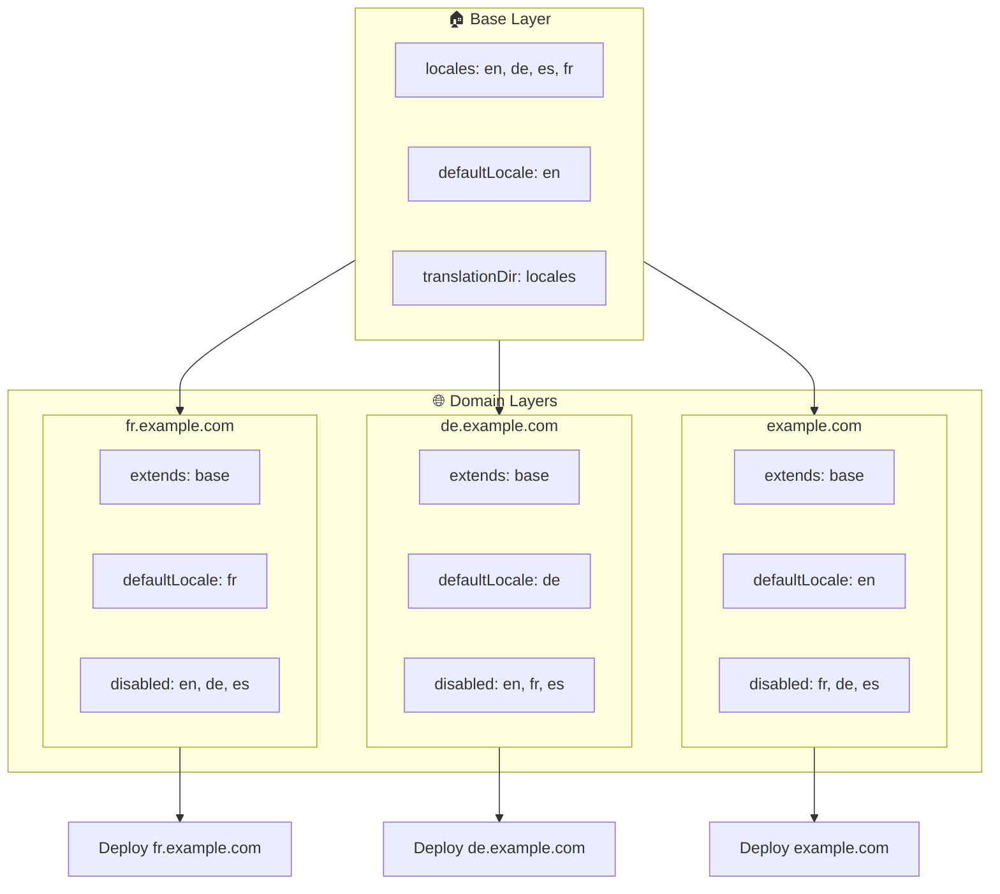

# 🌍 Configurarea locale-urilor multi-domeniu cu `Nuxt I18n Micro` folosind straturi

## 📝 Introducere

Folosind straturile în `Nuxt I18n Micro`, poți crea o configurare de localizare multi-domeniu flexibilă și ușor de întreținut. Această abordare nu doar că simplifică gestionarea domeniilor prin eliminarea nevoii de funcționalități complexe, dar permite și o distribuție eficientă a sarcinii și o complexitate redusă a proiectului. Rulând proiecte separate pentru locale-uri diferite, aplicația ta poate scala și se poate adapta cu ușurință la cerințele variate de locale, pe mai multe domenii, oferind o soluție robustă și scalabilă pentru aplicații globale.

## 🎯 Obiectiv

Crearea unei configurări în care domenii diferite servesc locale-uri specifice, prin personalizarea configurațiilor în straturi copil. Această metodă folosește sistemul de straturi al Nuxt, permițându-ți să menții o configurare de bază, extinzând-o sau modificând-o pentru fiecare domeniu.

### Arhitectură multi-domeniu



## 🛠 Pași pentru implementarea locale-urilor multi-domeniu

### 1. **Creează stratul de bază**

Începe prin a crea un strat de configurare de bază, care include toate setările comune de locale pentru aplicația ta. Această configurare va servi ca fundație pentru celelalte configurări specifice fiecărui domeniu.

#### **Configurarea stratului de bază**

Creează fișierul de configurare de bază `base/nuxt.config.ts`:

```typescript
// base/nuxt.config.ts

export default defineNuxtConfig({
  i18n: {
    locales: [
      { code: 'en', iso: 'en-US', dir: 'ltr' },
      { code: 'de', iso: 'de-DE', dir: 'ltr' },
      { code: 'es', iso: 'es-ES', dir: 'ltr' },
    ],
    defaultLocale: 'en',
    translationDir: 'locales',
    meta: true,
    autoDetectLanguage: true,
  },
})
```

### 2. **Creează straturi copil specifice domeniului**

Pentru fiecare domeniu, creează un strat copil care modifică configurarea de bază pentru a îndeplini cerințele specifice acelui domeniu. Poți dezactiva locale-urile care nu sunt necesare pentru un anumit domeniu.

#### **Exemplu: configurare pentru domeniul francez**

Creează o configurare de strat copil pentru domeniul francez în `fr/nuxt.config.ts`:

```typescript
// fr/nuxt.config.ts

export default defineNuxtConfig({
  extends: '../base', // Inherit from the base configuration

  i18n: {
    locales: [
      { code: 'en', iso: 'en-US', dir: 'ltr', disabled: true }, // Disable English
      { code: 'fr', iso: 'fr-FR', dir: 'ltr' }, // Add and enable the French locale
      { code: 'de', iso: 'de-DE', dir: 'ltr', disabled: true }, // Disable German
      { code: 'es', iso: 'es-ES', dir: 'ltr', disabled: true }, // Disable Spanish
    ],
    defaultLocale: 'fr', // Set French as the default locale
    autoDetectLanguage: false, // Disable automatic language detection
  },
})
```

#### **Exemplu: configurare pentru domeniul german**

Similar, creează o configurare de strat copil pentru domeniul german în `de/nuxt.config.ts`:

```typescript
// de/nuxt.config.ts

export default defineNuxtConfig({
  extends: '../base', // Inherit from the base configuration

  i18n: {
    locales: [
      { code: 'en', iso: 'en-US', dir: 'ltr', disabled: true }, // Disable English
      { code: 'fr', iso: 'fr-FR', dir: 'ltr', disabled: true }, // Disable French
      { code: 'de', iso: 'de-DE', dir: 'ltr' }, // Use the German locale
      { code: 'es', iso: 'es-ES', dir: 'ltr', disabled: true }, // Disable Spanish
    ],
    defaultLocale: 'de', // Set German as the default locale
    autoDetectLanguage: false, // Disable automatic language detection
  },
})
```

### 3. **Implementează aplicația pentru fiecare domeniu**

Implementează aplicația cu configurația corespunzătoare pentru fiecare domeniu. De exemplu:

- Implementează configurarea stratului `fr` pe `fr.example.com`.
- Implementează configurarea stratului `de` pe `de.example.com`.

### 4. **Configurează mai multe proiecte pentru locale-uri diferite**

Pentru fiecare locale și domeniu, va trebui să rulezi o instanță separată a aplicației. Acest lucru asigură că fiecare domeniu servește configurarea corectă de locale, optimizând distribuția sarcinii și simplificând structura proiectului. Rulând mai multe proiecte adaptate fiecărui locale, poți menține o separare curată între configurări și poți reduce complexitatea setup-ului general.

### 5. **Configurează rutarea în funcție de domeniu**

Asigură-te că rutarea este configurată astfel încât să direcționeze utilizatorii către proiectul corect, pe baza domeniului pe care îl accesează. Acest lucru va asigura că fiecare domeniu servește locale-ul corespunzător, îmbunătățind experiența utilizatorului și menținând consistența între diferite regiuni.

### 6. **Implementare și verificare**

După ce configurezi straturile și le implementezi pe domeniile lor respective, asigură-te că fiecare domeniu servește locale-ul corect. Testează temeinic aplicația pentru a confirma că locale-ul corect este încărcat în funcție de domeniu.

## 📝 Bune practici

- **Păstrează configurarea de bază generică**: Configurarea de bază ar trebui să acopere setări generale, aplicabile tuturor domeniilor.
- **Izolează logica specifică domeniului**: Păstrează configurările specifice domeniului în straturile lor respective, pentru a menține claritatea și separarea preocupărilor.

## 🎉 Concluzie

Folosind straturile în `Nuxt I18n Micro`, poți crea o configurare de localizare multi-domeniu flexibilă și ușor de întreținut. Această abordare nu doar că elimină nevoia de funcționalități complexe de gestionare a domeniilor, dar îți permite să distribui eficient sarcina și să reduci complexitatea proiectului. Rularea unor proiecte separate pentru locale-uri diferite asigură că aplicația ta poate scala cu ușurință și se poate adapta la cerințele diferite de locale, pe mai multe domenii, oferind o soluție robustă și scalabilă pentru aplicații globale.
