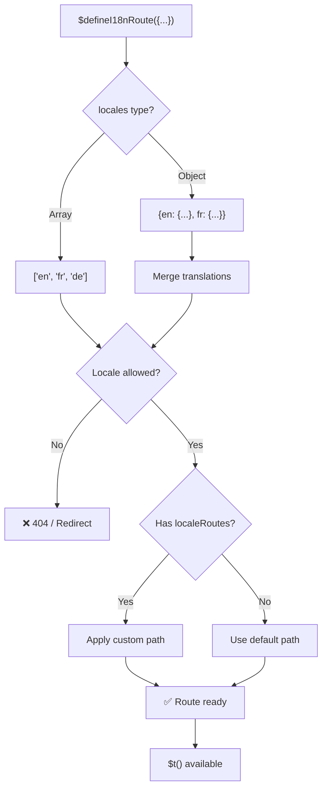
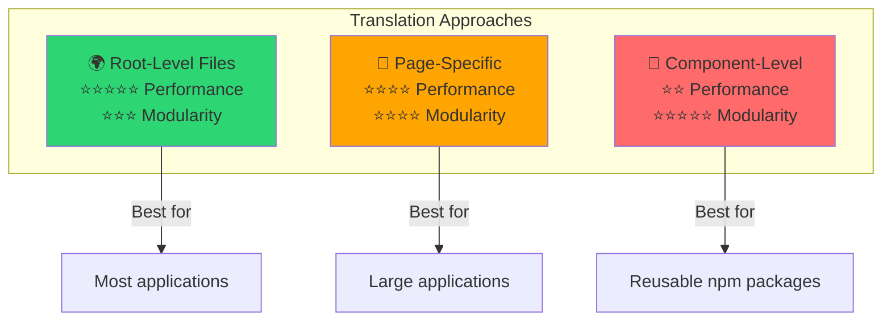

# 📖 Traduceri per componentă

Învață cum să definești traduceri direct în cadrul componentelor Vue, folosind `$defineI18nRoute`, pentru o localizare modulară și ușor de întreținut.

## 📖 Prezentare generală

Traducerile per componentă în `Nuxt I18n Micro` îți permit să definești traduceri direct în cadrul anumitor componente sau pagini, folosind funcția `$defineI18nRoute`. Această abordare este ideală pentru gestionarea conținutului localizat, unic pentru componente individuale, oferind o metodă mai modulară și mai ușor de întreținut pentru gestionarea traducerilor.

## 🚀 Start rapid

### Utilizare de bază

```vue
<template>
  <div>
    <h1>{{ $t('greeting') }}</h1>
    <p>{{ $t('farewell') }}</p>
  </div>
</template>

<script setup lang="ts">
import { useNuxtApp } from '#imports'

const { $defineI18nRoute, $t } = useNuxtApp()

$defineI18nRoute({
  locales: {
    en: { greeting: 'Hello', farewell: 'Goodbye' },
    fr: { greeting: 'Bonjour', farewell: 'Au revoir' },
    de: { greeting: 'Hallo', farewell: 'Auf Wiedersehen' },
  },
})
</script>
```

### Configurare necesară (`script setup`)

`$defineI18nRoute` este o injecție de aplicație Nuxt, nu o macro globală.  
Preia-o întotdeauna din `useNuxtApp()` înainte de a o apela.

```ts
import { useNuxtApp } from '#imports'

const { $defineI18nRoute } = useNuxtApp()
```

## 🏗️ Meta-uri de rută la build-time

La build-time, un unplugin Vite scanează fișierele `.vue` de pagină pentru apeluri `defineI18nRoute(...)` / `$defineI18nRoute(...)` și extrage restricțiile de locale, `localeRoutes` și `disableMeta` în metadatele de rută folosite de `@i18n-micro/route-strategy`.

- **Build**: unplugin (`src/unplugin-define-i18n-route.ts`) rulează în timpul transformării Vite și scrie `i18n-route-meta.json` sub directorul de build Nuxt
- **Runtime**: plugin-ul define (`03.define.ts`) încă expune `$defineI18nRoute` în `script setup` pentru dev și configurare inline

De obicei, apelezi `$defineI18nRoute` doar în pagini — modulul gestionează automat extracția la build-time.

## 🔧 Funcția `$defineI18nRoute`

Funcția `$defineI18nRoute` configurează comportamentul rutei pe baza locale-ului curent, oferind o soluție versatilă pentru:

- Controlul accesului la anumite rute pe baza locale-urilor disponibile
- Furnizarea de traduceri pentru anumite locale-uri
- Setarea de rute personalizate pentru locale-uri diferite
- Controlul generării de meta tag-uri

### Cum funcționează



### Semnătura metodei

```typescript
const { $defineI18nRoute } = useNuxtApp();
$defineI18nRoute(routeDefinition: DefineI18nRouteConfig);
```

### Parametri

| Parametru      | Tip                                       | Descriere                        |
| -------------- | ------------------------------------------ | ---------------------------------- |
| `locales`      | `string[] \| Record<string, Translations>` | Locale-uri disponibile pentru rută    |
| `localeRoutes` | `Record<string, string>`                   | Rute personalizate pentru anumite locale-uri |
| `disableMeta`  | `boolean \| string[]`                      | Controlează generarea de meta tag-uri i18n   |

### Descrieri detaliate ale parametrilor

#### `locales`

Definește ce locale-uri sunt disponibile pentru rută:

<CodeGroup>
```typescript Array Format
$defineI18nRoute({
  locales: ['en', 'fr', 'de'], // Simple array of locale codes
})
```

```typescript Object Format
$defineI18nRoute({
  locales: {
    en: { greeting: 'Hello', farewell: 'Goodbye' },
    fr: { greeting: 'Bonjour', farewell: 'Au revoir' },
    de: { greeting: 'Hallo', farewell: 'Auf Wiedersehen' },
    ru: {}, // Russian locale allowed but no translations provided
  },
})
```
</CodeGroup>

#### `localeRoutes`

Permite rute personalizate pentru anumite locale-uri:

```typescript
$defineI18nRoute({
  localeRoutes: {
    en: '/welcome',
    fr: '/bienvenue',
    de: '/willkommen',
    ru: '/privet', // Custom route path for Russian locale
  },
})
```

#### `disableMeta`

Controlează generarea de meta tag-uri i18n:

<CodeGroup>
```typescript Disable All Meta
$defineI18nRoute({
  locales: ['en', 'fr', 'de'],
  disableMeta: true, // Disables all i18n meta tags
})
```

```typescript Disable Specific Locales
$defineI18nRoute({
  locales: ['en', 'fr', 'de'],
  disableMeta: ['en', 'fr'], // Only English and French won't have meta tags
})
```
</CodeGroup>

## 💡 Cazuri de utilizare

### 1. Controlul accesului pe baza locale-urilor

Definește ce locale-uri sunt permise pentru anumite rute:

```typescript
$defineI18nRoute({
  locales: ['en', 'fr', 'de'], // Only these locales are allowed for this route
})
```

### 2. Furnizarea de traduceri specifice componentei

Folosește obiectul `locales` pentru a furniza traduceri specifice pentru fiecare rută:

```typescript
$defineI18nRoute({
  locales: {
    en: {
      greeting: 'Hello',
      farewell: 'Goodbye',
      description: 'Welcome to our application',
    },
    fr: {
      greeting: 'Bonjour',
      farewell: 'Au revoir',
      description: 'Bienvenue dans notre application',
    },
    de: {
      greeting: 'Hallo',
      farewell: 'Auf Wiedersehen',
      description: 'Willkommen in unserer Anwendung',
    },
  },
})
```

### 3. Rutare personalizată pentru locale-uri

Definește căi personalizate pentru anumite locale-uri:

```typescript
$defineI18nRoute({
  locales: ['en', 'fr', 'de'],
  localeRoutes: {
    en: '/welcome',
    fr: '/bienvenue',
    de: '/willkommen',
  },
})
```

### 4. Dezactivarea meta tag-urilor

Controlează generarea de meta tag-uri SEO pentru anumite rute sau locale-uri:

```typescript
// Disable meta tags for all locales
$defineI18nRoute({
  locales: ['en', 'fr', 'de'],
  disableMeta: true,
})

// Disable meta tags only for specific locales
$defineI18nRoute({
  locales: ['en', 'fr', 'de'],
  disableMeta: ['en', 'fr'],
})
```

## ✅ Formate de configurare suportate

Parser-ul `$defineI18nRoute` suportă diverse configurări JavaScript:

### Configurări statice

<CodeGroup>
```typescript Static Arrays
$defineI18nRoute({
  locales: ['en', 'de', 'fr'],
})
```

```typescript Static Objects
$defineI18nRoute({
  locales: {
    en: { greeting: 'Hello' },
    de: { greeting: 'Hallo' },
  },
  localeRoutes: {
    en: '/welcome',
    de: '/willkommen',
  },
})
```
</CodeGroup>

### Configurări dinamice

<CodeGroup>
```typescript Variables and Functions
const locales = ['en', 'de', 'fr']
const routes = { en: '/welcome', de: '/willkommen' }

$defineI18nRoute({
  locales: locales,
  localeRoutes: routes,
})
```

```typescript Template Literals
const prefix = 'api'

$defineI18nRoute({
  locales: [`${prefix}-en`, `${prefix}-de`],
  localeRoutes: {
    [`${prefix}-en`]: `/api/welcome`,
    [`${prefix}-de`]: `/api/willkommen`,
  },
})
```
</CodeGroup>

### Configurări avansate

<CodeGroup>
```typescript Spread Operator
const baseLocales = ['en', 'de']
const additionalLocales = ['fr', 'es']

$defineI18nRoute({
  locales: [...baseLocales, ...additionalLocales],
})
```

```typescript Array of Objects
$defineI18nRoute({
  locales: [
    { code: 'en', name: 'English' },
    { code: 'de', name: 'German' },
  ],
})
```
</CodeGroup>

### Logică condițională

```typescript
$defineI18nRoute({
  locales: process.env.NODE_ENV === 'production' ? ['en', 'de'] : ['en', 'de', 'fr', 'es'],
})
```

### Obiecte complexe imbricate

```typescript
$defineI18nRoute({
  locales: {
    'en-us': {
      region: 'US',
      currency: 'USD',
      format: {
        date: 'MM/DD/YYYY',
        time: '12h',
      },
    },
    'de-de': {
      region: 'DE',
      currency: 'EUR',
      format: {
        date: 'DD.MM.YYYY',
        time: '24h',
      },
    },
  },
})
```

### Comentarii și formatare

```typescript
$defineI18nRoute({
  // Supported locales for this component
  locales: [
    'en', // English
    'de', // German
    'fr', // French
  ],
  // Custom routes for each locale
  localeRoutes: {
    en: '/welcome',
    de: '/willkommen',
    fr: '/bienvenue',
  },
})
```

## ❌ Nesuportat

Parser-ul are limitări și nu poate gestiona:

- **Import-uri externe** (declarații `import`)
- **Funcții async/await**
- **Metode de clasă**
- **Flux de control complex** (bucle, try-catch, switch)
- **Arrow function-uri** în configurare
- **Funcții generator**

## 📝 Exemplu complet

Iată un exemplu cuprinzător care arată toate funcționalitățile:

```vue
<template>
  <div class="welcome-page">
    <header>
      <h1>{{ $t('title') }}</h1>
      <p>{{ $t('subtitle') }}</p>
    </header>

    <main>
      <section>
        <h2>{{ $t('features.title') }}</h2>
        <ul>
          <li v-for="feature in $t('features.list')" :key="feature">
            {{ feature }}
          </li>
        </ul>
      </section>

      <section>
        <h2>{{ $t('contact.title') }}</h2>
        <p>{{ $t('contact.description') }}</p>
        <a :href="$t('contact.email')">{{ $t('contact.email') }}</a>
      </section>
    </main>

    <footer>
      <p>{{ $t('footer.copyright') }}</p>
    </footer>
  </div>
</template>

<script setup lang="ts">
import { useNuxtApp } from '#imports'

const { $defineI18nRoute, $t } = useNuxtApp()

// Define comprehensive i18n route configuration
$defineI18nRoute({
  locales: {
    en: {
      title: 'Welcome to Our Platform',
      subtitle: 'The best solution for your needs',
      features: {
        title: 'Key Features',
        list: ['High Performance', 'Easy to Use', 'Scalable Architecture'],
      },
      contact: {
        title: 'Get in Touch',
        description: "We'd love to hear from you",
        email: 'mailto:contact@example.com',
      },
      footer: {
        copyright: '© 2024 Example Company. All rights reserved.',
      },
    },
    fr: {
      title: 'Bienvenue sur Notre Plateforme',
      subtitle: 'La meilleure solution pour vos besoins',
      features: {
        title: 'Fonctionnalités Clés',
        list: ['Haute Performance', 'Facile à Utiliser', 'Architecture Évolutive'],
      },
      contact: {
        title: 'Contactez-Nous',
        description: 'Nous aimerions avoir de vos nouvelles',
        email: 'mailto:contact@example.com',
      },
      footer: {
        copyright: '© 2024 Example Company. Tous droits réservés.',
      },
    },
    de: {
      title: 'Willkommen auf Unserer Plattform',
      subtitle: 'Die beste Lösung für Ihre Bedürfnisse',
      features: {
        title: 'Hauptfunktionen',
        list: ['Hohe Leistung', 'Einfach zu Verwenden', 'Skalierbare Architektur'],
      },
      contact: {
        title: 'Kontaktieren Sie Uns',
        description: 'Wir würden gerne von Ihnen hören',
        email: 'mailto:contact@example.com',
      },
      footer: {
        copyright: '© 2024 Example Company. Alle Rechte vorbehalten.',
      },
    },
  },
  localeRoutes: {
    en: '/welcome',
    fr: '/bienvenue',
    de: '/willkommen',
  },
  disableMeta: false, // Enable SEO meta tags
})
</script>

<style scoped>
.welcome-page {
  max-width: 800px;
  margin: 0 auto;
  padding: 2rem;
}

header {
  text-align: center;
  margin-bottom: 3rem;
}

section {
  margin-bottom: 2rem;
}

footer {
  text-align: center;
  margin-top: 3rem;
  padding-top: 2rem;
  border-top: 1px solid #eee;
}
</style>
```

## ⚡ Considerații de performanță

Încorporarea traducerilor în Single File Components (SFC) poate afecta performanța:

### Probleme potențiale

- **Dimensiune crescută a fișierului**: Toate locale-urile se află în SFC, spre deosebire de fișierele separate de traducere, care permit încărcarea conștientă de locale
- **Randare mai lentă**: Traducerile inline sunt procesate la runtime
- **Utilizarea memoriei**: Toate traducerile sunt încărcate indiferent de locale-ul curent

### Bune practici

- **Folosește traduceri pagină cu pagină** pentru performanță optimă
- **Rezervă traducerile la nivel de componentă** pentru cazuri specifice, precum:
  - Componente reutilizabile publicate pe npm
  - Traduceri nepotrivite pentru fișiere la nivel root
  - Componente care trebuie să fie autonome

### Performanță vs modularitate

Echilibrează nevoile proiectului tău când alegi o abordare:



| Abordare             | Performanță | Modularitate | Caz de utilizare            |
| -------------------- | ----------- | ---------- | ------------------- |
| **Fișiere la nivel root** | ⭐⭐⭐⭐⭐  | ⭐⭐⭐     | Majoritatea aplicațiilor   |
| **Specifice paginii**    | ⭐⭐⭐⭐    | ⭐⭐⭐⭐   | Aplicații mari  |
| **La nivel de componentă**  | ⭐⭐        | ⭐⭐⭐⭐⭐ | Componente reutilizabile |

## 🎯 Bune practici

### 1. Păstrează traducerile aproape de componente

Definește traducerile direct în componenta relevantă, pentru a păstra conținutul localizat organizat și ușor de întreținut.

### 2. Folosește obiecte de locale pentru flexibilitate

Utilizează formatul obiect pentru proprietatea `locales` când sunt necesare traduceri specifice sau controlul accesului pe baza locale-urilor.

### 3. Documentează rutele personalizate

Documentează clar orice rută personalizată setată pentru locale-uri diferite, pentru a menține claritatea și pentru a simplifica dezvoltarea și întreținerea.

### 4. Ia în considerare impactul asupra performanței

Evaluează dacă traducerile la nivel de componentă sunt necesare pentru cazul tău de utilizare, luând în considerare implicațiile de performanță.

### 5. Folosește TypeScript

Folosește TypeScript pentru o mai bună siguranță de tip și pentru suportul IntelliSense:

```typescript
interface ComponentTranslations {
  title: string
  subtitle: string
  features: {
    title: string
    list: string[]
  }
}

$defineI18nRoute({
  locales: {
    en: {
      title: 'Welcome',
      subtitle: 'Subtitle',
      features: {
        title: 'Features',
        list: ['Feature 1', 'Feature 2'],
      },
    } as ComponentTranslations,
  },
})
```

## 📚 Subiecte conexe

- **[Start rapid](/quickstart)** - Configurare și setări de bază
- **[Referință API](/api/methods)** - Documentație completă a metodelor
- **[Exemple](/examples)** - Exemple de utilizare din lumea reală

## Rezumat

Funcționalitatea de traduceri per componentă, alimentată de funcția `$defineI18nRoute`, oferă o modalitate puternică și flexibilă de a gestiona localizarea în aplicația ta Nuxt. Permițând ca conținutul localizat și rutarea să fie definite la nivel de componentă, ajută la crearea unei experiențe extrem de personalizate și prietenoase cu utilizatorul, adaptată preferințelor de limbă și regionale ale audienței tale.

Alege abordarea care se potrivește cel mai bine nevoilor proiectului tău, luând în considerare atât cerințele de performanță, cât și cele de mentenanță.
