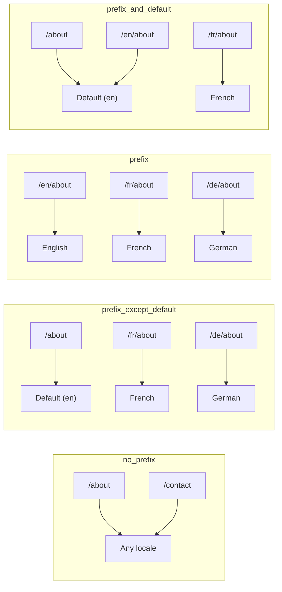
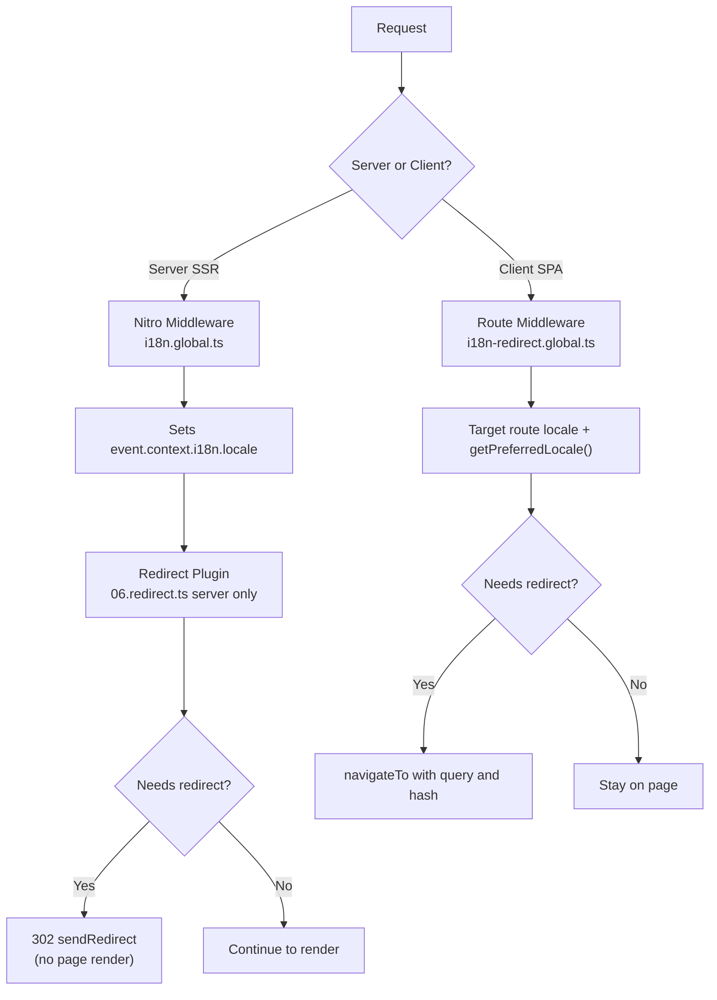

# 🗂️ Strategii de rutare în Nuxt I18n Micro

## 📖 Prezentare generală

Nuxt I18n Micro controlează modul în care prefixele de locale apar în URL-uri prin opțiunea `strategy`. În fundal, două pachete implementează acest lucru:

- **`@i18n-micro/route-strategy`** — generarea rutelor la build-time (extinde paginile Nuxt cu rute localizate)
- **`@i18n-micro/path-strategy`** — rezolvarea căilor la runtime, redirecționări, atribute SEO și generarea de link-uri

Modulul Nuxt selectează clasa de strategie corectă la build-time și o aliasează prin `#i18n-strategy`, astfel încât să fie inclusă în bundle doar implementarea aleasă.

## 🚦 Strategii disponibile

{/* generated:option:strategy — do not edit; run `pnpm run docs:generate` */}

**Tip** `Strategies` · **Implicit** `'prefix_except_default'`

Strategie de rutare URL pentru prefixele de locale.

- `'no_prefix'` — fără locale în URL; locale-ul este stocat în cookie.
- `'prefix_except_default'` — prefixează toate locale-urile, cu excepția celui implicit.
- `'prefix'` — prefixează întotdeauna, inclusiv locale-ul implicit.
- `'prefix_and_default'` — la fel ca `prefix`, dar locale-ul implicit este accesibil și fără prefix.

{/* /generated:option:strategy */}

### Comparație de strategii



### 🛑 `no_prefix`

URL-urile nu au un segment de locale. Locale-ul este determinat de cookie-uri, de starea `useI18nLocale()` sau de detectarea browser-ului.

- **Rute**: `/about`, `/contact` — același pattern de URL pentru toate locale-urile (fără prefix `/en/`, `/fr/`)
- **Persistența locale-ului**: Prin `localeCookie` (setat automat la `'user-locale'` dacă nu este specificat)
- **Căi personalizate**: Suportate prin [`globalLocaleRoutes`](/guides/configuration#globallocaleroutes) și [`defineI18nRoute`](/guides/custom-locale-routes) — slug-urile localizate sunt generate fără a adăuga un prefix de locale la URL-uri (de exemplu, `/about` vs `/ueber-uns`). Rutele imbricate, alias-urile și restricțiile per-locale sunt mai simple decât în `prefix_except_default`.

<Tip>
Când folosești `no_prefix`, `localeCookie` este setat automat la `'user-locale'` dacă nu este specificat. Acest lucru este necesar deoarece URL-ul nu conține informații despre locale.
</Tip>

```typescript
i18n: {
  strategy: 'no_prefix'
  // localeCookie is automatically set to 'user-locale'
}
```

### 🚧 `prefix_except_default`

Toate rutele au un prefix de locale, **cu excepția** locale-ului implicit.

- **Locale implicit**: `/about`, `/contact`
- **Alte locale-uri**: `/fr/about`, `/de/contact`
- **Locale-ul implicit cu prefix returnează 404**: `/en/about` → 404 (când `en` este implicit)

```typescript
i18n: {
  strategy: 'prefix_except_default' // This is the default
}
```

### 🌍 `prefix`

Fiecare rută are un prefix de locale, inclusiv locale-ul implicit.

- **Toate locale-urile**: `/en/about`, `/fr/about`, `/de/about`
- **Rădăcina `/`**: Redirecționează către `/\{locale\}/` pe baza preferinței utilizatorului

```typescript
i18n: {
  strategy: 'prefix'
}
```

### 🔄 `prefix_and_default`

Locale-ul implicit este disponibil atât cu, cât și fără prefix. Locale-urile non-implicite au întotdeauna un prefix.

- **Locale implicit**: atât `/about`, cât și `/en/about` sunt valide
- **Alte locale-uri**: `/fr/about`, `/de/about`
- **Fără redirecționare din `/`**: Atât `/`, cât și `/en/` servesc locale-ul implicit

```typescript
i18n: {
  strategy: 'prefix_and_default'
}
```

## 🔀 Arhitectura de redirecționare (v3)

În v3, logica de redirecționare este împărțită în două straturi pentru o performanță optimă:

### Cum funcționează



### Server-side (fără flash)

1. **Middleware-ul Nitro** (`i18n.global.ts`) rulează primul — detectează locale-ul din URL, cookie sau header-ul `Accept-Language` și setează `event.context.i18n.locale`
2. **Plugin-ul de redirecționare** (`06.redirect.ts`, doar server) verifică dacă calea curentă are nevoie de o redirecționare folosind `i18nStrategy.getClientRedirect()` și emite un 302 **înainte** ca redarea paginii să aibă loc
3. Acest lucru previne „flash-ul de eroare” în care utilizatorii văd o pagină greșită pentru scurt timp înainte de redirecționare

### Client-side (navigație SPA)

1. Middleware-ul global de rută (`i18n-redirect.global.ts`) rulează la fiecare navigare pe client, când `redirects` este activat
2. Derivează locale-ul preferat mai întâi din **ruta țintă**, apoi cade pe `useI18nLocale().getPreferredLocale()`
3. Folosește `i18nStrategy.getClientRedirect()` pentru a decide dacă este necesară o redirecționare
4. Păstrează `query` și `hash` la redirecționare

### Ordinea de prioritate a locale-ului

Pe server, plugin-ul de redirecționare determină locale-ul preferat în această ordine:

1. **`useState('i18n-locale')`** — prioritate maximă (setat programatic prin `useI18nLocale().setLocale()`)
2. **Cookie** — dacă `localeCookie` este configurat
3. **Header-ul `Accept-Language`** — dacă `autoDetectLanguage: true`
4. **`defaultLocale`** — fallback final

Pe client, middleware-ul de rută preferă locale-ul din ruta țintă, apoi folosește același lanț de fallback de stare/cookie.

### Comportament de redirecționare per strategie

| Strategie                | Comportament `GET /`                              | Cookie necesar? |
| ----------------------- | --------------------------------------------- | ---------------- |
| `no_prefix`             | Fără redirecționare (locale din cookie/stare)        | Setat automat         |
| `prefix`                | 302 → `/\{locale\}/`                            | Recomandat      |
| `prefix_except_default` | 302 → `/\{locale\}/` dacă locale ≠ implicit        | Recomandat      |
| `prefix_and_default`    | Fără redirecționare (atât `/`, cât și `/\{locale\}/` valide) | Opțional         |

### Dezactivarea redirecționărilor

```typescript
i18n: {
  redirects: false // Disables automatic locale redirects
}
```

Când `redirects: false`, redirecționările automate de locale sunt dezactivate:

- **Server**: plugin-ul de redirecționare (`06.redirect.ts`, doar server) rămâne înregistrat, dar sare peste logica de redirecționare. Efectuează în continuare **verificări 404** pentru prefixe de locale invalide (de exemplu, `/xx/about` unde `xx` nu este un locale valid) și **sincronizare cu cookie-ul** din prefixul URL (de exemplu, vizitarea `/fr/about` sincronizează cookie-ul la `fr`)
- **Client**: middleware-ul global de rută `i18n-redirect` **nu este înregistrat** — fără redirecționări automate SPA

## 🍪 Persistența locale-ului bazată pe cookie

<Warning>
Când folosești `prefix` sau `prefix_except_default` cu `redirects: true` (implicit), **trebuie** să setezi `localeCookie` pentru ca redirecționările să funcționeze corect. Fără un cookie, plugin-ul de redirecționare nu poate ține minte preferința de locale a utilizatorului între reîncărcările paginii.

```typescript
i18n: {
  strategy: 'prefix_except_default',
  localeCookie: 'user-locale' // Required for redirects to work properly
}
```
</Warning>

**Cum funcționează `localeCookie` în v3:**

- Gestionat intern de `useI18nLocale()` — **nu-l seta manual** prin `useCookie()`
- Când un utilizator vizitează un URL cu prefix (de exemplu, `/fr/about`), cookie-ul este sincronizat automat la `fr`
- La următoarea vizită pe `/`, valoarea cookie-ului este folosită pentru a redirecționa către `/\{locale\}/`
- Dacă cookie-ul conține un locale invalid (nu este în lista `locales`), se face fallback la `defaultLocale`

| Strategie                | `localeCookie` implicit | Note                                |
| ----------------------- | ---------------------- | ------------------------------------ |
| `no_prefix`             | Auto: `'user-locale'`  | Necesar; setat automat          |
| `prefix`                | `null` (dezactivat)      | Setează la `'user-locale'` pentru redirecționări |
| `prefix_except_default` | `null` (dezactivat)      | Setează la `'user-locale'` pentru redirecționări |
| `prefix_and_default`    | `null` (dezactivat)      | Opțional                             |

## 🔍 `autoDetectLanguage` și `autoDetectPath`

### `autoDetectLanguage`

{/* generated:option:autoDetectLanguage — do not edit; run `pnpm run docs:generate` */}

**Tip** `boolean` · **Implicit** `true`

Detectează automat limba preferată a utilizatorului din header-ul HTTP `Accept-Language`.
Folosit împreună cu `autoDetectPath` pentru a decide când are loc detectarea.

{/* /generated:option:autoDetectLanguage */}

Verificarea rulează în middleware-ul de server și este un fallback: un cookie sau o stare existentă are prioritate.

```typescript
i18n: {
  autoDetectLanguage: true
}
```

### `autoDetectPath`

{/* generated:option:autoDetectPath — do not edit; run `pnpm run docs:generate` */}

**Tip** `string` · **Implicit** `'/'`

Unde pot rula redirecționările pe baza preferinței de cookie / Accept-Language (când `redirects` este activat).

- `'/'` — doar `/` (deep link-urile în locale-ul implicit rămân accesibile; implicit)
- `'no_prefix'` — doar căi fără prefix de locale
- `'*'` — orice cale, inclusiv rescrierea unui prefix de locale explicit
  (de exemplu, `/fr/about` → `/de/about` când cookie-ul preferă `de`)

- orice alt string — potrivire exactă a căii (de exemplu, `'/welcome'`)

Curățarea de strategie cu prefix (de exemplu, `/en` → `/` sub `prefix_except_default`) nu este restricționată.

{/* /generated:option:autoDetectPath */}

```typescript
i18n: {
  autoDetectPath: '/' // Default: only root
  // autoDetectPath: '*' // All paths — redirects even /fr/about to /de/about
}
```

<Warning>
Cu `autoDetectPath: '*'`, chiar și URL-urile cu un prefix explicit de locale (de exemplu, `/fr/about`) vor fi redirecționate dacă locale-ul preferat al utilizatorului diferă. Acest lucru poate fi util pentru setup-uri bazate pe domeniu, dar poate deruta utilizatorii care partajează URL-uri.
</Warning>

Cu `autoDetectPath: '/'` implicit și un cookie de locale:

| cerere | cookie | rezultat |
| --- | --- | --- |
| `/` | `de` | 302 → `/de` |
| `/about` | `de` | 200, locale implicit (fără rescriere) |

```typescript
i18n: {
  localeCookie: 'user-locale',
  strategy: 'prefix_except_default',
  // Default — remember language on entry, keep deep links stable
  autoDetectPath: '/',
  // Or redirect on every unprefixed path (but not /de/… → /fr/…):
  // autoDetectPath: 'no_prefix',
}
```

## ⚠️ Probleme cunoscute și bune practici

### 1. Nepotrivire de hidratare în strategia `no_prefix`

Când folosești `no_prefix`, locale-ul este determinat dinamic. Dacă serverul și clientul nu sunt de acord asupra locale-ului, vei vedea o nepotrivire de hidratare.

**Soluție**: Folosește `useI18nLocale().setLocale()` într-un plugin de server (cu `order: -10`) pentru a seta locale-ul înainte de inițializarea i18n:

```ts
// plugins/i18n-loader.server.ts
export default defineNuxtPlugin({
  name: 'i18n-custom-loader',
  enforce: 'pre',
  order: -10,
  setup() {
    const { setLocale } = useI18nLocale()
    setLocale('ja') // Your detection logic here
  },
})
```

Vezi [Detectare personalizată a limbii](/guides/custom-language-detection) pentru exemple detaliate.

### 2. Folosește rute denumite cu `localeRoute`

Rutarea bazată pe cale poate provoca probleme cu rezolvarea rutelor:

```typescript
// May cause issues
$localeRoute('/page')

// Preferred approach
$localeRoute({ name: 'page' })
```

### 3. Folosirea `pages: false` cu i18n

Când folosești Nuxt cu `pages: false`:

```typescript
export default defineNuxtConfig({
  pages: false,
  i18n: {
    strategy: 'no_prefix', // Recommended
    disablePageLocales: true, // Required
    localeCookie: 'user-locale', // Required for persistence
  },
})
```

**Limitări cu `pages: false`:**

- Fără redirecționări automate
- Fără detectare a locale-ului pe baza URL-ului
- Schimbarea locale-ului pe client necesită reîncărcarea paginii sau încărcarea manuală a traducerilor

### 4. Gestionarea cookie-urilor invalide

Dacă un cookie conține un locale invalid (nu este în lista `locales`), modulul face fallback grațios la `defaultLocale`. Nu sunt aruncate erori.

## 📝 Rezumatul bunelor practici

| Recomandare            | Detalii                                                                             |
| ------------------------- | ----------------------------------------------------------------------------------- |
| **Setează `localeCookie`**    | Setează întotdeauna pentru strategiile cu prefix cu `redirects: true`                             |
| **Folosește `useI18nLocale()`** | Modul centralizat de a gestiona starea locale-ului (înlocuiește `useState`/`useCookie` manuale) |
| **Folosește rute denumite**      | `$localeRoute(\{ name: 'page' \})` în locul `$localeRoute('/page')`                       |
| **Locale programatic**   | Folosește `useI18nLocale().setLocale()` într-un plugin de server cu `order: -10`              |
| **Evită cookie-urile manuale**  | Nu folosi `useCookie('user-locale')` direct — `useI18nLocale()` gestionează asta      |
