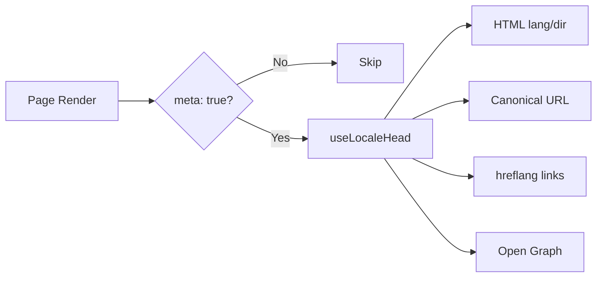

# 🌐 Ghid SEO pentru Nuxt I18n Micro

## 📖 Introducere

SEO-ul eficient (optimizarea pentru motoarele de căutare) este esențial pentru a te asigura că site-ul tău multilingv este accesibil și vizibil pentru utilizatorii din întreaga lume, prin intermediul motoarelor de căutare. `Nuxt I18n Micro` simplifică procesul de gestionare a SEO-ului pentru site-uri multilingve, generând automat meta tag-uri și atribute esențiale care informează motoarele de căutare despre structura și conținutul site-ului tău.

Acest ghid explică modul în care `Nuxt I18n Micro` gestionează SEO-ul pentru a îmbunătăți vizibilitatea site-ului tău și experiența utilizatorului, fără a fi necesară o configurare suplimentară.

## ⚙️ Gestionare automată a SEO-ului

### Fluxul de generare a meta-urilor SEO



**Tag-uri generate:**

| Tag             | Exemplu                                                  |
| --------------- | -------------------------------------------------------- |
| Atribute HTML | `<html lang="en" dir="ltr">`                             |
| Canonical       | `<link rel="canonical" href="...">`                      |
| hreflang        | `<link rel="alternate" hreflang="en" href="...">`        |
| x-default       | `<link rel="alternate" hreflang="x-default" href="...">` |
| Open Graph      | `<meta property="og:locale" content="en_US">`            |

#### `og` per locale (`og:locale` vs BCP 47)

`<html lang>` și `hreflang` folosesc **BCP 47** prin `locale.iso` (de exemplu, `ar-AE`).  
Open Graph necesită **`language_TERRITORY`** cu **underscore** (`ar_AE`), conform [protocolului OG](https://ogp.me/).

Implicit, `og:locale` este derivat din `iso` când maparea este neambiguă (`en-US` → `en_US`).  
Setează un string **`og`** explicit când ai nevoie de o valoare personalizată (de exemplu, `zh-Hans` → `zh_CN`).  
Dacă nici `og`, nici un `iso` convertibil nu sunt disponibile, tag-urile `og:locale` nu sunt generate — în dezvoltare primești un avertisment în consolă (respectă `missingWarn`).

```typescript
i18n: {
  meta: true,
  locales: [
    { code: 'ar', iso: 'ar-AE', og: 'ar_AE', dir: 'rtl' },
    { code: 'en', iso: 'en-US' }, // og:locale → en_US
    { code: 'zh', iso: 'zh-Hans', og: 'zh_CN' }, // script tags need explicit og
  ],
}
```

### 🔑 Caracteristici cheie SEO

Când opțiunea `meta` este activată în `Nuxt I18n Micro`, modulul gestionează automat următoarele aspecte SEO:

1. **🌍 Atributele de limbă și direcție**:
   - Modulul setează atributele `lang` și `dir` pe tag-ul `<html>` conform locale-ului curent și direcției textului (de exemplu, `ltr` pentru engleză sau `rtl` pentru arabă).

2. **🔗 URL-uri canonice**:
   - Modulul generează un link canonic (`<link rel="canonical">`) pentru fiecare pagină, asigurându-se că motoarele de căutare recunosc versiunea principală a conținutului.

3. **🌐 Link-uri de limbi alternative (`hreflang`)**:
   - Modulul generează automat tag-uri `<link rel="alternate" hreflang="">` pentru toate locale-urile disponibile. Acest lucru îi ajută pe motoarele de căutare să înțeleagă ce versiuni lingvistice ale conținutului tău sunt disponibile, îmbunătățind experiența utilizatorilor pentru audiențele globale.
   - Fiecare locale emite **un** tag: `hreflang = iso || code`. Când `iso` este setat, `code`-ul de rutare nu este niciodată folosit ca `hreflang` (astfel încât cheile de piață precum `mx` să nu devină tag-uri de limbă invalide).
   - Opțional, `hreflangBaseLanguage: true` emite și un tag de limbă simplă, derivat din `iso` (de exemplu, `es-ES` → `es`), revendicat de primul locale regional din `locales`.

4. **🌏 Hreflang `x-default`**:
   - Modulul generează automat un tag `<link rel="alternate" hreflang="x-default">` care indică către URL-ul locale-ului implicit. Acest lucru le spune motoarelor de căutare ce URL să afișeze utilizatorilor a căror limbă nu se potrivește cu niciuna dintre locale-urile definite. Nu este necesară o configurare suplimentară — funcționează automat când este setat `meta: true`.

5. **🔖 Metadate Open Graph**:
   - Modulul generează meta tag-uri Open Graph (`og:locale`, `og:url`, etc.) pentru fiecare locale, ceea ce este deosebit de util pentru partajarea pe rețele sociale și indexarea în motoarele de căutare.

### 🛠️ Configurare

Pentru a activa aceste funcționalități SEO, asigură-te că opțiunea `meta` este setată la `true` în fișierul tău `nuxt.config.ts`:

```typescript
export default defineNuxtConfig({
  modules: ['nuxt-i18n-micro'],
  i18n: {
    locales: [
      { code: 'en', iso: 'en-US', dir: 'ltr' },
      { code: 'fr', iso: 'fr-FR', dir: 'ltr' },
      { code: 'ar', iso: 'ar-SA', dir: 'rtl' },
    ],
    defaultLocale: 'en',
    translationDir: 'locales',
    meta: true, // Enables automatic SEO management
  },
})
```

### 🌍 `metaBaseUrl` dinamic pentru implementări multi-domeniu

Când `metaBaseUrl` nu este setat, URL-urile absolute SEO se rezolvă în această ordine (#240):

1. `site.url` din [`nuxt-site-config`](https://nuxtseo.com/docs/site-config) (dacă acel modul este prezent — de exemplu, prin `@nuxtjs/seo`)
2. Altfel, hostname-ul din cererea curentă (`useRequestURL()` / `window.location.origin`)

Fallback-ul la origin-ul cererii respectă header-ele de reverse-proxy (`X-Forwarded-Host`, `X-Forwarded-Proto`), astfel încât funcționează corect în spatele proxy-urilor nginx, Cloudflare, AWS ALB și similare.

Asta înseamnă că aplicațiile care setează deja `site.url` pentru sitemap / robots / schema.org **nu** au nevoie de o a doua declarație `metaBaseUrl`:

```typescript
export default defineNuxtConfig({
  site: {
    url: process.env.NUXT_SITE_URL, // also used by micro for canonical / og:url / hreflang
  },
  i18n: {
    meta: true,
    // metaBaseUrl omitted — picks up site.url, then request origin
  },
})
```

Fără `site.url`, o singură instanță de aplicație poate în continuare servi **mai multe domenii** cu tag-uri SEO corecte pentru fiecare, prin origin-ul cererii:

```typescript
export default defineNuxtConfig({
  i18n: {
    meta: true,
    // metaBaseUrl is undefined by default — resolved dynamically from the request
  },
})
```

De exemplu, o cerere către `https://site-a.com/en/about` va produce:

```html
<link rel="canonical" href="https://site-a.com/en/about" /> <meta property="og:url" content="https://site-a.com/en/about" />
```

În timp ce aceeași aplicație servind `https://site-b.com/en/about` va produce:

```html
<link rel="canonical" href="https://site-b.com/en/about" /> <meta property="og:url" content="https://site-b.com/en/about" />
```

Dacă ai nevoie de un URL de bază fix care are întotdeauna prioritate față de `site.url`, transmite un string static:

```typescript
metaBaseUrl: 'https://example.com'
```

### 🔍 Whitelist pentru query-urile canonice

Implicit, parametrii de query sunt eliminați din canonical și `og:url` pentru a evita conținutul duplicat. Poți pune pe lista albă anumiți parametri de query care ar trebui păstrați:

```typescript
i18n: {
  canonicalQueryWhitelist: ['page', 'sort', 'filter', 'search', 'q', 'query', 'tag']
}
```

Doar parametrii listați în `canonicalQueryWhitelist` vor apărea în URL-urile canonice. Toți ceilalți parametri de query (de exemplu, tracking, ID-uri de sesiune) sunt eliminați.

### 🚫 Dezactivarea meta tag-urilor per pagină

Poți dezactiva generarea meta tag-urilor SEO pentru anumite pagini folosind `defineI18nRoute()`:

```vue
<script setup>
// Disable all SEO meta tags for this page
defineI18nRoute({
  disableMeta: true,
})
</script>
```

Poți dezactiva meta doar pentru anumite locale-uri:

```vue
<script setup>
// Disable meta tags only for English locale on this page
defineI18nRoute({
  disableMeta: ['en'],
})
</script>
```

Când `disableMeta` este activ, nu sunt generate tag-uri `hreflang`, `canonical`, `og:locale`, `og:url` sau `x-default` pentru pagina/locale-ul afectat.

### 🔇 Locale-uri dezactivate

Locale-urile cu `disabled: true` sunt excluse automat din toată generarea de tag-uri SEO — nu sunt create link-uri `hreflang`, `og:locale:alternate` sau alternative pentru ele:

```typescript
i18n: {
  locales: [
    { code: 'en', iso: 'en-US' },
    { code: 'fr', iso: 'fr-FR', disabled: true }, // excluded from SEO tags
  ]
}
```

### 🙈 Locale-uri excluse (`seo: false`)

Pentru locale-urile care ar trebui să rămână rutabile și traduse, dar nu ar trebui să apară în tag-urile de descoperire între locale-uri, setează `seo: false`. Aceste locale-uri sunt omise din alternativele `hreflang` și `og:locale:alternate`. Dacă locale-ul **implicit** configurat are `seo: false`, nici link-ul `x-default` nu este emis.

```typescript
i18n: {
  locales: [
    { code: 'en', iso: 'en-US' },
    { code: 'ru', iso: 'ru-RU', seo: false }, // internal / non-indexed locale
  ]
}
```

### 📌 Comportament specific strategiei

| Strategie                | Link-uri hreflang   | x-default             | canonical      | og:url |
| ----------------------- | ---------------- | --------------------- | -------------- | ------ |
| `prefix`                | ✅ Toate locale-urile   | ✅ URL locale implicit | ✅ URL curent | ✅     |
| `prefix_except_default` | ✅ Toate locale-urile   | ✅ URL fără prefix     | ✅ URL curent | ✅     |
| `prefix_and_default`    | ✅ Toate locale-urile   | ✅ URL locale implicit | ✅ URL curent | ✅     |
| `no_prefix`             | ❌ Nu se generează | ❌ Nu se generează      | ✅ URL curent | ✅     |

Pentru strategia `no_prefix`, se generează doar atributele `canonical`, `og:url`, `og:locale` și `html` (`lang`, `dir`). Link-urile alternative de limbă (`hreflang`) și `x-default` nu sunt generate, deoarece nu există URL-uri distincte per locale.

## Suprascrieri la nivel de pagină (`useI18nHead`)

Pentru **articole, ghiduri sau orice conținut CMS**, unde nu fiecare locale există sau URL-urile provin dintr-un API, folosește [`useI18nHead`](/api/composables/use-i18n-head) pe pagină în loc de un plugin personalizat de i18n head.

### Articol cu traduceri parțiale

```vue
<script setup lang="ts">
const article = await loadArticle()
// article.locales = { en: '...', de: '...' } — only translated locales

useI18nHead({
  meta: [{ property: 'og:title', content: article.title }],
  replace: {
    hreflang: Object.entries(article.locales).map(([locale, href]) => ({
      rel: 'alternate',
      hreflang: locale,
      href,
    })),
    ogAlternates: Object.keys(article.locales),
  },
})
</script>
```

### Slug-uri per-locale cu `$setI18nRouteParams`

Când slug-urile diferă per limbă, setează mai întâi parametrii de rută, apoi suprascrie alternativele cu URL-uri reale:

```vue
<script setup lang="ts">
const { $defineI18nRoute, $setI18nRouteParams } = useNuxtApp()
const { data: article } = await useFetch(`/api/articles/${slug}`)

$defineI18nRoute({
  localeRoutes: { en: '/blog/[slug]', de: '/de/blog/[slug]' },
})

$setI18nRouteParams({
  en: { slug: article.value.slugEn },
  de: { slug: article.value.slugDe },
})

useI18nHead({
  replace: {
    hreflang: ['en', 'de'].map((locale) => ({
      rel: 'alternate',
      hreflang: locale,
      href: article.value.urls[locale],
    })),
    ogAlternates: ['en', 'de'],
  },
})
</script>
```

### Origin HTTPS în spatele unui proxy

Pentru URL-uri absolute corecte la SSR, fără un composable personalizat de origin:

```ts
i18n: {
  meta: true,
  metaBaseUrl: undefined,
  metaTrustForwardedHost: true,
  metaTrustForwardedProto: true,
}
```

Mai multe exemple (suprascriere canonical, `x-default`, fetch reactiv, helper-i partajați): [composable-ul useI18nHead](/api/composables/use-i18n-head).

### ⚠️ Slash final

Modulul generează URL-uri canonical și `hreflang` pe baza căii reale din `useRoute().fullPath`. Dacă aplicația ta folosește slash-uri finale (de exemplu, prin `router.options` din Nuxt), URL-urile generate vor reflecta acest lucru. Totuși, `$switchLocalePath` poate normaliza căile și elimina slash-urile finale. Dacă consistența slash-ului final este critică pentru SEO-ul tău, verifică dacă URL-urile generate se potrivesc structurii URL a aplicației tale.

### 🎯 Beneficii

Activând opțiunea `meta`, beneficiezi de:

- **📈 Clasamente îmbunătățite în motoarele de căutare**: Motoarele de căutare pot indexa mai bine site-ul tău, înțelegând relațiile dintre versiunile lingvistice diferite.
- **👥 O experiență mai bună pentru utilizator**: Utilizatorii primesc versiunea lingvistică corectă pe baza preferințelor lor, ceea ce duce la o experiență mai personalizată.
- **🔧 Configurare manuală redusă**: Modulul gestionează sarcinile SEO automat, eliberându-te de nevoia de a adăuga manual meta tag-uri și atribute legate de SEO.

## 🔗 Nuxt SEO (`@nuxtjs/seo`)

[`@nuxtjs/seo`](https://nuxtseo.com/) include sitemap, robots, schema.org, imagini OG și module conexe. Se integrează cu **nuxt-i18n-micro** prin [`nuxt-site-config`](https://nuxtseo.com/docs/site-config/guides/i18n) (v4+).

### Cerințe

- **`@nuxtjs/seo` 3+** (release-urile curente folosesc `nuxt-site-config` 4+, care înregistrează plugin-ul `nuxt-site-config:i18n` pentru micro)
- **`i18n.meta: true`** (recomandat — micro furnizează tag-uri head conștiente de locale; Nuxt SEO adaugă sitemap, schema.org, etc.)

### Ordinea modulelor

Listează **nuxt-i18n-micro înainte de `@nuxtjs/seo`** pentru ca site config să poată citi configurarea ta de locale:

```typescript
export default defineNuxtConfig({
  modules: ['nuxt-i18n-micro', '@nuxtjs/seo'],
  site: {
    url: 'https://example.com',
    name: 'My Site',
  },
  i18n: {
    meta: true,
    defaultLocale: 'en',
    locales: [
      { code: 'en', iso: 'en-US' },
      { code: 'de', iso: 'de-DE' },
    ],
  },
})
```

### Nume site și descriere traduse

Nuxt Site Config citește chei opționale de traducere din fișierele tale de locale:

```json
{
  "nuxtSiteConfig": {
    "name": "My Site",
    "description": "My site description"
  }
}
```

Valorile per-locale în `locales/en.json`, `locales/de.json`, etc. sunt preluate automat.

### Depanare

Dacă vezi `Plugin nuxt-seo:defaults depends on nuxt-site-config:i18n but they are not registered`, actualizează **`@nuxtjs/seo` la 3+** (vezi [issue #133](https://github.com/s00d/nuxt-i18n-micro/issues/133)). `nuxt-site-config` 3.x mai vechi a conectat i18n doar pentru `@nuxtjs/i18n`, nu pentru micro.

Mai multe: [Ghid sitemap i18n](https://nuxtseo.com/docs/sitemap/guides/i18n), [Ghid Site Config i18n](https://nuxtseo.com/docs/site-config/guides/i18n).
