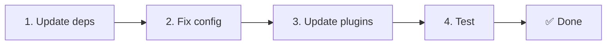

# 📦 Actualizare de la v2.x la v3.x

<Tip>
Vezi [Migrarea de la nuxt-i18n](/migration/from-nuxtjs-i18n) — acel ghid acoperă trecerea de la ecosistemul vue-i18n, nu de la nuxt-i18n-micro v2.
</Tip>

v3.0.0 introduce schimbări arhitecturale fundamentale: pachete de strategie, un nou sistem de caching, gestionare centralizată a locale-urilor prin `useI18nLocale()` și un pipeline de redirecționare redesenat. Această secțiune acoperă toate schimbările incompatibile și modul de actualizare a codului tău.

## Pași de migrare



## Rezumatul schimbărilor incompatibile

- **Starea locale-ului** — `useState` / `useCookie` manual → composable `useI18nLocale()`
- **Accesul la configurație** — `useRuntimeConfig().public.i18nConfig` → `getI18nConfig()` din `#build/i18n.strategy.mjs`
- **Componenta de redirecționare** — opțiunea `fallbackRedirectComponentPath` → plugin de redirecționare pe server + middleware de rută pe client (automat)
- **`includeDefaultLocaleRoute`** — Suportat (depreciat) → Eliminat, folosește opțiunea `strategy`
- **`experimental.hmr`** — Sub `experimental` → Opțiune la nivel root
- **`previousPageFallback`** — Eliminat complet (strategia de îmbinare cumulativă gestionează asta automat)
- **Caching** — `useStorage('cache')` → singleton `TranslationStorage` (`Symbol.for` pe `globalThis`)
- **Transfer SSR** — Runtime config → payload Nuxt (v3 folosea `useState`; chunk-urile trăiesc acum în `payload.data`, vezi [Performance](/guides/performance#server-side-payload-transfer))
- **Clase de strategie** — Interne → Pachete separate (`@i18n-micro/route-strategy`, `@i18n-micro/path-strategy`)

## Eliminat: `fallbackRedirectComponentPath`

Opțiunea `fallbackRedirectComponentPath` și componenta fallback `locale-redirect.vue` au fost eliminate. Logica de redirecționare este acum gestionată de:

1. **Middleware de server** (`i18n.global.ts`) — setează `event.context.i18n.locale`
2. **Plugin de redirecționare pe server** (`06.redirect.ts`, doar server) — redirecționări 302 înainte de randare
3. **Middleware de rută pe client** (`i18n-redirect.global.ts`) — redirecționări SPA după hidratare

```diff
 i18n: {
   strategy: 'prefix_except_default',
-  fallbackRedirectComponentPath: '~/components/MyRedirect.vue',
 }
```

Dacă aveai logică personalizată de redirecționare în componenta fallback, implementează-o în schimb într-un plugin de server:

```ts
// plugins/i18n-loader.server.ts
export default defineNuxtPlugin({
  name: 'i18n-custom-redirect',
  enforce: 'pre',
  order: -10,
  setup() {
    const { setLocale } = useI18nLocale()
    // Your custom detection logic
    setLocale(detectedLocale)
  },
})
```

## Eliminat: `includeDefaultLocaleRoute`

Folosește în schimb opțiunea `strategy`:

- `includeDefaultLocaleRoute: true` → `strategy: 'prefix'`
- `includeDefaultLocaleRoute: false` → `strategy: 'prefix_except_default'` (implicit)

```diff
 i18n: {
-  includeDefaultLocaleRoute: true,
+  strategy: 'prefix',
 }
```

## Acces la configurație: `getI18nConfig()` înlocuiește `useRuntimeConfig`

```diff
- const config = useRuntimeConfig()
- const cookieName = config.public.i18nConfig?.localeCookie || 'user-locale'
+ import { getI18nConfig } from '#build/i18n.strategy.mjs'
+ const { localeCookie: configCookie } = getI18nConfig()
+ const cookieName = configCookie ?? 'user-locale'
```

## Gestionarea locale-ului: `useI18nLocale()` înlocuiește starea manuală

În v2, este posibil să fi folosit `useState('i18n-locale')` sau `useCookie('user-locale')` direct. În v3, folosește composable-ul centralizat `useI18nLocale()`:

```diff
- const locale = useState('i18n-locale')
- const cookie = useCookie('user-locale')
- locale.value = 'fr'
- cookie.value = 'fr'
+ const { setLocale } = useI18nLocale()
+ setLocale('fr') // Updates both state and cookie atomically
```

Vezi [Custom Language Detection](/guides/custom-language-detection) pentru exemple detaliate.

## Opțiuni experimentale mutate / eliminate

`hmr` s-a mutat din `experimental` la nivel root. `previousPageFallback` a fost eliminat complet — modulul folosește acum o strategie de deep merge cumulativă (adâncime de 2 niveluri) care păstrează automat traducerile din pagina anterioară în timpul animațiilor de tranziție, chiar și când paginile împart chei imbricate care se suprapun. După ce animația de tranziție se termină, hook-ul `page:transition:finish` curăță din memorie cheile paginii vechi.

```diff
 i18n: {
-  experimental: {
-    hmr: true,
-    previousPageFallback: true
-  }
+  hmr: true,
+  // previousPageFallback removed — handled automatically
 }
```

## Arhitectura de redirecționare (v3)

Redirecționările sunt acum gestionate automat de două componente:

1. **Pe server** (`06.redirect.ts`, doar server): Rulează în timpul SSR, emite redirecționări 302 înainte de orice randare de pagină — fără „error flash”
2. **Pe client** (`i18n-redirect.global.ts`): Middleware global de rută la navigarea SPA; păstrează șirul query și hash-ul

Prioritatea locale-ului pentru redirecționări:

1. `useState('i18n-locale')` — setat prin `useI18nLocale().setLocale()`
2. Cookie — dacă `localeCookie` este configurat
3. Header-ul `Accept-Language` — dacă `autoDetectLanguage: true`
4. `defaultLocale` — fallback

Nu sunt necesare modificări de cod pentru setup-uri standard.

<Warning>
Pentru strategiile `prefix` și `prefix_except_default` cu `redirects: true`, setează `localeCookie: 'user-locale'` pentru a activa persistența locale-ului între reîncărcările paginii. Fără el, redirecționările folosesc doar `Accept-Language` sau `defaultLocale`.
</Warning>

## TypeScript: Tipuri de modul interne (opțional)

Dacă întâmpini erori de tip legate de importurile interne precum `#i18n-internal/plural`, `#i18n-internal/strategy` sau `#i18n-internal/config`, adaugă secțiunea `imports` în `package.json` al proiectului tău:

```json
{
  "imports": {
    "#i18n-internal/plural": "nuxt-i18n-micro/internals",
    "#i18n-internal/strategy": "nuxt-i18n-micro/internals",
    "#i18n-internal/config": "nuxt-i18n-micro/internals"
  }
}
```

<Tip>

</Tip>
