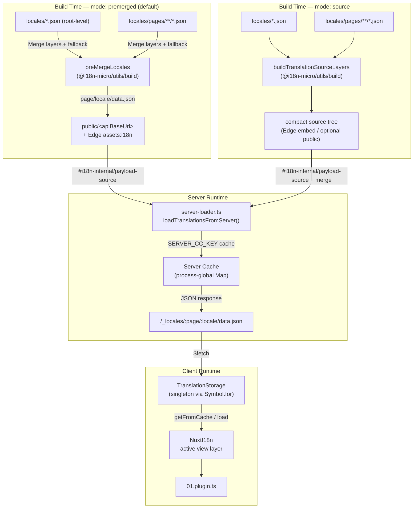

# 🗄️ Архитектура кэша и хранилища переводов

## 📖 Обзор

Nuxt I18n Micro v3 использует многоуровневую архитектуру кэширования переводов. Загрузка payload'а зависит от `translationPayloads.mode`:

- **`premerged`** (по умолчанию) — корневые, страничные, fallback и слоевые файлы объединяются на этапе сборки через `@i18n-micro/utils/build` в `\{page\}/\{locale\}/data.json`
- **`source`** — компактные исходники сохраняются для merge в рантайме через `@i18n-micro/utils/source-loader` и `@i18n-micro/utils/merge-source` (Edge встраивает их в Nitro `serverAssets`; Node читает из `public/` при копировании)

Эта страница описывает, как работает встроенный кэш и как расширить его под свои сценарии (админ-инструменты, внешние API, инвалидация кэша).

## 📊 Обзор архитектуры

### Поток данных



## 🧱 Ключевые компоненты

### 1. `TranslationStorage` (клиент + сервер)

**Файл**: `src/runtime/utils/storage.ts`

Класс-синглтон, предоставляющий единое хранилище переводов и для клиента, и для сервера. Использует `Symbol.for('__NUXT_I18N_STORAGE_CACHE__')` на `globalThis`, чтобы гарантировать единственный экземпляр даже при загрузке нескольких бандлов.

**Ключевые методы:**

| Метод                              | Описание                                                                |
| ----------------------------------- | ---------------------------------------------------------------------- |
| `getFromCache(locale, routeName?)`  | Синхронная проверка: возвращает закэшированные в памяти данные или `null` |
| `load(locale, routeName?, options)` | Асинхронная загрузка с кэшированием: сначала кэш, затем `$fetch`         |
| `clear()`                           | Очищает весь кэш                                                        |

**Формат ключа кэша**: `\{locale\}:\{routeName\}` (например, `en:index`, `fr:about`)

```typescript
import { translationStorage } from '../utils/storage'

// Synchronous cache check
const cached = translationStorage.getFromCache('en', 'index')

// Async load (with automatic caching)
const result = await translationStorage.load('en', 'index', {
  apiBaseUrl: '_locales',
  baseURL: '/',
  dateBuild: '2024-01-01',
})
// result.data — merged translations
// result.cacheKey — cache key used
```

### ⚙️ Детерминированный cache-busting (`i18n.dateBuild`)

По умолчанию модуль генерирует `dateBuild` на этапе сборки через `Date.now()`. Затем он встраивается в сгенерированный `#build/i18n.strategy.mjs` и используется как query-параметр (`?v=...`) для инвалидации кэшей загрузки переводов после ребилдов.

Если нужны воспроизводимые сборки (например, чтобы повысить долю попаданий в кэш чанков при rolling-деплоях), задайте стабильное значение в `nuxt.config`:

```ts
export default defineNuxtConfig({
  i18n: {
    // Any stable string/number (git SHA, CI build number, release tag, etc.)
    dateBuild: process.env.GIT_SHA ?? 'local-dev',
  },
})
```

### 2. `loadTranslationsFromServer()` (только сервер)

**Файл**: `src/runtime/server/utils/server-loader.ts`

Загружает переводы для локали/страницы и кэширует объединённый результат в process-global `CacheControl` map с ключами из `@i18n-micro/hmr/cache-keys` (`SERVER_CC_KEY`).

Поведение: SSR загружает из `#i18n-internal/payload-source` — **Node** делает `readFile` под `public/<apiBaseUrl>` (`\{page\}/\{locale\}/data.json` в режиме premerged), **Edge** читает `assets:i18n`. `premerged` читает один файл; `source` мёржит root/page/fallback через `@i18n-micro/utils/source-loader`.

```typescript
import { loadTranslationsFromServer } from '../server/utils/server-loader'

// Returns { data: Translations, json: string }
const { data, json } = await loadTranslationsFromServer('en', 'index')
```

### 3. Клиентская загрузка (без встраивания в HTML)

Словари **не** записываются в `nuxtApp.payload`. Сервер держит их в памяти для SSR-рендера; клиентский плагин делает `await` `switchContext`, который загружает `/\{apiBaseUrl\}/:page/:locale/data.json`
(та же дефолтная позиция, что у `@nuxtjs/i18n` с `experimental.preload: false`).

`NuxtI18n` держит активный view-layer словарь, используемый `$t()` и `$has()`. `NuxtTranslationLoader` переключает контекст локали/маршрута и мёржит чанки в этот слой.

### 4. Серверный API-маршрут

**Маршрут**: `/_locales/\{page\}/\{locale\}/data.json`

**Файл**: `src/runtime/server/routes/i18n.ts`

Этот Nitro-маршрут отдаёт объединённые переводы для активного режима payload. Он вызывает `loadTranslationsFromServer()` и возвращает результат в виде JSON.

В production он также выставляет:

```http
Cache-Control: public, max-age={httpCacheDuration}, immutable
```

По умолчанию `httpCacheDuration` равен `31536000` (1 год). Это безопасно, потому что клиенты запрашивают payload'ы с cache-busting `?v=\{dateBuild\}`. Установите `httpCacheDuration: 0`, чтобы не отправлять заголовок. В режиме разработки заголовок не применяется.

## 📥 Расширение: пользовательская загрузка переводов

### Чтение из кэша (серверный маршрут)

```ts
// server/api/i18n/load-cache.[post].ts
import { defineEventHandler, readBody } from 'h3'
import { loadTranslationsFromServer } from '#imports'

export default defineEventHandler(async (event) => {
  const { page, locale } = await readBody<{ page: string; locale: string }>(event)
  const { data } = await loadTranslationsFromServer(locale, page)
  return { locale, page, data }
})
```

### Обновление переводов (файл + инвалидация кэша)

```ts
// server/api/i18n/update.[post].ts
import { defineEventHandler, readBody, createError } from 'h3'
import { join } from 'node:path'
import { readFile, writeFile } from 'node:fs/promises'
import { deepMergeTranslations } from '@i18n-micro/utils/deep-merge'

export default defineEventHandler(async (event) => {
  const { path, updates } = await readBody<{ path: string; updates: Record<string, unknown> }>(event)

  if (!path || !updates) {
    throw createError({ statusCode: 400, statusMessage: 'Missing path or updates' })
  }

  const fullPath = join('locales', path)
  let existing: Record<string, unknown> = {}

  try {
    const content = await readFile(fullPath, 'utf-8')
    existing = JSON.parse(content) as Record<string, unknown>
  } catch {
    // File does not exist — create new
  }

  const merged = deepMergeTranslations(existing, updates)
  await writeFile(fullPath, JSON.stringify(merged, null, 2), 'utf-8')

  return { success: true, path, updated: merged }
})
```


## 🧹 Очистка кэша

### Программная очистка кэша (клиент)

Используйте встроенный метод `$clearCache`:

```vue
<script setup>
const { $clearCache } = useNuxtApp()

// Clears both TranslationStorage and plugin-level cache
$clearCache()
</script>
```

### Поведение серверного кэша

Серверный кэш (`loadTranslationsFromServer`) — process-global и живёт, пока:

- Серверный процесс не будет перезапущен
- Не будет обнаружен новый деплой (другое значение `dateBuild`)

В serverless-окружениях у каждого cold start свой чистый кэш.

## ⚙️ Конфигурация для serverless

В serverless-окружениях (Cloudflare Workers, AWS Lambda) встроенный кэш использует in-memory `Map`. Отдельной внешней конфигурации хранилища для самого кэша переводов не требуется.

Однако для Nitro storage под исходники переводов может потребоваться настройка:

```ts
export default defineNuxtConfig({
  nitro: {
    storage: {
      // Only needed if default file-system storage is unavailable
      'assets:server': {
        driver: 'cloudflare-kv-binding',
        binding: 'MY_KV_NAMESPACE',
      },
    },
  },
})
```

## 💡 Ключевые отличия от v2

| Аспект           | v2                            | v3                                                                       |
| ---------------- | ----------------------------- | ------------------------------------------------------------------------ |
| Клиентский кэш   | `useStorage('cache')`         | Синглтон `TranslationStorage` (Symbol.for на globalThis)                 |
| SSR-передача     | Runtime config                | Полные чанки через `payload.data` (в v3.0 использовался `useState`)      |
| Серверный кэш    | Nitro cache storage           | Process-global `Map` через `Symbol.for`                                  |
| Логика merge     | На клиенте                    | На этапе сборки (`premerged`) или в рантайме (`source`) через `@i18n-micro/utils/*` |
| Формат ключа кэша | `i18n:merged:\{page\}:\{locale\}` | `\{locale\}:\{routeName\}`                                                   |

## 📚 Связанное

- [Руководство по производительности](/guides/performance) — Как кэширование влияет на производительность
- [Server-Side Translations](/guides/server-side-translations) — Использование переводов в серверных маршрутах
- [Деплой на Firebase](/guides/firebase) — Особенности кэша при деплое
