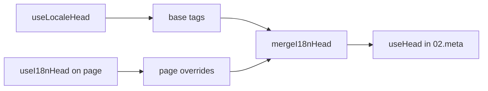

# Composable `useI18nHead`

`useI18nHead` позволяет настраивать i18n SEO-теги **для каждой страницы** без пользовательского meta-плагина. При `meta: true` модуль объединяет ваш ввод поверх вывода [`useLocaleHead`](/api/composables/use-locale-head).

Типичные сценарии:

- **CMS / статьи блога** — только некоторые локали переведены; альтернативные URL отличаются по языку (разные slug'и или пути).
- **Динамический canonical** — канонический URL должен совпадать с URL статьи из API, а не с `$switchLocalePath`.
- **Дополнительный Open Graph** — `og:title`, `og:description`, `og:image` вместе с автоматически сгенерированными `og:locale` / `og:url`.
- **Частичный контроль** — сохранить сгенерированный модулем canonical и `og:url`, но заменить только `hreflang` и `og:locale:alternate`.

---

## Сигнатура

{/* generated:symbol:useI18nHead — do not edit; run `pnpm run docs:generate` */}

```ts
useI18nHead(input?: MaybeRefOrGetter<I18nHeadInput | null>): { pageHead: any; resetPageHead: () => void }
```

Регистрация переопределений i18n SEO head-тегов на уровне страницы.
Объединяется поверх вывода `useLocaleHead` плагином `02.meta`.

| Параметр | Тип | Описание |
| --- | --- | --- |
| `input` *(необязательный)* | `MaybeRefOrGetter<I18nHeadInput \| null>` |  |

{/* /generated:symbol:useI18nHead */}

## Как это встраивается в конвейер



Вы вызываете `useI18nHead` в компоненте страницы. Плагин `02.meta` применяет переопределения после каждого `updateMeta()` (смена маршрута, `$setI18nRouteParams`, `page:finish` на клиенте).

---

## Пример 1 — Статья с переводами только в некоторых локалях

Распространённый паттерн: API возвращает, какие локали существуют, и их абсолютные или относительные URL.

```ts
interface Article {
  title: string
  slug: string
  /** Locale code → page URL (absolute or site-relative) */
  locales: Record<string, string>
}
```

```vue
<script setup lang="ts">
const route = useRoute()
const { data: article } = await useFetch<Article>(`/api/articles/${route.params.slug}`)

const localeCodes = computed(() => Object.keys(article.value?.locales ?? {}))

useI18nHead(() => {
  if (!article.value) return null

  return {
    meta: [
      { property: 'og:title', content: article.value.title },
      { property: 'og:type', content: 'article' },
    ],
    replace: {
      hreflang: localeCodes.value.map((locale) => ({
        rel: 'alternate',
        hreflang: locale,
        href: article.value!.locales[locale]!,
      })),
      ogAlternates: localeCodes.value,
    },
  }
})
</script>
```

`ogAlternates` принимает **коды локалей** из вашей конфигурации `i18n.locales`. Значения для `og:locale:alternate` разрешаются через `locale.og` или `iso` (формат Open Graph `en_US`).

---

## Пример 2 — Статья с slug'ами для каждой локали (`$defineI18nRoute` + `$setI18nRouteParams`)

Когда URL строятся из шаблонов локализованных маршрутов и динамических параметров:

```vue
<script setup lang="ts">
const { $defineI18nRoute, $setI18nRouteParams } = useNuxtApp()
const route = useRoute()

const { data: article } = await useFetch(`/api/articles/${route.params.slug}`)

$defineI18nRoute({
  localeRoutes: {
    en: '/blog/[slug]',
    de: '/de/blog/[slug]',
    fr: '/fr/blog/[slug]',
  },
})

if (article.value) {
  $setI18nRouteParams({
    en: { slug: article.value.slugEn },
    de: { slug: article.value.slugDe },
    fr: { slug: article.value.slugFr },
  })

  const availableLocales = article.value.availableLocales as string[]

  useI18nHead({
    meta: [{ property: 'og:title', content: article.value.title }],
    replace: {
      hreflang: availableLocales.map((locale) => ({
        rel: 'alternate',
        hreflang: locale,
        href: article.value!.urls[locale],
      })),
      ogAlternates: availableLocales,
    },
  })
}
</script>
```

Сгенерированные модулем альтернативы будут перечислять **все** настроенные локали. `replace.hreflang` ограничивает теги теми локалями, у которых действительно есть перевод.

---

## Пример 3 — Пользовательский `x-default` для URL статьи в локали по умолчанию

По умолчанию `x-default` указывает на URL локали по умолчанию из `$switchLocalePath`. Для статей направьте его на URL перевода в локали по умолчанию:

```vue
<script setup lang="ts">
const { $defaultLocale } = useNuxtApp()
const article = await loadArticle()

const defaultLocale = $defaultLocale() ?? 'en'
const defaultHref = article.locales[defaultLocale]

useI18nHead({
  replace: {
    hreflang: Object.entries(article.locales).map(([locale, href]) => ({
      rel: 'alternate',
      hreflang: locale,
      href,
    })),
    xDefault: defaultHref ? { rel: 'alternate', hreflang: 'x-default', href: defaultHref } : false,
    ogAlternates: Object.keys(article.locales),
  },
})
</script>
```

---

## Пример 4 — Замена canonical и `og:url` из данных API

Когда canonical должен соответствовать URL, предоставленному CMS (мультидоменный, пользовательский путь или готовый абсолютный URL):

```vue
<script setup lang="ts">
const article = await loadArticle()
const canonical = article.canonicalUrl // e.g. https://www.example.com/en/blog/my-post

useI18nHead({
  replace: {
    canonical,
    ogUrl: canonical,
    hreflang: buildAlternateLinks(article),
    ogAlternates: Object.keys(article.locales),
  },
  meta: [
    { property: 'og:title', content: article.title },
    { name: 'description', content: article.excerpt },
  ],
})
</script>
```

---

## Пример 5 — Сохранить авто canonical / `og:url`, заменить только альтернативы

Если `$switchLocalePath` + `$setI18nRouteParams` уже дают корректный canonical и `og:url`, замените только discovery-теги:

```vue
<script setup lang="ts">
const article = await loadArticle()

useI18nHead({
  replace: {
    hreflang: buildAlternateLinks(article),
    ogAlternates: Object.keys(article.locales),
  },
})
</script>
```

---

## Пример 6 — Полный head для страницы деталей контента (meta + links)

Паттерн, аналогичный разделению «meta страницы» и «альтернативных ссылок» на отдельные хелперы — объединённый в один вызов:

```vue
<script setup lang="ts">
const article = await loadArticle()
const alternates = Object.entries(article.locales).map(([locale, href]) => ({
  rel: 'alternate' as const,
  hreflang: locale,
  href: normalizeSeoUrl(href), // strip ?query and #hash if needed
}))

useI18nHead({
  meta: [
    { property: 'og:title', content: article.title },
    { property: 'og:description', content: article.description },
    { property: 'og:image', content: article.imageUrl },
    { name: 'twitter:card', content: 'summary_large_image' },
    { name: 'twitter:title', content: article.title },
  ],
  replace: {
    canonical: article.canonicalUrl,
    ogUrl: article.canonicalUrl,
    hreflang: alternates,
    ogAlternates: Object.keys(article.locales),
  },
})
</script>
```

```ts
/** Remove query and hash — useful when CMS URLs must be clean for SEO */
function normalizeSeoUrl(href: string): string {
  try {
    const url = new URL(href, 'https://placeholder.local')
    url.search = ''
    url.hash = ''
    return href.startsWith('http') ? url.href : `${url.pathname}`
  } catch {
    return href.split(/[?#]/)[0] ?? href
  }
}
```

---

## Пример 7 — Два типа контента, один паттерн (новости vs руководства)

Одинаковая форма API, разные имена маршрутов — переиспользуйте небольшой хелпер:

```ts
// composables/useArticleHead.ts
import type { I18nHeadInput } from '@i18n-micro/types'

interface LocalizedContent {
  title: string
  locales: Record<string, string>
  canonicalUrl?: string
}

export function buildArticleHead(content: LocalizedContent): I18nHeadInput {
  const localeCodes = Object.keys(content.locales)
  const canonical = content.canonicalUrl ?? content.locales.en

  return {
    meta: [{ property: 'og:title', content: content.title }],
    replace: {
      canonical,
      ogUrl: canonical,
      hreflang: localeCodes.map((locale) => ({
        rel: 'alternate',
        hreflang: locale,
        href: content.locales[locale]!,
      })),
      ogAlternates: localeCodes,
    },
  }
}
```

```vue
<!-- pages/blog/[slug].vue -->
<script setup lang="ts">
const article = await loadArticle()
useI18nHead(buildArticleHead(article))
</script>
```

```vue
<!-- pages/guides/[slug].vue -->
<script setup lang="ts">
const guide = await loadGuide()
useI18nHead(buildArticleHead(guide))
</script>
```

---

## Пример 8 — Отключить встроенные альтернативы, передать свой список

Эквивалентно отключению генератора hreflang модуля и передаче пользовательского списка (без дублирующихся наборов альтернатив):

```vue
<script setup lang="ts">
const article = await loadArticle()

useI18nHead({
  disable: ['hreflang', 'x-default', 'og-alternates'],
  link: Object.entries(article.locales).map(([locale, href]) => ({
    rel: 'alternate',
    hreflang: locale,
    href,
  })),
  replace: {
    ogAlternates: Object.keys(article.locales),
  },
})
</script>
```

Или предпочтите `replace.hreflang` без `disable` — он заменяет все `rel="alternate"` ссылки за один шаг.

---

## Пример 9 — Лендинг: только дополнительный OG, сохранить все i18n-теги

```vue
<script setup lang="ts">
const { t } = useI18n()

useI18nHead({
  meta: [
    { property: 'og:title', content: t('landing.ogTitle') },
    { property: 'og:description', content: t('landing.ogDescription') },
  ],
})
</script>
```

---

## Пример 10 — Страница продукта: отключить hreflang для эксперимента с одной локалью

```vue
<script setup lang="ts">
useI18nHead({
  disable: ['hreflang', 'x-default'],
  // canonical, og:locale, og:url still generated
})
</script>
```

---

## Пример 11 — Реактивные обновления после клиентской загрузки

```vue
<script setup lang="ts">
const article = ref<Article | null>(null)

onMounted(async () => {
  article.value = await $fetch('/api/articles/latest')
})

useI18nHead(() => {
  if (!article.value) return null
  return {
    meta: [{ property: 'og:title', content: article.value.title }],
    replace: {
      hreflang: Object.entries(article.value.locales).map(([locale, href]) => ({
        rel: 'alternate',
        hreflang: locale,
        href,
      })),
    },
  }
})
</script>
```

Head обновляется при `page:finish` и когда меняется состояние `pageHead`.

---

## Пример 12 — HTTPS origin за обратным прокси

Если раньше вы использовали composable «public origin» для абсолютных URL canonical / alternate, используйте конфигурацию модуля:

```ts
// nuxt.config.ts
export default defineNuxtConfig({
  i18n: {
    meta: true,
    // undefined = origin from current request (multi-domain friendly)
    metaBaseUrl: undefined,
    metaTrustForwardedHost: true,
    metaTrustForwardedProto: true,
  },
})
```

Затем передавайте **пути или полные URL** в `replace.hreflang` / `replace.canonical`. Модуль использует `useRequestURL` с `X-Forwarded-Host` / `X-Forwarded-Proto` на SSR.

---

## Справочник API

### `meta`

Дополнительные `<meta>`-теги. Дедуплицируются по `id`, `property` или `name`.

### `link`

Дополнительные `<link>`-теги. Дедуплицируются по `id` или `rel` + `hreflang`.

### `htmlAttrs`

Объединяется с атрибутами `<html>` из `useLocaleHead` (`lang`, `dir`).

### `replace`

| Ключ           | Тип                       | Эффект                                              |
| -------------- | ------------------------- | --------------------------------------------------- |
| `canonical`    | `string \| false`         | Заменить или удалить canonical-ссылку               |
| `hreflang`     | `I18nHeadLink[] \| false` | Заменить или удалить все `rel="alternate"` ссылки   |
| `xDefault`     | `I18nHeadLink \| false`   | Заменить или удалить `hreflang="x-default"`         |
| `ogLocale`     | `string \| false`         | Заменить или удалить `og:locale`                    |
| `ogUrl`        | `string \| false`         | Заменить или удалить `og:url`                       |
| `ogAlternates` | `string[] \| false`       | Пересобрать `og:locale:alternate` для кодов локалей |

### `disable`

| Значение        | Удаляет                                        |
| --------------- | ---------------------------------------------- |
| `hreflang`      | Альтернативные ссылки локалей (не `x-default`) |
| `x-default`     | Ссылку `hreflang="x-default"`                  |
| `canonical`     | Canonical-ссылку                               |
| `og`            | `og:locale` и `og:url`                         |
| `og-alternates` | Теги `og:locale:alternate`                     |
| `html`          | `lang` / `dir` на `<html>`                     |

---

## `useLocaleHead` vs `useI18nHead`

| Composable      | Область                  | Когда использовать                          |
| --------------- | ------------------------ | ------------------------------------------- |
| `useLocaleHead` | Глобальный / ручной head | `meta: false`, полная кастомная `useHead`   |
| `useI18nHead`   | Переопределения страниц  | `meta: true`, настройка конкретных страниц  |

При `meta: true` вам **не** нужен `useLocaleHead` на страницах, которые используют только `useI18nHead`.

---

## Миграция с пользовательского i18n head-плагина

Многие проекты поддерживают пользовательский плагин, который:

- объединяет альтернативные ссылки для страницы из общего состояния;
- фильтрует дублирующиеся региональные записи `hreflang`;
- нормализует значения `og:locale`;
- убирает query-строки из SEO URL.

Вы можете заменить это на `useI18nHead` на каждой странице контента и значения по умолчанию модуля.

| Прежний подход                                              | С `useI18nHead`                                       |
| ----------------------------------------------------------- | ----------------------------------------------------- |
| Общее состояние + «какие локали существуют для этой статьи» | `replace: \{ ogAlternates: localeCodes \}`             |
| Отдельный хелпер, строящий `rel="alternate"` ссылки         | `replace: \{ hreflang: links \}`                       |
| Пользовательский плагин, объединяющий состояние в head      | Встроенное объединение в `02.meta`                    |
| Пользовательский «public origin» для абсолютных URL         | `metaBaseUrl` + forwarded-заголовки (см. пример 12)   |
| Короткий `og:locale` (`en` вместо `en_US`)                  | Задайте `locale.og` или используйте `iso` → `en_US`   |

**`hreflang` из `iso`:** каждая локаль генерирует одну альтернативу с `hreflang = iso || code`. Routing `code` никогда не используется, когда задано `iso` (избегает некорректных тегов вроде `hreflang="mx"`). Включите fallback'и на голый язык (`es-ES` → также `es`) через `hreflangBaseLanguage: true` — вычисляется из `iso`, не из `code`. Для полностью пользовательских списков используйте `replace.hreflang`.

**JSON-LD:** `useI18nHead` не генерирует структурированные данные. Продолжайте использовать `useHead(\{ script: [...] \})` или отдельный JSON-LD хелпер параллельно с ним.

---

## См. также

- [Руководство по SEO](/guides/seo) — автоматическая генерация meta и переопределения на уровне страницы
- [`useLocaleHead`](/api/composables/use-locale-head) — низкоуровневый head API
