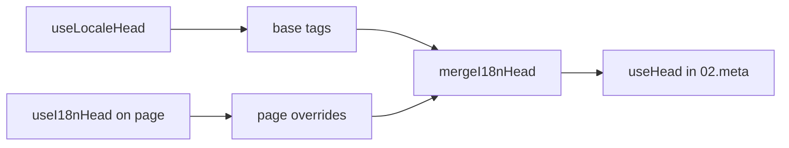

# Композабл `useI18nHead`

`useI18nHead` позволяет настраивать i18n SEO-теги **постранично** без своего meta-плагина. При `meta: true` модуль объединяет ваш вход поверх вывода [`useLocaleHead`](/api/composables/use-locale-head).

Типичные случаи:

- **CMS / статьи блога** — переведены не все локали; альтернативные URL отличаются по языкам (разные слаги или пути).
- **Динамический canonical** — canonical URL должен совпадать с URL статьи из API, а не с `$switchLocalePath`.
- **Дополнительный Open Graph** — `og:title`, `og:description`, `og:image` рядом с автосгенерированными `og:locale` / `og:url`.
- **Частичный контроль** — оставить canonical и `og:url` от модуля, но заменить только `hreflang` и `og:locale:alternate`.

---

## Сигнатура

{/* generated:symbol:useI18nHead — do not edit; run `pnpm run docs:generate` */}

```ts
useI18nHead(input?: MaybeRefOrGetter<I18nHeadInput | null>): { pageHead: any; resetPageHead: () => void }
```

Регистрирует постраничные переопределения i18n SEO head-тегов.
Объединяется поверх вывода `useLocaleHead` плагином `02.meta`.

| Параметр | Тип | Описание |
| --- | --- | --- |
| `input` *(опционально)* | `MaybeRefOrGetter<I18nHeadInput \| null>` |  |

{/* /generated:symbol:useI18nHead */}

## Как это встраивается в пайплайн



Вы вызываете `useI18nHead` в компоненте страницы. Плагин `02.meta` применяет переопределения после каждого `updateMeta()` (смена маршрута, `$setI18nRouteParams`, `page:finish` на клиенте).

---

## Пример 1 — Статья с переводами только в некоторых локалях

Типичный паттерн: API возвращает, какие локали существуют, и их абсолютные или относительные URL.

```ts
interface Article {
  title: string
  slug: string
  /** Locale code → page URL (absolute or site-relative) */
  locales: Record<string, string>
}
```

```vue
<script setup lang="ts">
const route = useRoute()
const { data: article } = await useFetch<Article>(`/api/articles/${route.params.slug}`)

const localeCodes = computed(() => Object.keys(article.value?.locales ?? {}))

useI18nHead(() => {
  if (!article.value) return null

  return {
    meta: [
      { property: 'og:title', content: article.value.title },
      { property: 'og:type', content: 'article' },
    ],
    replace: {
      hreflang: localeCodes.value.map((locale) => ({
        rel: 'alternate',
        hreflang: locale,
        href: article.value!.locales[locale]!,
      })),
      ogAlternates: localeCodes.value,
    },
  }
})
</script>
```

`ogAlternates` принимает **коды локалей** из вашей конфигурации `i18n.locales`. Значения для `og:locale:alternate` разрешаются через `locale.og` или `iso` (формат Open Graph `en_US`).

---

## Пример 2 — Статья со слагами на локаль (`$defineI18nRoute` + `$setI18nRouteParams`)

Когда URL строятся из локализованных шаблонов маршрутов и динамических параметров:

```vue
<script setup lang="ts">
const { $defineI18nRoute, $setI18nRouteParams } = useNuxtApp()
const route = useRoute()

const { data: article } = await useFetch(`/api/articles/${route.params.slug}`)

$defineI18nRoute({
  localeRoutes: {
    en: '/blog/[slug]',
    de: '/de/blog/[slug]',
    fr: '/fr/blog/[slug]',
  },
})

if (article.value) {
  $setI18nRouteParams({
    en: { slug: article.value.slugEn },
    de: { slug: article.value.slugDe },
    fr: { slug: article.value.slugFr },
  })

  const availableLocales = article.value.availableLocales as string[]

  useI18nHead({
    meta: [{ property: 'og:title', content: article.value.title }],
    replace: {
      hreflang: availableLocales.map((locale) => ({
        rel: 'alternate',
        hreflang: locale,
        href: article.value!.urls[locale],
      })),
      ogAlternates: availableLocales,
    },
  })
}
</script>
```

Стандартно модуль перечислит **все** сконфигурированные локали. `replace.hreflang` ограничивает теги только теми локалями, где реально есть перевод.

---

## Пример 3 — Свой `x-default` для URL статьи в локали по умолчанию

По умолчанию `x-default` указывает на URL локали по умолчанию из `$switchLocalePath`. Для статей направляйте его на URL перевода локали по умолчанию:

```vue
<script setup lang="ts">
const { $defaultLocale } = useNuxtApp()
const article = await loadArticle()

const defaultLocale = $defaultLocale() ?? 'en'
const defaultHref = article.locales[defaultLocale]

useI18nHead({
  replace: {
    hreflang: Object.entries(article.locales).map(([locale, href]) => ({
      rel: 'alternate',
      hreflang: locale,
      href,
    })),
    xDefault: defaultHref ? { rel: 'alternate', hreflang: 'x-default', href: defaultHref } : false,
    ogAlternates: Object.keys(article.locales),
  },
})
</script>
```

---

## Пример 4 — Замена canonical и `og:url` данными из API

Когда canonical должен совпадать с URL, предоставленным CMS (мультидоменный сетап, кастомный путь или заранее построенный абсолютный URL):

```vue
<script setup lang="ts">
const article = await loadArticle()
const canonical = article.canonicalUrl // e.g. https://www.example.com/en/blog/my-post

useI18nHead({
  replace: {
    canonical,
    ogUrl: canonical,
    hreflang: buildAlternateLinks(article),
    ogAlternates: Object.keys(article.locales),
  },
  meta: [
    { property: 'og:title', content: article.title },
    { name: 'description', content: article.excerpt },
  ],
})
</script>
```

---

## Пример 5 — Оставить авто-canonical / `og:url`, заменить только альтернативы

Если `$switchLocalePath` + `$setI18nRouteParams` уже выдают корректные canonical и `og:url`, замените только теги обнаружения:

```vue
<script setup lang="ts">
const article = await loadArticle()

useI18nHead({
  replace: {
    hreflang: buildAlternateLinks(article),
    ogAlternates: Object.keys(article.locales),
  },
})
</script>
```

---

## Пример 6 — Полный head для страницы контента (meta + link'и)

Паттерн, похожий на разделение «page meta» и «alternate links» на отдельные хелперы, — объединён в один вызов:

```vue
<script setup lang="ts">
const article = await loadArticle()
const alternates = Object.entries(article.locales).map(([locale, href]) => ({
  rel: 'alternate' as const,
  hreflang: locale,
  href: normalizeSeoUrl(href), // strip ?query and #hash if needed
}))

useI18nHead({
  meta: [
    { property: 'og:title', content: article.title },
    { property: 'og:description', content: article.description },
    { property: 'og:image', content: article.imageUrl },
    { name: 'twitter:card', content: 'summary_large_image' },
    { name: 'twitter:title', content: article.title },
  ],
  replace: {
    canonical: article.canonicalUrl,
    ogUrl: article.canonicalUrl,
    hreflang: alternates,
    ogAlternates: Object.keys(article.locales),
  },
})
</script>
```

```ts
/** Remove query and hash — useful when CMS URLs must be clean for SEO */
function normalizeSeoUrl(href: string): string {
  try {
    const url = new URL(href, 'https://placeholder.local')
    url.search = ''
    url.hash = ''
    return href.startsWith('http') ? url.href : `${url.pathname}`
  } catch {
    return href.split(/[?#]/)[0] ?? href
  }
}
```

---

## Пример 7 — Два типа контента, один паттерн (новости vs гайды)

Один и тот же формат API, разные имена маршрутов — переиспользуйте маленький хелпер:

```ts
// composables/useArticleHead.ts
import type { I18nHeadInput } from '@i18n-micro/types'

interface LocalizedContent {
  title: string
  locales: Record<string, string>
  canonicalUrl?: string
}

export function buildArticleHead(content: LocalizedContent): I18nHeadInput {
  const localeCodes = Object.keys(content.locales)
  const canonical = content.canonicalUrl ?? content.locales.en

  return {
    meta: [{ property: 'og:title', content: content.title }],
    replace: {
      canonical,
      ogUrl: canonical,
      hreflang: localeCodes.map((locale) => ({
        rel: 'alternate',
        hreflang: locale,
        href: content.locales[locale]!,
      })),
      ogAlternates: localeCodes,
    },
  }
}
```

```vue
<!-- pages/blog/[slug].vue -->
<script setup lang="ts">
const article = await loadArticle()
useI18nHead(buildArticleHead(article))
</script>
```

```vue
<!-- pages/guides/[slug].vue -->
<script setup lang="ts">
const guide = await loadGuide()
useI18nHead(buildArticleHead(guide))
</script>
```

---

## Пример 8 — Отключить встроенные альтернативы и передать свой список

Эквивалентно отключению генератора hreflang модуля и передаче собственного списка (без дублирования наборов альтернатив):

```vue
<script setup lang="ts">
const article = await loadArticle()

useI18nHead({
  disable: ['hreflang', 'x-default', 'og-alternates'],
  link: Object.entries(article.locales).map(([locale, href]) => ({
    rel: 'alternate',
    hreflang: locale,
    href,
  })),
  replace: {
    ogAlternates: Object.keys(article.locales),
  },
})
</script>
```

Либо используйте `replace.hreflang` без `disable` — он одним шагом заменяет все ссылки `rel="alternate"`.

---

## Пример 9 — Лендинг: только дополнительный OG, все i18n-теги оставляем

```vue
<script setup lang="ts">
const { t } = useI18n()

useI18nHead({
  meta: [
    { property: 'og:title', content: t('landing.ogTitle') },
    { property: 'og:description', content: t('landing.ogDescription') },
  ],
})
</script>
```

---

## Пример 10 — Страница товара: отключаем hreflang для эксперимента на одной локали

```vue
<script setup lang="ts">
useI18nHead({
  disable: ['hreflang', 'x-default'],
  // canonical, og:locale, og:url still generated
})
</script>
```

---

## Пример 11 — Реактивные обновления после клиентского fetch'а

```vue
<script setup lang="ts">
const article = ref<Article | null>(null)

onMounted(async () => {
  article.value = await $fetch('/api/articles/latest')
})

useI18nHead(() => {
  if (!article.value) return null
  return {
    meta: [{ property: 'og:title', content: article.value.title }],
    replace: {
      hreflang: Object.entries(article.value.locales).map(([locale, href]) => ({
        rel: 'alternate',
        hreflang: locale,
        href,
      })),
    },
  }
})
</script>
```

Head обновляется на `page:finish` и при изменении состояния `pageHead`.

---

## Пример 12 — HTTPS origin за reverse-прокси

Если раньше вы получали композабл «публичного origin» для canonical / абсолютных альтернатив, вместо этого используйте конфигурацию модуля:

```ts
// nuxt.config.ts
export default defineNuxtConfig({
  i18n: {
    meta: true,
    // undefined = origin from current request (multi-domain friendly)
    metaBaseUrl: undefined,
    metaTrustForwardedHost: true,
    metaTrustForwardedProto: true,
  },
})
```

Затем передавайте в `replace.hreflang` / `replace.canonical` **пути или полные URL**. Модуль использует `useRequestURL` c `X-Forwarded-Host` / `X-Forwarded-Proto` на SSR.

---

## Справочник API

### `meta`

Дополнительные теги `<meta>`. Дедупликация по `id`, `property` или `name`.

### `link`

Дополнительные теги `<link>`. Дедупликация по `id` или `rel` + `hreflang`.

### `htmlAttrs`

Мёржатся в атрибуты `<html>` из `useLocaleHead` (`lang`, `dir`).

### `replace`

| Ключ           | Тип                       | Эффект                                         |
| -------------- | ------------------------- | ---------------------------------------------- |
| `canonical`    | `string \| false`         | Заменить или удалить canonical-ссылку          |
| `hreflang`     | `I18nHeadLink[] \| false` | Заменить или удалить все ссылки `rel="alternate"` |
| `xDefault`     | `I18nHeadLink \| false`   | Заменить или удалить `hreflang="x-default"`    |
| `ogLocale`     | `string \| false`         | Заменить или удалить `og:locale`               |
| `ogUrl`        | `string \| false`         | Заменить или удалить `og:url`                  |
| `ogAlternates` | `string[] \| false`       | Пересобрать `og:locale:alternate` по кодам локалей |

### `disable`

| Значение        | Удаляет                                  |
| --------------- | ---------------------------------------- |
| `hreflang`      | Альтернативные ссылки локалей (не `x-default`) |
| `x-default`     | Ссылку `hreflang="x-default"`            |
| `canonical`     | Canonical-ссылку                         |
| `og`            | `og:locale` и `og:url`                   |
| `og-alternates` | Теги `og:locale:alternate`               |
| `html`          | `lang` / `dir` на `<html>`               |

---

## `useLocaleHead` vs `useI18nHead`

| Композабл       | Область               | Когда использовать                                |
| --------------- | -------------------- | ------------------------------------------------ |
| `useLocaleHead` | Глобальный / ручной head | `meta: false`, полностью свой `useHead`         |
| `useI18nHead`   | Постраничные переопределения | `meta: true`, кастомизация конкретных страниц |

При `meta: true` **не нужно** использовать `useLocaleHead` на страницах, которые ограничиваются `useI18nHead`.

---

## Миграция с собственного i18n head-плагина

Многие проекты сопровождают собственный плагин, который:

- мёржит постраничные альтернативные ссылки из общего state;
- фильтрует дублирующиеся региональные `hreflang`-записи;
- нормализует значения `og:locale`;
- вычищает query-строки из SEO URL.

Это можно заменить `useI18nHead` на каждой контентной странице и настройками модуля по умолчанию.

| Прежний подход                                       | С `useI18nHead`                                       |
| ----------------------------------------------------- | ---------------------------------------------------- |
| Общий state + «какие локали существуют для статьи»    | `replace: \{ ogAlternates: localeCodes \}`             |
| Отдельный хелпер, строящий ссылки `rel="alternate"`   | `replace: \{ hreflang: links \}`                       |
| Плагин, мёржащий page state в head                    | Встроенный merge в `02.meta`                         |
| Кастомный «публичный origin» для абсолютных URL       | `metaBaseUrl` + forwarded headers (см. Пример 12)   |
| Короткий `og:locale` (`en` вместо `en_US`)            | Установите `locale.og` или используйте `iso` → `en_US` (протокол OG) |

**`hreflang` из `iso`:** каждая локаль эмитит одну альтернативу с `hreflang = iso || code`. Роутинговый `code` никогда не используется, когда задан `iso` (это защищает от невалидных тегов вроде `hreflang="mx"`). Включить fallback на «голый» язык (`es-ES` → также `es`) можно через `hreflangBaseLanguage: true` — выводится из `iso`, а не из `code`. Для полностью кастомных списков используйте `replace.hreflang`.

**JSON-LD:** `useI18nHead` не генерирует структурированные данные. Держите `useHead(\{ script: [...] \})` или отдельный JSON-LD хелпер рядом.

---

## См. также

- [Руководство по SEO](/guides/seo) — автоматическая генерация мета и постраничные переопределения
- [`useLocaleHead`](/api/composables/use-locale-head) — низкоуровневое head API
