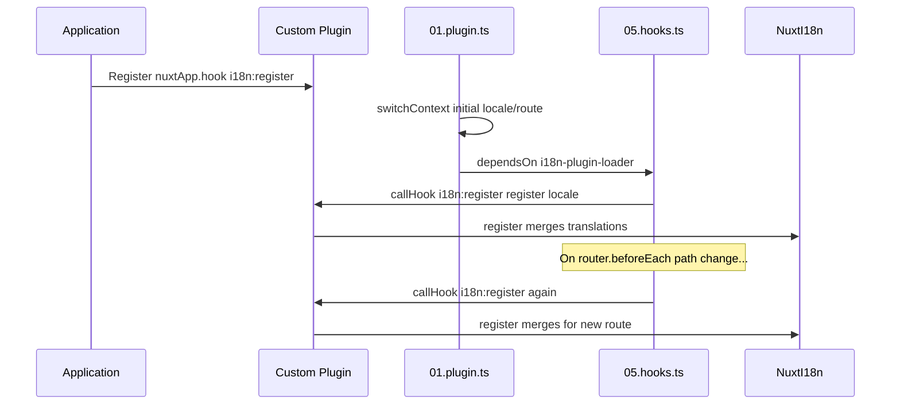

# 📢 События

## 🔄 `i18n:register`

Событие `i18n:register` в `Nuxt I18n Micro` позволяет динамически добавлять переводы в i18n-контекст вашего приложения, делая процесс интернационализации плавным и гибким. Это событие даёт возможность интегрировать новые переводы по мере необходимости, расширяя возможности локализации вашего приложения.

### 📝 Детали события

- **Назначение**:
  - Позволяет динамически включать дополнительные переводы в существующий набор для конкретной локали.

- **Payload**:
  - **`register`**:
    - Функция, предоставляемая событием, которая принимает два аргумента:
      - **`translations`** (`Translations`):
        - Объект, содержащий пары ключ-значение с переводами, организованные согласно интерфейсу `Translations`.
      - **`locale`** (`string`, необязательный):
        - Код локали (например, `'en'`, `'ru'`), для которой регистрируются переводы. По умолчанию используется локаль, предоставленная событием, если не указано иное.

- **Поведение**:
  - При срабатывании функция `register` объединяет новые переводы с текущим контекстом для указанной локали, обновляя доступные переводы во всём приложении.

### ⏱️ Когда срабатывает

Плагин хуков модуля (`05.hooks.ts`, `dependsOn: ['i18n-plugin-loader']`) вызывает `nuxtApp.callHook('i18n:register', …)`:

1. **Один раз при запуске** — после того, как основной i18n-плагин (`01.plugin.ts`) загрузил переводы для начального маршрута
2. **При навигации** — в `router.beforeEach` при изменении пути или при каждой навигации при `strategy: 'no_prefix'`

Регистрируйте свой обработчик в обычном плагине Nuxt через `nuxtApp.hook('i18n:register', …)`. Плагин хуков запускается после готовности загрузчика, поэтому ваш колбэк вызывается, когда переводы нужно расширить.

Установите `hooks: false` в `nuxt.config`, чтобы отключить автоматические вызовы `i18n:register` (см. [Конфигурация — `hooks`](/guides/configuration#hooks)).

### 💡 Пример использования

Следующий пример демонстрирует, как использовать событие `i18n:register` для динамического добавления переводов:

```typescript
nuxt.hook('i18n:register', async (register: (translations: unknown, locale?: string) => void, locale: string) => {
  register(
    {
      greeting: 'Hello',
      farewell: 'Goodbye',
    },
    locale,
  )
})
```

### 🛠️ Пояснение



- **Срабатывание события**:
  - Плагин хуков (`05.hooks.ts`) вызывает `i18n:register` после готовности основного загрузчика и при соответствующих навигациях.

- **Добавление переводов**:
  - В примере регистрируются английские переводы для `"greeting"` и `"farewell"`.
  - Функция `register` объединяет эти переводы с существующим набором для предоставленной локали.

### 🔗 Ключевые преимущества

- **Динамические обновления**:
  - Легко обновляйте или добавляйте переводы без необходимости повторного развёртывания всего приложения.

- **Гибкость локализации**:
  - Поддерживает корректировки локализации в реальном времени в зависимости от потребностей пользователя или приложения.

Используя событие `i18n:register`, вы можете гарантировать, что стратегия локализации вашего приложения остаётся гибкой и адаптивной, улучшая общий пользовательский опыт.

---

## 🛠️ Изменение переводов с помощью плагинов

Для динамического изменения переводов в вашем приложении Nuxt рекомендуется использовать плагины. Плагины предоставляют структурированный способ обработки обновлений локализации, особенно при работе с модулями или внешними файлами переводов.

### **Регистрация плагина**

Если вы используете модуль, зарегистрируйте плагин, где будут происходить изменения переводов, добавив его в конфигурацию модуля:

```javascript
addPlugin({
  src: resolve('./plugins/extend_locales'),
})
```

Это регистрирует плагин, расположенный в `./plugins/extend_locales`, который будет заниматься динамической загрузкой и регистрацией переводов.

### **Реализация плагина**

В плагине можно управлять изменениями локали. Вот пример реализации в плагине Nuxt:

```typescript
import { defineNuxtPlugin } from '#app'

export default defineNuxtPlugin(async (nuxtApp) => {
  // Function to load translations from JSON files and register them
  const loadTranslations = async (lang: string) => {
    try {
      const translations = await import(`../locales/${lang}.json`)
      return translations.default
    } catch (error) {
      console.error(`Error loading translations for language: ${lang}`, error)
      return null
    }
  }

  // Hook into the 'i18n:register' event to dynamically add translations
  // eslint-disable-next-line @typescript-eslint/ban-ts-comment
  // @ts-expect-error
  nuxtApp.hook('i18n:register', async (register: (translations: unknown, locale?: string) => void, locale: string) => {
    const translations = await loadTranslations(locale)
    if (translations) {
      register(translations, locale)
    }
  })
})
```

### 📝 Подробное пояснение

1. **Загрузка переводов**:

- Функция `loadTranslations` динамически импортирует файлы переводов на основе локали. Файлы должны находиться в директории `locales` и называться в соответствии с кодами локалей (например, `en.json`, `de.json`).
- При успешной загрузке возвращаются переводы; в противном случае логируется ошибка.

2. **Регистрация переводов**:

- Плагин подписывается на событие `i18n:register` с помощью `nuxtApp.hook`.
- Когда событие срабатывает, функция `register` вызывается с загруженными переводами и соответствующей локалью.
- Это объединяет новые переводы в i18n-контекст для указанной локали, обновляя доступные переводы во всём приложении.

### 🔗 Преимущества использования плагинов для изменения переводов

- **Разделение ответственности**:
  - Инкапсулирует логику локализации отдельно от основного кода приложения, упрощая управление и обслуживание.

- **Динамичность и масштабируемость**:
  - Динамически загружая и регистрируя переводы, вы можете обновлять контент без необходимости полного повторного развёртывания приложения, что особенно полезно для приложений с часто обновляемым или многоязычным контентом.

- **Повышенная гибкость локализации**:
  - Плагины позволяют изменять или расширять переводы по мере необходимости, обеспечивая более адаптивную и отзывчивую стратегию локализации, соответствующую предпочтениям пользователей или требованиям бизнеса.

Применяя этот подход, вы можете эффективно расширять и изменять локализацию вашего приложения через структурированный и поддерживаемый процесс с помощью плагинов, сохраняя интернационализацию адаптивной к меняющимся потребностям и улучшая общий пользовательский опыт.
