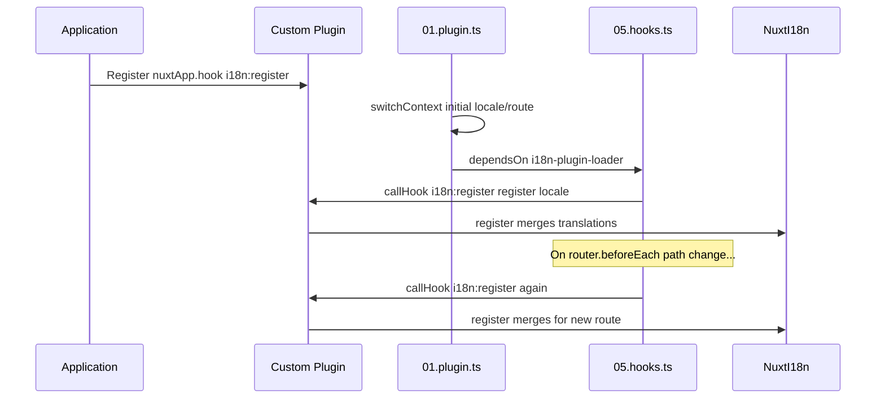

# 📢 События

## 🔄 `i18n:register`

Событие `i18n:register` в `Nuxt I18n Micro` позволяет динамически добавлять переводы в i18n-контекст приложения, делая процесс интернационализации простым и гибким. С его помощью можно подключать новые переводы по мере необходимости, расширяя возможности локализации.

### 📝 Детали события

- **Назначение**:
  - Позволяет динамически включать дополнительные переводы в существующий набор для конкретной локали.

- **Payload**:
  - **`register`**:
    - Функция, предоставляемая событием, принимает два аргумента:
      - **`translations`** (`Translations`):
        - Объект с парами ключ-значение, представляющий переводы, организованный по интерфейсу `Translations`.
      - **`locale`** (`string`, опционально):
        - Код локали (например, `'en'`, `'ru'`), для которой регистрируются переводы. По умолчанию используется локаль, переданная событием.

- **Поведение**:
  - При срабатывании функция `register` мёржит новые переводы в текущий контекст указанной локали, обновляя доступные переводы во всём приложении.

### ⏱️ Когда срабатывает

Плагин хуков модуля (`05.hooks.ts`, `dependsOn: ['i18n-plugin-loader']`) вызывает `nuxtApp.callHook('i18n:register', …)`:

1. **Один раз при старте** — после того как основной плагин i18n (`01.plugin.ts`) загрузил переводы для начального маршрута
2. **При навигации** — в `router.beforeEach` при изменении пути, либо при каждой навигации, если `strategy: 'no_prefix'`

Регистрируйте слушателя в обычном плагине Nuxt через `nuxtApp.hook('i18n:register', …)`. Плагин хуков работает после готовности загрузчика, поэтому ваш колбэк вызывается, когда переводы нужно расширить.

Установите `hooks: false` в `nuxt.config`, чтобы отключить автоматические вызовы `i18n:register` (см. [Конфигурация — `hooks`](/guides/configuration#hooks)).

### 💡 Пример использования

Пример ниже показывает, как использовать событие `i18n:register` для динамического добавления переводов:

```typescript
nuxt.hook('i18n:register', async (register: (translations: unknown, locale?: string) => void, locale: string) => {
  register(
    {
      greeting: 'Hello',
      farewell: 'Goodbye',
    },
    locale,
  )
})
```

### 🛠️ Пояснение



- **Срабатывание события**:
  - Плагин хуков (`05.hooks.ts`) вызывает `i18n:register` после готовности основного загрузчика и при подходящих навигациях.

- **Добавление переводов**:
  - В примере регистрируются английские переводы для `"greeting"` и `"farewell"`.
  - Функция `register` объединяет их с существующим набором для указанной локали.

### 🔗 Ключевые преимущества

- **Динамические обновления**:
  - Легко обновляйте или добавляйте переводы без пересборки всего приложения.

- **Гибкость локализации**:
  - Поддерживает изменения локализации в реальном времени в зависимости от нужд пользователя или приложения.

Используя событие `i18n:register`, вы можете сохранить стратегию локализации гибкой и адаптируемой, улучшая пользовательский опыт.

---

## 🛠️ Изменение переводов через плагины

Для динамического изменения переводов в приложении Nuxt рекомендуется использовать плагины. Плагины дают структурированный способ работы с обновлениями локализации, особенно если вы работаете с модулями или внешними файлами переводов.

### **Регистрация плагина**

Если вы используете модуль, зарегистрируйте плагин, в котором будут происходить изменения переводов, добавив его в конфигурацию вашего модуля:

```javascript
addPlugin({
  src: resolve('./plugins/extend_locales'),
})
```

Это регистрирует плагин по пути `./plugins/extend_locales`, который будет обрабатывать динамическую загрузку и регистрацию переводов.

### **Реализация плагина**

В плагине вы управляете модификациями локалей. Пример реализации плагина Nuxt:

```typescript
import { defineNuxtPlugin } from '#app'

export default defineNuxtPlugin(async (nuxtApp) => {
  // Function to load translations from JSON files and register them
  const loadTranslations = async (lang: string) => {
    try {
      const translations = await import(`../locales/${lang}.json`)
      return translations.default
    } catch (error) {
      console.error(`Error loading translations for language: ${lang}`, error)
      return null
    }
  }

  // Hook into the 'i18n:register' event to dynamically add translations
  // eslint-disable-next-line @typescript-eslint/ban-ts-comment
  // @ts-expect-error
  nuxtApp.hook('i18n:register', async (register: (translations: unknown, locale?: string) => void, locale: string) => {
    const translations = await loadTranslations(locale)
    if (translations) {
      register(translations, locale)
    }
  })
})
```

### 📝 Подробное объяснение

1. **Загрузка переводов**:

- Функция `loadTranslations` динамически импортирует файлы переводов на основе локали. Файлы должны находиться в каталоге `locales` и называться по кодам локалей (например, `en.json`, `de.json`).
- При успешной загрузке переводы возвращаются; иначе выводится сообщение об ошибке.

2. **Регистрация переводов**:

- Плагин подписывается на событие `i18n:register` через `nuxtApp.hook`.
- При его срабатывании функция `register` вызывается с загруженными переводами и соответствующей локалью.
- Это объединяет новые переводы с i18n-контекстом указанной локали, обновляя доступные переводы во всём приложении.

### 🔗 Преимущества плагинов для модификации переводов

- **Разделение ответственностей**:
  - Инкапсулируйте логику локализации отдельно от основного кода приложения, что упрощает управление и поддержку.

- **Динамичность и масштабируемость**:
  - Динамическая загрузка и регистрация переводов позволяют обновлять контент без полного пересборки приложения, что особенно полезно при часто меняющемся или многоязычном контенте.

- **Расширенная гибкость локализации**:
  - Плагины позволяют изменять или расширять переводы по мере необходимости, обеспечивая более адаптивную стратегию локализации, отвечающую предпочтениям пользователей или требованиям бизнеса.

Принимая этот подход, вы можете эффективно расширять и модифицировать локализацию приложения через структурированный и поддерживаемый процесс на плагинах, сохраняя интернационализацию адаптивной и улучшая пользовательский опыт.
