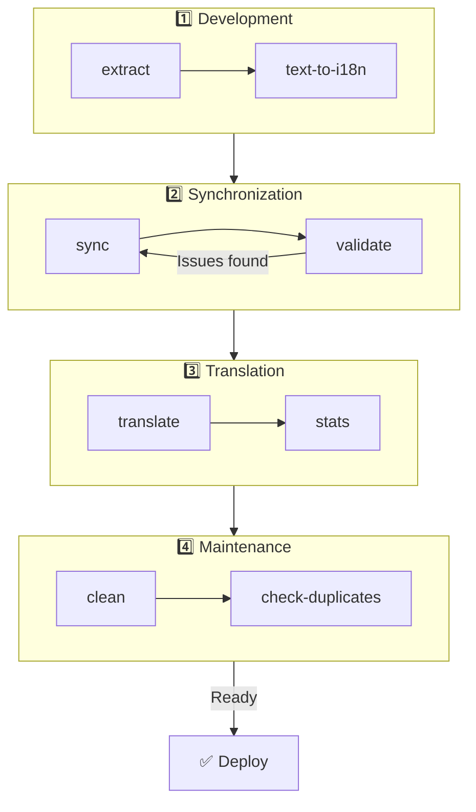

# 🌐 Руководство по nuxt-i18n-micro-cli

## 📖 Введение

`nuxt-i18n-micro-cli` — это инструмент командной строки, упрощающий локализацию и интернационализацию в проектах Nuxt.js, использующих модуль `nuxt-i18n-micro` (Nuxt I18n Micro). Он предоставляет утилиты для извлечения ключей переводов из вашего кода, управления файлами переводов, синхронизации переводов между локалями и автоматизации перевода через внешние сервисы.

Это руководство расскажет, как установить, настроить и использовать `nuxt-i18n-micro-cli`, чтобы эффективно управлять переводами проекта. Пакет на [npmjs.com](https://www.npmjs.com/package/nuxt-i18n-micro-cli).

## 🔧 Установка и настройка

### 📦 Установка nuxt-i18n-micro-cli

Установите глобально или как dev-зависимость в проекте Nuxt (рекомендуется для CI):

```bash
# global
npm install -g nuxt-i18n-micro-cli

# or per project
pnpm add -D nuxt-i18n-micro-cli
pnpm exec i18n-micro text-to-i18n --dryRun
```

Используйте **`nuxt-i18n-micro-cli` ≥ 2.1.1**, если проект использует каталог `app/` из Nuxt 4 (`app/pages`, `app/components`, …). Более старые версии CLI сканировали только `pages/` в корне проекта.

### 🛠 Инициализация в проекте

После установки вы можете запускать команды `i18n-micro` в каталоге проекта Nuxt.js.

Убедитесь, что проект настроен с `nuxt-i18n-micro` и имеет необходимую конфигурацию в `nuxt.config.ts` (или `nuxt.config.js`).

### 📄 Общие аргументы

- `--cwd`: Задаёт текущий рабочий каталог (по умолчанию `.`).
- `--logLevel`: Уровень логирования (`silent`, `info`, `verbose`).
- `--translationDir`: Каталог с JSON-файлами переводов (по умолчанию `locales`).

## 📊 Обзор рабочего процесса CLI



### Этапы рабочего процесса

| Этап            | Команды                     | Назначение                        |
| --------------- | --------------------------- | --------------------------------- |
| **Разработка**  | `extract`, `text-to-i18n`   | Поиск и извлечение ключей переводов |
| **Синхронизация** | `sync`, `validate`         | Обеспечение одинаковых ключей во всех локалях |
| **Перевод**     | `translate`, `stats`        | Автоматический перевод недостающих ключей |
| **Поддержка**   | `clean`, `check-duplicates` | Поддержание порядка в переводах   |

## 📋 Команды

### 🔄 Команда `text-to-i18n`

Пакет CLI: [`nuxt-i18n-micro-cli`](https://www.npmjs.com/package/nuxt-i18n-micro-cli)

**Описание**: Сканирует файлы Vue/TS/JS на предмет захардкоженных строк, видимых пользователю, заменяет их на `$t('...')` и мёржит новые ключи в JSON-файл переводов. Запускайте из **корня Nuxt-проекта** (где лежит `nuxt.config`).

**Использование**:

```bash
i18n-micro text-to-i18n [options]
```

**Опции**:

| Опция                   | По умолчанию      | Описание                                                              |
| ----------------------- | ----------------- | --------------------------------------------------------------------- |
| `--translationFile`     | `locales/en.json` | JSON-файл для новых ключей (относительно корня проекта).              |
| `--path`                | —                 | Обработать только один файл или каталог (например, `app/pages/about.vue`). |
| `--context`             | —                 | Префикс ключа (например, `auth` → `auth.*`).                          |
| `--dryRun`              | `false`           | Предпросмотр без записи файлов.                                       |
| `--verbose`             | `false`           | Расширенное логирование.                                              |
| `--interactive`         | `false`           | Подтверждать или редактировать каждый ключ перед применением.         |
| `--extractOnlyDirs`     | `plugins`         | Каталоги, где ключи извлекаются, но исходники **не** перезаписываются. |
| `--extractOnlyPatterns` | —                 | Glob-паттерны только для извлечения (например, `**/*.plugin.ts`).     |

**Пример**:

```bash
i18n-micro text-to-i18n --translationFile locales/en.json --context auth --dryRun
```

#### Какие папки сканируются?

<Info>
Начиная с CLI **v2.1.1**, `text-to-i18n` сканирует и классические корневые папки, и их эквиваленты в `app/*`. Запускайте команду из **корня проекта** — не делайте `cd app`.
</Info>

Собирает `*.vue`, `*.js` и `*.ts` в:

| Nuxt 3 (корень проекта) | Nuxt 4 (каталог `app/`)   |
| --------------------- | ------------------------- |
| `pages/`              | `app/pages/`              |
| `components/`         | `app/components/`         |
| `plugins/`            | `app/plugins/`            |
| `layouts/`            | `app/layouts/`            |

Другие папки (`server/`, `composables/`, `middleware/`, …) пропускаются, если только вы не используете `--path`. Для Nuxt 4 запускайте из корня проекта (не нужно `cd app`). Согласуйте `i18n.translationDir` с `--translationFile`, если это не `locales/`.

```bash
i18n-micro text-to-i18n --path app/pages
```

#### Как это работает

1. Собирает файлы из указанных каталогов (или из `--path`).
2. Заменяет литералы / текст шаблонов на `$t('generated.key')` (`plugins/` по умолчанию только извлекается).
3. Мёржит новые ключи в `--translationFile` без удаления существующих записей.

**Пример трансформаций**:

До:

```vue
<template>
  <div>
    <h1>Welcome to our site</h1>
    <p>Please sign in to continue</p>
  </div>
</template>
```

После:

```vue
<template>
  <div>
    <h1>{{ $t('pages.home.welcome_to_our_site') }}</h1>
    <p>{{ $t('pages.home.please_sign_in') }}</p>
  </div>
</template>
```

**Лучшие практики**: сначала dry-run; сделайте коммит перед полным запуском; согласуйте `--translationFile` с `i18n.translationDir` в `nuxt.config`; оставьте `--extractOnlyDirs plugins` для загрузочного кода.

**Ограничения**: отдельный npm-пакет (не идёт в комплекте с модулем); автоматически не читает `nuxt.config`; выводит `$t(...)`; сложные динамические строки могут потребовать `extract` / `search`.

### 📊 Команда `stats`

**Описание**: Команда `stats` показывает статистику переводов по локалям в проекте Nuxt.js. Помогает понять прогресс перевода: сколько ключей переведено по сравнению с общим числом.

**Использование**:

```bash
i18n-micro stats [options]
```

**Опции**:

- `--full`: Показать только сводную статистику по переводам (по умолчанию: `false`).

**Пример**:

```bash
i18n-micro stats --full
```

### 🌍 Команда `translate`

**Описание**: Команда `translate` автоматически переводит недостающие ключи через внешние сервисы перевода. Упрощает процесс перевода, задействуя API таких сервисов, как Google Translate, DeepL и др., для заполнения недостающих переводов.

**Использование**:

```bash
i18n-micro translate [options]
```

**Опции**:

- `--service`: Сервис перевода (например, `google`, `deepl`, `yandex`). Если не указан, команда спросит выбор.
- `--token`: API-ключ соответствующего сервиса. Если не указан, вас попросят его ввести.
- `--options`: Дополнительные опции сервиса в формате пар key:value, разделённых запятыми (например, `model:gpt-3.5-turbo,max_tokens:1000`).
- `--replace`: Перевести все ключи, заменив существующие переводы (по умолчанию: `false`).

**Пример**:

```bash
i18n-micro translate --service deepl --token YOUR_DEEPL_API_KEY
```

#### 🌐 Поддерживаемые сервисы перевода

Команда `translate` поддерживает несколько сервисов. Часть из них:

- **Google Translate** (`google`)
- **DeepL** (`deepl`)
- **Yandex Translate** (`yandex`)
- **OpenAI** (`openai`)
- **Azure Translator** (`azure`)
- **IBM Watson** (`ibm`)
- **Baidu Translate** (`baidu`)
- **LibreTranslate** (`libretranslate`)
- **MyMemory** (`mymemory`)
- **Lingva Translate** (`lingvatranslate`)
- **Papago** (`papago`)
- **Tencent Translate** (`tencent`)
- **Systran Translate** (`systran`)
- **Yandex Cloud Translate** (`yandexcloud`)
- **ModernMT** (`modernmt`)
- **Lilt** (`lilt`)
- **Unbabel** (`unbabel`)
- **Reverso Translate** (`reverso`)

#### ⚙️ Конфигурация сервисов

Некоторые сервисы требуют определённых настроек или API-ключей. При использовании `translate` укажите сервис и передайте требуемый `--token` (API-ключ) и дополнительные `--options` при необходимости.

Например:

```bash
i18n-micro translate --service openai --token YOUR_OPENAI_API_KEY --options openaiModel:gpt-3.5-turbo,max_tokens:1000
```

### 🛠️ Команда `extract`

**Описание**: Извлекает ключи переводов из кода и группирует их по областям.

**Использование**:

```bash
i18n-micro extract [options]
```

**Опции**:

- `--prod, -p`: Запуск в production-режиме.

**Пример**:

```bash
i18n-micro extract
```

### 🔄 Команда `sync`

**Описание**: Синхронизирует файлы переводов между локалями, следя, чтобы все локали имели одинаковые ключи.

**Использование**:

```bash
i18n-micro sync [options]
```

**Пример**:

```bash
i18n-micro sync
```

### ✅ Команда `validate`

**Описание**: Валидирует файлы переводов на предмет отсутствующих или лишних ключей по сравнению с эталонной локалью.

**Использование**:

```bash
i18n-micro validate [options]
```

**Пример**:

```bash
i18n-micro validate
```

### 🧹 Команда `clean`

**Описание**: Удаляет неиспользуемые ключи переводов из файлов переводов.

**Использование**:

```bash
i18n-micro clean [options]
```

**Пример**:

```bash
i18n-micro clean
```

### 📤 Команда `import`

**Описание**: Конвертирует PO-файлы обратно в JSON и сохраняет их в каталоге переводов.

**Использование**:

```bash
i18n-micro import [options]
```

**Опции**:

- `--potsDir`: Каталог с PO-файлами (по умолчанию: `pots`).

**Пример**:

```bash
i18n-micro import --potsDir pots
```

### 📥 Команда `export`

**Описание**: Экспортирует переводы в PO-файлы для внешнего управления переводами.

**Использование**:

```bash
i18n-micro export [options]
```

**Опции**:

- `--potsDir`: Каталог для сохранения PO-файлов (по умолчанию: `pots`).

**Пример**:

```bash
i18n-micro export --potsDir pots
```

### 🗂️ Команда `export-csv`

**Описание**: Команда `export-csv` экспортирует ключи и значения переводов из JSON-файлов, включая пути к файлам, в формат CSV. Полезно для команд, которые предпочитают работать с переводами в электронных таблицах.

**Использование**:

```bash
i18n-micro export-csv [options]
```

**Опции**:

- `--csvDir`: Каталог, куда будут сохранены CSV-файлы.
- `--delimiter`: Разделитель CSV (по умолчанию: `,`).

**Пример**:

```bash
i18n-micro export-csv --csvDir csv_files
```

### 📑 Команда `import-csv`

**Описание**: Команда `import-csv` импортирует данные переводов из CSV-файлов, обновляя соответствующие JSON-файлы. Полезно для массовых обновлений переводов из таблиц.

**Использование**:

```bash
i18n-micro import-csv [options]
```

**Опции**:

- `--csvDir`: Каталог с CSV-файлами для импорта.
- `--delimiter`: Разделитель, используемый в CSV (по умолчанию: `,`).

**Пример**:

```bash
i18n-micro import-csv --csvDir csv_files
```

### 🧾 Команда `diff`

**Описание**: Сравнивает файлы переводов между локалью по умолчанию и другими локалями в том же каталоге (включая подкаталоги). Команда выявляет отсутствующие ключи и их значения в локали по умолчанию по сравнению с другими локалями, что упрощает отслеживание прогресса и расхождений.

**Использование**:

```bash
i18n-micro diff [options]
```

**Пример**:

```bash
i18n-micro diff
```

### 🔍 Команда `check-duplicates`

**Описание**: Команда `check-duplicates` проверяет наличие повторяющихся значений переводов в каждой локали по всем файлам переводов, включая корневые и постраничные. Она следит, чтобы разные ключи внутри одного языка не имели одинаковых значений, помогая сохранять ясность и согласованность переводов.

**Использование**:

```bash
i18n-micro check-duplicates [options]
```

**Пример**:

```bash
i18n-micro check-duplicates
```

**Как это работает**:

- Команда проверяет и корневые, и постраничные файлы переводов для каждой локали.
- Если значение перевода встречается в нескольких местах (в корневых переводах или на разных страницах), отчёт покажет дубли вместе с файлом и ключом.
- Если дублей нет, команда подтверждает, что локаль свободна от дублирующихся значений.

Эта команда помогает следить, чтобы ключи имели уникальные значения, и предотвращает случайные повторения внутри одной локали.

### 🔄 Команда `replace-values`

**Описание**: Команда `replace-values` позволяет массово заменять значения переводов во всех локалях. Поддерживает простые текстовые замены и продвинутые замены через регулярные выражения (regex). Также можно использовать группы захвата в regex и ссылаться на них в строке замены, что удобно для сложных сценариев.

**Использование**:

```bash
i18n-micro replace-values [options]
```

**Опции**:

- `--search`: Текст или regex-паттерн для поиска в переводах. Обязательная опция.
- `--replace`: Текст замены. Обязательная опция.
- `--useRegex`: Использовать регулярное выражение (по умолчанию: `false`).

**Пример 1**: Простая замена

Заменить строку "Hello" на "Hi" во всех локалях:

```bash
i18n-micro replace-values --search "Hello" --replace "Hi"
```

**Пример 2**: Regex-замена

Включить regex и заменить любую строку, начинающуюся с "Hello" и цифр (например, "Hello123") на "Hi" во всех локалях:

```bash
i18n-micro replace-values --search "Hello\\d+" --replace "Hi" --useRegex
```

**Пример 3**: Использование групп захвата в regex

Используйте группы захвата, чтобы динамически подставить часть совпадения в строку замены. Например, замените "Hello [name]" на "Hi [name]", сохранив имя:

```bash
i18n-micro replace-values --search "Hello (\\w+)" --replace "Hi $1" --useRegex
```

В этом случае `$1` ссылается на первую группу захвата — часть `[name]` после "Hello". Замена сохранит имя из оригинала.

**Как это работает**:

- Команда просматривает все файлы переводов (глобальные и постраничные).
- При совпадении по строке или паттерну заменяет найденный текст на строку замены.
- При regex-поиске можно использовать группы захвата в строке замены через `$1`, `$2` и т. д.
- Все изменения логируются, показывая путь к файлу, ключ перевода и состояние до/после.

**Логирование**:
Для каждой замены логируется:

- Локаль и путь к файлу
- Изменяемый ключ перевода
- Старое и новое значение
- При regex с группами захвата — сопоставления и то, как они были заменены

Это позволяет точно отслеживать, где и что было изменено, и вести историю правок в файлах переводов.

## 🛠 Примеры

- **Извлечение переводов**:

  ```bash
  i18n-micro extract
  ```

- **Перевод недостающих ключей через Google Translate**:

  ```bash
  i18n-micro translate --service google --token YOUR_GOOGLE_API_KEY
  ```

- **Перевод всех ключей с заменой существующих**:

  ```bash
  i18n-micro translate --service deepl --token YOUR_DEEPL_API_KEY --replace
  ```

- **Валидация файлов переводов**:

  ```bash
  i18n-micro validate
  ```

- **Очистка неиспользуемых ключей**:

  ```bash
  i18n-micro clean
  ```

- **Синхронизация файлов переводов**:

  ```bash
  i18n-micro sync
  ```

## ⚙️ Руководство по конфигурации

`nuxt-i18n-micro-cli` полагается на вашу i18n-конфигурацию Nuxt.js в `nuxt.config.ts` (или `nuxt.config.js`). Убедитесь, что модуль `nuxt-i18n-micro` установлен и настроен.

### 🔑 Пример nuxt.config.js

```ts
export default defineNuxtConfig({
  modules: ['nuxt-i18n-micro'],
  i18n: {
    locales: [
      { code: 'en', iso: 'en-US' },
      { code: 'fr', iso: 'fr-FR' },
    ],
    defaultLocale: 'en',
    fallbackLocale: 'en',
    translationDir: 'locales', // or 'app/locales' for Nuxt 4 colocation
  },
})
```

Убедитесь, что `translationDir` совпадает с каталогом, используемым `nuxt-i18n-micro-cli` (по умолчанию `locales`).

## 📝 Лучшие практики

### 🔑 Единообразное именование ключей

Держите ключи переводов согласованными и описательными, чтобы избежать путаницы и дублирования.

### 🧹 Регулярное обслуживание

Регулярно запускайте команду `clean`, чтобы удалять неиспользуемые ключи и держать файлы переводов чистыми.

### 🛠 Автоматизируйте процесс перевода

Встраивайте команды `nuxt-i18n-micro-cli` в ваш рабочий процесс или CI/CD-пайплайн, чтобы автоматизировать извлечение, перевод, валидацию и синхронизацию файлов переводов.

### 🛡️ Защищайте API-ключи

Если сервисы перевода требуют API-ключей, храните их в безопасности и не коммитьте в систему контроля версий. Используйте переменные окружения или менеджеры секретов.

## 📞 Поддержка и участие

Если вы столкнулись с проблемами или у вас есть предложения по улучшению, участвуйте в развитии проекта или откройте issue в репозитории.

---

Следуя этому руководству, вы сможете эффективно управлять переводами в проекте Nuxt.js через `nuxt-i18n-micro-cli`, ускоряя работу с интернационализацией и обеспечивая удобство пользователей в разных локалях.
