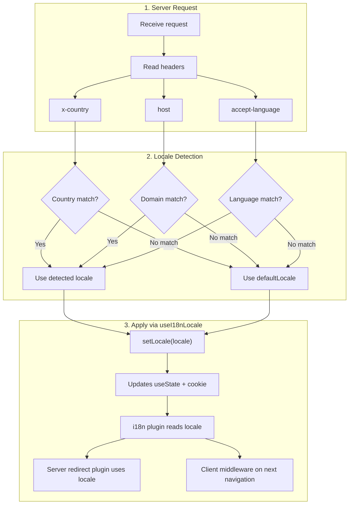

# 🔧 Пользовательское определение языка в Nuxt I18n Micro

## 📖 Обзор

Nuxt I18n Micro v3 предоставляет централизованный композабл — `useI18nLocale()` — для всего управления локалью. Он заменяет ручные паттерны `useState`/`useCookie` из v2. Вызвав `useI18nLocale().setLocale()` в серверном плагине, вы можете реализовать любую логику определения языка, сохраняя полную совместимость с системами редиректов и cookie модуля.

## 🏗️ Архитектура

```mermaid
flowchart TB
    subgraph Plugins["Plugin Execution Order"]
        A["Your plugin<br/>order: -10"] -->|setLocale()| B["01.plugin.ts<br/>order: -5"]
        B --> C["06.redirect.ts server<br/>order: 10"]
    end

    subgraph Client["Client SPA Navigation"]
        D["i18n-redirect.global.ts<br/>route middleware"]
    end

    subgraph State["Locale State"]
        E["useState('i18n-locale')"]
        F["localeCookie"]
    end

    A -->|"setLocale() updates both"| E
    A -->|"setLocale() updates both"| F
    B -->|reads| E
    C -->|reads| E
    C -->|reads| F
    D -->|reads target route +| E
```

**Ключевой принцип**: Вызывайте `useI18nLocale().setLocale()` в серверном плагине с `order: -10`. Это атомарно обновляет и `useState('i18n-locale')`, и cookie локали, поэтому плагин i18n (`order: -5`) и серверный redirect-плагин (`order: 10`) видят корректную локаль при первом SSR-запросе. Клиентские авто-редиректы работают в глобальном route middleware при последующих переходах.

## 🛠️ Отключение встроенного авто-определения

Если хотите полностью контролировать определение локали, отключите встроенный механизм:

```ts
export default defineNuxtConfig({
  i18n: {
    autoDetectLanguage: false,
  },
})
```

## ✨ Пример: серверное определение с `useI18nLocale`

Это **рекомендуемый подход** для всех стратегий.

### Шаг 1: настройте `nuxt.config.ts`

```ts
export default defineNuxtConfig({
  modules: ['nuxt-i18n-micro'],
  i18n: {
    strategy: 'no_prefix', // Works with ANY strategy
    defaultLocale: 'en',
    localeCookie: 'user-locale',
    autoDetectLanguage: false,
    locales: [
      { code: 'en', iso: 'en-US' },
      { code: 'de', iso: 'de-DE' },
      { code: 'ja', iso: 'ja-JP' },
    ],
  },
})
```

### Шаг 2: создайте `plugins/i18n-loader.server.ts`

```ts
import { defineNuxtPlugin, useRequestHeaders } from '#imports'

export default defineNuxtPlugin({
  name: 'i18n-custom-loader',
  enforce: 'pre',
  order: -10, // Execute BEFORE the i18n plugin (which has order -5)

  setup() {
    const { setLocale } = useI18nLocale()
    const headers = useRequestHeaders(['host', 'x-country', 'accept-language'])
    let detectedLocale = 'en'

    // --- YOUR DETECTION LOGIC ---

    // Example 1: By domain
    const host = headers['host']
    if (host?.includes('example.de')) {
      detectedLocale = 'de'
    }
    // Example 2: By custom header
    else if (headers['x-country'] === 'JP') {
      detectedLocale = 'ja'
    }
    // Example 3: By Accept-Language header
    else if (headers['accept-language']?.includes('de')) {
      detectedLocale = 'de'
    }

    // --- APPLY THE LOCALE ---
    setLocale(detectedLocale)
  },
})
```

### Как это работает



1. **Плагин выполняется первым** (`order: -10`) — определяет локаль по заголовкам, домену или другим источникам.
2. **`setLocale()` обновляет и** `useState('i18n-locale')`, и cookie — обеспечивает мгновенную видимость для всех последующих плагинов.
3. **Плагин i18n** (`order: -5`) читает локаль и загружает правильные переводы.
4. **Server redirect plugin** (`order: 10`) использует локаль для решений о редиректе при SSR.
5. **Client route middleware** (`i18n-redirect`) применяет редиректы при SPA-навигации, когда локаль URL не совпадает с предпочтением.

## 🌐 Поведение в зависимости от стратегии

`useI18nLocale().setLocale()` работает со **всеми стратегиями**. Поведение редиректа зависит от стратегии:

<Tip>
| Стратегия | Эффект `setLocale('de')` |
|----------|---------------------------|
| `no_prefix` | Рендерится на немецком, URL не меняется |
| `prefix` | 302 → `/de/` (серверный редирект) |
| `prefix_except_default` | 302 → `/de/`, если `de` ≠ default; без редиректа, если `de` = default |
| `prefix_and_default` | Без редиректа (и `/`, и `/de/` валидны) |
</Tip>

**Важные заметки:**

- Определение локали по cookie отключено по умолчанию (`localeCookie: null`).
- Установите `localeCookie: 'user-locale'`, чтобы включить сохранение в cookie.
- Если значение cookie/state отсутствует в списке `locales`, происходит откат на `defaultLocale`.

## 🏢 Продвинутое: определение по домену

Для мультидоменных сетапов, где каждый домен отдаёт свою локаль:

```ts
import { defineNuxtPlugin, useRequestHeaders } from '#imports'

export default defineNuxtPlugin({
  name: 'i18n-domain-loader',
  enforce: 'pre',
  order: -10,

  setup() {
    const { setLocale } = useI18nLocale()
    const headers = useRequestHeaders(['host'])
    const host = headers['host'] || ''

    let detectedLocale = 'en'

    if (host.endsWith('.de') || host.includes('german.')) {
      detectedLocale = 'de'
    } else if (host.endsWith('.fr') || host.includes('french.')) {
      detectedLocale = 'fr'
    } else if (host.endsWith('.jp') || host.includes('japanese.')) {
      detectedLocale = 'ja'
    }

    setLocale(detectedLocale)
  },
})
```

## 🔄 Продвинутое: уважение к выбору пользователя

Если пользователи могут вручную переключать язык, учитывайте их выбор поверх авто-определения:

```ts
import { defineNuxtPlugin, useRequestHeaders } from '#imports'

export default defineNuxtPlugin({
  name: 'i18n-smart-loader',
  enforce: 'pre',
  order: -10,

  setup() {
    const { getLocale, setLocale } = useI18nLocale()

    // If user already has a preference (from cookie), respect it
    if (getLocale()) {
      return
    }

    // Otherwise, detect locale from headers
    const headers = useRequestHeaders(['accept-language'])
    let detectedLocale = 'en'

    const acceptLanguage = headers['accept-language'] || ''
    if (acceptLanguage.includes('de')) {
      detectedLocale = 'de'
    } else if (acceptLanguage.includes('ja')) {
      detectedLocale = 'ja'
    }

    setLocale(detectedLocale)
  },
})
```

## ⚙️ Плагины только для сервера или только для клиента

Используйте [соглашения по именам файлов Nuxt](https://nuxt.com/docs/getting-started/directory-structure#plugins), чтобы контролировать, где выполняется плагин:

- **Только на сервере**: `i18n-loader.server.ts` — выполняется только при SSR (рекомендуется для определения по заголовкам).
- **Только на клиенте**: `i18n-loader.client.ts` — выполняется только в браузере (для определения через `localStorage` или DOM).


## ✅ Резюме

| Возможность                            | Описание                                                          |
| -------------------------------------- | ----------------------------------------------------------------- |
| `useI18nLocale().setLocale()`          | Атомарно обновляет `useState` + cookie; работает со всеми стратегиями |
| `useI18nLocale().getLocale()`          | Возвращает текущую локаль из state или cookie                     |
| `useI18nLocale().getPreferredLocale()` | Возвращает предпочтительную локаль (проверенную по списку `locales`) |
| Плагин `order: -10`                    | Гарантирует, что ваш плагин запустится до инициализации i18n      |
| `enforce: 'pre'`                       | Запуск в группе плагинов "pre"                                    |

**НЕ надо:**

- Использовать `useCookie('user-locale')` напрямую — `useI18nLocale()` управляет cookie внутренне.
- Использовать `useState('i18n-locale')` напрямую — используйте `useI18nLocale().setLocale()`.
- Ставить `order` >= -5 — ваш плагин должен запускаться до плагина i18n.
