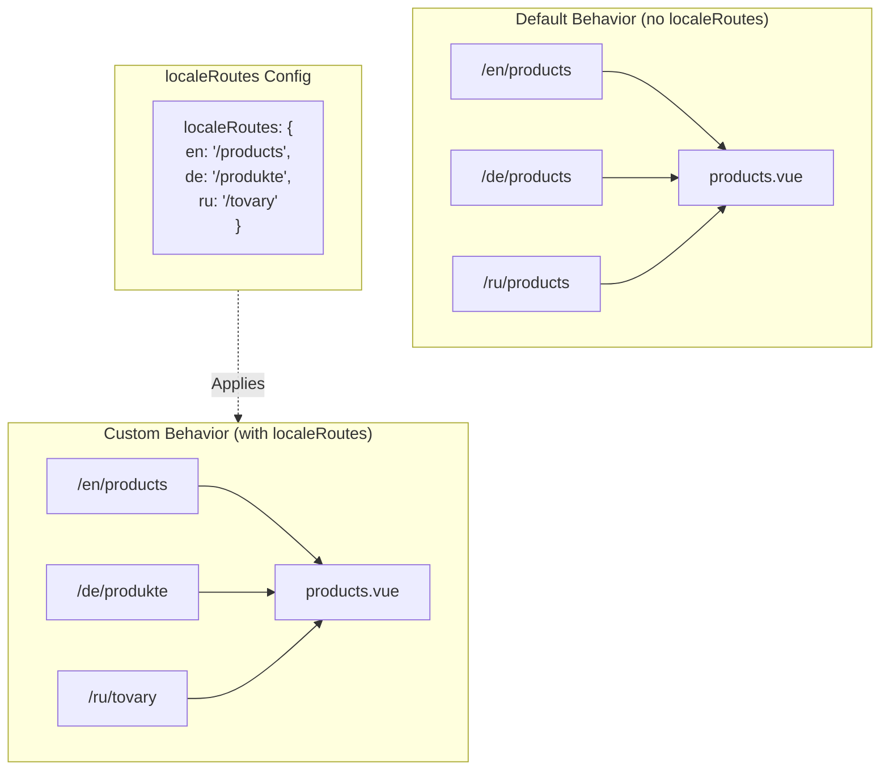

# 🔗 Пользовательские локализованные маршруты с `localeRoutes` в `Nuxt I18n Micro`

## 📖 Введение в `localeRoutes`

Возможность `localeRoutes` в `Nuxt I18n Micro` позволяет определять свои маршруты для конкретных локалей, обеспечивая гибкость и контроль над структурой роутинга приложения. Это особенно полезно, когда отдельным локалям нужны другие URL, специальные пути или региональные/языковые конвенции.

## 🚀 Основной сценарий использования `localeRoutes`

Основное применение `localeRoutes` — предоставлять разные маршруты для разных локалей, улучшая пользовательский опыт и делая URL понятнее и релевантнее целевой аудитории. Например, у страницы могут быть разные пути для английской и русской версий, где русская локаль использует локализованный формат URL.

### 📄 Пример: определение `localeRoutes` в `$defineI18nRoute`

Пример того, как определить свои маршруты для конкретных локалей через `localeRoutes` в функции `$defineI18nRoute`:

```typescript
import { useNuxtApp } from '#imports'

const { $defineI18nRoute } = useNuxtApp()

$defineI18nRoute({
  localeRoutes: {
    ru: '/localesubpage', // Custom route path for the Russian locale
    de: '/lokaleseite', // Custom route path for the German locale
  },
})
```

> [!IMPORTANT]
> `$defineI18nRoute` не является глобальной функцией. В `script setup` сначала получите её из `useNuxtApp()`, затем вызывайте.

### 🔄 Как работает `localeRoutes`



- **Поведение по умолчанию**: Без `localeRoutes` все локали используют общую структуру маршрута, заданную основным путём.
- **Кастомное поведение**: С `localeRoutes` конкретные локали получают свои маршруты, перекрывающие путь по умолчанию.

## 🌱 Сценарии для `localeRoutes`

### 📄 Пример: использование `localeRoutes` на странице

Простой Vue-компонент, показывающий использование `$defineI18nRoute` с `localeRoutes`:

```vue
<template>
  <div>
    <!-- Display greeting message based on the current locale -->
    <p>{{ $t('greeting') }}</p>

    <!-- Navigation links -->
    <div>
      <NuxtLink :to="$localeRoute({ name: 'index' })"> Go to Index </NuxtLink>
      |
      <NuxtLink :to="$localeRoute({ name: 'about' })"> Go to About Page </NuxtLink>
    </div>
  </div>
</template>

<script setup>
import { useNuxtApp } from '#imports'

const { $getLocale, $switchLocale, $getLocales, $localeRoute, $t, $defineI18nRoute } = useNuxtApp()

// Define translations and custom routes for specific locales
$defineI18nRoute({
  localeRoutes: {
    ru: '/localesubpage', // Custom route path for Russian locale
  },
})
</script>
```

### 🛠️ Использование `localeRoutes` в разных контекстах

- **Лендинги**: Используйте свои маршруты, чтобы локализовать URL посадочных страниц и синхронизировать их с маркетинговыми кампаниями.
- **Документационные сайты**: Дайте каждой локали свой маршрут, чтобы лучше соответствовать структуре локализованного контента.
- **E-commerce**: Подгоняйте URL товаров и категорий под локаль ради улучшения SEO и пользовательского опыта.

## Навигация с `localeRoutes`

Так как локализованные маршруты не совпадают напрямую с именами файлов в каталоге страниц, ссылайтесь на них по объекту, а не по имени.

```vue
<template>
  /**
   * Exemple page: /pages/about-us.vue
   * EN /about-us
   * ES /sobre-nosotros
   * FR /a-propos
   */

  // Using NuxtLink
  <NuxtLink :to="$localeRoute({ name: 'about-us' })">
    Go to About Page
  </NuxtLink>

  // Using I18nLink
  <I18nLink :to="{ name: 'about-us' }">
    Go to About Page
  </NuxtLink>

  // The string literal navigation wouldn't work for any locale but english
  <I18nLink to="/about-us">
    Go to About Page
  </NuxtLink>
</template>
```

### Именование вложенных страниц

По умолчанию имена страниц строятся из их файла и пути. Это значит:

- `/pages/about-us.vue` доступно через `$localeRoute(\{ name: 'about-us' \})`
- `/pages/about-us/physical-stores.vue` доступно через `$localeRoute(\{ name: 'about-us-physical-stores' \})`

Чтобы переопределить это поведение, задайте имя страницы явно через `definePageMeta`.

```vue
// /pages/about-us/physical-stores.vue
<script setup>
definePageMeta({
  name: 'our-stores'
})
```

Теперь на эту страницу можно ссылаться через `$localeRoute` или `I18nLink` по имени: `:to='\{ name: "our-stores" \}'`.

## 🎯 Динамические маршруты со слагами и `$setI18nRouteParams`

При работе с динамическими маршрутами, содержащими слаги или параметры, вы можете использовать `localeRoutes` с динамическими сегментами вместе с `$setI18nRouteParams`, чтобы подставлять слаги под каждую локаль.

### Параметры динамического маршрута в `localeRoutes`

Вы можете определить динамические маршруты через синтаксис параметров Nuxt (`[...slug]` — catch-all, `[param]` — одиночный параметр, `:param()` — именованный параметр):

```vue
<script setup lang="ts">
import { useNuxtApp, useRoute, useFetch, createError } from '#imports'

const { $defineI18nRoute, $setI18nRouteParams } = useNuxtApp()

// Define custom routes with dynamic segments
$defineI18nRoute({
  localeRoutes: {
    en: '/our-products/[...slug]',
    es: '/nuestros-productos/[...slug]',
  },
})
</script>
```

### Настройка параметров маршрута под конкретную локаль

Функция `$setI18nRouteParams` позволяет задавать разные значения параметров (например, слаги) для каждой локали. Это особенно полезно, когда у контента есть локале-специфичные URL.

**Важно**: `$setI18nRouteParams` следует вызывать после получения данных с локале-специфичными слагами, обычно внутри `useFetch` или `useAsyncData`.

```vue
<script setup lang="ts">
import { useNuxtApp, useRoute, useFetch, createError } from '#imports'

interface Product {
  title: string
  price: string
  urlEn: string // English slug
  urlEs: string // Spanish slug
}

const { $defineI18nRoute, $setI18nRouteParams } = useNuxtApp()

const route = useRoute()
const slug = Array.isArray(route.params.slug) ? route.params.slug[0] : route.params.slug

// Fetch product data that includes locale-specific slugs
const { data: product, error } = await useFetch<Product>(`/api/product/${slug}`)
if (error.value)
  throw createError({
    statusCode: error.value?.statusCode,
    statusMessage: error.value?.statusMessage,
    fatal: true,
  })

// Define custom routes with dynamic segments
$defineI18nRoute({
  localeRoutes: {
    en: '/our-products/[...slug]',
    es: '/nuestros-productos/[...slug]',
  },
})

// Set different slugs for different locales
if (product.value) {
  $setI18nRouteParams({
    en: { slug: product.value.urlEn },
    es: { slug: product.value.urlEs },
  })
}
</script>
```

### Полный пример: страницы товаров со слагами по локалям

Полный пример совместного использования `localeRoutes` и `$setI18nRouteParams` для страницы товара:

```vue
<template>
  <div v-if="product">
    <h1>{{ product.title }}</h1>
    <p>{{ $t('price') }}: {{ product.price }}</p>
    <div class="locale-switcher">
      <a :href="$switchLocalePath('en')">English</a>
      <a :href="$switchLocalePath('es')">Español</a>
    </div>
  </div>
</template>

<script setup lang="ts">
import { useNuxtApp, useRoute, useFetch, createError } from '#imports'

interface Product {
  title: string
  price: string
  urlEn: string
  urlEs: string
}

const { $t, $defineI18nRoute, $setI18nRouteParams, $switchLocalePath } = useNuxtApp()

// Set page name for easier navigation
definePageMeta({ name: 'product-slug' })

const route = useRoute()
const slug = Array.isArray(route.params.slug) ? route.params.slug[0] : route.params.slug

// Fetch product data
const { data: product, error } = await useFetch<Product>(`/api/product/${slug}`)
if (error.value)
  throw createError({
    statusCode: error.value?.statusCode,
    statusMessage: error.value?.statusMessage,
    fatal: true,
  })

// Define locale-specific routes with dynamic segments
$defineI18nRoute({
  localeRoutes: {
    en: '/our-products/[...slug]',
    es: '/nuestros-productos/[...slug]',
  },
})

// Set locale-specific slugs so $switchLocalePath works correctly
if (product.value) {
  $setI18nRouteParams({
    en: { slug: product.value.urlEn },
    es: { slug: product.value.urlEs },
  })
}
</script>
```

### Пример: страница списка товаров

При ссылках на динамические маршруты со страницы списка используйте имя маршрута и параметры:

```vue
<template>
  <div>
    <h1>{{ $t('title') }}</h1>
    <ul>
      <li v-for="product in products?.[$getLocale()] || []" :key="product.id">
        <I18nLink :to="{ name: 'product-slug', params: { slug: product.url } }"> {{ product.title }} – {{ product.price }} </I18nLink>
      </li>
    </ul>
  </div>
</template>

<script setup lang="ts">
import { useNuxtApp, useFetch, createError } from '#imports'

interface Product {
  id: string
  title: string
  price: string
  url: string
}

type ProductsByLocale = Record<string, Product[]>

const { $t, $defineI18nRoute, $getLocale } = useNuxtApp()

const { data: products, error } = await useFetch<ProductsByLocale>('/api/product')
if (error.value)
  throw createError({
    statusCode: error.value?.statusCode,
    statusMessage: error.value?.statusMessage,
    fatal: true,
  })

$defineI18nRoute({
  locales: {
    en: {
      title: 'Our Product Range',
      description: 'Discover our collection of high-quality products.',
    },
    es: {
      title: 'Nuestra Gama de Productos',
      description: 'Descubra nuestra colección de productos de alta calidad.',
    },
  },
  localeRoutes: {
    en: '/our-products',
    es: '/nuestros-productos',
  },
})
</script>
```

### Как это работает

1. **Определение маршрута**: `localeRoutes` задаёт базовую структуру пути для каждой локали, включая динамические сегменты вроде `[...slug]` или `[id]`.

2. **Установка параметров**: `$setI18nRouteParams` устанавливает фактические значения параметров для каждой локали. Когда пользователь переключает локали через `$switchLocalePath`, модуль использует эти параметры, чтобы построить корректный URL.

3. **Формат параметров**: Объект параметров должен иметь такую структуру:

   ```typescript
   {
     [localeCode]: {
       [paramName]: paramValue
     }
   }
   ```

4. **Навигация**: Используйте `I18nLink` или `$localeRoute` с именем маршрута и параметрами, чтобы переходить между локализованными версиями динамических маршрутов.

### Важные заметки

- **Тайминг**: `$setI18nRouteParams` следует вызывать после получения данных, содержащих локале-специфичные слаги, обычно внутри `useFetch` или `useAsyncData`.

- **Имена параметров**: Имена параметров в `$setI18nRouteParams` должны совпадать с именами параметров маршрута (например, `slug` для `[...slug]` или `id` для `[id]`).

- **Имена маршрутов**: Когда используете `definePageMeta(\{ name: 'route-name' \})`, ссылайтесь на маршрут этим именем через `I18nLink` или `$localeRoute`.

- **Catch-all маршруты**: Для catch-all (`[...slug]`) параметр slug должен быть массивом или строкой, которую можно преобразовать в массив.

## 🧩 Программные маршруты (`pages:extend`) — #244

Маршрутам, созданным в `pages:extend`, некуда положить `defineI18nRoute()`, а несколько маршрутов часто делят один SFC-обёртку. Сканирование по файлу склеивает их в одну запись.

Не **кладите** локализованные пути в `route.meta` (они попадут в клиентскую таблицу маршрутов). Держите один реестр и проецируйте его дважды:

1. в `pages:extend` (создаёт Nuxt-маршруты)
2. в `i18n.globalLocaleRoutes` c ключами по **имени** маршрута (не по пути файла)

Используйте `splitLocaleRoutes` из `@i18n-micro/utils/split-locale-routes`:

```typescript
import { splitLocaleRoutes } from '@i18n-micro/utils/split-locale-routes'

const dynamic = splitLocaleRoutes([
  {
    name: 'products_tag',
    path: '/products/:tag',
    file: '~/pages/_dynamic.vue',
    paths: { fr: '/produits/:tag', de: '/produkte/:tag' },
  },
  {
    name: 'products_category',
    path: '/products/category/:category',
    file: '~/pages/_dynamic.vue',
    paths: { fr: '/produits/categorie/:category' },
  },
  // Disable localization for a programmatic route:
  // { name: 'internal', path: '/internal', file: '~/pages/_dynamic.vue', paths: false },
])

export default defineNuxtConfig({
  hooks: {
    'pages:extend'(pages) {
      pages.push(...dynamic.pages)
    },
  },
  i18n: {
    globalLocaleRoutes: dynamic.globalLocaleRoutes,
  },
})
```

Обе половинки остаются в синхронности; общие обёртки больше не перезаписывают друг друга. `globalLocaleRoutes` в одиночку недостаточно — он только настраивает пути для маршрутов, которые уже есть в таблице страниц Nuxt.

## 📝 Лучшие практики использования `localeRoutes`

- **🚀 Применяйте к релевантным локалям**: Используйте `localeRoutes` прежде всего там, где структура URL существенно влияет на пользовательский опыт или SEO. Не перегружайте им мелкие отличия.
- **🔧 Поддерживайте согласованность**: Держите единый паттерн роутинга между локалями, если нет веских причин отклоняться. Это помогает сохранять ясность и снижать сложность.
- **📚 Документируйте пользовательские маршруты**: Чётко фиксируйте любые кастомные маршруты, определённые через `localeRoutes`, особенно в модульных приложениях, чтобы команда понимала логику роутинга.
