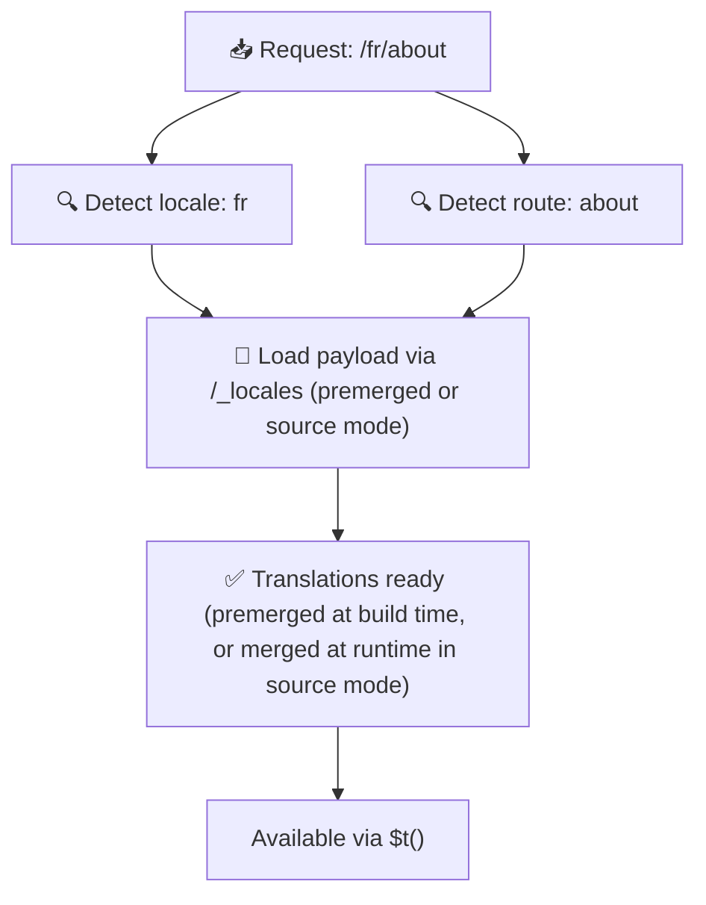

# 📂 Руководство по структуре папок

## 📖 Введение

Грамотная организация файлов переводов важна для поддержания масштабируемой и эффективной системы интернационализации (i18n). `Nuxt I18n Micro` упрощает этот процесс, предлагая понятный подход к управлению корневыми и постраничными переводами. Это руководство проведёт вас через рекомендуемую структуру папок и объяснит, как `Nuxt I18n Micro` обрабатывает такие переводы.

## 🗂️ Рекомендуемая структура папок

`Nuxt I18n Micro` разделяет переводы на корневые файлы и постраничные файлы внутри каталога `pages`. При `translationPayloads.mode: 'premerged'` (по умолчанию) корневые переводы на этапе сборки автоматически объединяются с каждым постраничным файлом, так что каждая страница получает полный набор переводов без накладных расходов на merge в рантайме.

При `mode: 'source'` исходные файлы остаются раздельными в ассетах Nitro и объединяются в рантайме через маршрут `/_locales`. См. [Serverless Payload Output](/guides/performance#serverless-payload-output).

### 🔧 Базовая структура

Пример базовой структуры папок:

```text
locales/
├── pages/
│   ├── index/
│   │   ├── en.json
│   │   ├── fr.json
│   │   └── ar.json
│   ├── about/
│   │   ├── en.json
│   │   ├── fr.json
│   │   └── ar.json
├── en.json
├── fr.json
└── ar.json

```

### 📄 Пояснение к структуре

#### 1. 🌍 Корневые файлы переводов

- **Путь:** `/locales/\{locale\}.json` (например, `/locales/en.json`)
- **Назначение:** Эти файлы содержат переводы, общие для всего приложения (меню навигации, шапки, подвалы и т. п.). При `mode: 'premerged'` (по умолчанию) они автоматически объединяются с каждым постраничным файлом на этапе сборки, и сервер отдаёт единый готовый файл на страницу.

  **Пример содержимого (`/locales/en.json`):**

  ```json
  {
    "menu": {
      "home": "Home",
      "about": "About Us",
      "contact": "Contact"
    },
    "footer": {
      "copyright": "© 2024 Your Company"
    }
  }
  ```

#### 2. 📄 Постраничные файлы переводов

- **Путь:** `/locales/pages/\{routeName\}/\{locale\}.json` (например, `/locales/pages/index/en.json`)
- **Назначение:** Эти файлы содержат переводы, специфичные для отдельных страниц. При `mode: 'premerged'` (по умолчанию) корневые переводы подмешиваются как база на этапе сборки, так что каждый постраничный файл становится самодостаточным.

  **Пример содержимого (`/locales/pages/index/en.json`):**

  ```json
  {
    "title": "Welcome to Our Website",
    "description": "We offer a wide range of products and services to meet your needs."
  }
  ```

  **Пример содержимого (`/locales/pages/about/en.json`):**

  ```json
  {
    "title": "About Us",
    "description": "Learn more about our mission, vision, and values."
  }
  ```

### 📂 Обработка динамических маршрутов и вложенных путей

`Nuxt I18n Micro` автоматически преобразует динамические сегменты и вложенные пути в маршрутах в плоскую структуру папок, следуя специальному соглашению переименования. Это гарантирует, что все переводы хранятся единообразно и легко доступны.

#### Структура папок переводов для динамических маршрутов

При работе с динамическими маршрутами, например `/products/[id]`, модуль преобразует динамический сегмент `[id]` в статический формат внутри файловой структуры.

**Пример структуры папок для динамических маршрутов:**

Для маршрута `/products/[id]` файлы переводов хранятся в папке `products-id`:

```text
locales/pages/
├── products-id/
│   ├── en.json
│   ├── fr.json
│   └── ar.json

```

**Пример структуры для вложенных динамических маршрутов:**

Для вложенного маршрута `/products/key/[id]` файлы переводов хранятся в папке `products-key-id`:

```text
locales/pages/
├── products-key-id/
│   ├── en.json
│   ├── fr.json
│   └── ar.json

```

**Пример структуры для многоуровневых вложенных маршрутов:**

Для более сложного маршрута `/products/category/[id]/details` файлы переводов хранятся в папке `products-category-id-details`:

```text
locales/pages/
├── products-category-id-details/
│   ├── en.json
│   ├── fr.json
│   └── ar.json

```

### 🛠 Настройка структуры каталогов

Если вы хотите хранить переводы в другом каталоге, `Nuxt I18n Micro` позволяет настроить его расположение. Это делается в `nuxt.config.ts`.

**Пример: настройка каталога переводов**

```typescript
export default defineNuxtConfig({
  i18n: {
    translationDir: 'i18n', // Custom directory path
  },
})
```

Это укажет `Nuxt I18n Micro` искать файлы переводов в каталоге `/i18n` вместо `/locales` по умолчанию.

## ⚙️ Как загружаются переводы

### 🌍 Динамические маршруты локалей

`Nuxt I18n Micro` использует динамические маршруты локалей для эффективной загрузки переводов. Когда пользователь заходит на страницу, модуль определяет подходящую локаль и загружает соответствующие файлы переводов на основе текущего маршрута и локали.



Например:

- Посещение `/en/index` загрузит переводы из `/locales/pages/index/en.json`.
- Посещение `/fr/about` загрузит переводы из `/locales/pages/about/fr.json`.

Такой подход гарантирует, что загружаются только необходимые переводы, оптимизируя нагрузку на сервер и производительность на клиенте.

### 💾 Кэширование и пре-рендеринг

Для дальнейшего повышения производительности `Nuxt I18n Micro` поддерживает кэширование и пре-рендеринг файлов переводов:

- **Кэширование**: Загруженные файлы переводов кэшируются для последующих запросов, что снижает необходимость повторной загрузки одних и тех же данных.
- **Пре-рендеринг**: Во время сборки файлы переводов можно пре-рендерить для всех настроенных локалей и маршрутов, чтобы они отдавались с сервера без задержек в рантайме.

## 📝 Лучшие практики

### 📂 Разумно используйте постраничные файлы

Опирайтесь на постраничные файлы, чтобы держать переводы упорядоченными. Так у каждой страницы будет компактный и быстрый в загрузке набор переводов — это особенно важно для страниц со сложным или объёмным контентом.

### 🔑 Держите ключи переводов единообразными

Используйте согласованные соглашения об именовании ключей во всех файлах. Это помогает сохранять ясность и предотвращает проблемы при управлении переводами, особенно по мере роста приложения.

### 🗂️ Организуйте переводы по контексту

Группируйте связанные переводы внутри файлов. Например, соберите все подписи кнопок под ключом `buttons`, а тексты форм — под ключом `forms`. Это повышает читаемость и упрощает управление переводами между локалями.

### ⚠️ Ограничение глубины вложенности (рекомендуется 2 уровня)

Во время клиентской навигации `Nuxt I18n Micro` использует оптимизированный deep merge глубиной 2 уровня, чтобы объединять переводы уходящей и приходящей страниц. Это гарантирует, что пересекающиеся вложенные ключи (например, обе страницы имеют ключи под `common.*`) сохраняются во время анимаций перехода.

**Это корректно работает для стандартной структуры `Section → Key → Value` (2 уровня):**

```json
// Page A translations
{ "common": { "fromA": "Text A" } }

// Page B translations
{ "common": { "fromB": "Text B" } }

// During transition, both are available:
// { "common": { "fromA": "Text A", "fromB": "Text B" } }
```

**Однако при 3+ уровнях вложенности более глубокие ключи могут перезаписываться при переходах:**

```json
// Page A translations
{ "auth": { "form": { "login": "Login" } } }

// Page B translations
{ "auth": { "form": { "register": "Register" } } }

// During transition: "login" key is lost
// { "auth": { "form": { "register": "Register" } } }
```


### 🧹 Регулярно вычищайте неиспользуемые переводы

Со временем в приложении могут накапливаться неиспользуемые ключи переводов, особенно если функции удаляются или реструктурируются. Периодически просматривайте и вычищайте файлы переводов, чтобы они оставались лаконичными и поддерживаемыми.
