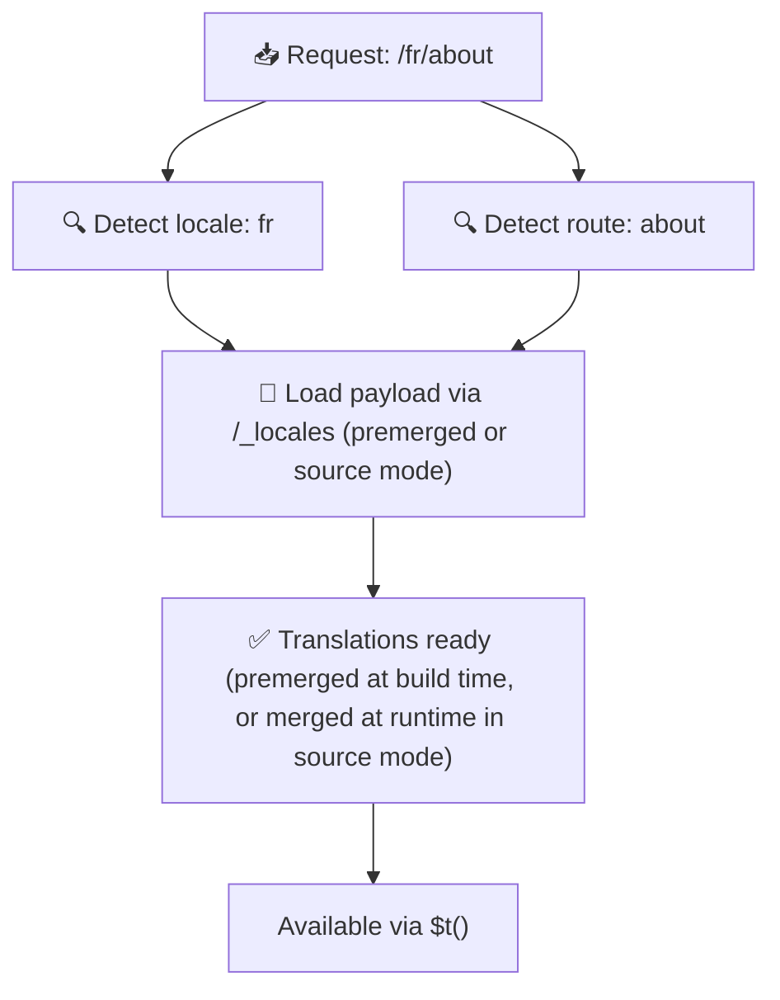

# 📂 Руководство по структуре папок

## 📖 Введение

Эффективная организация файлов переводов необходима для поддержания масштабируемой и эффективной системы интернационализации (i18n). `Nuxt I18n Micro` упрощает этот процесс, предлагая ясный подход к управлению переводами корневого уровня и переводами для конкретных страниц. Это руководство проведёт вас через рекомендуемую структуру папок и объяснит, как `Nuxt I18n Micro` обрабатывает эти переводы.

## 🗂️ Рекомендуемая структура папок

`Nuxt I18n Micro` организует переводы в файлы корневого уровня и файлы для конкретных страниц в директории `pages`. При `translationPayloads.mode: 'premerged'` (по умолчанию) переводы корневого уровня автоматически объединяются с каждым файлом страницы на этапе сборки, поэтому каждая страница имеет полный набор переводов без накладных расходов на слияние во время выполнения.

При `mode: 'source'` исходные файлы остаются раздельными в ассетах Nitro и объединяются во время выполнения через маршрут `/_locales`. См. [Serverless Payload Output](/guides/performance#serverless-payload-output).

### 🔧 Базовая структура

Вот базовый пример структуры папок, которой стоит следовать:

```text
locales/
├── pages/
│   ├── index/
│   │   ├── en.json
│   │   ├── fr.json
│   │   └── ar.json
│   ├── about/
│   │   ├── en.json
│   │   ├── fr.json
│   │   └── ar.json
├── en.json
├── fr.json
└── ar.json

```

### 📄 Объяснение структуры

#### 1. 🌍 Файлы переводов корневого уровня

- **Путь:** `/locales/\{locale\}.json` (например, `/locales/en.json`)
- **Назначение:** эти файлы содержат переводы, общие для всего приложения (навигационные меню, шапки, футеры и т. д.). При `mode: 'premerged'` (по умолчанию) они автоматически объединяются с каждым файлом конкретной страницы на этапе сборки, поэтому сервер возвращает один заранее подготовленный файл для каждой страницы.

  **Пример содержимого (`/locales/en.json`):**

  ```json
  {
    "menu": {
      "home": "Home",
      "about": "About Us",
      "contact": "Contact"
    },
    "footer": {
      "copyright": "© 2024 Your Company"
    }
  }
  ```

#### 2. 📄 Файлы переводов для конкретных страниц

- **Путь:** `/locales/pages/\{routeName\}/\{locale\}.json` (например, `/locales/pages/index/en.json`)
- **Назначение:** эти файлы содержат переводы, специфичные для отдельных страниц. При `mode: 'premerged'` (по умолчанию) переводы корневого уровня объединяются с ними как база на этапе сборки, поэтому каждый файл страницы становится самодостаточным.

  **Пример содержимого (`/locales/pages/index/en.json`):**

  ```json
  {
    "title": "Welcome to Our Website",
    "description": "We offer a wide range of products and services to meet your needs."
  }
  ```

  **Пример содержимого (`/locales/pages/about/en.json`):**

  ```json
  {
    "title": "About Us",
    "description": "Learn more about our mission, vision, and values."
  }
  ```

### 📂 Обработка динамических маршрутов и вложенных путей

`Nuxt I18n Micro` автоматически преобразует динамические сегменты и вложенные пути в маршрутах в плоскую структуру папок, используя определённую конвенцию переименования. Это гарантирует, что все переводы хранятся согласованно и легко доступны.

#### Структура папок для динамических маршрутов

При работе с динамическими маршрутами, такими как `/products/[id]`, модуль преобразует динамический сегмент `[id]` в статический формат в файловой структуре.

**Пример структуры папок для динамических маршрутов:**

Для маршрута вида `/products/[id]` файлы переводов будут храниться в папке с именем `products-id`:

```text
locales/pages/
├── products-id/
│   ├── en.json
│   ├── fr.json
│   └── ar.json

```

**Пример структуры папок для вложенных динамических маршрутов:**

Для вложенного маршрута вида `/products/key/[id]` файлы переводов будут храниться в папке с именем `products-key-id`:

```text
locales/pages/
├── products-key-id/
│   ├── en.json
│   ├── fr.json
│   └── ar.json

```

**Пример структуры папок для многоуровневых вложенных маршрутов:**

Для более сложного вложенного маршрута вида `/products/category/[id]/details` файлы переводов будут храниться в папке с именем `products-category-id-details`:

```text
locales/pages/
├── products-category-id-details/
│   ├── en.json
│   ├── fr.json
│   └── ar.json

```

### 🛠 Настройка структуры директорий

Если вы предпочитаете хранить переводы в другой директории, `Nuxt I18n Micro` позволяет настроить директорию, в которой хранятся файлы переводов. Настроить это можно в файле `nuxt.config.ts`.

**Пример: настройка директории переводов**

```typescript
export default defineNuxtConfig({
  i18n: {
    translationDir: 'i18n', // Custom directory path
  },
})
```

Это укажет `Nuxt I18n Micro` искать файлы переводов в директории `/i18n` вместо стандартной `/locales`.

## ⚙️ Как загружаются переводы

### 🌍 Динамические маршруты локалей

`Nuxt I18n Micro` использует динамические маршруты локалей для эффективной загрузки переводов. Когда пользователь посещает страницу, модуль определяет подходящую локаль и загружает соответствующие файлы переводов на основе текущего маршрута и локали.



Например:

- Посещение `/en/index` загрузит переводы из `/locales/pages/index/en.json`.
- Посещение `/fr/about` загрузит переводы из `/locales/pages/about/fr.json`.

Такой способ гарантирует, что загружаются только необходимые переводы, оптимизируя нагрузку на сервер и производительность на стороне клиента.

### 💾 Кэширование и предварительный рендеринг

Для дальнейшего повышения производительности `Nuxt I18n Micro` поддерживает кэширование и предварительный рендеринг файлов переводов:

- **Кэширование**: как только файл перевода загружен, он кэшируется для последующих запросов, что уменьшает необходимость повторного получения тех же данных.
- **Предварительный рендеринг**: во время процесса сборки вы можете предварительно отрендерить файлы переводов для всех настроенных локалей и маршрутов, что позволяет обслуживать их напрямую с сервера без задержек во время выполнения.

## 📝 Лучшие практики

### 📂 Разумно используйте файлы для конкретных страниц

Используйте файлы страниц, чтобы упорядочить переводы. Это делает переводы каждой страницы компактными и быстро загружаемыми, что особенно важно для страниц со сложным или большим содержимым.

### 🔑 Сохраняйте согласованность ключей переводов

Используйте согласованные соглашения об именовании ключей переводов во всех файлах. Это помогает поддерживать ясность и предотвращает проблемы при управлении переводами, особенно по мере роста вашего приложения.

### 🗂️ Организуйте переводы по контексту

Группируйте связанные переводы внутри ваших файлов. Например, размещайте все подписи кнопок под ключом `buttons`, а все связанные с формами тексты — под ключом `forms`. Это не только улучшает читаемость, но и облегчает управление переводами в разных локалях.

### ⚠️ Ограничение глубины вложенности (рекомендуется 2 уровня)

Во время клиентской навигации `Nuxt I18n Micro` использует оптимизированное глубокое слияние на 2 уровня для объединения переводов страницы, с которой уходят, и страницы, на которую переходят. Это гарантирует сохранение пересекающихся вложенных ключей (например, обе страницы имеют ключи под `common.*`) во время анимации перехода.

**Это корректно работает для стандартной структуры `Section → Key → Value` (2 уровня):**

```json
// Page A translations
{ "common": { "fromA": "Text A" } }

// Page B translations
{ "common": { "fromB": "Text B" } }

// During transition, both are available:
// { "common": { "fromA": "Text A", "fromB": "Text B" } }
```

**Однако при использовании 3+ уровней вложенности более глубокие ключи могут быть перезаписаны во время переходов:**

```json
// Page A translations
{ "auth": { "form": { "login": "Login" } } }

// Page B translations
{ "auth": { "form": { "register": "Register" } } }

// During transition: "login" key is lost
// { "auth": { "form": { "register": "Register" } } }
```

<Tip>

</Tip>

### 🧹 Регулярно очищайте неиспользуемые переводы

Со временем в вашем приложении могут накапливаться неиспользуемые ключи переводов, особенно если функции удаляются или реструктурируются. Периодически проверяйте и очищайте файлы переводов, чтобы они оставались компактными и удобными в поддержке.
