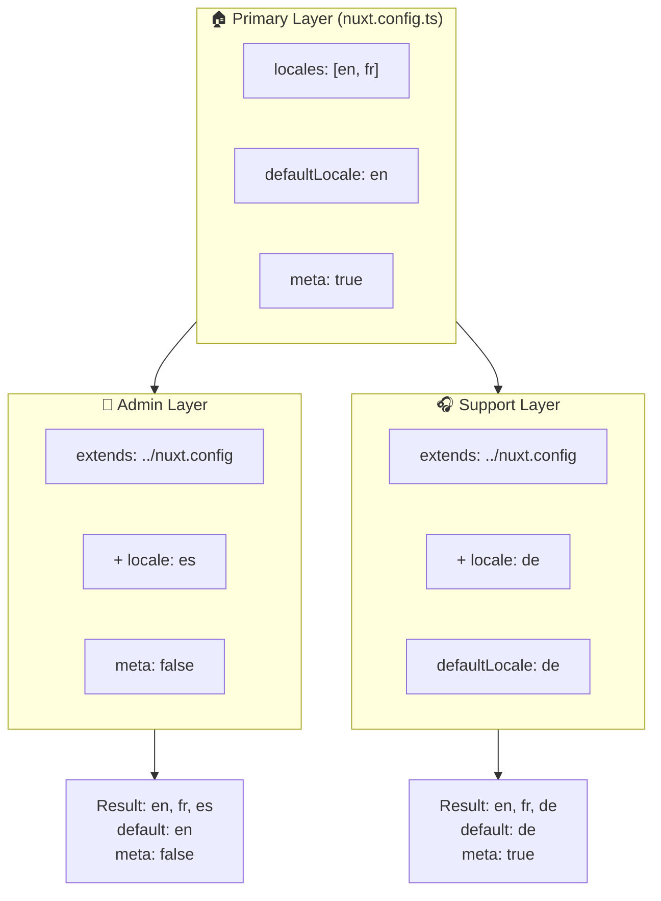

# 🗂️ Слои в `Nuxt I18n Micro`

## 📖 Введение в слои

Слои в `Nuxt I18n Micro` позволяют гибко управлять настройками локализации и адаптировать их в разных частях приложения. Определяя разные слои, вы можете подстраивать конфигурацию под разные контексты: переопределять настройки для конкретных разделов сайта или создавать переиспользуемые базовые конфигурации, которые расширяются в других частях приложения.

### Поток наследования слоёв



## 🛠️ Первичный слой конфигурации

**Первичный слой конфигурации** — это место, где вы задаёте настройки локализации по умолчанию для всего приложения. Этот слой критически важен: он определяет глобальную конфигурацию, включая поддерживаемые локали, язык по умолчанию и другие важные i18n-настройки.

### 📄 Пример: определение первичного слоя конфигурации

Пример определения первичного слоя конфигурации в файле `nuxt.config.ts`:

```typescript
export default defineNuxtConfig({
  i18n: {
    locales: [
      { code: 'en', iso: 'en-EN', dir: 'ltr' },
      { code: 'fr', iso: 'fr-FR', dir: 'ltr' },
      { code: 'ar', iso: 'ar-SA', dir: 'rtl' },
    ],
    defaultLocale: 'en', // The default locale for the entire app
    translationDir: 'locales', // Directory where translations are stored
    meta: true, // Automatically generate SEO-related meta tags like `alternate`
    autoDetectLanguage: true, // Automatically detect and use the user's preferred language
  },
})
```

## 🌱 Дочерние слои

Дочерние слои используются, чтобы расширить или переопределить первичную конфигурацию для конкретных частей приложения. Например, вам может понадобиться добавить дополнительные локали или изменить локаль по умолчанию для определённой секции. Дочерние слои особенно полезны в модульных приложениях, где разные части имеют разные требования к локализации.

### 📄 Пример: расширение первичного слоя в дочернем слое

Допустим, у вас есть раздел сайта, где нужно поддержать дополнительные локали или отключить какую-то локаль в определённом контексте. Вот как это сделать через расширение первичного слоя:

```typescript
// basic/nuxt.config.ts (Primary Layer)
export default defineNuxtConfig({
  i18n: {
    locales: [
      { code: 'en', iso: 'en-EN', dir: 'ltr' },
      { code: 'fr', iso: 'fr-FR', dir: 'ltr' },
    ],
    defaultLocale: 'en',
    meta: true,
    translationDir: 'locales',
  },
})
```

```typescript
// extended/nuxt.config.ts (Child Layer)
export default defineNuxtConfig({
  extends: '../basic', // Inherit the base configuration from the 'basic' layer
  i18n: {
    locales: [
      { code: 'en', iso: 'en-EN', dir: 'ltr' }, // Inherited from the base layer
      { code: 'fr', iso: 'fr-FR', dir: 'ltr' }, // Inherited from the base layer
      { code: 'de', iso: 'de-DE', dir: 'ltr' }, // Added in the child layer
    ],
    defaultLocale: 'fr', // Override the default locale to French for this section
    autoDetectLanguage: false, // Disable automatic language detection in this section
  },
})
```

### 🌐 Использование слоёв в модульном приложении

В более крупном модульном приложении Nuxt у вас могут быть несколько секций, каждая со своими i18n-настройками. Слои позволяют поддерживать чистую и масштабируемую структуру конфигурации.

### 📄 Пример: конфигурация со слоями в модульном приложении

Представьте e-commerce сайт с разделами вроде основного сайта, админ-панели и портала поддержки клиентов. Каждому разделу нужны свои наборы локалей или другие i18n-настройки.

#### **Первичный слой (глобальная конфигурация):**

```typescript
// nuxt.config.ts
export default defineNuxtConfig({
  i18n: {
    locales: [
      { code: 'en', iso: 'en-EN', dir: 'ltr' },
      { code: 'fr', iso: 'fr-FR', dir: 'ltr' },
    ],
    defaultLocale: 'en',
    meta: true,
    translationDir: 'locales',
    autoDetectLanguage: true,
  },
})
```

#### **Дочерний слой для админ-панели:**

```typescript
// admin/nuxt.config.ts
export default defineNuxtConfig({
  extends: '../nuxt.config', // Inherit the global settings
  i18n: {
    locales: [
      { code: 'en', iso: 'en-EN', dir: 'ltr' }, // Inherited
      { code: 'fr', iso: 'fr-FR', dir: 'ltr' }, // Inherited
      { code: 'es', iso: 'es-ES', dir: 'ltr' }, // Specific to the admin panel
    ],
    defaultLocale: 'en',
    meta: false, // Disable automatic meta generation in the admin panel
  },
})
```

#### **Дочерний слой для портала поддержки клиентов:**

```typescript
// support/nuxt.config.ts
export default defineNuxtConfig({
  extends: '../nuxt.config', // Inherit the global settings
  i18n: {
    locales: [
      { code: 'en', iso: 'en-EN', dir: 'ltr' }, // Inherited
      { code: 'fr', iso: 'fr-FR', dir: 'ltr' }, // Inherited
      { code: 'de', iso: 'de-DE', dir: 'ltr' }, // Specific to the support portal
    ],
    defaultLocale: 'de', // Default to German in the support portal
    autoDetectLanguage: false, // Disable automatic language detection
  },
})
```

В этом модульном примере:

- У каждого раздела (admin, support) свои i18n-настройки, но все они наследуют базовую конфигурацию.
- Админ-панель добавляет испанский (`es`) как локаль и отключает генерацию мета-тегов.
- Портал поддержки добавляет немецкий (`de`) и по умолчанию использует немецкий язык интерфейса.

## 📝 Лучшие практики использования слоёв

- **🔧 Держите первичный слой простым:** Первичный слой должен содержать самые общие настройки, применимые ко всему приложению. Держите его лаконичным ради единообразия.
- **⚙️ Используйте дочерние слои для конкретных настроек:** Переопределяйте или расширяйте настройки в дочерних слоях только по необходимости. Это позволяет избежать ненужного усложнения конфигурации.
- **📚 Документируйте свои слои:** Чётко фиксируйте цель и особенности каждого слоя в проекте. Это поможет поддерживать ясность и упростит понимание конфигурации коллегам (или вам через полгода).
