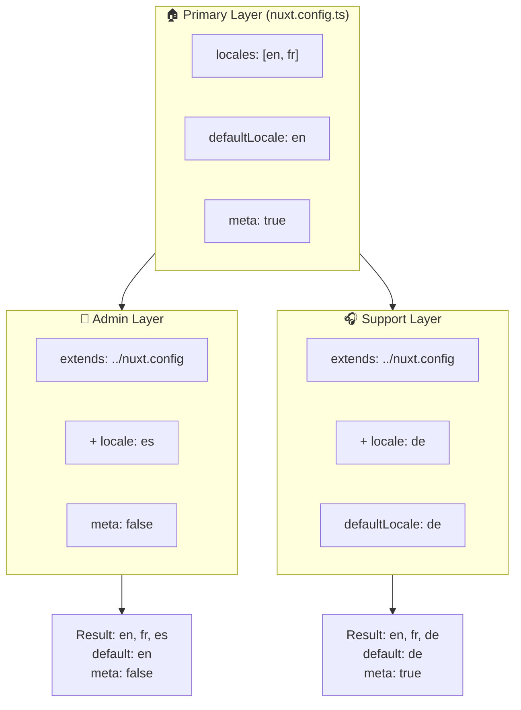

# 🗂️ Слои в `Nuxt I18n Micro`

## 📖 Введение в слои

Слои в `Nuxt I18n Micro` позволяют гибко управлять и настраивать параметры локализации в разных частях вашего приложения. Определяя разные слои, вы можете корректировать конфигурацию для различных контекстов, например, переопределяя настройки для конкретных разделов сайта или создавая переиспользуемые базовые конфигурации, которые могут быть расширены другими частями приложения.

### Поток наследования слоёв



## 🛠️ Основной слой конфигурации

**Основной слой конфигурации** — это место, где вы задаёте настройки локализации по умолчанию для всего приложения. Этот слой важен, так как определяет глобальную конфигурацию, включая поддерживаемые локали, язык по умолчанию и другие критически важные настройки i18n.

### 📄 Пример: определение основного слоя конфигурации

Вот пример того, как можно определить основной слой конфигурации в файле `nuxt.config.ts`:

```typescript
export default defineNuxtConfig({
  i18n: {
    locales: [
      { code: 'en', iso: 'en-EN', dir: 'ltr' },
      { code: 'fr', iso: 'fr-FR', dir: 'ltr' },
      { code: 'ar', iso: 'ar-SA', dir: 'rtl' },
    ],
    defaultLocale: 'en', // The default locale for the entire app
    translationDir: 'locales', // Directory where translations are stored
    meta: true, // Automatically generate SEO-related meta tags like `alternate`
    autoDetectLanguage: true, // Automatically detect and use the user's preferred language
  },
})
```

## 🌱 Дочерние слои

Дочерние слои используются для расширения или переопределения основной конфигурации для конкретных частей вашего приложения. Например, вы можете захотеть добавить дополнительные локали или изменить локаль по умолчанию для определённого раздела сайта. Дочерние слои особенно полезны в модульных приложениях, где разные части приложения могут иметь разные требования к локализации.

### 📄 Пример: расширение основного слоя в дочернем слое

Предположим, у вас есть раздел сайта, который должен поддерживать дополнительные локали, или вы хотите отключить конкретную локаль в определённом контексте. Вот как это можно реализовать, расширив основной слой конфигурации:

```typescript
// basic/nuxt.config.ts (Primary Layer)
export default defineNuxtConfig({
  i18n: {
    locales: [
      { code: 'en', iso: 'en-EN', dir: 'ltr' },
      { code: 'fr', iso: 'fr-FR', dir: 'ltr' },
    ],
    defaultLocale: 'en',
    meta: true,
    translationDir: 'locales',
  },
})
```

```typescript
// extended/nuxt.config.ts (Child Layer)
export default defineNuxtConfig({
  extends: '../basic', // Inherit the base configuration from the 'basic' layer
  i18n: {
    locales: [
      { code: 'en', iso: 'en-EN', dir: 'ltr' }, // Inherited from the base layer
      { code: 'fr', iso: 'fr-FR', dir: 'ltr' }, // Inherited from the base layer
      { code: 'de', iso: 'de-DE', dir: 'ltr' }, // Added in the child layer
    ],
    defaultLocale: 'fr', // Override the default locale to French for this section
    autoDetectLanguage: false, // Disable automatic language detection in this section
  },
})
```

### 🌐 Использование слоёв в модульном приложении

В более крупном модульном приложении Nuxt у вас может быть несколько разделов, каждый из которых требует собственных настроек i18n. Используя слои, вы можете поддерживать чистую и масштабируемую структуру конфигурации.

### 📄 Пример: многослойная конфигурация в модульном приложении

Представьте, что у вас есть сайт электронной коммерции с отдельными разделами, такими как основной сайт, административная панель и портал поддержки клиентов. Каждый раздел может нуждаться в разном наборе локалей или других настройках i18n.

#### **Основной слой (глобальная конфигурация):**

```typescript
// nuxt.config.ts
export default defineNuxtConfig({
  i18n: {
    locales: [
      { code: 'en', iso: 'en-EN', dir: 'ltr' },
      { code: 'fr', iso: 'fr-FR', dir: 'ltr' },
    ],
    defaultLocale: 'en',
    meta: true,
    translationDir: 'locales',
    autoDetectLanguage: true,
  },
})
```

#### **Дочерний слой для админ-панели:**

```typescript
// admin/nuxt.config.ts
export default defineNuxtConfig({
  extends: '../nuxt.config', // Inherit the global settings
  i18n: {
    locales: [
      { code: 'en', iso: 'en-EN', dir: 'ltr' }, // Inherited
      { code: 'fr', iso: 'fr-FR', dir: 'ltr' }, // Inherited
      { code: 'es', iso: 'es-ES', dir: 'ltr' }, // Specific to the admin panel
    ],
    defaultLocale: 'en',
    meta: false, // Disable automatic meta generation in the admin panel
  },
})
```

#### **Дочерний слой для портала поддержки клиентов:**

```typescript
// support/nuxt.config.ts
export default defineNuxtConfig({
  extends: '../nuxt.config', // Inherit the global settings
  i18n: {
    locales: [
      { code: 'en', iso: 'en-EN', dir: 'ltr' }, // Inherited
      { code: 'fr', iso: 'fr-FR', dir: 'ltr' }, // Inherited
      { code: 'de', iso: 'de-DE', dir: 'ltr' }, // Specific to the support portal
    ],
    defaultLocale: 'de', // Default to German in the support portal
    autoDetectLanguage: false, // Disable automatic language detection
  },
})
```

В этом модульном примере:

- Каждый раздел (админка, поддержка) имеет собственные настройки i18n, но все они наследуют базовую конфигурацию.
- Административная панель добавляет испанский (`es`) как локаль и отключает генерацию мета-тегов.
- Портал поддержки добавляет немецкий (`de`) как локаль и использует немецкий по умолчанию для интерфейса.

## 📝 Лучшие практики использования слоёв

- **🔧 Держите основной слой простым:** основной слой должен содержать наиболее часто используемые настройки, применимые глобально во всём приложении. Держите его простым, чтобы обеспечить согласованность.
- **⚙️ Используйте дочерние слои для конкретных настроек:** переопределяйте или расширяйте настройки в дочерних слоях только при необходимости. Такой подход позволяет избежать излишней сложности в вашей конфигурации.
- **📚 Документируйте ваши слои:** чётко документируйте назначение и особенности каждого слоя в проекте. Это поможет сохранить ясность и облегчит понимание конфигурации другими людьми (или вами в будущем).
