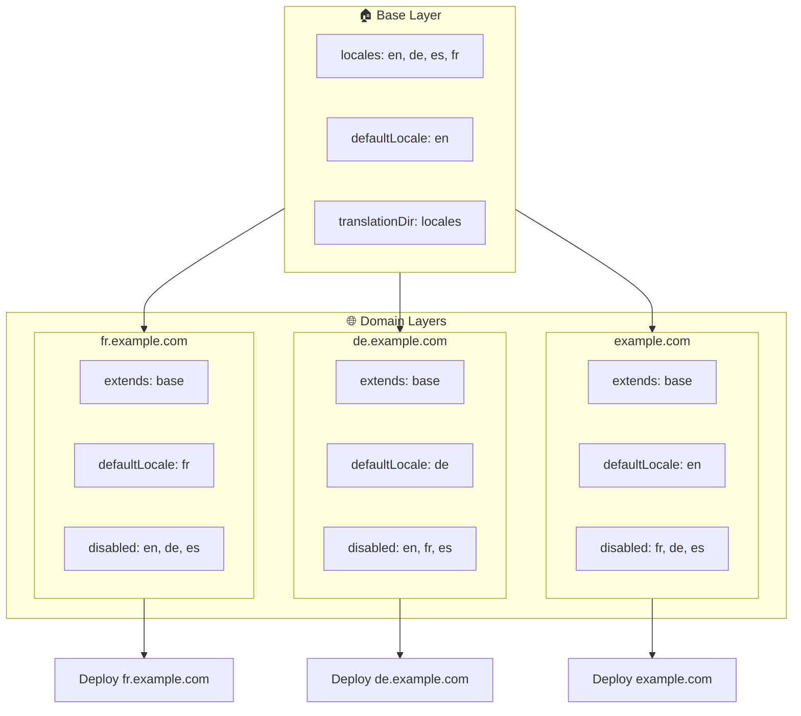

# 🌍 Настройка мультидоменных локалей в `Nuxt I18n Micro` с помощью слоёв

## 📝 Введение

Используя слои в `Nuxt I18n Micro`, вы можете создать гибкий и поддерживаемый мультидоменный сетап локализации. Такой подход не только упрощает управление доменами, устраняя необходимость в сложной функциональности, но и позволяет эффективно распределять нагрузку и снижать сложность проекта. Запуская отдельные проекты для разных локалей, приложение легко масштабируется и адаптируется к различным требованиям по локалям на нескольких доменах, предоставляя надёжное и масштабируемое решение для глобальных приложений.

## 🎯 Цель

Создать сетап, где разные домены обслуживают конкретные локали за счёт настройки в дочерних слоях. Этот метод использует систему слоёв Nuxt, позволяя поддерживать базовую конфигурацию и расширять или изменять её для каждого домена.

### Архитектура мультидоменного решения



## 🛠 Шаги внедрения мультидоменных локалей

### 1. **Создайте базовый слой**

Начните с создания слоя базовой конфигурации, куда войдут общие настройки локалей приложения. Эта конфигурация станет фундаментом для доменных настроек.

#### **Конфигурация базового слоя**

Создайте файл базовой конфигурации `base/nuxt.config.ts`:

```typescript
// base/nuxt.config.ts

export default defineNuxtConfig({
  i18n: {
    locales: [
      { code: 'en', iso: 'en-US', dir: 'ltr' },
      { code: 'de', iso: 'de-DE', dir: 'ltr' },
      { code: 'es', iso: 'es-ES', dir: 'ltr' },
    ],
    defaultLocale: 'en',
    translationDir: 'locales',
    meta: true,
    autoDetectLanguage: true,
  },
})
```

### 2. **Создайте дочерние слои для доменов**

Для каждого домена создайте дочерний слой, который меняет базовую конфигурацию под требования этого домена. Локали, которые не нужны на конкретном домене, можно отключить.

#### **Пример: конфигурация для французского домена**

Создайте конфигурацию дочернего слоя для французского домена в `fr/nuxt.config.ts`:

```typescript
// fr/nuxt.config.ts

export default defineNuxtConfig({
  extends: '../base', // Inherit from the base configuration

  i18n: {
    locales: [
      { code: 'en', iso: 'en-US', dir: 'ltr', disabled: true }, // Disable English
      { code: 'fr', iso: 'fr-FR', dir: 'ltr' }, // Add and enable the French locale
      { code: 'de', iso: 'de-DE', dir: 'ltr', disabled: true }, // Disable German
      { code: 'es', iso: 'es-ES', dir: 'ltr', disabled: true }, // Disable Spanish
    ],
    defaultLocale: 'fr', // Set French as the default locale
    autoDetectLanguage: false, // Disable automatic language detection
  },
})
```

#### **Пример: конфигурация для немецкого домена**

Аналогично создайте конфигурацию дочернего слоя для немецкого домена в `de/nuxt.config.ts`:

```typescript
// de/nuxt.config.ts

export default defineNuxtConfig({
  extends: '../base', // Inherit from the base configuration

  i18n: {
    locales: [
      { code: 'en', iso: 'en-US', dir: 'ltr', disabled: true }, // Disable English
      { code: 'fr', iso: 'fr-FR', dir: 'ltr', disabled: true }, // Disable French
      { code: 'de', iso: 'de-DE', dir: 'ltr' }, // Use the German locale
      { code: 'es', iso: 'es-ES', dir: 'ltr', disabled: true }, // Disable Spanish
    ],
    defaultLocale: 'de', // Set German as the default locale
    autoDetectLanguage: false, // Disable automatic language detection
  },
})
```

### 3. **Разверните приложение для каждого домена**

Разверните приложение с соответствующей конфигурацией на каждом домене. Например:

- Деплой конфигурации слоя `fr` на `fr.example.com`.
- Деплой конфигурации слоя `de` на `de.example.com`.

### 4. **Настройте несколько проектов для разных локалей**

Для каждой локали и домена вам нужно запустить отдельный инстанс приложения. Это гарантирует, что каждый домен обслуживает правильную конфигурацию локали, оптимизирует распределение нагрузки и упрощает структуру проекта. Запуская отдельные проекты, заточенные под каждую локаль, вы получаете чистое разделение конфигураций и снижаете общую сложность сетапа.

### 5. **Настройте роутинг по домену**

Убедитесь, что маршрутизация направляет пользователей на правильный проект в зависимости от домена. Это гарантирует, что каждый домен обслуживает нужную локаль, улучшая пользовательский опыт и поддерживая единообразие между регионами.

### 6. **Разверните и проверьте**

После настройки слоёв и деплоя на соответствующие домены убедитесь, что каждый домен отдаёт правильную локаль. Тщательно протестируйте приложение, чтобы подтвердить: нужная локаль загружается в зависимости от домена.

## 📝 Лучшие практики

- **Держите базовую конфигурацию общей**: Базовая конфигурация должна содержать общие настройки, применимые ко всем доменам.
- **Изолируйте специфику доменов**: Держите настройки, специфичные для домена, в соответствующих слоях, чтобы сохранять ясность и разделение обязанностей.

## 🎉 Заключение

Используя слои в `Nuxt I18n Micro`, вы можете построить гибкий и поддерживаемый мультидоменный сетап локализации. Такой подход не только устраняет необходимость в сложной функциональности по управлению доменами, но и позволяет эффективно распределять нагрузку и уменьшать сложность проекта. Запуск отдельных проектов для разных локалей гарантирует, что приложение легко масштабируется и адаптируется к разным требованиям локалей на разных доменах, обеспечивая надёжное и масштабируемое решение для глобальных приложений.
