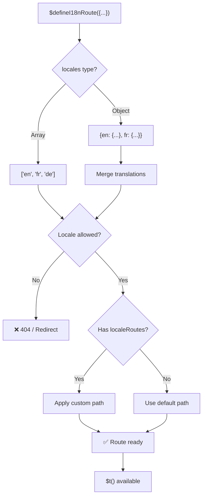
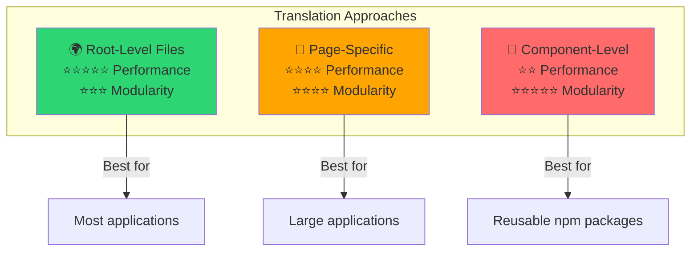

# 📖 Переводы для отдельных компонентов

Научитесь задавать переводы прямо внутри Vue-компонентов через `$defineI18nRoute`, добиваясь модульной и поддерживаемой локализации.

## 📖 Обзор

Функция «Переводы для отдельных компонентов» в `Nuxt I18n Micro` позволяет задавать переводы прямо в конкретных компонентах или страницах через `$defineI18nRoute`. Такой подход хорошо подходит для локализованного контента, уникального для отдельных компонентов, и даёт более модульный и поддерживаемый способ управлять переводами.

## 🚀 Быстрый старт

### Базовое использование

```vue
<template>
  <div>
    <h1>{{ $t('greeting') }}</h1>
    <p>{{ $t('farewell') }}</p>
  </div>
</template>

<script setup lang="ts">
import { useNuxtApp } from '#imports'

const { $defineI18nRoute, $t } = useNuxtApp()

$defineI18nRoute({
  locales: {
    en: { greeting: 'Hello', farewell: 'Goodbye' },
    fr: { greeting: 'Bonjour', farewell: 'Au revoir' },
    de: { greeting: 'Hallo', farewell: 'Auf Wiedersehen' },
  },
})
</script>
```

### Обязательная подготовка (`script setup`)

`$defineI18nRoute` — это инъекция Nuxt-приложения, а не глобальный макрос.
Всегда получайте её через `useNuxtApp()` перед вызовом.

```ts
import { useNuxtApp } from '#imports'

const { $defineI18nRoute } = useNuxtApp()
```

## 🏗️ Route meta на этапе сборки

На этапе сборки Vite unplugin сканирует страничные `.vue`-файлы на вызовы `defineI18nRoute(...)` / `$defineI18nRoute(...)` и извлекает ограничения по локалям, `localeRoutes` и `disableMeta` в метаданные маршрута, которые использует `@i18n-micro/route-strategy`.

- **Сборка**: unplugin (`src/unplugin-define-i18n-route.ts`) работает во время Vite transform и записывает `i18n-route-meta.json` в каталог сборки Nuxt.
- **Рантайм**: define-плагин (`03.define.ts`) по-прежнему выставляет `$defineI18nRoute` в `script setup` для dev и inline-конфигурации.

Обычно вы вызываете `$defineI18nRoute` только на страницах — модуль автоматически берёт извлечение на этапе сборки на себя.

## 🔧 Функция `$defineI18nRoute`

Функция `$defineI18nRoute` настраивает поведение маршрута в зависимости от текущей локали и позволяет:

- Управлять доступом к конкретным маршрутам в зависимости от доступных локалей
- Указывать переводы для конкретных локалей
- Задавать свои маршруты для разных локалей
- Управлять генерацией мета-тегов

### Как это работает



### Сигнатура метода

```typescript
const { $defineI18nRoute } = useNuxtApp();
$defineI18nRoute(routeDefinition: DefineI18nRouteConfig);
```

### Параметры

| Параметр       | Тип                                        | Описание                              |
| -------------- | ------------------------------------------ | ---------------------------------- |
| `locales`      | `string[] \| Record<string, Translations>` | Доступные локали для маршрута      |
| `localeRoutes` | `Record<string, string>`                   | Свои маршруты для конкретных локалей |
| `disableMeta`  | `boolean \| string[]`                      | Управление генерацией i18n мета-тегов |

### Подробное описание параметров

#### `locales`

Определяет, какие локали доступны для маршрута:

<CodeGroup>
```typescript Array Format
$defineI18nRoute({
  locales: ['en', 'fr', 'de'], // Simple array of locale codes
})
```

```typescript Object Format
$defineI18nRoute({
  locales: {
    en: { greeting: 'Hello', farewell: 'Goodbye' },
    fr: { greeting: 'Bonjour', farewell: 'Au revoir' },
    de: { greeting: 'Hallo', farewell: 'Auf Wiedersehen' },
    ru: {}, // Russian locale allowed but no translations provided
  },
})
```
</CodeGroup>

#### `localeRoutes`

Позволяет задать свои маршруты для конкретных локалей:

```typescript
$defineI18nRoute({
  localeRoutes: {
    en: '/welcome',
    fr: '/bienvenue',
    de: '/willkommen',
    ru: '/privet', // Custom route path for Russian locale
  },
})
```

#### `disableMeta`

Управляет генерацией i18n мета-тегов:

<CodeGroup>
```typescript Disable All Meta
$defineI18nRoute({
  locales: ['en', 'fr', 'de'],
  disableMeta: true, // Disables all i18n meta tags
})
```

```typescript Disable Specific Locales
$defineI18nRoute({
  locales: ['en', 'fr', 'de'],
  disableMeta: ['en', 'fr'], // Only English and French won't have meta tags
})
```
</CodeGroup>

## 💡 Сценарии использования

### 1. Управление доступом на основе локалей

Определите, какие локали разрешены для конкретных маршрутов:

```typescript
$defineI18nRoute({
  locales: ['en', 'fr', 'de'], // Only these locales are allowed for this route
})
```

### 2. Переводы, специфичные для компонента

Используйте объектный формат `locales`, чтобы задать конкретные переводы для каждого маршрута:

```typescript
$defineI18nRoute({
  locales: {
    en: {
      greeting: 'Hello',
      farewell: 'Goodbye',
      description: 'Welcome to our application',
    },
    fr: {
      greeting: 'Bonjour',
      farewell: 'Au revoir',
      description: 'Bienvenue dans notre application',
    },
    de: {
      greeting: 'Hallo',
      farewell: 'Auf Wiedersehen',
      description: 'Willkommen in unserer Anwendung',
    },
  },
})
```

### 3. Кастомная маршрутизация для локалей

Определите свои пути для конкретных локалей:

```typescript
$defineI18nRoute({
  locales: ['en', 'fr', 'de'],
  localeRoutes: {
    en: '/welcome',
    fr: '/bienvenue',
    de: '/willkommen',
  },
})
```

### 4. Отключение мета-тегов

Управляйте генерацией SEO-мета-тегов для конкретных маршрутов или локалей:

```typescript
// Disable meta tags for all locales
$defineI18nRoute({
  locales: ['en', 'fr', 'de'],
  disableMeta: true,
})

// Disable meta tags only for specific locales
$defineI18nRoute({
  locales: ['en', 'fr', 'de'],
  disableMeta: ['en', 'fr'],
})
```

## ✅ Поддерживаемые форматы конфигурации

Парсер `$defineI18nRoute` поддерживает разные JavaScript-конфигурации:

### Статические конфигурации

<CodeGroup>
```typescript Static Arrays
$defineI18nRoute({
  locales: ['en', 'de', 'fr'],
})
```

```typescript Static Objects
$defineI18nRoute({
  locales: {
    en: { greeting: 'Hello' },
    de: { greeting: 'Hallo' },
  },
  localeRoutes: {
    en: '/welcome',
    de: '/willkommen',
  },
})
```
</CodeGroup>

### Динамические конфигурации

<CodeGroup>
```typescript Variables and Functions
const locales = ['en', 'de', 'fr']
const routes = { en: '/welcome', de: '/willkommen' }

$defineI18nRoute({
  locales: locales,
  localeRoutes: routes,
})
```

```typescript Template Literals
const prefix = 'api'

$defineI18nRoute({
  locales: [`${prefix}-en`, `${prefix}-de`],
  localeRoutes: {
    [`${prefix}-en`]: `/api/welcome`,
    [`${prefix}-de`]: `/api/willkommen`,
  },
})
```
</CodeGroup>

### Продвинутые конфигурации

<CodeGroup>
```typescript Spread Operator
const baseLocales = ['en', 'de']
const additionalLocales = ['fr', 'es']

$defineI18nRoute({
  locales: [...baseLocales, ...additionalLocales],
})
```

```typescript Array of Objects
$defineI18nRoute({
  locales: [
    { code: 'en', name: 'English' },
    { code: 'de', name: 'German' },
  ],
})
```
</CodeGroup>

### Условная логика

```typescript
$defineI18nRoute({
  locales: process.env.NODE_ENV === 'production' ? ['en', 'de'] : ['en', 'de', 'fr', 'es'],
})
```

### Сложные вложенные объекты

```typescript
$defineI18nRoute({
  locales: {
    'en-us': {
      region: 'US',
      currency: 'USD',
      format: {
        date: 'MM/DD/YYYY',
        time: '12h',
      },
    },
    'de-de': {
      region: 'DE',
      currency: 'EUR',
      format: {
        date: 'DD.MM.YYYY',
        time: '24h',
      },
    },
  },
})
```

### Комментарии и форматирование

```typescript
$defineI18nRoute({
  // Supported locales for this component
  locales: [
    'en', // English
    'de', // German
    'fr', // French
  ],
  // Custom routes for each locale
  localeRoutes: {
    en: '/welcome',
    de: '/willkommen',
    fr: '/bienvenue',
  },
})
```

## ❌ Не поддерживается

У парсера есть ограничения, он не может обработать:

- **Внешние импорты** (`import`)
- **Функции с async/await**
- **Методы классов**
- **Сложный поток управления** (циклы, try-catch, switch)
- **Стрелочные функции** в конфигурации
- **Функции-генераторы**

## 📝 Полный пример

Комплексный пример, использующий все возможности:

```vue
<template>
  <div class="welcome-page">
    <header>
      <h1>{{ $t('title') }}</h1>
      <p>{{ $t('subtitle') }}</p>
    </header>

    <main>
      <section>
        <h2>{{ $t('features.title') }}</h2>
        <ul>
          <li v-for="feature in $t('features.list')" :key="feature">
            {{ feature }}
          </li>
        </ul>
      </section>

      <section>
        <h2>{{ $t('contact.title') }}</h2>
        <p>{{ $t('contact.description') }}</p>
        <a :href="$t('contact.email')">{{ $t('contact.email') }}</a>
      </section>
    </main>

    <footer>
      <p>{{ $t('footer.copyright') }}</p>
    </footer>
  </div>
</template>

<script setup lang="ts">
import { useNuxtApp } from '#imports'

const { $defineI18nRoute, $t } = useNuxtApp()

// Define comprehensive i18n route configuration
$defineI18nRoute({
  locales: {
    en: {
      title: 'Welcome to Our Platform',
      subtitle: 'The best solution for your needs',
      features: {
        title: 'Key Features',
        list: ['High Performance', 'Easy to Use', 'Scalable Architecture'],
      },
      contact: {
        title: 'Get in Touch',
        description: "We'd love to hear from you",
        email: 'mailto:contact@example.com',
      },
      footer: {
        copyright: '© 2024 Example Company. All rights reserved.',
      },
    },
    fr: {
      title: 'Bienvenue sur Notre Plateforme',
      subtitle: 'La meilleure solution pour vos besoins',
      features: {
        title: 'Fonctionnalités Clés',
        list: ['Haute Performance', 'Facile à Utiliser', 'Architecture Évolutive'],
      },
      contact: {
        title: 'Contactez-Nous',
        description: 'Nous aimerions avoir de vos nouvelles',
        email: 'mailto:contact@example.com',
      },
      footer: {
        copyright: '© 2024 Example Company. Tous droits réservés.',
      },
    },
    de: {
      title: 'Willkommen auf Unserer Plattform',
      subtitle: 'Die beste Lösung für Ihre Bedürfnisse',
      features: {
        title: 'Hauptfunktionen',
        list: ['Hohe Leistung', 'Einfach zu Verwenden', 'Skalierbare Architektur'],
      },
      contact: {
        title: 'Kontaktieren Sie Uns',
        description: 'Wir würden gerne von Ihnen hören',
        email: 'mailto:contact@example.com',
      },
      footer: {
        copyright: '© 2024 Example Company. Alle Rechte vorbehalten.',
      },
    },
  },
  localeRoutes: {
    en: '/welcome',
    fr: '/bienvenue',
    de: '/willkommen',
  },
  disableMeta: false, // Enable SEO meta tags
})
</script>

<style scoped>
.welcome-page {
  max-width: 800px;
  margin: 0 auto;
  padding: 2rem;
}

header {
  text-align: center;
  margin-bottom: 3rem;
}

section {
  margin-bottom: 2rem;
}

footer {
  text-align: center;
  margin-top: 3rem;
  padding-top: 2rem;
  border-top: 1px solid #eee;
}
</style>
```

## ⚡ Соображения по производительности

Встраивание переводов в Single File Components (SFC) может повлиять на производительность:

### Возможные проблемы

- **Увеличение размера файла**: Все локали лежат в SFC, в отличие от отдельных файлов, поддерживающих загрузку под локаль.
- **Более медленный рендеринг**: Внутрифайловые переводы обрабатываются в рантайме.
- **Использование памяти**: Загружаются все переводы, независимо от текущей локали.

### Лучшие практики

- **Используйте постраничные переводы** ради максимальной производительности.
- **Оставляйте переводы на уровне компонента** для специальных случаев:
  - Переиспользуемых компонентов, публикуемых в npm
  - Переводов, неподходящих для корневых файлов
  - Самодостаточных компонентов

### Производительность vs модульность

Балансируйте нужды проекта при выборе подхода:



| Подход              | Производительность | Модульность | Сценарий             |
| -------------------- | ----------- | ---------- | ------------------- |
| **Корневые файлы**   | ⭐⭐⭐⭐⭐  | ⭐⭐⭐     | Большинство приложений |
| **Постраничные**     | ⭐⭐⭐⭐    | ⭐⭐⭐⭐   | Крупные приложения   |
| **На уровне компонента** | ⭐⭐    | ⭐⭐⭐⭐⭐ | Переиспользуемые компоненты |

## 🎯 Лучшие практики

### 1. Держите переводы рядом с компонентами

Определяйте переводы непосредственно в соответствующем компоненте, чтобы локализованный контент оставался упорядоченным и удобным в сопровождении.

### 2. Используйте объекты локалей для гибкости

Применяйте объектный формат для свойства `locales`, когда нужны конкретные переводы или контроль доступа по локалям.

### 3. Документируйте пользовательские маршруты

Чётко документируйте любые кастомные маршруты для разных локалей, чтобы поддерживать ясность и упрощать разработку и сопровождение.

### 4. Учитывайте влияние на производительность

Оценивайте, нужны ли переводы на уровне компонента в вашем случае, с учётом влияния на производительность.

### 5. Используйте TypeScript

Пользуйтесь TypeScript ради типобезопасности и IntelliSense:

```typescript
interface ComponentTranslations {
  title: string
  subtitle: string
  features: {
    title: string
    list: string[]
  }
}

$defineI18nRoute({
  locales: {
    en: {
      title: 'Welcome',
      subtitle: 'Subtitle',
      features: {
        title: 'Features',
        list: ['Feature 1', 'Feature 2'],
      },
    } as ComponentTranslations,
  },
})
```

## 📚 Смежные темы

- **[Быстрый старт](/quickstart)** — базовая настройка и конфигурация
- **[Справочник API](/api/methods)** — полная документация методов
- **[Примеры](/examples)** — примеры реального использования

## Итог

Функция «Переводы для отдельных компонентов», построенная вокруг `$defineI18nRoute`, даёт мощный и гибкий способ управлять локализацией в приложении Nuxt. Она позволяет определять локализованный контент и маршруты на уровне компонентов, создавая максимально настраиваемый и удобный интерфейс, подстраивающийся под язык и региональные предпочтения аудитории.

Выбирайте подход, лучше отвечающий нуждам проекта, учитывая и требования к производительности, и удобство сопровождения.
