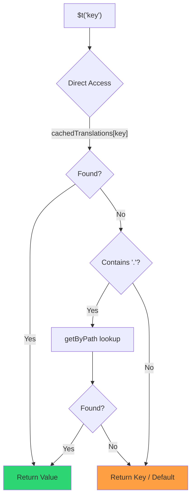

# 🚀 Руководство по производительности

## 📖 Введение

`Nuxt I18n Micro` спроектирован с оглядкой на производительность и заметно улучшает показатели по сравнению с классическими модулями интернационализации (i18n), такими как `nuxt-i18n`. Это руководство подробно рассматривает преимущества `Nuxt I18n Micro` в производительности и сравнивает его с другими решениями.

## 🤔 Почему это важно?

В крупных проектах и высоконагруженных окружениях узкие места по производительности приводят к медленным сборкам, повышенному потреблению памяти и медленным ответам сервера. Эти проблемы усиливаются со сложными i18n-сетапами и большими файлами переводов. `Nuxt I18n Micro` разработан именно для этих задач, оптимизируя скорость, потребление памяти и минимальное влияние на размер бандла.

## 📊 Сравнение производительности

Мы провели серию тестов на одинаковых фикстурах через `pnpm test:performance` (`pnpm -C scripts cli performance`) против **`@nuxtjs/i18n@10.6.0`**. Полная методология и графики: [Результаты тестов производительности](/guides/performance-results).

Дефолтный профиль CLI: **4 локали** × **2 страницы** (`index`, `page`) × ~10k листовых ключей index. Повышайте `--locales` / `--keys` для более тяжёлых регрессионных нагрузок. Отчёт разбивает **код**, **переводы** (включая `chunks/raw/*` у `@nuxtjs/i18n`) и **итоговый** деплоящийся выход.

```bash
pnpm test:performance
pnpm -C scripts cli performance --only micro --skip-stress
pnpm -C scripts cli performance --locales 12 --keys 100000 --runs 3
```

### ⏱️ Время сборки и потребление ресурсов

<Accordion title="**@nuxtjs/i18n v10.6**">
- **Код-бандл**: 2.16 MB
- **Переводы**: 7.21 MB (message-чанки + payload'ы локалей)
- **Итого деплой**: 9.37 MB
- **Пик потребления памяти**: 1 821 MB
- **Время**: 8.34s (среднее из 3)
</Accordion>

<Tip>
- **Код-бандл**: 1.74 MB — **~на 19% меньше кода, чем у `@nuxtjs/i18n` v10.6**
- **Переводы**: 6.8 MB (ленивая загрузка JSON)
- **Итого деплой**: 8.54 MB
- **Пик потребления памяти**: 1 065 MB — **~на 41% меньше памяти, чем у `@nuxtjs/i18n` v10.6**
- **Время**: 5.34s — **~на 36% быстрее, чем `@nuxtjs/i18n` v10.6** (≈ baseline plain-nuxt)
</Tip>

> Старые документы, где у `@nuxtjs/i18n` было «код ≈ 15 MB / переводы 0 B», засчитывали файлы сообщений `chunks/raw` как код приложения. Текущий классификатор разделяет их: разрыв по **коду** меньше, но micro всё равно лидирует по времени сборки, пиковому RSS и нагрузочным тестам.

Графики, результаты Autocannon и детали фикстур смотрите в [полном отчёте бенчмарков](/guides/performance-results).

### 🌐 Производительность сервера под нагрузкой

Artillery (6s@6 + 60s@60) и Autocannon (10c / 10s), среднее из 3 последовательных запусков на фикстуру.

<Accordion title="**@nuxtjs/i18n v10.6**">
- **Запросов в секунду (Artillery)**: 143 [#/sec]
- **Среднее время ответа**: 956 ms
- **Autocannon RPS / средняя латентность**: 72 / 139 ms
</Accordion>

<Tip>
- **Запросов в секунду (Artillery)**: 275 [#/sec] — **~на 93% больше, чем `@nuxtjs/i18n` v10.6**
- **Среднее время ответа**: 483 ms — **~на 49% быстрее, чем `@nuxtjs/i18n` v10.6**
- **Autocannon RPS / средняя латентность**: 162 / 62 ms
</Tip>

### 📈 Наглядное сравнение

<Note>
Интерактивный график в документации Mintlify опущен. См. таблицы бенчмарков на этой странице или [документацию VitePress](https://s00d.github.io/nuxt-i18n-micro/guide/performance-results) для графика: `chart`.
</Note>

<Note>
Интерактивный график в документации Mintlify опущен. См. таблицы бенчмарков на этой странице или [документацию VitePress](https://s00d.github.io/nuxt-i18n-micro/guide/performance-results) для графика: `chart`.
</Note>

| Метрика         | @nuxtjs/i18n v10.6 | i18n-micro | Улучшение          |
| --------------- | ------------------ | ---------- | ------------------ |
| Время сборки    | 8.34s              | 5.34s      | **~на 36% быстрее** |
| Память (сборка) | 1 821 MB           | 1 065 MB   | **~на 41% меньше** |
| Код-бандл       | 2.16 MB            | 1.74 MB    | **~на 19% меньше** |
| Время ответа    | 956 ms             | 483 ms     | **~на 49% быстрее** |
| RPS (Artillery) | 143                | 275        | **~на 93% больше** |

### 🔍 Интерпретация результатов

Против текущей `@nuxtjs/i18n` **v10.6** (дефолтный профиль CLI, среднее из 3):

- 🗜️ **Меньший граф кода**: ~1.74 MB против ~2.16 MB, когда message-чанки не маркируются как «код».
- 🧠 **Меньший RSS при сборке**: пик ~1.1 GB против ~1.8 GB.
- 🕒 **Быстрее сборки**: ~5.3s против ~8.3s (micro на этом профиле сравнивается с baseline plain-Nuxt).
- ⚡ **Гораздо лучше под нагрузкой**: ~275 против ~143 Artillery RPS, ~162 против ~72 Autocannon RPS, меньшая средняя латентность.

Абсолютные цифры отличаются от опубликованных ранее таблиц (меньшие словари, более старый Nuxt и «нечестное» деление «0 B переводов» у `@nuxtjs/i18n`). По направлению всё то же: micro остаётся впереди по стоимости сборки и пропускной способности.

## ⚙️ Ключевые оптимизации

### 🛠️ Минималистичная архитектура

`Nuxt I18n Micro` построен вокруг минималистичной архитектуры с небольшим ядром и выделенными пакетами стратегий. Это снижает накладные расходы и упрощает внутреннюю логику, что приводит к росту производительности.

### 🚦 Эффективный роутинг

В v3 генерация маршрутов и рантайм-логика путей разделены на отдельные пакеты ради оптимального tree-shaking:

- **`@i18n-micro/route-strategy`** — Генерация маршрутов на этапе сборки: расширяет страницы Nuxt локализованными маршрутами. В бандл попадает только выбранная стратегия (`no_prefix`, `prefix`, `prefix_except_default`, `prefix_and_default`).
- **`@i18n-micro/path-strategy`** — Рантайм-разрешение путей, редиректы и генерация ссылок. Использует чистые функции и предвычисленные флаги контекста, минимизируя аллокации в горячих путях. Subpath-экспорты (`/prefix`, `/no-prefix` и т. д.) гарантируют, что попадает только выбранная реализация.

Такой подход держит конфигурацию роутинга лёгкой и обеспечивает быстрое разрешение маршрутов независимо от числа локалей.

### 📂 Оптимизированная загрузка переводов

Модуль поддерживает только JSON-файлы для переводов с чётким разделением на глобальные и постраничные файлы. Так в любой момент загружаются только нужные данные, что дополнительно повышает производительность.

### 🔒 Синглтон-кэш через globalThis

Начиная с v3.0.0 модуль использует паттерн синглтона на `globalThis` с `Symbol.for`, чтобы гарантировать единственный экземпляр кэша во всём процессе Node.js. Это предотвращает:

- Дублирование кэша, если один и тот же модуль бандлится несколько раз
- Пересоздание объектов на каждый запрос, порождающее давление на GC
- Утечки памяти из-за «осиротевших» экземпляров кэша

```mermaid
flowchart LR
    subgraph Process["Node.js Process"]
        G["globalThis[Symbol.for('CACHE')]"]

        subgraph R1["SSR Request 1"]
            P1[Plugin Instance] --> G
        end

        subgraph R2["SSR Request 2"]
            P2[Plugin Instance] --> G
        end

        subgraph R3["SSR Request 3"]
            P3[Plugin Instance] --> G
        end
    end

    G --> Cache["Single Map Instance"]
    Cache --> D1["en:index → translations"]
    Cache --> D2["en:about → translations"
```

```typescript
// Internal implementation pattern
const CACHE_KEY = Symbol.for('__NUXT_I18N_STORAGE_CACHE__')
if (!globalThis[CACHE_KEY]) {
  globalThis[CACHE_KEY] = new Map()
}
```

### ⚡ Оптимизированная функция перевода (tFast)

Функция `$t()` использует стратегию прямого lookup, оптимизированную под скорость:

1. **Предвычисленный контекст**: Локаль и имя маршрута вычисляются один раз при навигации, а не при каждом вызове `$t()`
2. **Один источник для lookup**: Все переводы (корневые + постраничные + fallback) заранее объединяются на этапе сборки в один файл на страницу — многоуровневый поиск не нужен
3. **Кумулятивный deep merge при навигации**: При переходе внутри одной локали новые переводы страницы глубоко мёржатся (глубина 2) в активный словарь, поэтому ключи предыдущей страницы остаются видимыми во время анимаций перехода — даже когда страницы делят пересекающиеся вложенные префиксы (например, обе имеют ключи под `common.*`)
4. **Сборка мусора через `page:transition:finish`**: После завершения анимации перехода объединённый словарь заменяется чистыми переводами только новой страницы, освобождая память от ключей старой
5. **Прямой доступ к свойствам**: Использует `obj[key]` вместо Map-lookup'ов на горячих путях



```typescript
// Simplified lookup logic — single active dictionary
let val = cachedTranslations[key]
if (val === undefined && key.includes('.')) {
  val = getByPath(cachedTranslations, key)
}
```

### 💉 Серверная загрузка (без встраивания в HTML)

Переводы, загруженные при SSR, остаются в **памяти сервера** для `$t` во время рендера. Они **не** копируются ни в `nuxtApp.payload`, ни в HTML-документ (та же идея, что у `@nuxtjs/i18n` с `experimental.preload: false`).

На клиенте `01.plugin.ts` делает `await` `switchContext`, который загружает `/\{apiBaseUrl\}/:page/:locale/data.json` до того, как приложение продолжит работу — один запрос вместо 8 MB inline-блоба.

`NuxtI18n` по-прежнему хранит активный объединённый словарь (`cachedTranslations`) для `$t()` / `$has()`. Навигации в пределах одной локали глубоко мёржат постраничные чанки, пока `page:transition:finish` не уберёт устаревшие ключи.

#### Как обстоят дела сегодня

Числа ниже читаются из файла бюджета, который измеряет и контролирует `pnpm run budget:payload`.

{/* generated:payload-budget — do not edit; run `pnpm run docs:generate` */}

Измерения на `playground` для `/`, `/de`:

| Измерение | Размер |
| --- | --- |
| Исходники переводов на диске | 15.2 MB |
| Отдаётся отдельными файлами payload | 76.3 MB |
| Крупнейший inline `__NUXT_DATA__` | 6.9 MB |
| Клиентские ассеты | 449.5 KB |

В playground сознательно раздутый словарь, поэтому такие цифры не стоит ожидать в реальном приложении. Это фиксированная точка отсчёта. Бюджет падает, когда цифры неожиданно растут, — так замечается случайное изменение того, что вообще везёт payload.

{/* /generated:payload-budget */}

### 💾 Кэширование и пре-рендеринг

Переводы проходят через несколько кэшей, и понимание, какой из них ответил на запрос, — это разница между пятью минутами и пятью часами отладки. Их четыре, в порядке, в котором запрос их встречает:

| Уровень | Где | Время жизни | Чем очищается |
| --- | --- | --- | --- |
| Браузер / CDN | `Cache-Control` для `/\{apiBaseUrl\}/**` | `httpCacheDuration`, `immutable` | новым `?v=` — то есть деплоем, изменившим переводы |
| Nitro route cache | `routeRules['/\{apiBaseUrl\}/**'].cache` | 60 s, stale-while-revalidate | перезапуском сервера |
| Server loader | in-process `CacheControl`, ключ `locale:routeName` | до перезапуска процесса, или `cacheTtl` | перезапуском сервера, HMR в dev |
| Клиентское хранилище | `translationStorage` + активный чанк в `NuxtI18n` | время жизни страницы | перезагрузкой |

Два правила защищают их от противоречий:

- **Nitro route cache существует только когда есть `?v=`.** С cache-buster'ом каждый URL уникален для своего содержимого, поэтому его серверное кэширование не приводит к устаревшим ответам. Установите `dateBuild: 0`, и этот уровень отключится, потому что URL становится стабильным, а ответ говорит `must-revalidate` — серверный кэш иначе отдавал бы устаревшую запись до минуты и незаметно ломал бы гарантии.
- **`immutable` тоже требует `?v=`.** Без cache-buster'а заголовок будет `public, max-age=0, must-revalidate`, что бы ни говорил `httpCacheDuration`: длинный `max-age` на URL, который никогда не меняется, зафиксирует первый ответ, что увидел браузер.

<Warning>
При `translationPayloads.publicAssets` (по умолчанию в режиме premerged) payload'ы копируются в
`public/<apiBaseUrl>/\{page\}/\{locale\}/data.json`. Платформа, отдающая этот каталог сама (Cloudflare Pages, Firebase Hosting, `npx serve`), применяет свои заголовки — заголовок из Nitro `routeRules` касается только ответов, идущих через сервер. Политику кэша для этих статических файлов задавайте в конфигурации самой платформы.
</Warning>

🏁 **Пре-рендеринг**: в режиме premerged `publicAssets` уже пишет клиентское дерево URL в `public/`. Включайте `prerenderRoutes`, только если вам нужно, чтобы Nitro материализовал маршруты-хендлеры при отключённой этой копии.

### 🗜️ Сжатые публичные payload'ы

Когда включена `nitro.compressPublicAssets`, payload'ы переводов, скопированные в public-каталог, тоже получают `.gz`- и `.br`-соседей:

```ts
export default defineNuxtConfig({
  nitro: { compressPublicAssets: true },
})
```

Nitro сжимает публичные ассеты до хука, копирующего payload'ы, поэтому без этого они были бы единственной несжатой частью статической сборки. Модуль сам не включает сжатие — он лишь применяет ваш выбор. Селекция по кодировкам (`\{ gzip: true, brotli: false \}`) уважается.

Payload index в playground: 6 651 984 B сырых, 1 012 831 B gzip, 821 617 B brotli.

### ☁️ Serverless-выход payload'а

На **Node** SSR читает JSON переводов из `public/<apiBaseUrl>` (`readFile`, без Nitro `serverAssets` / Rollup `raw:`). На **Edge** Nitro `serverAssets` встраивает то же дерево (для больших каталогов предпочтительно `mode: 'source'`).

```typescript
export default defineNuxtConfig({
  i18n: {
    translationPayloads: {
      serverAssets: true, // default — Node → public copy; Edge → serverAssets embed
      publicAssets: true, // default in premerged mode
    },
  },
})
```

Используйте `translationPayloads.mode: 'source'` для компактных Edge-embed'ов (и опционально компактных публичных копий):

```typescript
export default defineNuxtConfig({
  i18n: {
    translationPayloads: {
      mode: 'source',
    },
  },
})
```

`mode: 'source'` держит объединённые слои исходников компактными и мёржит root/page/fallback в рантайме через встроенный маршрут `/_locales` (или Edge `assets:i18n`). По умолчанию он отключает копирование в public и пререндер payload-маршрутов.

<Warning>
`prerenderRoutes` по умолчанию `false`. В `mode: 'source'` `publicAssets` тоже по умолчанию `false`. Поэтому чистый статический хостинг без Nitro/edge-рантайма не сможет загрузить переводы на клиенте, если вы не включите один из этих выходов, не сохраните `serverHandler` доступным в рантайме или не будете хостить payload'ы внешне.

Дефолтный premerged + `publicAssets` уже кладёт `/\{apiBaseUrl\}/\{page\}/\{locale\}/data.json` под `public/`, так что статические хосты смогут обслуживать клиентские запросы без Nitro.
</Warning>

<Warning>
Установка `apiBaseServerHost` или `apiBaseClientHost` переносит отдачу payload'ов на этот origin, что имеет свои требования — см. [Конфигурация → Внешние CDN-хосты](/guides/configuration#external-cdn-hosts).
</Warning>

Либо отключите отдельные HTTP/public-выходы и хостите payload'ы снаружи:

```typescript
export default defineNuxtConfig({
  i18n: {
    apiBaseClientHost: 'https://cdn.example.com',
    apiBaseServerHost: 'https://cdn.example.com',
    translationPayloads: {
      serverHandler: false,
      publicAssets: false,
      prerenderRoutes: false,
    },
  },
})
```

Оставляйте `serverHandler` включённым, когда полагаетесь на встроенный локальный маршрут `/\{apiBaseUrl\}/:page/:locale/data.json`. Отключайте его, когда payload'ы хостятся снаружи и `apiBaseServerHost` указывает на этот внешний origin. Включайте `prerenderRoutes`, только когда нужно, чтобы Nitro материализовал статические маршруты payload'ов и `publicAssets` их не записал.

Во время сборки модуль предупреждает, когда объём сгенерированного payload'а превышает `translationPayloads.warnFileCount` (по умолчанию 500) или `translationPayloads.warnSizeBytes` (по умолчанию 10 MB). Он также предупреждает, когда все локальные выходы отключены без настроенных внешних хостов payload'ов.

## 📝 Советы по максимальной производительности

Несколько советов, чтобы выжать из `Nuxt I18n Micro` максимум:

- 📉 **Ограничивайте данные локалей**: Включайте в проект только те локали, которые нужны, чтобы держать бандл небольшим.
- 🗂️ **Используйте постраничные переводы**: Организуйте файлы переводов по страницам, чтобы не грузить лишние данные.
- 💾 **Включайте кэширование**: Пользуйтесь возможностями кэша, чтобы снизить нагрузку на сервер и ускорить ответы.
- 🏁 **Используйте пре-рендеринг**: Пре-рендерите переводы, чтобы ускорить загрузку страниц и снизить рантайм-оверхед.

Подробные результаты тестов производительности см. в [Результатах тестов](/guides/performance-results).
