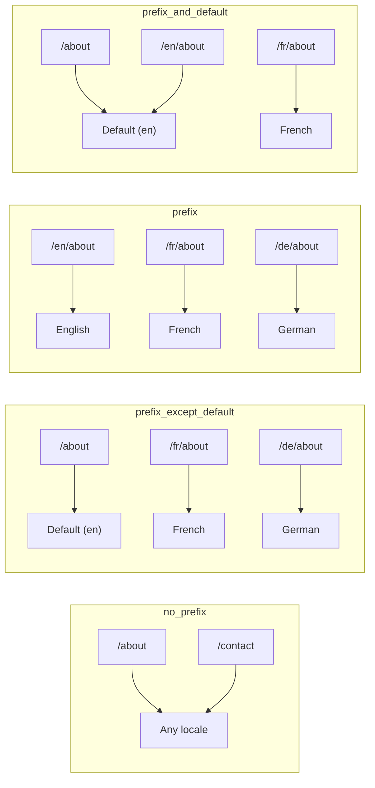
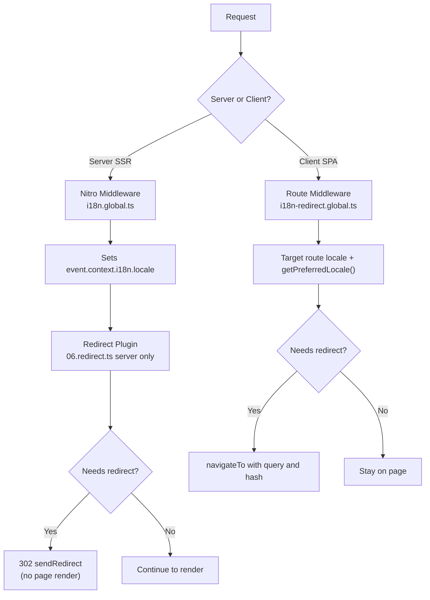

# 🗂️ Стратегии маршрутизации в Nuxt I18n Micro

## 📖 Обзор

Nuxt I18n Micro контролирует, как префиксы локалей отображаются в URL, через опцию `strategy`. Под капотом это реализуют два пакета:

- **`@i18n-micro/route-strategy`** — генерация маршрутов на этапе сборки (расширяет страницы Nuxt локализованными маршрутами)
- **`@i18n-micro/path-strategy`** — resolve путей во время выполнения, перенаправления, SEO-атрибуты и генерация ссылок

Модуль Nuxt выбирает правильный класс стратегии на этапе сборки и создаёт для него алиас через `#i18n-strategy`, поэтому в бандл попадает только выбранная реализация.

## 🚦 Доступные стратегии

{/* generated:option:strategy — do not edit; run `pnpm run docs:generate` */}

**Тип** `Strategies` · **По умолчанию** `'prefix_except_default'`

Стратегия маршрутизации URL для префиксов локалей.

- `'no_prefix'` — нет локали в URL; локаль хранится в cookie.
- `'prefix_except_default'` — префикс для всех локалей, кроме локали по умолчанию.
- `'prefix'` — всегда префикс, включая локаль по умолчанию.
- `'prefix_and_default'` — как `prefix`, но локаль по умолчанию также доступна без префикса.

{/* /generated:option:strategy */}

### Сравнение стратегий



### 🛑 `no_prefix`

URL не содержат сегмент локали. Локаль определяется по cookies, состоянию `useI18nLocale()` или через определение браузера.

- **Маршруты**: `/about`, `/contact` — одинаковый паттерн URL для всех локалей (без префикса `/en/`, `/fr/`)
- **Сохранение локали**: через `localeCookie` (автоматически устанавливается в `'user-locale'`, если не указано)
- **Пользовательские пути**: поддерживаются через [`globalLocaleRoutes`](/guides/configuration#globallocaleroutes) и [`defineI18nRoute`](/guides/custom-locale-routes) — локализованные slug'и генерируются без добавления префикса локали в URL (например, `/about` и `/ueber-uns`). Вложенные маршруты, псевдонимы и ограничения по локалям проще, чем в `prefix_except_default`.

<Tip>
При использовании `no_prefix` параметр `localeCookie` автоматически устанавливается в `'user-locale'`, если не указано иное. Это необходимо, так как URL не содержит информации о локали.
</Tip>

```typescript
i18n: {
  strategy: 'no_prefix'
  // localeCookie is automatically set to 'user-locale'
}
```

### 🚧 `prefix_except_default`

Все маршруты имеют префикс локали, **кроме** локали по умолчанию.

- **Локаль по умолчанию**: `/about`, `/contact`
- **Другие локали**: `/fr/about`, `/de/contact`
- **Локаль по умолчанию с префиксом возвращает 404**: `/en/about` → 404 (когда `en` — по умолчанию)

```typescript
i18n: {
  strategy: 'prefix_except_default' // This is the default
}
```

### 🌍 `prefix`

Каждый маршрут имеет префикс локали, включая локаль по умолчанию.

- **Все локали**: `/en/about`, `/fr/about`, `/de/about`
- **Корень `/`**: перенаправляет на `/\{locale\}/` в зависимости от предпочтений пользователя

```typescript
i18n: {
  strategy: 'prefix'
}
```

### 🔄 `prefix_and_default`

Локаль по умолчанию доступна как с префиксом, так и без него. Локали, отличные от локали по умолчанию, всегда имеют префикс.

- **Локаль по умолчанию**: и `/about`, и `/en/about` являются валидными
- **Другие локали**: `/fr/about`, `/de/about`
- **Нет перенаправления с `/`**: и `/`, и `/en/` обслуживают локаль по умолчанию

```typescript
i18n: {
  strategy: 'prefix_and_default'
}
```

## 🔀 Архитектура перенаправлений (v3)

В v3 логика перенаправления разделена на два уровня для оптимальной производительности:

### Как это работает



### На стороне сервера (без «мигания»)

1. **Nitro middleware** (`i18n.global.ts`) запускается первым — определяет локаль из URL, cookie или заголовка `Accept-Language` и устанавливает `event.context.i18n.locale`
2. **Плагин перенаправлений** (`06.redirect.ts`, только на сервере) проверяет, нужен ли для текущего пути редирект, используя `i18nStrategy.getClientRedirect()`, и выдаёт 302 **до** какого-либо рендеринга страницы
3. Это предотвращает «мигание ошибки», когда пользователи ненадолго видят неправильную страницу перед перенаправлением

### На стороне клиента (SPA-навигация)

1. Глобальный route middleware (`i18n-redirect.global.ts`) запускается при каждой клиентской навигации, когда включено `redirects`
2. Сначала определяет предпочтительную локаль из **целевого маршрута**, затем откатывается к `useI18nLocale().getPreferredLocale()`
3. Использует `i18nStrategy.getClientRedirect()`, чтобы решить, нужен ли редирект
4. Сохраняет `query` и `hash` при перенаправлении

### Порядок приоритета локалей

На сервере плагин перенаправлений определяет предпочтительную локаль в следующем порядке:

1. **`useState('i18n-locale')`** — высший приоритет (устанавливается программно через `useI18nLocale().setLocale()`)
2. **Cookie** — если настроен `localeCookie`
3. **Заголовок `Accept-Language`** — если `autoDetectLanguage: true`
4. **`defaultLocale`** — окончательный fallback

На клиенте route middleware отдаёт предпочтение локали из целевого маршрута, затем использует ту же цепочку state/cookie в качестве fallback.

### Поведение перенаправлений по стратегиям

| Стратегия               | Поведение `GET /`                              | Требуется cookie? |
| ----------------------- | ---------------------------------------------- | ----------------- |
| `no_prefix`             | Нет редиректа (локаль из cookie/state)         | Устанавливается автоматически |
| `prefix`                | 302 → `/\{locale\}/`                            | Рекомендуется     |
| `prefix_except_default` | 302 → `/\{locale\}/`, если локаль ≠ по умолчанию | Рекомендуется   |
| `prefix_and_default`    | Нет редиректа (и `/`, и `/\{locale\}/` валидны) | Опционально       |

### Отключение перенаправлений

```typescript
i18n: {
  redirects: false // Disables automatic locale redirects
}
```

При `redirects: false` автоматические перенаправления локалей отключены:

- **Сервер**: плагин перенаправлений (`06.redirect.ts`, только на сервере) остаётся зарегистрированным, но пропускает логику редиректа. Он по-прежнему выполняет **проверки 404** для некорректных префиксов локалей (например, `/xx/about`, где `xx` не является валидной локалью) и **синхронизацию cookie** из префикса URL (например, посещение `/fr/about` синхронизирует cookie в `fr`)
- **Клиент**: глобальный route middleware `i18n-redirect` **не регистрируется** — SPA-авторедиректов нет

## 🍪 Сохранение локали через cookie

<Warning>
При использовании `prefix` или `prefix_except_default` с `redirects: true` (по умолчанию) вы **обязаны** установить `localeCookie` для корректной работы перенаправлений. Без cookie плагин перенаправлений не может запомнить предпочтение локали пользователя между перезагрузками страниц.

```typescript
i18n: {
  strategy: 'prefix_except_default',
  localeCookie: 'user-locale' // Required for redirects to work properly
}
```
</Warning>

**Как `localeCookie` работает в v3:**

- Управляется внутри `useI18nLocale()` — **не устанавливайте её вручную** через `useCookie()`
- Когда пользователь посещает URL с префиксом (например, `/fr/about`), cookie автоматически синхронизируется в `fr`
- При следующем посещении `/` значение cookie используется для перенаправления на `/\{locale\}/`
- Если cookie содержит некорректную локаль (не входящую в список `locales`), выполняется fallback на `defaultLocale`

| Стратегия               | По умолчанию `localeCookie` | Примечания                             |
| ----------------------- | --------------------------- | -------------------------------------- |
| `no_prefix`             | Авто: `'user-locale'`       | Требуется; устанавливается автоматически |
| `prefix`                | `null` (отключено)          | Установите `'user-locale'` для редиректов |
| `prefix_except_default` | `null` (отключено)          | Установите `'user-locale'` для редиректов |
| `prefix_and_default`    | `null` (отключено)          | Опционально                            |

## 🔍 `autoDetectLanguage` и `autoDetectPath`

### `autoDetectLanguage`

{/* generated:option:autoDetectLanguage — do not edit; run `pnpm run docs:generate` */}

**Тип** `boolean` · **По умолчанию** `true`

Автоматически определять предпочтительный язык пользователя из HTTP-заголовка `Accept-Language`.
Используется вместе с `autoDetectPath`, чтобы решить, когда должно происходить определение.

{/* /generated:option:autoDetectLanguage */}

Проверка выполняется в серверном middleware и является запасным вариантом: cookie или существующее состояние имеют более высокий приоритет.

```typescript
i18n: {
  autoDetectLanguage: true
}
```

### `autoDetectPath`

{/* generated:option:autoDetectPath — do not edit; run `pnpm run docs:generate` */}

**Тип** `string` · **По умолчанию** `'/'`

Определяет, где могут выполняться перенаправления по предпочтениям cookie / Accept-Language (при включённых `redirects`).

- `'/'` — только `/` (deep-ссылки в локали по умолчанию остаются доступными; по умолчанию)
- `'no_prefix'` — только пути без префикса локали
- `'*'` — каждый путь, включая перезапись явного префикса локали
  (например, `/fr/about` → `/de/about`, когда cookie предпочитает `de`)

- любая другая строка — точное совпадение пути (например, `'/welcome'`)

Очистка префиксов стратегии (например, `/en` → `/` при `prefix_except_default`) не блокируется.

{/* /generated:option:autoDetectPath */}

```typescript
i18n: {
  autoDetectPath: '/' // Default: only root
  // autoDetectPath: '*' // All paths — redirects even /fr/about to /de/about
}
```

<Warning>
При `autoDetectPath: '*'` даже URL с явным префиксом локали (например, `/fr/about`) будут перенаправлены, если предпочтительная локаль пользователя отличается. Это может быть полезно для настроек на основе доменов, но может запутать пользователей, которые делятся URL.
</Warning>

При стандартном значении `autoDetectPath: '/'` и наличии cookie локали:

| запрос | cookie | результат |
| --- | --- | --- |
| `/` | `de` | 302 → `/de` |
| `/about` | `de` | 200, локаль по умолчанию (без перезаписи) |

```typescript
i18n: {
  localeCookie: 'user-locale',
  strategy: 'prefix_except_default',
  // Default — remember language on entry, keep deep links stable
  autoDetectPath: '/',
  // Or redirect on every unprefixed path (but not /de/… → /fr/…):
  // autoDetectPath: 'no_prefix',
}
```

## ⚠️ Известные проблемы и лучшие практики

### 1. Несоответствия гидратации в стратегии `no_prefix`

При использовании `no_prefix` локаль определяется динамически. Если сервер и клиент не согласны относительно локали, вы увидите несоответствие гидратации.

**Решение**: используйте `useI18nLocale().setLocale()` в серверном плагине (с `order: -10`), чтобы установить локаль до инициализации i18n:

```ts
// plugins/i18n-loader.server.ts
export default defineNuxtPlugin({
  name: 'i18n-custom-loader',
  enforce: 'pre',
  order: -10,
  setup() {
    const { setLocale } = useI18nLocale()
    setLocale('ja') // Your detection logic here
  },
})
```

Подробные примеры см. в разделе [Пользовательское определение языка](/guides/custom-language-detection).

### 2. Используйте именованные маршруты с `localeRoute`

Маршрутизация на основе путей может вызывать проблемы с resolve маршрутов:

```typescript
// May cause issues
$localeRoute('/page')

// Preferred approach
$localeRoute({ name: 'page' })
```

### 3. Использование `pages: false` с i18n

При использовании Nuxt с `pages: false`:

```typescript
export default defineNuxtConfig({
  pages: false,
  i18n: {
    strategy: 'no_prefix', // Recommended
    disablePageLocales: true, // Required
    localeCookie: 'user-locale', // Required for persistence
  },
})
```

**Ограничения при `pages: false`:**

- Нет автоматических перенаправлений
- Нет определения локали на основе URL
- Клиентское переключение локали требует перезагрузки страницы или ручной загрузки переводов

### 4. Обработка некорректных cookie

Если cookie содержит некорректную локаль (не входящую в список `locales`), модуль корректно откатывается к `defaultLocale`. Ошибки не выбрасываются.

## 📝 Сводка лучших практик

| Рекомендация                | Детали                                                                              |
| --------------------------- | ----------------------------------------------------------------------------------- |
| **Устанавливайте `localeCookie`** | Всегда устанавливайте для стратегий с префиксами при `redirects: true`         |
| **Используйте `useI18nLocale()`** | Централизованный способ управлять состоянием локали (заменяет ручные `useState`/`useCookie`) |
| **Используйте именованные маршруты** | `$localeRoute(\{ name: 'page' \})` вместо `$localeRoute('/page')`                |
| **Программное задание локали** | Используйте `useI18nLocale().setLocale()` в серверном плагине с `order: -10`      |
| **Избегайте ручных cookie**   | Не используйте `useCookie('user-locale')` напрямую — этим управляет `useI18nLocale()` |
