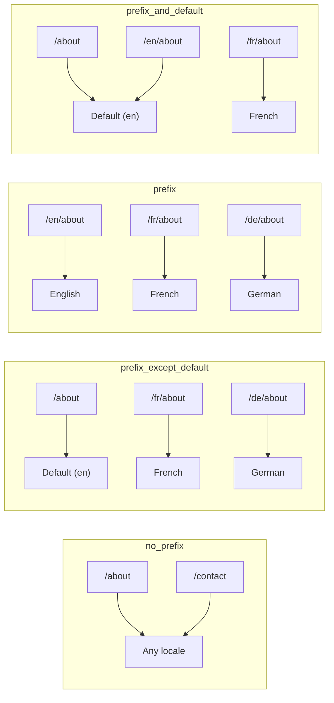
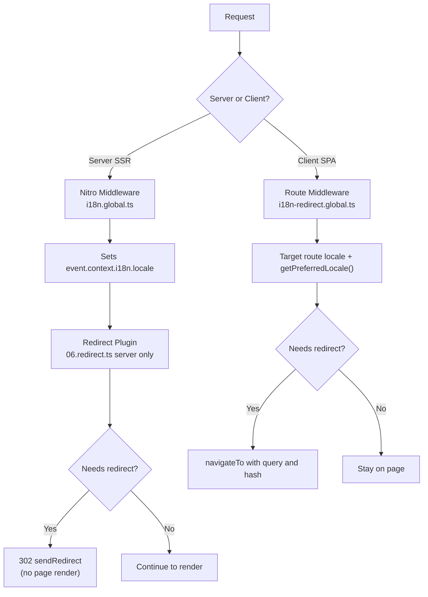

# 🗂️ Стратегии роутинга в Nuxt I18n Micro

## 📖 Обзор

Nuxt I18n Micro контролирует, как префиксы локалей появляются в URL, через опцию `strategy`. Под капотом это реализуют два пакета:

- **`@i18n-micro/route-strategy`** — генерация маршрутов на этапе сборки (расширяет страницы Nuxt локализованными маршрутами)
- **`@i18n-micro/path-strategy`** — рантайм-разрешение путей, редиректы, SEO-атрибуты и генерация ссылок

Модуль Nuxt на этапе сборки выбирает нужный класс стратегии и алиасит его через `#i18n-strategy`, так что в бандл попадает только выбранная реализация.

## 🚦 Доступные стратегии

{/* generated:option:strategy — do not edit; run `pnpm run docs:generate` */}

**Тип** `Strategies` · **По умолчанию** `'prefix_except_default'`

Стратегия роутинга URL для префиксов локалей.

- `'no_prefix'` — локали нет в URL; локаль хранится в cookie.
- `'prefix_except_default'` — префикс у всех локалей, кроме локали по умолчанию.
- `'prefix'` — префикс всегда, включая локаль по умолчанию.
- `'prefix_and_default'` — как `prefix`, но локаль по умолчанию доступна и без префикса.

{/* /generated:option:strategy */}

### Сравнение стратегий



### 🛑 `no_prefix`

В URL нет сегмента локали. Локаль определяется по cookie, состоянию `useI18nLocale()` или автоопределению в браузере.

- **Маршруты**: `/about`, `/contact` — одинаковый шаблон URL для всех локалей (без префиксов `/en/`, `/fr/`)
- **Хранение локали**: Через `localeCookie` (автоматически ставится в `'user-locale'`, если не указано иначе)
- **Пользовательские пути**: Поддерживаются через [`globalLocaleRoutes`](/guides/configuration#globallocaleroutes) и [`defineI18nRoute`](/guides/custom-locale-routes) — локализованные слаги генерируются без добавления префикса локали к URL (например, `/about` vs `/ueber-uns`). Вложенные маршруты, алиасы и ограничения по локалям проще, чем в `prefix_except_default`.

<Tip>
При использовании `no_prefix` `localeCookie` автоматически ставится в `'user-locale'`, если не указано иначе. Это обязательно, потому что URL не содержит информацию о локали.
</Tip>

```typescript
i18n: {
  strategy: 'no_prefix'
  // localeCookie is automatically set to 'user-locale'
}
```

### 🚧 `prefix_except_default`

Все маршруты имеют префикс локали **за исключением** локали по умолчанию.

- **Локаль по умолчанию**: `/about`, `/contact`
- **Другие локали**: `/fr/about`, `/de/contact`
- **Локаль по умолчанию с префиксом возвращает 404**: `/en/about` → 404 (когда `en` — default)

```typescript
i18n: {
  strategy: 'prefix_except_default' // This is the default
}
```

### 🌍 `prefix`

У каждого маршрута есть префикс локали, включая локаль по умолчанию.

- **Все локали**: `/en/about`, `/fr/about`, `/de/about`
- **Корень `/`**: Редиректит на `/\{locale\}/` в зависимости от предпочтения пользователя

```typescript
i18n: {
  strategy: 'prefix'
}
```

### 🔄 `prefix_and_default`

Локаль по умолчанию доступна и с префиксом, и без. У недефолтных локалей префикс есть всегда.

- **Локаль по умолчанию**: и `/about`, и `/en/about` валидны
- **Другие локали**: `/fr/about`, `/de/about`
- **Никакого редиректа с `/`**: И `/`, и `/en/` отдают локаль по умолчанию

```typescript
i18n: {
  strategy: 'prefix_and_default'
}
```

## 🔀 Архитектура редиректов (v3)

В v3 логика редиректов разделена на два слоя ради максимальной производительности:

### Как это работает



### Серверная часть (без вспышки)

1. **Nitro middleware** (`i18n.global.ts`) работает первым — определяет локаль по URL, cookie или заголовку `Accept-Language` и выставляет `event.context.i18n.locale`.
2. **Redirect-плагин** (`06.redirect.ts`, только сервер) проверяет через `i18nStrategy.getClientRedirect()`, нужен ли редирект, и выдаёт 302 **до** любого рендера страницы.
3. Это исключает «вспышку ошибки», когда пользователи мельком видят неверную страницу до редиректа.

### Клиентская часть (SPA-навигация)

1. Глобальный route middleware (`i18n-redirect.global.ts`) работает при каждой клиентской навигации, когда включены `redirects`.
2. Предпочтительная локаль сначала берётся из **целевого маршрута**, затем откатывается на `useI18nLocale().getPreferredLocale()`.
3. Через `i18nStrategy.getClientRedirect()` решается, нужен ли редирект.
4. При редиректе сохраняются `query` и `hash`.

### Приоритет локалей

На сервере redirect-плагин определяет предпочтительную локаль в таком порядке:

1. **`useState('i18n-locale')`** — высший приоритет (устанавливается программно через `useI18nLocale().setLocale()`).
2. **Cookie** — если настроен `localeCookie`.
3. **Заголовок `Accept-Language`** — если `autoDetectLanguage: true`.
4. **`defaultLocale`** — финальный fallback.

На клиенте route middleware сперва предпочитает локаль из целевого маршрута, затем использует ту же цепочку state/cookie.

### Поведение редиректов по стратегиям

| Стратегия               | Поведение `GET /`                              | Нужен cookie? |
| ----------------------- | --------------------------------------------- | ---------------- |
| `no_prefix`             | Нет редиректа (локаль из cookie/state)         | Ставится автоматически |
| `prefix`                | 302 → `/\{locale\}/`                            | Рекомендуется      |
| `prefix_except_default` | 302 → `/\{locale\}/`, если локаль ≠ default     | Рекомендуется      |
| `prefix_and_default`    | Нет редиректа (и `/`, и `/\{locale\}/` валидны) | Опционально        |

### Отключение редиректов

```typescript
i18n: {
  redirects: false // Disables automatic locale redirects
}
```

При `redirects: false` автоматические редиректы по локали отключены:

- **Сервер**: redirect-плагин (`06.redirect.ts`, только сервер) остаётся зарегистрированным, но пропускает логику редиректа. Он всё ещё выполняет **проверки 404** для невалидных префиксов локалей (например, `/xx/about`, где `xx` не является валидной локалью) и **синхронизацию cookie** из префикса URL (например, посещение `/fr/about` синхронизирует cookie в `fr`).
- **Клиент**: глобальный route middleware `i18n-redirect` **не регистрируется** — авто-редиректов в SPA нет.

## 🍪 Хранение локали в cookie

<Warning>
При использовании `prefix` или `prefix_except_default` c `redirects: true` (по умолчанию) вы **обязаны** задавать `localeCookie`, чтобы редиректы работали корректно. Без cookie redirect-плагин не сможет запомнить предпочтение пользователя между перезагрузками.

```typescript
i18n: {
  strategy: 'prefix_except_default',
  localeCookie: 'user-locale' // Required for redirects to work properly
}
```
</Warning>

**Как `localeCookie` работает в v3:**

- Управляется внутренне через `useI18nLocale()` — **не задавайте его вручную** через `useCookie()`.
- Когда пользователь заходит на префиксный URL (например, `/fr/about`), cookie автоматически синхронизируется в `fr`.
- При следующем визите на `/` значение cookie используется, чтобы редиректить на `/\{locale\}/`.
- Если cookie содержит невалидную локаль (нет в списке `locales`), откатывается на `defaultLocale`.

| Стратегия               | `localeCookie` по умолчанию | Примечания                              |
| ----------------------- | ---------------------- | ------------------------------------ |
| `no_prefix`             | Авто: `'user-locale'`  | Обязательно; ставится автоматически  |
| `prefix`                | `null` (отключено)     | Задавайте `'user-locale'` для редиректов |
| `prefix_except_default` | `null` (отключено)     | Задавайте `'user-locale'` для редиректов |
| `prefix_and_default`    | `null` (отключено)     | Опционально                          |

## 🔍 `autoDetectLanguage` и `autoDetectPath`

### `autoDetectLanguage`

{/* generated:option:autoDetectLanguage — do not edit; run `pnpm run docs:generate` */}

**Тип** `boolean` · **По умолчанию** `true`

Автоматически определять предпочитаемый язык пользователя из HTTP-заголовка `Accept-Language`.
Используется в связке с `autoDetectPath`, чтобы решить, когда происходит определение.

{/* /generated:option:autoDetectLanguage */}

Проверка выполняется в серверном middleware и является fallback'ом: cookie или существующий state побеждают.

```typescript
i18n: {
  autoDetectLanguage: true
}
```

### `autoDetectPath`

{/* generated:option:autoDetectPath — do not edit; run `pnpm run docs:generate` */}

**Тип** `string` · **По умолчанию** `'/'`

Где могут срабатывать редиректы по cookie/Accept-Language (при включённых `redirects`).

- `'/'` — только `/` (глубокие ссылки в локали по умолчанию остаются доступны; значение по умолчанию)
- `'no_prefix'` — только пути без префикса локали
- `'*'` — любой путь, включая переписывание явного префикса локали
  (например, `/fr/about` → `/de/about`, когда cookie предпочитает `de`)

- любая другая строка — точное совпадение пути (например, `'/welcome'`)

Очистка при префиксных стратегиях (например, `/en` → `/` при `prefix_except_default`) не ограничивается.

{/* /generated:option:autoDetectPath */}

```typescript
i18n: {
  autoDetectPath: '/' // Default: only root
  // autoDetectPath: '*' // All paths — redirects even /fr/about to /de/about
}
```

<Warning>
При `autoDetectPath: '*'` даже URL с явным префиксом локали (например, `/fr/about`) будут редиректиться, если предпочитаемая локаль пользователя другая. Это может быть удобно для доменных сетапов, но может путать пользователей, которые делятся ссылками.
</Warning>

С дефолтным `autoDetectPath: '/'` и cookie локали:

| запрос | cookie | результат |
| --- | --- | --- |
| `/` | `de` | 302 → `/de` |
| `/about` | `de` | 200, локаль по умолчанию (без переписывания) |

```typescript
i18n: {
  localeCookie: 'user-locale',
  strategy: 'prefix_except_default',
  // Default — remember language on entry, keep deep links stable
  autoDetectPath: '/',
  // Or redirect on every unprefixed path (but not /de/… → /fr/…):
  // autoDetectPath: 'no_prefix',
}
```

## ⚠️ Известные проблемы и лучшие практики

### 1. Hydration mismatch в стратегии `no_prefix`

При использовании `no_prefix` локаль определяется динамически. Если сервер и клиент расходятся во мнении о локали, вы получите hydration mismatch.

**Решение**: Задайте локаль до инициализации i18n с помощью `useI18nLocale().setLocale()` в серверном плагине (с `order: -10`):

```ts
// plugins/i18n-loader.server.ts
export default defineNuxtPlugin({
  name: 'i18n-custom-loader',
  enforce: 'pre',
  order: -10,
  setup() {
    const { setLocale } = useI18nLocale()
    setLocale('ja') // Your detection logic here
  },
})
```

Подробные примеры см. в [Пользовательском определении языка](/guides/custom-language-detection).

### 2. Используйте именованные маршруты с `localeRoute`

Роутинг по путям может создавать проблемы с разрешением маршрутов:

```typescript
// May cause issues
$localeRoute('/page')

// Preferred approach
$localeRoute({ name: 'page' })
```

### 3. Использование `pages: false` с i18n

Когда используете Nuxt с `pages: false`:

```typescript
export default defineNuxtConfig({
  pages: false,
  i18n: {
    strategy: 'no_prefix', // Recommended
    disablePageLocales: true, // Required
    localeCookie: 'user-locale', // Required for persistence
  },
})
```

**Ограничения при `pages: false`:**

- Нет автоматических редиректов
- Нет определения локали по URL
- Смена локали на клиенте требует перезагрузки страницы или ручной подгрузки переводов

### 4. Обработка невалидного cookie

Если cookie содержит невалидную локаль (нет в списке `locales`), модуль корректно откатывается на `defaultLocale`. Никаких ошибок не выбрасывается.

## 📝 Итог лучших практик

| Рекомендация              | Детали                                                                              |
| ------------------------- | ----------------------------------------------------------------------------------- |
| **Задавайте `localeCookie`** | Всегда задавайте для префиксных стратегий с `redirects: true`                       |
| **Используйте `useI18nLocale()`** | Централизованный способ управлять состоянием локали (заменяет ручные `useState`/`useCookie`) |
| **Именованные маршруты**  | `$localeRoute(\{ name: 'page' \})` вместо `$localeRoute('/page')`                    |
| **Программная локаль**    | Используйте `useI18nLocale().setLocale()` в серверном плагине с `order: -10`        |
| **Не трогайте cookie вручную** | Не используйте `useCookie('user-locale')` напрямую — этим занимается `useI18nLocale()` |
