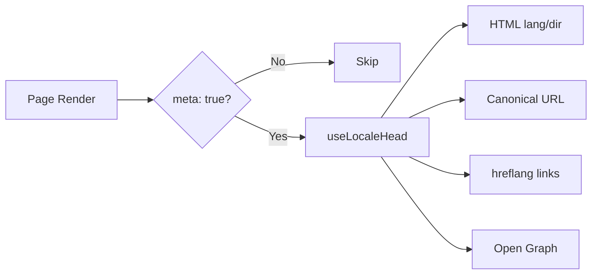

# 🌐 Руководство по SEO для Nuxt I18n Micro

## 📖 Введение

Эффективное SEO (Search Engine Optimization) важно для того, чтобы многоязычный сайт был доступен и заметен для пользователей по всему миру через поисковики. `Nuxt I18n Micro` упрощает управление SEO многоязычных сайтов, автоматически генерируя ключевые мета-теги и атрибуты, сообщающие поисковикам структуру и содержимое сайта.

Это руководство рассказывает, как `Nuxt I18n Micro` обрабатывает SEO, чтобы повысить видимость сайта и улучшить пользовательский опыт без дополнительной настройки.

## ⚙️ Автоматическая работа с SEO

### Поток генерации SEO-мета



**Генерируемые теги:**

| Тег             | Пример                                                   |
| --------------- | -------------------------------------------------------- |
| Атрибуты HTML   | `<html lang="en" dir="ltr">`                             |
| Canonical       | `<link rel="canonical" href="...">`                      |
| hreflang        | `<link rel="alternate" hreflang="en" href="...">`        |
| x-default       | `<link rel="alternate" hreflang="x-default" href="...">` |
| Open Graph      | `<meta property="og:locale" content="en_US">`            |

#### `og` для каждой локали (`og:locale` vs BCP 47)

`<html lang>` и `hreflang` используют **BCP 47** через `locale.iso` (например, `ar-AE`).
Open Graph требует **`language_TERRITORY`** с **подчёркиванием** (`ar_AE`) согласно [протоколу OG](https://ogp.me/).

По умолчанию `og:locale` выводится из `iso`, если сопоставление однозначно (`en-US` → `en_US`).
Явно задавайте строку **`og`**, когда нужно кастомное значение (например, `zh-Hans` → `zh_CN`).
Если нет ни `og`, ни конвертируемого `iso`, теги `og:locale` не создаются. В разработке будет предупреждение в консоли (уважает `missingWarn`).

```typescript
i18n: {
  meta: true,
  locales: [
    { code: 'ar', iso: 'ar-AE', og: 'ar_AE', dir: 'rtl' },
    { code: 'en', iso: 'en-US' }, // og:locale → en_US
    { code: 'zh', iso: 'zh-Hans', og: 'zh_CN' }, // script tags need explicit og
  ],
}
```

### 🔑 Ключевые возможности SEO

Когда включена опция `meta` в `Nuxt I18n Micro`, модуль автоматически берёт на себя следующие аспекты SEO:

1. **🌍 Атрибуты языка и направления**:
   - Модуль задаёт `lang` и `dir` на теге `<html>` в соответствии с текущей локалью и направлением текста (`ltr` для английского или `rtl` для арабского и т. п.).

2. **🔗 Canonical URL**:
   - Модуль генерирует canonical-ссылку (`<link rel="canonical">`) для каждой страницы, чтобы поисковики понимали основную версию содержимого.

3. **🌐 Альтернативные языковые ссылки (`hreflang`)**:
   - Модуль автоматически создаёт теги `<link rel="alternate" hreflang="">` для всех доступных локалей. Это помогает поисковикам понимать, какие языковые версии доступны, и улучшает опыт глобальной аудитории.
   - Каждая локаль эмитит **один** тег: `hreflang = iso || code`. Когда задан `iso`, роутинговый `code` в `hreflang` не используется никогда (чтобы «маркетинговые» ключи вроде `mx` не становились невалидными языковыми тегами).
   - Опциональный `hreflangBaseLanguage: true` дополнительно эмитит тег без региона, полученный из `iso` (например, `es-ES` → `es`), который забирает первая региональная локаль в `locales`.

4. **🌏 `x-default` hreflang**:
   - Модуль автоматически создаёт `<link rel="alternate" hreflang="x-default">`, указывающую на URL локали по умолчанию. Это сообщает поисковикам, какой URL показать пользователям, чей язык не соответствует ни одной из настроенных локалей. Дополнительная настройка не требуется — это работает автоматически при `meta: true`.

5. **🔖 Метаданные Open Graph**:
   - Модуль создаёт Open Graph мета-теги (`og:locale`, `og:url` и т. п.) для каждой локали, что особенно полезно для шаринга в соцсетях и индексации.

### 🛠️ Конфигурация

Чтобы включить эти возможности SEO, установите опцию `meta` в `true` в `nuxt.config.ts`:

```typescript
export default defineNuxtConfig({
  modules: ['nuxt-i18n-micro'],
  i18n: {
    locales: [
      { code: 'en', iso: 'en-US', dir: 'ltr' },
      { code: 'fr', iso: 'fr-FR', dir: 'ltr' },
      { code: 'ar', iso: 'ar-SA', dir: 'rtl' },
    ],
    defaultLocale: 'en',
    translationDir: 'locales',
    meta: true, // Enables automatic SEO management
  },
})
```

### 🌍 Динамический `metaBaseUrl` для мультидоменных деплоев

Когда `metaBaseUrl` не задан, абсолютные SEO URL разрешаются в таком порядке (#240):

1. `site.url` из [`nuxt-site-config`](https://nuxtseo.com/docs/site-config) (если модуль присутствует, например через `@nuxtjs/seo`)
2. Иначе — хост из текущего запроса (`useRequestURL()` / `window.location.origin`)

Fallback по origin запроса уважает заголовки reverse-proxy (`X-Forwarded-Host`, `X-Forwarded-Proto`), поэтому корректно работает за nginx, Cloudflare, AWS ALB и подобными прокси.

Значит, приложениям, уже устанавливающим `site.url` для sitemap / robots / schema.org, **не нужно** второе объявление `metaBaseUrl`:

```typescript
export default defineNuxtConfig({
  site: {
    url: process.env.NUXT_SITE_URL, // also used by micro for canonical / og:url / hreflang
  },
  i18n: {
    meta: true,
    // metaBaseUrl omitted — picks up site.url, then request origin
  },
})
```

Без `site.url` единственный инстанс приложения всё равно может обслуживать **несколько доменов** с корректными SEO-тегами для каждого через origin запроса:

```typescript
export default defineNuxtConfig({
  i18n: {
    meta: true,
    // metaBaseUrl is undefined by default — resolved dynamically from the request
  },
})
```

Например, запрос к `https://site-a.com/en/about` создаст:

```html
<link rel="canonical" href="https://site-a.com/en/about" /> <meta property="og:url" content="https://site-a.com/en/about" />
```

А то же приложение на `https://site-b.com/en/about` создаст:

```html
<link rel="canonical" href="https://site-b.com/en/about" /> <meta property="og:url" content="https://site-b.com/en/about" />
```

Если нужен фиксированный базовый URL, который всегда важнее `site.url`, передавайте статическую строку:

```typescript
metaBaseUrl: 'https://example.com'
```

### 🔍 Whitelist canonical-запросов

По умолчанию query-параметры удаляются из canonical и `og:url`, чтобы избежать дубликатов. Вы можете добавить в whitelist конкретные параметры, которые нужно сохранить:

```typescript
i18n: {
  canonicalQueryWhitelist: ['page', 'sort', 'filter', 'search', 'q', 'query', 'tag']
}
```

Только параметры из `canonicalQueryWhitelist` попадут в canonical URL. Все прочие (например, tracking, session ID) будут удалены.

### 🚫 Отключение мета-тегов для отдельной страницы

Вы можете отключить генерацию SEO-тегов для конкретных страниц через `defineI18nRoute()`:

```vue
<script setup>
// Disable all SEO meta tags for this page
defineI18nRoute({
  disableMeta: true,
})
</script>
```

Также можно отключать мета только для конкретных локалей:

```vue
<script setup>
// Disable meta tags only for English locale on this page
defineI18nRoute({
  disableMeta: ['en'],
})
</script>
```

Когда `disableMeta` активен, для соответствующей страницы/локали не создаются теги `hreflang`, `canonical`, `og:locale`, `og:url` и `x-default`.

### 🔇 Отключённые локали

Локали с `disabled: true` автоматически исключаются из всей генерации SEO-тегов — для них не создаются `hreflang`, `og:locale:alternate` и alternate-ссылки:

```typescript
i18n: {
  locales: [
    { code: 'en', iso: 'en-US' },
    { code: 'fr', iso: 'fr-FR', disabled: true }, // excluded from SEO tags
  ]
}
```

### 🙈 Локали «без SEO» (`seo: false`)

Для локалей, которые должны оставаться маршрутизируемыми и переведёнными, но не появляться в тегах кросс-локального обнаружения, установите `seo: false`. Такие локали не попадают в альтернативы `hreflang` и `og:locale:alternate`. Если у настроенной **default**-локали `seo: false`, ссылка `x-default` тоже не эмитится.

```typescript
i18n: {
  locales: [
    { code: 'en', iso: 'en-US' },
    { code: 'ru', iso: 'ru-RU', seo: false }, // internal / non-indexed locale
  ]
}
```

### 📌 Особенности по стратегиям

| Стратегия               | hreflang-ссылки  | x-default             | canonical      | og:url |
| ----------------------- | ---------------- | --------------------- | -------------- | ------ |
| `prefix`                | ✅ Все локали    | ✅ URL default-локали | ✅ Текущий URL | ✅     |
| `prefix_except_default` | ✅ Все локали    | ✅ URL без префикса   | ✅ Текущий URL | ✅     |
| `prefix_and_default`    | ✅ Все локали    | ✅ URL default-локали | ✅ Текущий URL | ✅     |
| `no_prefix`             | ❌ Не создаётся  | ❌ Не создаётся       | ✅ Текущий URL | ✅     |

Для стратегии `no_prefix` создаются только `canonical`, `og:url`, `og:locale` и атрибуты `html` (`lang`, `dir`). Альтернативные языковые ссылки (`hreflang`) и `x-default` не создаются, потому что нет разных URL на локаль.

## Постраничные переопределения (`useI18nHead`)

Для **статей, гайдов или любого CMS-контента**, где не для всех локалей есть перевод или URL приходят из API, используйте на странице [`useI18nHead`](/api/composables/use-i18n-head) вместо кастомного i18n-head плагина.

### Статья с частичными переводами

```vue
<script setup lang="ts">
const article = await loadArticle()
// article.locales = { en: '...', de: '...' } — only translated locales

useI18nHead({
  meta: [{ property: 'og:title', content: article.title }],
  replace: {
    hreflang: Object.entries(article.locales).map(([locale, href]) => ({
      rel: 'alternate',
      hreflang: locale,
      href,
    })),
    ogAlternates: Object.keys(article.locales),
  },
})
</script>
```

### Слаги, разные по локалям, с `$setI18nRouteParams`

Когда слаги отличаются по языку, сначала задайте параметры маршрута, затем переопределите альтернативы реальными URL:

```vue
<script setup lang="ts">
const { $defineI18nRoute, $setI18nRouteParams } = useNuxtApp()
const { data: article } = await useFetch(`/api/articles/${slug}`)

$defineI18nRoute({
  localeRoutes: { en: '/blog/[slug]', de: '/de/blog/[slug]' },
})

$setI18nRouteParams({
  en: { slug: article.value.slugEn },
  de: { slug: article.value.slugDe },
})

useI18nHead({
  replace: {
    hreflang: ['en', 'de'].map((locale) => ({
      rel: 'alternate',
      hreflang: locale,
      href: article.value.urls[locale],
    })),
    ogAlternates: ['en', 'de'],
  },
})
</script>
```

### HTTPS origin за прокси

Для корректных абсолютных URL при SSR без кастомного origin-композабла:

```ts
i18n: {
  meta: true,
  metaBaseUrl: undefined,
  metaTrustForwardedHost: true,
  metaTrustForwardedProto: true,
}
```

Больше примеров (переопределение canonical, `x-default`, реактивный fetch, общие хелперы): [Композабл useI18nHead](/api/composables/use-i18n-head).

### ⚠️ Trailing slash

Модуль формирует canonical и `hreflang` URL на основе фактического пути из `useRoute().fullPath`. Если приложение использует trailing slash (например, через `router.options` в Nuxt), сгенерированные URL это отразят. Однако `$switchLocalePath` может нормализовать пути и убрать trailing slash. Если для вашего SEO важна согласованность trailing slash, проверьте, что сгенерированные URL совпадают со структурой URL приложения.

### 🎯 Преимущества

Включив опцию `meta`, вы получаете:

- **📈 Улучшение позиций в поиске**: Поисковики лучше индексируют сайт, понимая связи между разными языковыми версиями.
- **👥 Улучшение пользовательского опыта**: Пользователи получают правильную языковую версию согласно своим предпочтениям, что делает опыт более персонализированным.
- **🔧 Меньше ручной настройки**: Модуль решает SEO-задачи автоматически, освобождая вас от необходимости вручную добавлять SEO-мета-теги и атрибуты.

## 🔗 Nuxt SEO (`@nuxtjs/seo`)

[`@nuxtjs/seo`](https://nuxtseo.com/) объединяет sitemap, robots, schema.org, OG-изображения и связанные модули. Он интегрируется с **nuxt-i18n-micro** через [`nuxt-site-config`](https://nuxtseo.com/docs/site-config/guides/i18n) (v4+).

### Требования

- **`@nuxtjs/seo` 3+** (текущие релизы используют `nuxt-site-config` 4+, регистрирующий плагин `nuxt-site-config:i18n` для micro)
- **`i18n.meta: true`** (рекомендуется — micro отдаёт head-теги, учитывающие локаль; Nuxt SEO добавляет sitemap, schema.org и т. п.)

### Порядок модулей

Указывайте **nuxt-i18n-micro раньше `@nuxtjs/seo`**, чтобы site-config мог прочитать вашу настройку локалей:

```typescript
export default defineNuxtConfig({
  modules: ['nuxt-i18n-micro', '@nuxtjs/seo'],
  site: {
    url: 'https://example.com',
    name: 'My Site',
  },
  i18n: {
    meta: true,
    defaultLocale: 'en',
    locales: [
      { code: 'en', iso: 'en-US' },
      { code: 'de', iso: 'de-DE' },
    ],
  },
})
```

### Переводы названия и описания сайта

Nuxt Site Config читает опциональные ключи переводов из ваших файлов локалей:

```json
{
  "nuxtSiteConfig": {
    "name": "My Site",
    "description": "My site description"
  }
}
```

Значения для каждой локали в `locales/en.json`, `locales/de.json` и т. д. подхватываются автоматически.

### Устранение неполадок

Если вы видите `Plugin nuxt-seo:defaults depends on nuxt-site-config:i18n but they are not registered`, обновите **`@nuxtjs/seo` до 3+** (см. [issue #133](https://github.com/s00d/nuxt-i18n-micro/issues/133)). Старая `nuxt-site-config` 3.x подключала i18n только для `@nuxtjs/i18n`, а не для micro.

Дополнительно: [Sitemap i18n guide](https://nuxtseo.com/docs/sitemap/guides/i18n), [Site Config i18n guide](https://nuxtseo.com/docs/site-config/guides/i18n).
