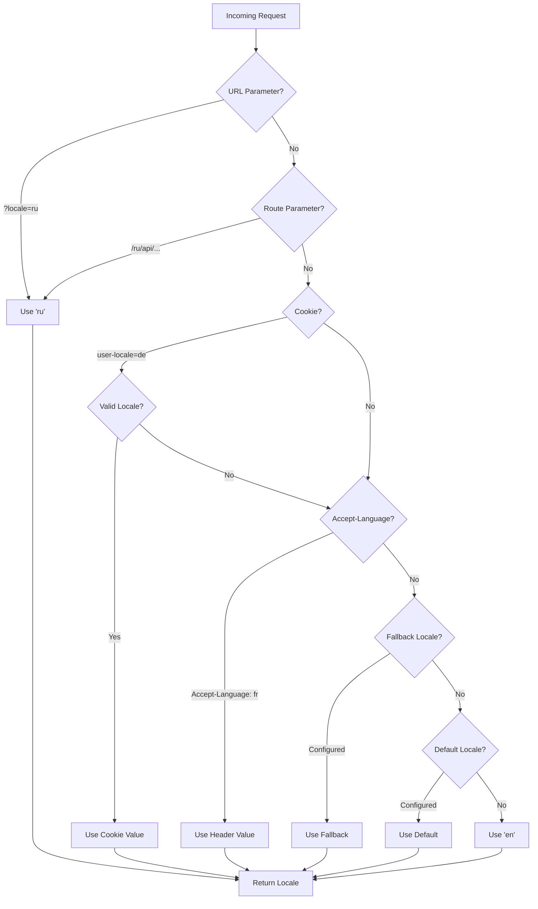

# 🌍 Серверные переводы и информация о локали в Nuxt I18n Micro

## 📖 Обзор

Nuxt I18n Micro поддерживает серверные переводы и информацию о локали, позволяя переводить контент и получать данные о локали на сервере. Это особенно полезно для API или серверно-рендеренных приложений, где локализация нужна ещё до достижения клиента.

Переводы используют сообщения локалей, определённые в конфигурации Nuxt I18n, и динамически разрешаются на основе определённой локали.

По умолчанию (`translationPayloads.mode: 'premerged'`) корневые файлы вплетаются в payload каждой страницы на этапе сборки как `\{page\}/\{locale\}/data.json`. Сервер загружает те же готовые файлы, что клиент забирает по `/\{apiBaseUrl\}/...`, поэтому все ключи (общие и постраничные) доступны в серверных обработчиках.

При `translationPayloads.mode: 'source'` компактные исходники объединяются в рантайме, когда вызывается `loadTranslationsFromServer()` (или маршрут `/_locales`) — на **Edge** через Nitro `serverAssets`, на **Node** — из опциональной копии в public. Подробнее см. в [Руководстве по производительности — Serverless Payload Output](/guides/performance#serverless-payload-output) и [Архитектуре кэша и хранилища](/api/cache).

Сводный список рантайм- и серверных API см. в [Справочнике API](/api/overview).

## 🛠️ Настройка серверного middleware

Чтобы включить серверные переводы и информацию о локали, используйте предоставленные функции middleware:

- `useTranslationServerMiddleware` — для перевода контента
- `useLocaleServerMiddleware` — для доступа к информации о локали

Обе функции middleware автоматически доступны во всех серверных маршрутах.

Логика определения локали разделяется между двумя функциями через утилиту `detectCurrentLocale`, что обеспечивает единообразие в модуле.

## ✨ Использование переводов в серверных обработчиках

Вы можете спокойно переводить контент в любом `eventHandler`, используя translation middleware.

### Пример: базовое использование перевода

```typescript
import { defineEventHandler } from 'h3'

export default defineEventHandler(async (event) => {
  const t = await useTranslationServerMiddleware(event)
  return {
    message: t('greeting'), // Returns the translated value for the key "greeting"
  }
})
```

В этом примере:

- Локаль пользователя автоматически определяется из query-параметров, cookie или заголовков.
- Функция `t` возвращает нужный перевод для определённой локали.

## 🌍 Использование информации о локали в серверных обработчиках

### Базовое использование информации о локали

```typescript
import { defineEventHandler } from 'h3'

export default defineEventHandler((event) => {
  const localeInfo = useLocaleServerMiddleware(event)

  return {
    success: true,
    data: localeInfo,
    timestamp: new Date().toISOString(),
  }
})
```

### Передача собственных параметров локали

```typescript
import { defineEventHandler } from 'h3'

export default defineEventHandler((event) => {
  // Force specific locale with custom default
  const localeInfo = useLocaleServerMiddleware(event, 'en', 'ru')

  return {
    success: true,
    data: localeInfo,
    timestamp: new Date().toISOString(),
  }
})
```

### Структура ответа

Middleware локали возвращает объект `LocaleInfo` со следующими свойствами:

```typescript
interface LocaleInfo {
  current: string // Current detected locale code
  default: string // Default locale code
  fallback: string // Fallback locale code
  available: string[] // Array of all available locale codes
  locale: Locale | null // Full locale configuration object
  isDefault: boolean // Whether current locale is the default
  isFallback: boolean // Whether current locale is the fallback
}
```

### Пример ответа

```json
{
  "success": true,
  "data": {
    "current": "ru",
    "default": "en",
    "fallback": "en",
    "available": ["en", "ru", "de"],
    "locale": {
      "code": "ru",
      "iso": "ru-RU",
      "dir": "ltr",
      "displayName": "Русский"
    },
    "isDefault": false,
    "isFallback": false
  },
  "timestamp": "2024-01-15T10:30:00.000Z"
}
```

## 🌐 Указание собственной локали

Если вам нужно вручную указать локаль (например, для тестов или отдельных запросов), передайте её translation middleware:

### Пример: пользовательская локаль

```typescript
import { defineEventHandler } from 'h3'

function detectLocale(event): string | null {
  const urlSearchParams = new URLSearchParams(event.node.req.url?.split('?')[1])
  const localeFromQuery = urlSearchParams.get('locale')
  if (localeFromQuery) return localeFromQuery

  return 'en'
}

export default defineEventHandler(async (event) => {
  const t = await useTranslationServerMiddleware(event, 'en', detectLocale(event)) // Force French local, en - default locale
  return {
    message: t('welcome'), // Returns the French translation for "welcome"
  }
})
```

## 📋 Логика определения локали

Обе функции middleware автоматически определяют локаль пользователя, используя следующий приоритет:



1. **URL-параметры**: `?locale=ru`
2. **Параметры маршрута**: `/ru/api/endpoint`
3. **Cookie**: cookie `user-locale`
4. **HTTP-заголовки**: заголовок `Accept-Language`
5. **Fallback-локаль**: как настроено в опциях модуля
6. **Локаль по умолчанию**: как настроено в опциях модуля
7. **Жёстко заданный fallback**: `'en'`

> **Заметка**: Логика определения локали разделяется между `useLocaleServerMiddleware` и `useTranslationServerMiddleware` для единообразия в модуле.

## 📋 Примеры продвинутого использования

### Условный ответ в зависимости от локали

```typescript
import { defineEventHandler } from 'h3'

export default defineEventHandler((event) => {
  const { current, isDefault, locale } = useLocaleServerMiddleware(event)

  // Return different content based on locale
  if (current === 'ru') {
    return {
      message: 'Привет, мир!',
      locale: current,
      isDefault,
    }
  }

  if (current === 'de') {
    return {
      message: 'Hallo, Welt!',
      locale: current,
      isDefault,
    }
  }

  // Default English response
  return {
    message: 'Hello, World!',
    locale: current,
    isDefault,
  }
})
```

### Пользовательское определение локали

```typescript
import { defineEventHandler } from 'h3'

export default defineEventHandler((event) => {
  // Force German locale with English as fallback
  const { current, isDefault, locale } = useLocaleServerMiddleware(event, 'en', 'de')

  return {
    message: 'Hallo, Welt!',
    locale: current,
    isDefault: false, // Will be false since we forced German
  }
})
```

### API, чувствительное к локали, с валидацией

```typescript
import { defineEventHandler, createError } from 'h3'

export default defineEventHandler((event) => {
  const { current, available, locale } = useLocaleServerMiddleware(event)

  // Validate if the detected locale is supported
  if (!available.includes(current)) {
    throw createError({
      statusCode: 400,
      statusMessage: `Unsupported locale: ${current}. Available locales: ${available.join(', ')}`,
    })
  }

  // Return locale-specific configuration
  return {
    locale: current,
    direction: locale?.dir || 'ltr',
    displayName: locale?.displayName || current,
    availableLocales: available,
  }
})
```

### Интеграция с translation middleware

Информацию о локали можно комбинировать с translation middleware для всесторонней интернационализации:

```typescript
import { defineEventHandler } from 'h3'

export default defineEventHandler(async (event) => {
  const localeInfo = useLocaleServerMiddleware(event)
  const t = await useTranslationServerMiddleware(event)

  return {
    locale: localeInfo.current,
    message: t('welcome_message'),
    availableLocales: localeInfo.available,
    isDefault: localeInfo.isDefault,
  }
})
```

## 📝 Лучшие практики

1. **Всегда валидируйте локали**: Проверяйте, входит ли определённая локаль в список доступных.
2. **Используйте fallback-логику**: Задавайте разумные значения по умолчанию, когда определение локали не срабатывает.
3. **Кэшируйте информацию о локали**: В приложениях, критичных к производительности, подумайте о кэшировании результатов определения.
4. **Учитывайте краевые случаи**: Обрабатывайте неподдерживаемые локали и возвращайте адекватные ответы об ошибках.
5. **Комбинируйте с переводами**: Используйте информацию о локали вместе с translation middleware для полной поддержки i18n.

## 🚀 Соображения по производительности

- Обе функции middleware легковесны и рассчитаны на быстрое выполнение.
- Определение локали использует эффективные цепочки fallback'ов.
- Никаких внешних API-вызовов при определении локали не производится.
- Результаты вычисляются синхронно ради оптимальной производительности.
