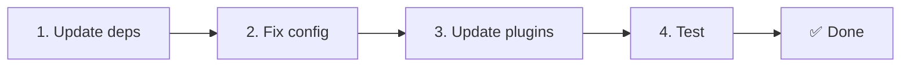

# 📦 Обновление с v2.x до v3.x

<Tip>
См. [Миграцию с nuxt-i18n](/migration/from-nuxtjs-i18n). То руководство описывает переход из экосистемы vue-i18n, а не с nuxt-i18n-micro v2.
</Tip>

В v3.0.0 внесены фундаментальные архитектурные изменения: пакеты стратегий, новая система кэширования, централизованное управление локалью через `useI18nLocale()` и переработанный пайплайн редиректов. В этом разделе разобраны все ломающие изменения и способы обновить ваш код.

## Шаги миграции



## Сводка ломающих изменений

- **Состояние локали** — ручные `useState` / `useCookie` → композабл `useI18nLocale()`
- **Доступ к конфигурации** — `useRuntimeConfig().public.i18nConfig` → `getI18nConfig()` из `#build/i18n.strategy.mjs`
- **Компонент редиректа** — опция `fallbackRedirectComponentPath` → серверный redirect-плагин + клиентское route middleware (автоматически)
- **`includeDefaultLocaleRoute`** — поддерживалось (deprecated) → удалено, используйте `strategy`
- **`experimental.hmr`** — под `experimental` → опция на верхнем уровне
- **`previousPageFallback`** — полностью удалён (кумулятивная стратегия merge справляется автоматически)
- **Кэширование** — `useStorage('cache')` → синглтон `TranslationStorage` (`Symbol.for` на `globalThis`)
- **SSR-передача** — Runtime config → Nuxt payload (в v3 использовался `useState`; чанки теперь живут в `payload.data`, см. [Производительность](/guides/performance#server-side-payload-transfer))
- **Классы стратегий** — Internal → Отдельные пакеты (`@i18n-micro/route-strategy`, `@i18n-micro/path-strategy`)

## Удалено: `fallbackRedirectComponentPath`

Опция `fallbackRedirectComponentPath` и fallback-компонент `locale-redirect.vue` удалены. Логику редиректа теперь обеспечивают:

1. **Server middleware** (`i18n.global.ts`) — устанавливает `event.context.i18n.locale`
2. **Server redirect plugin** (`06.redirect.ts`, только на сервере) — 302-редиректы до рендера
3. **Client route middleware** (`i18n-redirect.global.ts`) — SPA-редиректы после гидратации

```diff
 i18n: {
   strategy: 'prefix_except_default',
-  fallbackRedirectComponentPath: '~/components/MyRedirect.vue',
 }
```

Если у вас была своя логика редиректа в fallback-компоненте, реализуйте её в серверном плагине:

```ts
// plugins/i18n-loader.server.ts
export default defineNuxtPlugin({
  name: 'i18n-custom-redirect',
  enforce: 'pre',
  order: -10,
  setup() {
    const { setLocale } = useI18nLocale()
    // Your custom detection logic
    setLocale(detectedLocale)
  },
})
```

## Удалено: `includeDefaultLocaleRoute`

Используйте `strategy`:

- `includeDefaultLocaleRoute: true` → `strategy: 'prefix'`
- `includeDefaultLocaleRoute: false` → `strategy: 'prefix_except_default'` (по умолчанию)

```diff
 i18n: {
-  includeDefaultLocaleRoute: true,
+  strategy: 'prefix',
 }
```

## Доступ к конфигурации: `getI18nConfig()` вместо `useRuntimeConfig`

```diff
- const config = useRuntimeConfig()
- const cookieName = config.public.i18nConfig?.localeCookie || 'user-locale'
+ import { getI18nConfig } from '#build/i18n.strategy.mjs'
+ const { localeCookie: configCookie } = getI18nConfig()
+ const cookieName = configCookie ?? 'user-locale'
```

## Управление локалью: `useI18nLocale()` вместо ручного state

В v2 вы могли использовать `useState('i18n-locale')` или `useCookie('user-locale')` напрямую. В v3 используйте централизованный композабл `useI18nLocale()`:

```diff
- const locale = useState('i18n-locale')
- const cookie = useCookie('user-locale')
- locale.value = 'fr'
- cookie.value = 'fr'
+ const { setLocale } = useI18nLocale()
+ setLocale('fr') // Updates both state and cookie atomically
```

Подробные примеры см. в [Пользовательском определении языка](/guides/custom-language-detection).

## Экспериментальные опции: перенос / удаление

`hmr` перенесён из `experimental` на верхний уровень. `previousPageFallback` полностью удалён: модуль теперь использует кумулятивную стратегию глубокого merge (глубина 2), которая автоматически сохраняет переводы предыдущей страницы во время анимаций перехода, даже когда страницы разделяют пересекающиеся вложенные ключи. После завершения анимации перехода хук `page:transition:finish` очищает из памяти ключи старой страницы.

```diff
 i18n: {
-  experimental: {
-    hmr: true,
-    previousPageFallback: true
-  }
+  hmr: true,
+  // previousPageFallback removed — handled automatically
 }
```

## Архитектура редиректов (v3)

Редиректы теперь автоматически обрабатываются двумя компонентами:

1. **На стороне сервера** (`06.redirect.ts`, только сервер): работает во время SSR, выдаёт 302-редиректы до рендера страницы. Никакого «error flash».
2. **На стороне клиента** (`i18n-redirect.global.ts`): глобальный route middleware на SPA-навигации; сохраняет query-строку и хеш.

Приоритет локали для редиректов:

1. `useState('i18n-locale')` — устанавливается через `useI18nLocale().setLocale()`
2. Cookie — если настроен `localeCookie`
3. Заголовок `Accept-Language` — если `autoDetectLanguage: true`
4. `defaultLocale` — fallback

Для типовых сетапов правки кода не требуются.

<Warning>
Для стратегий `prefix` и `prefix_except_default` c `redirects: true` задавайте `localeCookie: 'user-locale'`, чтобы включить сохранение локали между перезагрузками. Без этого редиректы будут опираться только на `Accept-Language` или `defaultLocale`.
</Warning>

## TypeScript: внутренние типы модуля (опционально)

Если возникают ошибки типов, связанные с внутренними импортами вроде `#i18n-internal/plural`, `#i18n-internal/strategy` или `#i18n-internal/config`, добавьте секцию `imports` в `package.json` вашего проекта:

```json
{
  "imports": {
    "#i18n-internal/plural": "nuxt-i18n-micro/internals",
    "#i18n-internal/strategy": "nuxt-i18n-micro/internals",
    "#i18n-internal/config": "nuxt-i18n-micro/internals"
  }
}
```
