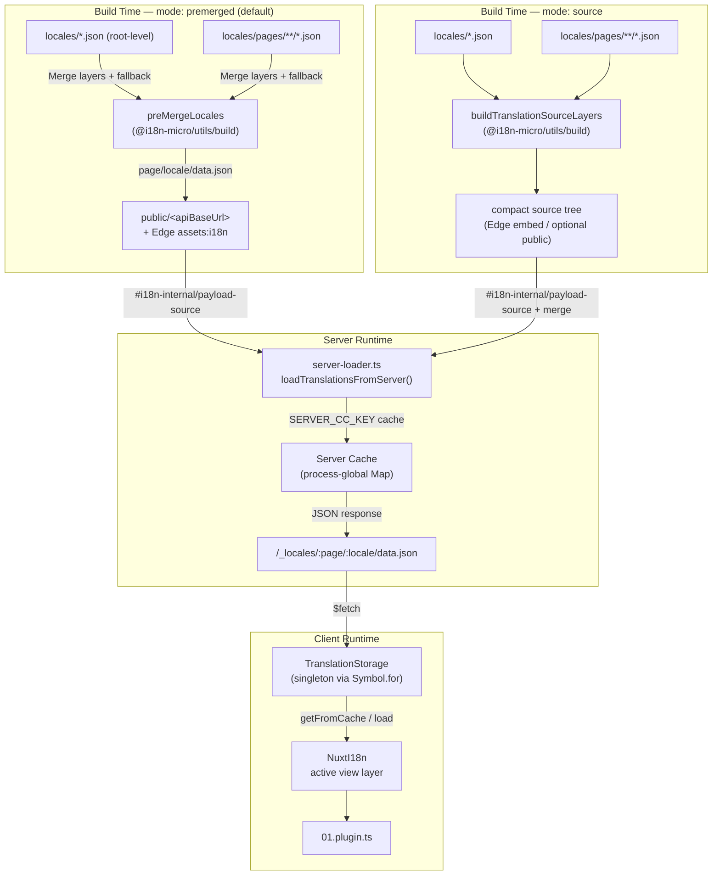

# 🗄️ Arkitektur för översättningscache och lagring

## 📖 Översikt

Nuxt I18n Micro v3 använder en cache-arkitektur med flera lager för översättningar. Payload-laddning beror på `translationPayloads.mode`:

- **`premerged`** (standard) — rot-, sid-, fallback- och lagerfiler slås samman vid byggtid via `@i18n-micro/utils/build` till `\{page\}/\{locale\}/data.json`
- **`source`** — kompakta källfiler behålls för runtime-sammanslagning via `@i18n-micro/utils/source-loader` och `@i18n-micro/utils/merge-source` (Edge bäddar in dem i Nitros `serverAssets`; Node läser dem från `public/` när de kopierats)

Denna sida beskriver hur den inbyggda cachen fungerar och hur du utökar den för anpassade användningsfall (administratörsverktyg, externa API:er, cacheinvalidering).

## 📊 Arkitekturöversikt

### Dataflöde



## 🧱 Kärnkomponenter

### 1. `TranslationStorage` (klient + server)

**Fil**: `src/runtime/utils/storage.ts`

En singleton-klass som tillhandahåller enhetlig översättningslagring för både klient och server. Använder `Symbol.for('__NUXT_I18N_STORAGE_CACHE__')` på `globalThis` för att säkerställa att endast en instans finns, även när flera bundles laddas.

**Nyckelmetoder:**

| Metod                               | Beskrivning                                                             |
| ----------------------------------- | ----------------------------------------------------------------------- |
| `getFromCache(locale, routeName?)`  | Synkron kontroll: returnerar cachad data i minnet eller `null`          |
| `load(locale, routeName?, options)` | Asynkron laddning med caching: kontrollerar cachen först, sedan `$fetch` |
| `clear()`                           | Rensar hela cachen                                                      |

**Cachenyckelformat**: `\{locale\}:\{routeName\}` (till exempel `en:index`, `fr:about`)

```typescript
import { translationStorage } from '../utils/storage'

// Synchronous cache check
const cached = translationStorage.getFromCache('en', 'index')

// Async load (with automatic caching)
const result = await translationStorage.load('en', 'index', {
  apiBaseUrl: '_locales',
  baseURL: '/',
  dateBuild: '2024-01-01',
})
// result.data — merged translations
// result.cacheKey — cache key used
```

### ⚙️ Deterministisk cache-busting (`i18n.dateBuild`)

Som standard genererar modulen `dateBuild` under byggtid med hjälp av `Date.now()`. Värdet bäddas sedan in i den genererade `#build/i18n.strategy.mjs` och används som en query-parameter (`?v=...`) för att invalidera cache för översättningshämtningar efter ombyggnader.

Om du behöver reproducerbara byggen (till exempel för att förbättra chunk-cachens träffkvot vid rullande distributioner), ange ett stabilt värde i `nuxt.config`:

```ts
export default defineNuxtConfig({
  i18n: {
    // Any stable string/number (git SHA, CI build number, release tag, etc.)
    dateBuild: process.env.GIT_SHA ?? 'local-dev',
  },
})
```

### 2. `loadTranslationsFromServer()` (endast server)

**Fil**: `src/runtime/server/utils/server-loader.ts`

Laddar översättningar för en lokal/sida och cachar det sammanslagna resultatet i en processglobal `CacheControl`-map med nyckel via `@i18n-micro/hmr/cache-keys` (`SERVER_CC_KEY`).

Beteende: SSR laddar från `#i18n-internal/payload-source` — **Node** `readFile` under `public/<apiBaseUrl>` (`\{page\}/\{locale\}/data.json` i premerged-läge), **Edge** `assets:i18n`. `premerged` läser en fil; `source` slår samman rot/sida/fallback via `@i18n-micro/utils/source-loader`.

```typescript
import { loadTranslationsFromServer } from '../server/utils/server-loader'

// Returns { data: Translations, json: string }
const { data, json } = await loadTranslationsFromServer('en', 'index')
```

### 3. Klientladdning (ingen HTML-inbäddning)

Ordböcker skrivs **inte** in i `nuxtApp.payload`. Servern behåller dem i minnet för SSR-rendering; klient-pluginen `await`ar `switchContext`, som laddar `/\{apiBaseUrl\}/:page/:locale/data.json` (samma standardhållning som `@nuxtjs/i18n` med `experimental.preload: false`).

`NuxtI18n` håller den aktiva vylagerordboken som används av `$t()` och `$has()`. `NuxtTranslationLoader` byter lokal/route-kontext och slår samman chunks in i det lagret.

### 4. Server-API-rutt

**Rutt**: `/_locales/\{page\}/\{locale\}/data.json`

**Fil**: `src/runtime/server/routes/i18n.ts`

Denna Nitro-rutt levererar sammanslagna översättningar för det aktiva payload-läget. Den anropar `loadTranslationsFromServer()` och returnerar resultatet som JSON.

I produktion sätter den även:

```http
Cache-Control: public, max-age={httpCacheDuration}, immutable
```

Standardvärdet för `httpCacheDuration` är `31536000` (1 år). Detta är säkert eftersom klienter begär payloads med cache-busting via `?v=\{dateBuild\}`. Sätt `httpCacheDuration: 0` för att utelämna headern. Headern tillämpas inte i utvecklingsläge.

## 📥 Utökning: anpassad översättningsladdning

### Läs från cachen (server-rutt)

```ts
// server/api/i18n/load-cache.[post].ts
import { defineEventHandler, readBody } from 'h3'
import { loadTranslationsFromServer } from '#imports'

export default defineEventHandler(async (event) => {
  const { page, locale } = await readBody<{ page: string; locale: string }>(event)
  const { data } = await loadTranslationsFromServer(locale, page)
  return { locale, page, data }
})
```

### Uppdatera översättningar (fil + invalidera cache)

```ts
// server/api/i18n/update.[post].ts
import { defineEventHandler, readBody, createError } from 'h3'
import { join } from 'node:path'
import { readFile, writeFile } from 'node:fs/promises'
import { deepMergeTranslations } from '@i18n-micro/utils/deep-merge'

export default defineEventHandler(async (event) => {
  const { path, updates } = await readBody<{ path: string; updates: Record<string, unknown> }>(event)

  if (!path || !updates) {
    throw createError({ statusCode: 400, statusMessage: 'Missing path or updates' })
  }

  const fullPath = join('locales', path)
  let existing: Record<string, unknown> = {}

  try {
    const content = await readFile(fullPath, 'utf-8')
    existing = JSON.parse(content) as Record<string, unknown>
  } catch {
    // File does not exist — create new
  }

  const merged = deepMergeTranslations(existing, updates)
  await writeFile(fullPath, JSON.stringify(merged, null, 2), 'utf-8')

  return { success: true, path, updated: merged }
})
```


## 🧹 Rensa cachen

### Programmatisk cache-rensning (klient)

Använd den inbyggda `$clearCache`-metoden:

```vue
<script setup>
const { $clearCache } = useNuxtApp()

// Clears both TranslationStorage and plugin-level cache
$clearCache()
</script>
```

### Beteende för servercache

Serverbaserad cache (`loadTranslationsFromServer`) är processglobal och kvarstår tills:

- Serverprocessen startas om
- En ny distribution upptäcks (annat `dateBuild`-värde)

För serverlösa miljöer har varje kallstart en färsk cache.

## ⚙️ Serverlös konfiguration

För serverlösa miljöer (Cloudflare Workers, AWS Lambda) använder den inbyggda cachen `Map`-objekt i minnet. Ingen extern lagringskonfiguration behövs för själva översättningscachen.

Nitro-lagring för käll-översättningsfiler kan dock behöva konfigureras:

```ts
export default defineNuxtConfig({
  nitro: {
    storage: {
      // Only needed if default file-system storage is unavailable
      'assets:server': {
        driver: 'cloudflare-kv-binding',
        binding: 'MY_KV_NAMESPACE',
      },
    },
  },
})
```

## 💡 Viktiga skillnader från v2

| Aspekt             | v2                            | v3                                                                          |
| ------------------ | ----------------------------- | --------------------------------------------------------------------------- |
| Klientcache        | `useStorage('cache')`         | `TranslationStorage`-singleton (Symbol.for på globalThis)                   |
| SSR-överföring     | Runtime-konfig                | Fullständiga chunks via `payload.data` (v3.0 använde `useState`)            |
| Servercache        | Nitro-cachelagring            | Processglobal `Map` via `Symbol.for`                                        |
| Sammanslagningslogik | På klientsidan              | Vid byggtid (`premerged`) eller runtime (`source`) via `@i18n-micro/utils/*` |
| Cachenyckelformat  | `i18n:merged:\{page\}:\{locale\}` | `\{locale\}:\{routeName\}`                                                     |

## 📚 Relaterat

- [Prestandaguide](/guides/performance) — Så påverkar caching prestandan
- [Serverbaserade översättningar](/guides/server-side-translations) — Använda översättningar i serverrutter
- [Firebase-distribution](/guides/firebase) — Distributionsspecifika cache-överväganden
