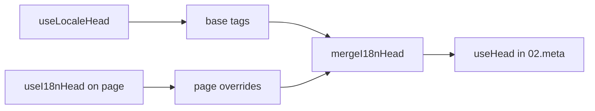

# Composablen `useI18nHead`

`useI18nHead` låter dig anpassa i18n-SEO-taggar **per sida** utan en anpassad meta-plugin. När `meta: true` slår modulen samman din indata ovanpå utdata från [`useLocaleHead`](/api/composables/use-locale-head).

Typiska fall:

- **CMS/blogginlägg** — endast vissa lokaler är översatta; alternativa URL:er skiljer sig per språk (olika slugs eller sökvägar).
- **Dynamisk canonical** — canonical-URL:en måste matcha artikelns URL från API:et, inte `$switchLocalePath`.
- **Extra Open Graph** — `og:title`, `og:description`, `og:image` vid sidan av automatiskt genererade `og:locale` / `og:url`.
- **Partiell kontroll** — behåll modulgenererad canonical och `og:url`, men ersätt endast `hreflang` och `og:locale:alternate`.

---

## Signatur

{/* generated:symbol:useI18nHead — do not edit; run `pnpm run docs:generate` */}

```ts
useI18nHead(input?: MaybeRefOrGetter<I18nHeadInput | null>): { pageHead: any; resetPageHead: () => void }
```

Registrera per sida-override för i18n-SEO-head-taggar. Slås samman ovanpå utdata från `useLocaleHead` av `02.meta`-pluginen.

| Parameter | Typ | Beskrivning |
| --- | --- | --- |
| `input` *(valfritt)* | `MaybeRefOrGetter<I18nHeadInput \| null>` |  |

{/* /generated:symbol:useI18nHead */}

## Hur det passar in i pipelinen



Du anropar `useI18nHead` i en sidkomponent. Pluginen `02.meta` tillämpar överskrivningar efter varje `updateMeta()` (ruttändring, `$setI18nRouteParams`, `page:finish` på klienten).

---

## Exempel 1 — Artikel med översättningar endast i vissa lokaler

Ett vanligt mönster: API:et returnerar vilka lokaler som finns och deras absoluta eller relativa URL:er.

```ts
interface Article {
  title: string
  slug: string
  /** Locale code → page URL (absolute or site-relative) */
  locales: Record<string, string>
}
```

```vue
<script setup lang="ts">
const route = useRoute()
const { data: article } = await useFetch<Article>(`/api/articles/${route.params.slug}`)

const localeCodes = computed(() => Object.keys(article.value?.locales ?? {}))

useI18nHead(() => {
  if (!article.value) return null

  return {
    meta: [
      { property: 'og:title', content: article.value.title },
      { property: 'og:type', content: 'article' },
    ],
    replace: {
      hreflang: localeCodes.value.map((locale) => ({
        rel: 'alternate',
        hreflang: locale,
        href: article.value!.locales[locale]!,
      })),
      ogAlternates: localeCodes.value,
    },
  }
})
</script>
```

`ogAlternates` tar **lokalkoder** från din `i18n.locales`-konfiguration. Värden för `og:locale:alternate` resolvas via `locale.og` eller `iso` (Open Graph-format `en_US`).

---

## Exempel 2 — Artikel med per-lokala slugs (`$defineI18nRoute` + `$setI18nRouteParams`)

När URL:er byggs från lokaliserade ruttmallar och dynamiska parametrar:

```vue
<script setup lang="ts">
const { $defineI18nRoute, $setI18nRouteParams } = useNuxtApp()
const route = useRoute()

const { data: article } = await useFetch(`/api/articles/${route.params.slug}`)

$defineI18nRoute({
  localeRoutes: {
    en: '/blog/[slug]',
    de: '/de/blog/[slug]',
    fr: '/fr/blog/[slug]',
  },
})

if (article.value) {
  $setI18nRouteParams({
    en: { slug: article.value.slugEn },
    de: { slug: article.value.slugDe },
    fr: { slug: article.value.slugFr },
  })

  const availableLocales = article.value.availableLocales as string[]

  useI18nHead({
    meta: [{ property: 'og:title', content: article.value.title }],
    replace: {
      hreflang: availableLocales.map((locale) => ({
        rel: 'alternate',
        hreflang: locale,
        href: article.value!.urls[locale],
      })),
      ogAlternates: availableLocales,
    },
  })
}
</script>
```

Modulgenererade alternativ skulle lista **alla** konfigurerade lokaler. `replace.hreflang` begränsar taggarna till lokaler som faktiskt har en översättning.

---

## Exempel 3 — Anpassad `x-default` för standardlokalens artikel-URL

Som standard pekar `x-default` på standardlokalens URL från `$switchLocalePath`. För artiklar, peka den mot standardöversättningens URL:

```vue
<script setup lang="ts">
const { $defaultLocale } = useNuxtApp()
const article = await loadArticle()

const defaultLocale = $defaultLocale() ?? 'en'
const defaultHref = article.locales[defaultLocale]

useI18nHead({
  replace: {
    hreflang: Object.entries(article.locales).map(([locale, href]) => ({
      rel: 'alternate',
      hreflang: locale,
      href,
    })),
    xDefault: defaultHref ? { rel: 'alternate', hreflang: 'x-default', href: defaultHref } : false,
    ogAlternates: Object.keys(article.locales),
  },
})
</script>
```

---

## Exempel 4 — Ersätt canonical och `og:url` från API-data

När canonical måste matcha en URL från CMS (flera domäner, anpassad sökväg eller förbyggd absolut URL):

```vue
<script setup lang="ts">
const article = await loadArticle()
const canonical = article.canonicalUrl // e.g. https://www.example.com/en/blog/my-post

useI18nHead({
  replace: {
    canonical,
    ogUrl: canonical,
    hreflang: buildAlternateLinks(article),
    ogAlternates: Object.keys(article.locales),
  },
  meta: [
    { property: 'og:title', content: article.title },
    { name: 'description', content: article.excerpt },
  ],
})
</script>
```

---

## Exempel 5 — Behåll automatisk canonical / `og:url`, ersätt endast alternativ

Om `$switchLocalePath` + `$setI18nRouteParams` redan producerar korrekt canonical och `og:url`, ersätt endast discovery-taggar:

```vue
<script setup lang="ts">
const article = await loadArticle()

useI18nHead({
  replace: {
    hreflang: buildAlternateLinks(article),
    ogAlternates: Object.keys(article.locales),
  },
})
</script>
```

---

## Exempel 6 — Fullständig head för en detaljsida med innehåll (meta + länkar)

Mönster liknande att dela upp "sidmeta" och "alternativa länkar" i separata hjälpare — kombinerade i ett anrop:

```vue
<script setup lang="ts">
const article = await loadArticle()
const alternates = Object.entries(article.locales).map(([locale, href]) => ({
  rel: 'alternate' as const,
  hreflang: locale,
  href: normalizeSeoUrl(href), // strip ?query and #hash if needed
}))

useI18nHead({
  meta: [
    { property: 'og:title', content: article.title },
    { property: 'og:description', content: article.description },
    { property: 'og:image', content: article.imageUrl },
    { name: 'twitter:card', content: 'summary_large_image' },
    { name: 'twitter:title', content: article.title },
  ],
  replace: {
    canonical: article.canonicalUrl,
    ogUrl: article.canonicalUrl,
    hreflang: alternates,
    ogAlternates: Object.keys(article.locales),
  },
})
</script>
```

```ts
/** Remove query and hash — useful when CMS URLs must be clean for SEO */
function normalizeSeoUrl(href: string): string {
  try {
    const url = new URL(href, 'https://placeholder.local')
    url.search = ''
    url.hash = ''
    return href.startsWith('http') ? url.href : `${url.pathname}`
  } catch {
    return href.split(/[?#]/)[0] ?? href
  }
}
```

---

## Exempel 7 — Två innehållstyper, samma mönster (news kontra guides)

Samma API-form, olika ruttnamn — återanvänd en liten hjälpare:

```ts
// composables/useArticleHead.ts
import type { I18nHeadInput } from '@i18n-micro/types'

interface LocalizedContent {
  title: string
  locales: Record<string, string>
  canonicalUrl?: string
}

export function buildArticleHead(content: LocalizedContent): I18nHeadInput {
  const localeCodes = Object.keys(content.locales)
  const canonical = content.canonicalUrl ?? content.locales.en

  return {
    meta: [{ property: 'og:title', content: content.title }],
    replace: {
      canonical,
      ogUrl: canonical,
      hreflang: localeCodes.map((locale) => ({
        rel: 'alternate',
        hreflang: locale,
        href: content.locales[locale]!,
      })),
      ogAlternates: localeCodes,
    },
  }
}
```

```vue
<!-- pages/blog/[slug].vue -->
<script setup lang="ts">
const article = await loadArticle()
useI18nHead(buildArticleHead(article))
</script>
```

```vue
<!-- pages/guides/[slug].vue -->
<script setup lang="ts">
const guide = await loadGuide()
useI18nHead(buildArticleHead(guide))
</script>
```

---

## Exempel 8 — Inaktivera inbyggda alternativ och tillhandahåll din egen lista

Motsvarar att inaktivera modulens hreflang-generator och skicka in en anpassad lista (inga duplicerade uppsättningar av alternativ):

```vue
<script setup lang="ts">
const article = await loadArticle()

useI18nHead({
  disable: ['hreflang', 'x-default', 'og-alternates'],
  link: Object.entries(article.locales).map(([locale, href]) => ({
    rel: 'alternate',
    hreflang: locale,
    href,
  })),
  replace: {
    ogAlternates: Object.keys(article.locales),
  },
})
</script>
```

Eller föredra `replace.hreflang` utan `disable` — den ersätter alla `rel="alternate"`-länkar i ett steg.

---

## Exempel 9 — Landningssida: endast extra OG, behåll alla i18n-taggar

```vue
<script setup lang="ts">
const { t } = useI18n()

useI18nHead({
  meta: [
    { property: 'og:title', content: t('landing.ogTitle') },
    { property: 'og:description', content: t('landing.ogDescription') },
  ],
})
</script>
```

---

## Exempel 10 — Produktsida: inaktivera hreflang för ett experiment i en enda lokal

```vue
<script setup lang="ts">
useI18nHead({
  disable: ['hreflang', 'x-default'],
  // canonical, og:locale, og:url still generated
})
</script>
```

---

## Exempel 11 — Reaktiva uppdateringar efter hämtning på klientsidan

```vue
<script setup lang="ts">
const article = ref<Article | null>(null)

onMounted(async () => {
  article.value = await $fetch('/api/articles/latest')
})

useI18nHead(() => {
  if (!article.value) return null
  return {
    meta: [{ property: 'og:title', content: article.value.title }],
    replace: {
      hreflang: Object.entries(article.value.locales).map(([locale, href]) => ({
        rel: 'alternate',
        hreflang: locale,
        href,
      })),
    },
  }
})
</script>
```

Head uppdateras vid `page:finish` och när `pageHead`-state ändras.

---

## Exempel 12 — HTTPS-origin bakom en omvänd proxy

Om du tidigare löste en composable för "public origin" för kanoniska/alternativa absoluta URL:er, använd modulkonfiguration i stället:

```ts
// nuxt.config.ts
export default defineNuxtConfig({
  i18n: {
    meta: true,
    // undefined = origin from current request (multi-domain friendly)
    metaBaseUrl: undefined,
    metaTrustForwardedHost: true,
    metaTrustForwardedProto: true,
  },
})
```

Skicka sedan **sökvägar eller fullständiga URL:er** i `replace.hreflang` / `replace.canonical`. Modulen använder `useRequestURL` med `X-Forwarded-Host` / `X-Forwarded-Proto` på SSR.

---

## API-referens

### `meta`

Extra `<meta>`-taggar. Deduplicerade efter `id`, `property` eller `name`.

### `link`

Extra `<link>`-taggar. Deduplicerade efter `id` eller `rel` + `hreflang`.

### `htmlAttrs`

Slås samman med `<html>`-attribut från `useLocaleHead` (`lang`, `dir`).

### `replace`

| Nyckel         | Typ                       | Effekt                                          |
| -------------- | ------------------------- | ----------------------------------------------- |
| `canonical`    | `string \| false`         | Ersätt eller ta bort canonical-länk             |
| `hreflang`     | `I18nHeadLink[] \| false` | Ersätt eller ta bort alla `rel="alternate"`-länkar |
| `xDefault`     | `I18nHeadLink \| false`   | Ersätt eller ta bort `hreflang="x-default"`     |
| `ogLocale`     | `string \| false`         | Ersätt eller ta bort `og:locale`                |
| `ogUrl`        | `string \| false`         | Ersätt eller ta bort `og:url`                   |
| `ogAlternates` | `string[] \| false`       | Bygg om `og:locale:alternate` för lokalkoder    |

### `disable`

| Värde           | Tar bort                                    |
| --------------- | ------------------------------------------- |
| `hreflang`      | Lokalens alternativa länkar (inte `x-default`) |
| `x-default`     | `hreflang="x-default"`-länk                 |
| `canonical`     | Canonical-länk                              |
| `og`            | `og:locale` och `og:url`                    |
| `og-alternates` | `og:locale:alternate`-taggar                |
| `html`          | `lang` / `dir` på `<html>`                  |

---

## `useLocaleHead` kontra `useI18nHead`

| Composable      | Omfång                | När den ska användas                         |
| --------------- | --------------------- | -------------------------------------------- |
| `useLocaleHead` | Global / manuell head | `meta: false`, fullständig anpassad `useHead`-uppsättning |
| `useI18nHead`   | Per sida-överskrivningar | `meta: true`, anpassa specifika sidor     |

När `meta: true` behöver du **inte** `useLocaleHead` på sidor som endast använder `useI18nHead`.

---

## Migrera från en anpassad i18n-head-plugin

Många projekt underhåller en anpassad plugin som:

- slår samman sidspecifika alternativa länkar från delat state;
- filtrerar duplicerade regionala `hreflang`-poster;
- normaliserar `og:locale`-värden;
- tar bort querystrings från SEO-URL:er.

Du kan ersätta det med `useI18nHead` på varje innehållssida och modulens standardvärden.

| Tidigare tillvägagångssätt                            | Med `useI18nHead`                                    |
| ----------------------------------------------------- | ---------------------------------------------------- |
| Delat state + "vilka lokaler finns för denna artikel" | `replace: \{ ogAlternates: localeCodes \}`           |
| Separat hjälpare som bygger `rel="alternate"`-länkar  | `replace: \{ hreflang: links \}`                     |
| Anpassad plugin som slår samman sidstate till head    | Inbyggd sammanslagning i `02.meta`                   |
| Anpassad "public origin" för absoluta URL:er          | `metaBaseUrl` + vidarebefordrade headers (se Exempel 12) |
| Kort `og:locale` (`en` i stället för `en_US`)         | Sätt `locale.og` eller använd `iso` → `en_US` (OG-protokoll) |

**`hreflang` från `iso`:** varje lokal emitterar en alternativ med `hreflang = iso || code`. Routing-`code` används aldrig när `iso` är satt (undviker ogiltiga taggar som `hreflang="mx"`). Välj in nakenspråks-fallback (`es-ES` → även `es`) med `hreflangBaseLanguage: true` — härledd från `iso`, inte `code`. För helt anpassade listor, använd `replace.hreflang`.

**JSON-LD:** `useI18nHead` genererar inte strukturerad data. Behåll `useHead(\{ script: [...] \})` eller en dedikerad JSON-LD-hjälpare vid sidan av den.

---

## Se även

- [SEO-guide](/guides/seo) — automatisk metagenerering och överskrivningar på sidnivå
- [`useLocaleHead`](/api/composables/use-locale-head) — lågnivå-head-API
