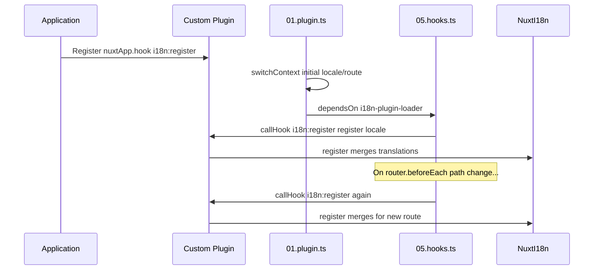

# 📢 Händelser

## 🔄 `i18n:register`

Händelsen `i18n:register` i `Nuxt I18n Micro` möjliggör dynamisk tillägg av översättningar till din applikations i18n-kontext, vilket gör internationaliseringsprocessen sömlös och flexibel. Denna händelse låter dig integrera nya översättningar vid behov och förbättra din applikations lokaliseringsförmåga.

### 📝 Händelsedetaljer

- **Syfte**:
  - Möjliggör dynamisk införlivning av ytterligare översättningar i den befintliga uppsättningen för en specifik lokal.

- **Payload**:
  - **`register`**:
    - En funktion som tillhandahålls av händelsen och som tar två argument:
      - **`translations`** (`Translations`):
        - Ett objekt som innehåller nyckel-värdepar med översättningar, organiserade enligt gränssnittet `Translations`.
      - **`locale`** (`string`, valfritt):
        - Lokalkoden (till exempel `'en'`, `'ru'`) för vilken översättningarna registreras. Standardvärdet är den lokal som händelsen tillhandahåller om inget anges.

- **Beteende**:
  - När den utlöses slår `register`-funktionen samman de nya översättningarna in i den aktuella kontexten för den angivna lokalen och uppdaterar tillgängliga översättningar i hela applikationen.

### ⏱️ När den utlöses

Modulens hooks-plugin (`05.hooks.ts`, `dependsOn: ['i18n-plugin-loader']`) anropar `nuxtApp.callHook('i18n:register', …)`:

1. **En gång vid start** — efter att den huvudsakliga i18n-pluginen (`01.plugin.ts`) har laddat översättningar för den initiala rutten
2. **Vid navigering** — i `router.beforeEach` när sökvägen ändras, eller vid varje navigering när `strategy: 'no_prefix'`

Registrera din lyssnare i ett vanligt Nuxt-plugin med `nuxtApp.hook('i18n:register', …)`. Hooks-pluginen körs efter att laddaren är klar, så din callback anropas när översättningar behöver utökas.

Sätt `hooks: false` i `nuxt.config` för att inaktivera automatiska `i18n:register`-anrop (se [Konfiguration — `hooks`](/guides/configuration#hooks)).

### 💡 Exempelanvändning

Följande exempel visar hur du använder händelsen `i18n:register` för att lägga till översättningar dynamiskt:

```typescript
nuxt.hook('i18n:register', async (register: (translations: unknown, locale?: string) => void, locale: string) => {
  register(
    {
      greeting: 'Hello',
      farewell: 'Goodbye',
    },
    locale,
  )
})
```

### 🛠️ Förklaring



- **Utlösning av händelsen**:
  - Hooks-pluginen (`05.hooks.ts`) triggar `i18n:register` efter att huvudladdaren är klar och vid relevanta navigeringar.

- **Lägga till översättningar**:
  - Exemplet registrerar engelska översättningar för `"greeting"` och `"farewell"`.
  - `register`-funktionen slår samman dessa översättningar med den befintliga uppsättningen för den angivna lokalen.

### 🔗 Viktiga fördelar

- **Dynamiska uppdateringar**:
  - Uppdatera eller lägg till översättningar utan att behöva distribuera om hela applikationen.

- **Lokaliseringsflexibilitet**:
  - Stödjer realtidsjusteringar av lokalisering baserat på användarens eller applikationens behov.

Genom att använda händelsen `i18n:register` kan du säkerställa att din applikations lokaliseringsstrategi förblir flexibel och anpassningsbar, vilket förbättrar den övergripande användarupplevelsen.

---

## 🛠️ Ändra översättningar med plugins

För att ändra översättningar dynamiskt i din Nuxt-applikation rekommenderas plugins. Plugins ger ett strukturerat sätt att hantera lokaliseringsuppdateringar, särskilt när du arbetar med moduler eller externa översättningsfiler.

### **Registrera pluginen**

Om du använder en modul, registrera pluginen där översättningsmodifieringar ska ske genom att lägga till den i modulens konfiguration:

```javascript
addPlugin({
  src: resolve('./plugins/extend_locales'),
})
```

Detta registrerar pluginen på `./plugins/extend_locales`, som hanterar dynamisk laddning och registrering av översättningar.

### **Implementera pluginen**

I pluginen kan du hantera lokalmodifieringar. Här är ett exempel på implementation i ett Nuxt-plugin:

```typescript
import { defineNuxtPlugin } from '#app'

export default defineNuxtPlugin(async (nuxtApp) => {
  // Function to load translations from JSON files and register them
  const loadTranslations = async (lang: string) => {
    try {
      const translations = await import(`../locales/${lang}.json`)
      return translations.default
    } catch (error) {
      console.error(`Error loading translations for language: ${lang}`, error)
      return null
    }
  }

  // Hook into the 'i18n:register' event to dynamically add translations
  // eslint-disable-next-line @typescript-eslint/ban-ts-comment
  // @ts-expect-error
  nuxtApp.hook('i18n:register', async (register: (translations: unknown, locale?: string) => void, locale: string) => {
    const translations = await loadTranslations(locale)
    if (translations) {
      register(translations, locale)
    }
  })
})
```

### 📝 Detaljerad förklaring

1. **Ladda översättningar**:

- `loadTranslations`-funktionen importerar översättningsfiler dynamiskt baserat på lokalen. Filerna förväntas ligga i katalogen `locales` och vara namngivna enligt lokalkoder (till exempel `en.json`, `de.json`).
- Vid lyckad laddning returneras översättningarna; annars loggas ett fel.

2. **Registrera översättningar**:

- Pluginen kopplar in sig i händelsen `i18n:register` med `nuxtApp.hook`.
- När händelsen utlöses anropas `register`-funktionen med de laddade översättningarna och motsvarande lokal.
- Detta slår samman de nya översättningarna med i18n-kontexten för den angivna lokalen och uppdaterar tillgängliga översättningar i hela applikationen.

### 🔗 Fördelar med att använda plugins för översättningsmodifieringar

- **Uppdelning av ansvar**:
  - Inkapsla lokaliseringslogik separat från den huvudsakliga applikationskoden, vilket underlättar hantering och underhåll.

- **Dynamisk och skalbar**:
  - Genom att ladda och registrera översättningar dynamiskt kan du uppdatera innehåll utan att behöva göra en fullständig omdistribution av applikationen. Detta är särskilt användbart för applikationer med ofta uppdaterat eller flerspråkigt innehåll.

- **Utökad lokaliseringsflexibilitet**:
  - Plugins låter dig ändra eller utöka översättningar efter behov och ger en mer anpassningsbar och responsiv lokaliseringsstrategi som möter användarpreferenser eller affärskrav.

Genom att anta detta tillvägagångssätt kan du effektivt utöka och modifiera din applikations lokalisering via en strukturerad och underhållbar process med plugins, vilket håller internationaliseringen anpassningsbar till förändrade behov och förbättrar den övergripande användarupplevelsen.
