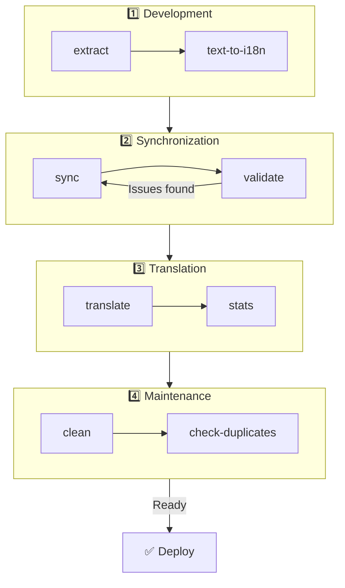

# 🌐 Guide för nuxt-i18n-micro-cli

## 📖 Introduktion

`nuxt-i18n-micro-cli` är ett kommandoradsverktyg utformat för att effektivisera lokaliserings- och internationaliseringsprocessen i Nuxt.js-projekt med modulen `nuxt-i18n-micro` (Nuxt I18n Micro). Det tillhandahåller verktyg för att extrahera översättningsnycklar från din kodbas, hantera översättningsfiler, synkronisera översättningar mellan lokaler och automatisera översättningsprocessen med externa översättningstjänster.

Denna guide går igenom installation, konfiguration och användning av `nuxt-i18n-micro-cli` för att effektivt hantera projektets översättningar. Paket på [npmjs.com](https://www.npmjs.com/package/nuxt-i18n-micro-cli).

## 🔧 Installation och installation

### 📦 Installera nuxt-i18n-micro-cli

Installera globalt eller som ett dev-beroende i ditt Nuxt-projekt (rekommenderas för CI):

```bash
# global
npm install -g nuxt-i18n-micro-cli

# or per project
pnpm add -D nuxt-i18n-micro-cli
pnpm exec i18n-micro text-to-i18n --dryRun
```

Använd **`nuxt-i18n-micro-cli` ≥ 2.1.1** om ditt projekt använder Nuxt 4:s `app/`-katalog (`app/pages`, `app/components` med flera). Äldre CLI-versioner skannade endast `pages/` i projektets rot.

### 🛠 Initiera i ditt projekt

Efter installation kan du köra `i18n-micro`-kommandon i ditt Nuxt.js-projekts katalog.

Se till att ditt projekt är uppsatt med `nuxt-i18n-micro` och har den nödvändiga konfigurationen i `nuxt.config.ts` (eller `nuxt.config.js`).

### 📄 Vanliga argument

- `--cwd`: Ange den aktuella arbetskatalogen (standard: `.`).
- `--logLevel`: Sätt loggnivån (`silent`, `info`, `verbose`).
- `--translationDir`: Katalog som innehåller JSON-översättningsfiler (standard: `locales`).

## 📊 Översikt av CLI-arbetsflöde



### Arbetsflödessteg

| Fas             | Kommandon                   | Syfte                             |
| --------------- | --------------------------- | --------------------------------- |
| **Utveckling**  | `extract`, `text-to-i18n`   | Hitta och extrahera översättningsnycklar |
| **Synk**        | `sync`, `validate`          | Säkerställ att alla lokaler har samma nycklar |
| **Översätt**    | `translate`, `stats`        | Autoöversätt saknade nycklar      |
| **Underhåll**   | `clean`, `check-duplicates` | Håll översättningar snygga        |

## 📋 Kommandon

### 🔄 Kommandot `text-to-i18n`

CLI-paket: [`nuxt-i18n-micro-cli`](https://www.npmjs.com/package/nuxt-i18n-micro-cli)

**Beskrivning**: Skannar Vue/TS/JS-filer efter hårdkodade användarvända strängar, ersätter dem med `$t('...')` och slår samman nya nycklar in i din JSON-översättningsfil. Kör från **Nuxt-projektets rot** (där `nuxt.config` ligger).

**Användning**:

```bash
i18n-micro text-to-i18n [options]
```

**Alternativ**:

| Alternativ              | Standard          | Beskrivning                                                           |
| ----------------------- | ----------------- | --------------------------------------------------------------------- |
| `--translationFile`     | `locales/en.json` | JSON-fil för nya nycklar (relativt projektroten).                     |
| `--path`                | —                 | Bearbeta endast en fil eller katalog (till exempel `app/pages/about.vue`). |
| `--context`             | —                 | Nyckelprefix (till exempel `auth` → `auth.*`).                        |
| `--dryRun`              | `false`           | Förhandsgranska utan att skriva filer.                                |
| `--verbose`             | `false`           | Extra loggning.                                                       |
| `--interactive`         | `false`           | Bekräfta eller redigera varje nyckel innan tillämpning.               |
| `--extractOnlyDirs`     | `plugins`         | Kataloger där nycklar extraheras men källfiler **inte** skrivs om.    |
| `--extractOnlyPatterns` | —                 | Glob-liknande mönster som endast extraheras (till exempel `**/*.plugin.ts`). |

**Exempel**:

```bash
i18n-micro text-to-i18n --translationFile locales/en.json --context auth --dryRun
```

#### Vilka mappar skannas?

<Info>
Sedan CLI **v2.1.1** skannar `text-to-i18n` både klassiska rotmappar och `app/*`-motsvarigheter. Kör kommandot från **projektroten** — gör inte `cd app`.
</Info>

Samlar `*.vue`, `*.js` och `*.ts` under:

| Nuxt 3 (projektrot)   | Nuxt 4 (`app/`-katalog)   |
| --------------------- | ------------------------- |
| `pages/`              | `app/pages/`              |
| `components/`         | `app/components/`         |
| `plugins/`            | `app/plugins/`            |
| `layouts/`            | `app/layouts/`            |

Andra mappar (`server/`, `composables/`, `middleware/` med flera) hoppas över om du inte använder `--path`. För Nuxt 4, kör från projektroten (ingen anledning att `cd app`). Matcha `i18n.translationDir` i `--translationFile` om det inte är `locales/`.

```bash
i18n-micro text-to-i18n --path app/pages
```

#### Så fungerar det

1. Samla filer från katalogerna ovan (eller från `--path`).
2. Ersätt literaler / malltext med `$t('generated.key')` (`plugins/` är endast extraherande som standard).
3. Slå samman nya nycklar in i `--translationFile` utan att ta bort befintliga poster.

**Exempel på transformationer**:

Före:

```vue
<template>
  <div>
    <h1>Welcome to our site</h1>
    <p>Please sign in to continue</p>
  </div>
</template>
```

Efter:

```vue
<template>
  <div>
    <h1>{{ $t('pages.home.welcome_to_our_site') }}</h1>
    <p>{{ $t('pages.home.please_sign_in') }}</p>
  </div>
</template>
```

**Bästa praxis**: kör en dry run först; commit:a innan en fullständig körning; anpassa `--translationFile` med `i18n.translationDir` i `nuxt.config`; behåll `--extractOnlyDirs plugins` för bootstrap-kod.

**Begränsningar**: separat npm-paket (inte buntat med modulen); läser inte `nuxt.config` automatiskt; genererar `$t(...)`; komplexa dynamiska strängar kan behöva `extract` / `search` i stället.

### 📊 Kommandot `stats`

**Beskrivning**: Kommandot `stats` används för att visa översättningsstatistik för varje lokal i ditt Nuxt.js-projekt. Det hjälper dig att förstå framstegen med dina översättningar genom att visa hur många nycklar som är översatta jämfört med det totala antalet tillgängliga nycklar.

**Användning**:

```bash
i18n-micro stats [options]
```

**Alternativ**:

- `--full`: Visa endast kombinerad översättningsstatistik (standard: `false`).

**Exempel**:

```bash
i18n-micro stats --full
```

### 🌍 Kommandot `translate`

**Beskrivning**: Kommandot `translate` översätter automatiskt saknade nycklar med externa översättningstjänster. Detta kommando förenklar översättningsprocessen genom att använda API:er från tjänster som Google Translate, DeepL och andra för att fylla i saknade översättningar.

**Användning**:

```bash
i18n-micro translate [options]
```

**Alternativ**:

- `--service`: Översättningstjänst att använda (till exempel `google`, `deepl`, `yandex`). Om inget anges kommer kommandot att fråga dig att välja en.
- `--token`: API-nyckel som motsvarar den valda översättningstjänsten. Om inget anges kommer du att uppmanas att ange den.
- `--options`: Ytterligare alternativ för översättningstjänsten, angivna som nyckel:värde-par, separerade med komma (till exempel `model:gpt-3.5-turbo,max_tokens:1000`).
- `--replace`: Översätt alla nycklar och ersätt befintliga översättningar (standard: `false`).

**Exempel**:

```bash
i18n-micro translate --service deepl --token YOUR_DEEPL_API_KEY
```

#### 🌐 Översättningstjänster som stöds

Kommandot `translate` stöder flera översättningstjänster. Några av de tjänster som stöds är:

- **Google Translate** (`google`)
- **DeepL** (`deepl`)
- **Yandex Translate** (`yandex`)
- **OpenAI** (`openai`)
- **Azure Translator** (`azure`)
- **IBM Watson** (`ibm`)
- **Baidu Translate** (`baidu`)
- **LibreTranslate** (`libretranslate`)
- **MyMemory** (`mymemory`)
- **Lingva Translate** (`lingvatranslate`)
- **Papago** (`papago`)
- **Tencent Translate** (`tencent`)
- **Systran Translate** (`systran`)
- **Yandex Cloud Translate** (`yandexcloud`)
- **ModernMT** (`modernmt`)
- **Lilt** (`lilt`)
- **Unbabel** (`unbabel`)
- **Reverso Translate** (`reverso`)

#### ⚙️ Tjänstkonfiguration

Vissa tjänster kräver specifika konfigurationer eller API-nycklar. När du använder kommandot `translate` kan du ange tjänsten och tillhandahålla den nödvändiga `--token` (API-nyckel) och ytterligare `--options` vid behov.

Till exempel:

```bash
i18n-micro translate --service openai --token YOUR_OPENAI_API_KEY --options openaiModel:gpt-3.5-turbo,max_tokens:1000
```

### 🛠️ Kommandot `extract`

**Beskrivning**: Extraherar översättningsnycklar från din kodbas och organiserar dem efter scope.

**Användning**:

```bash
i18n-micro extract [options]
```

**Alternativ**:

- `--prod, -p`: Kör i produktionsläge.

**Exempel**:

```bash
i18n-micro extract
```

### 🔄 Kommandot `sync`

**Beskrivning**: Synkroniserar översättningsfiler mellan lokaler och säkerställer att alla lokaler har samma nycklar.

**Användning**:

```bash
i18n-micro sync [options]
```

**Exempel**:

```bash
i18n-micro sync
```

### ✅ Kommandot `validate`

**Beskrivning**: Validerar översättningsfiler för saknade eller extra nycklar jämfört med referens-lokalen.

**Användning**:

```bash
i18n-micro validate [options]
```

**Exempel**:

```bash
i18n-micro validate
```

### 🧹 Kommandot `clean`

**Beskrivning**: Tar bort oanvända översättningsnycklar från översättningsfiler.

**Användning**:

```bash
i18n-micro clean [options]
```

**Exempel**:

```bash
i18n-micro clean
```

### 📤 Kommandot `import`

**Beskrivning**: Konverterar PO-filer tillbaka till JSON-format och sparar dem i översättningskatalogen.

**Användning**:

```bash
i18n-micro import [options]
```

**Alternativ**:

- `--potsDir`: Katalog som innehåller PO-filer (standard: `pots`).

**Exempel**:

```bash
i18n-micro import --potsDir pots
```

### 📥 Kommandot `export`

**Beskrivning**: Exporterar översättningar till PO-filer för extern översättningshantering.

**Användning**:

```bash
i18n-micro export [options]
```

**Alternativ**:

- `--potsDir`: Katalog för att spara PO-filer (standard: `pots`).

**Exempel**:

```bash
i18n-micro export --potsDir pots
```

### 🗂️ Kommandot `export-csv`

**Beskrivning**: Kommandot `export-csv` exporterar översättningsnycklar och värden från JSON-filer, inklusive deras filsökvägar, till ett CSV-format. Detta kommando är användbart för team som föredrar att arbeta med översättningsdata i kalkylprogram.

**Användning**:

```bash
i18n-micro export-csv [options]
```

**Alternativ**:

- `--csvDir`: Katalog där de exporterade CSV-filerna sparas.
- `--delimiter`: Ange en avgränsare för CSV-filen (standard: `,`).

**Exempel**:

```bash
i18n-micro export-csv --csvDir csv_files
```

### 📑 Kommandot `import-csv`

**Beskrivning**: Kommandot `import-csv` importerar översättningsdata från CSV-filer och uppdaterar motsvarande JSON-filer. Detta är användbart för att tillämpa bulkuppdateringar av översättningar från kalkylark.

**Användning**:

```bash
i18n-micro import-csv [options]
```

**Alternativ**:

- `--csvDir`: Katalog som innehåller CSV-filerna som ska importeras.
- `--delimiter`: Ange en avgränsare som används i CSV-filen (standard: `,`).

**Exempel**:

```bash
i18n-micro import-csv --csvDir csv_files
```

### 🧾 Kommandot `diff`

**Beskrivning**: Jämför översättningsfiler mellan standardlokalen och andra lokaler inom samma katalog (inklusive underkataloger). Kommandot identifierar saknade nycklar och deras värden i standardlokalen jämfört med andra lokaler, vilket gör det enklare att spåra översättningsframsteg eller avvikelser.

**Användning**:

```bash
i18n-micro diff [options]
```

**Exempel**:

```bash
i18n-micro diff
```

### 🔍 Kommandot `check-duplicates`

**Beskrivning**: Kommandot `check-duplicates` letar efter dubbletter av översättningsvärden inom varje lokal över alla översättningsfiler, inklusive både rotnivå- och sidspecifika översättningar. Det säkerställer att olika nycklar inom samma språk inte delar identiska översättningsvärden, vilket hjälper till att bibehålla tydlighet och konsistens i dina översättningar.

**Användning**:

```bash
i18n-micro check-duplicates [options]
```

**Exempel**:

```bash
i18n-micro check-duplicates
```

**Så fungerar det**:

- Kommandot kontrollerar både rotnivå- och sidspecifika översättningsfiler för varje lokal.
- Om ett översättningsvärde förekommer på flera platser (antingen inom rotnivåöversättningar eller mellan olika sidor) rapporteras dubblettvärdena tillsammans med filen och nyckeln där de finns.
- Om inga dubbletter hittas bekräftar kommandot att lokalen är fri från duplicerade översättningsvärden.

Detta kommando hjälper till att säkerställa att översättningsnycklar bibehåller unika värden och förhindrar oavsiktlig upprepning inom samma lokal.

### 🔄 Kommandot `replace-values`

**Beskrivning**: Kommandot `replace-values` låter dig utföra bulkersättningar av översättningsvärden över alla lokaler. Det stöder både enkla textersättningar och avancerade ersättningar med reguljära uttryck (regex). Du kan även använda fångstgrupper i regex-mönster och referera till dem i ersättningssträngen, vilket är idealiskt för mer komplexa ersättningsscenarier.

**Användning**:

```bash
i18n-micro replace-values [options]
```

**Alternativ**:

- `--search`: Texten eller regex-mönstret att söka efter i översättningar. Detta är ett obligatoriskt alternativ.
- `--replace`: Ersättningstexten som ska användas för de hittade översättningarna. Detta är ett obligatoriskt alternativ.
- `--useRegex`: Aktivera sökning med ett reguljärt uttrycksmönster (standard: `false`).

**Exempel 1**: Enkel ersättning

Ersätt strängen "Hello" med "Hi" över alla lokaler:

```bash
i18n-micro replace-values --search "Hello" --replace "Hi"
```

**Exempel 2**: Regex-ersättning

Aktivera regex-sökning och ersätt varje sträng som börjar med "Hello" följt av siffror (till exempel "Hello123") med "Hi" över alla lokaler:

```bash
i18n-micro replace-values --search "Hello\\d+" --replace "Hi" --useRegex
```

**Exempel 3**: Använda regex-fångstgrupper

Använd fångstgrupper för att dynamiskt infoga en del av den matchade strängen i ersättningen. Ersätt till exempel "Hello [name]" med "Hi [name]" samtidigt som namnet bevaras:

```bash
i18n-micro replace-values --search "Hello (\\w+)" --replace "Hi $1" --useRegex
```

I detta fall refererar `$1` till den första fångstgruppen, som matchar `[name]`-delen efter "Hello". Ersättningen behåller namnet från originalsträngen.

**Så fungerar det**:

- Kommandot skannar igenom alla översättningsfiler (både globala och sidspecifika).
- När en matchning hittas baserat på söksträngen eller regex-mönstret ersätts den matchade texten med den angivna ersättningen.
- När regex används kan fångstgrupper användas i ersättningssträngen genom att referera till dem med `$1`, `$2` och så vidare.
- Alla ändringar loggas och visar filsökvägen, översättningsnyckeln och före/efter-tillståndet för översättningsvärdet.

**Loggning**:
För varje ersättning loggar kommandot detaljer inklusive:

- Lokal och filsökväg
- Översättningsnyckeln som ändras
- Det gamla värdet och det nya värdet efter ersättning
- Om regex med fångstgrupper används visar loggarna gruppmatchningarna och hur de ersattes.

Detta låter dig spåra exakt var och vad som ändrades under ersättningsoperationen och ger en tydlig historik över modifieringar i dina översättningsfiler.

## 🛠 Exempel

- **Extrahera översättningar**:

  ```bash
  i18n-micro extract
  ```

- **Översätta saknade nycklar med Google Translate**:

  ```bash
  i18n-micro translate --service google --token YOUR_GOOGLE_API_KEY
  ```

- **Översätta alla nycklar och ersätta befintliga översättningar**:

  ```bash
  i18n-micro translate --service deepl --token YOUR_DEEPL_API_KEY --replace
  ```

- **Validera översättningsfiler**:

  ```bash
  i18n-micro validate
  ```

- **Rensa oanvända översättningsnycklar**:

  ```bash
  i18n-micro clean
  ```

- **Synkronisera översättningsfiler**:

  ```bash
  i18n-micro sync
  ```

## ⚙️ Konfigurationsguide

`nuxt-i18n-micro-cli` förlitar sig på din Nuxt.js-i18n-konfiguration i `nuxt.config.ts` (eller `nuxt.config.js`). Se till att du har `nuxt-i18n-micro`-modulen installerad och konfigurerad.

### 🔑 Exempel på nuxt.config.js

```ts
export default defineNuxtConfig({
  modules: ['nuxt-i18n-micro'],
  i18n: {
    locales: [
      { code: 'en', iso: 'en-US' },
      { code: 'fr', iso: 'fr-FR' },
    ],
    defaultLocale: 'en',
    fallbackLocale: 'en',
    translationDir: 'locales', // or 'app/locales' for Nuxt 4 colocation
  },
})
```

Se till att `translationDir` matchar den katalog som används av `nuxt-i18n-micro-cli` (standard är `locales`).

## 📝 Bästa praxis

### 🔑 Konsekvent namngivning av nycklar

Se till att översättningsnycklar är konsekventa och beskrivande för att undvika förvirring och dubbletter.

### 🧹 Regelbunden underhåll

Använd kommandot `clean` regelbundet för att ta bort oanvända översättningsnycklar och hålla dina översättningsfiler rena.

### 🛠 Automatisera översättningsarbetsflödet

Integrera `nuxt-i18n-micro-cli`-kommandon i ditt utvecklingsarbetsflöde eller CI/CD-pipeline för att automatisera extrahering, översättning, validering och synkronisering av översättningsfiler.

### 🛡️ Skydda API-nycklar

När du använder översättningstjänster som kräver API-nycklar, se till att dina nycklar hålls säkra och inte incheckas i versionshanteringssystem. Överväg att använda miljövariabler eller säkra nyckelhanteringslösningar.

## 📞 Support och bidrag

Om du stöter på problem eller har förslag på förbättringar är du välkommen att bidra till projektet eller öppna ett issue i projektets arkiv.

---

Genom att följa denna guide kan du effektivt hantera översättningar i ditt Nuxt.js-projekt med `nuxt-i18n-micro-cli`, effektivisera dina internationaliseringsinsatser och säkerställa en smidig upplevelse för användare i olika lokaler.
