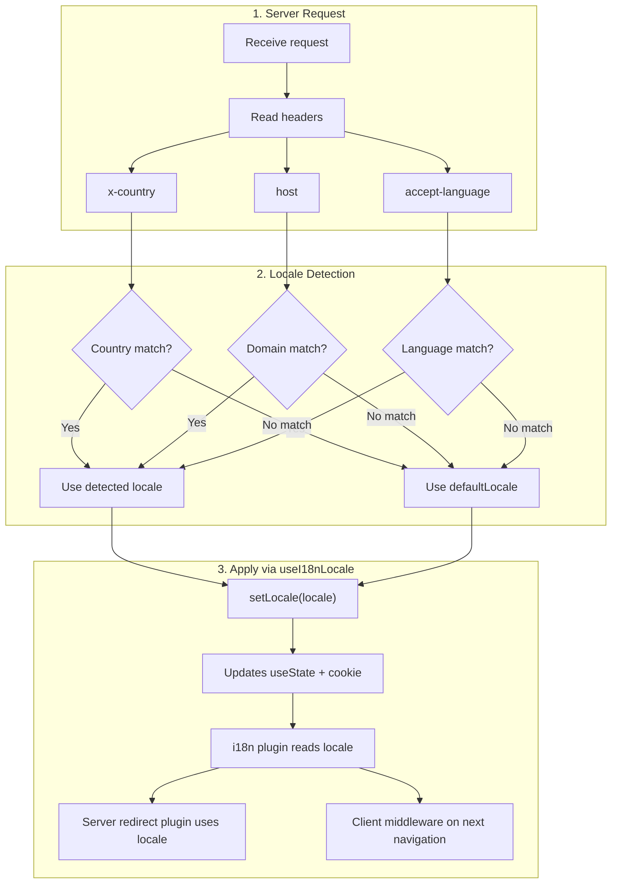

# 🔧 Anpassad språkdetektering i Nuxt I18n Micro

## 📖 Översikt

Nuxt I18n Micro v3 tillhandahåller en centraliserad composable — `useI18nLocale()` — för all lokalhantering. Denna ersätter de manuella `useState`/`useCookie`-mönstren från v2. Genom att använda `useI18nLocale().setLocale()` i ett server-plugin kan du implementera valfri anpassad detekteringslogik samtidigt som du behåller full kompatibilitet med modulens omdirigerings- och cookiesystem.

## 🏗️ Arkitektur

```mermaid
flowchart TB
    subgraph Plugins["Plugin Execution Order"]
        A["Your plugin<br/>order: -10"] -->|setLocale()| B["01.plugin.ts<br/>order: -5"]
        B --> C["06.redirect.ts server<br/>order: 10"]
    end

    subgraph Client["Client SPA Navigation"]
        D["i18n-redirect.global.ts<br/>route middleware"]
    end

    subgraph State["Locale State"]
        E["useState('i18n-locale')"]
        F["localeCookie"]
    end

    A -->|"setLocale() updates both"| E
    A -->|"setLocale() updates both"| F
    B -->|reads| E
    C -->|reads| E
    C -->|reads| F
    D -->|reads target route +| E
```

**Nyckelprincip**: Anropa `useI18nLocale().setLocale()` i ett server-plugin med `order: -10`. Detta uppdaterar både `useState('i18n-locale')` och lokal-cookien atomiskt, så att i18n-pluginen (`order: -5`) och serverns omdirigeringsplugin (`order: 10`) ser rätt lokal vid den första SSR-förfrågan. Klientautomatiska omdirigeringar körs i den globala route-middlewaren vid efterföljande navigeringar.

## 🛠️ Inaktivera inbyggd autodetektering

Om du vill ha full kontroll över lokaldetekteringen, inaktivera den inbyggda mekanismen:

```ts
export default defineNuxtConfig({
  i18n: {
    autoDetectLanguage: false,
  },
})
```

## ✨ Exempel: Serverbaserad detektering med `useI18nLocale`

Detta är det **rekommenderade tillvägagångssättet** för alla strategier.

### Steg 1: Konfigurera `nuxt.config.ts`

```ts
export default defineNuxtConfig({
  modules: ['nuxt-i18n-micro'],
  i18n: {
    strategy: 'no_prefix', // Works with ANY strategy
    defaultLocale: 'en',
    localeCookie: 'user-locale',
    autoDetectLanguage: false,
    locales: [
      { code: 'en', iso: 'en-US' },
      { code: 'de', iso: 'de-DE' },
      { code: 'ja', iso: 'ja-JP' },
    ],
  },
})
```

### Steg 2: Skapa `plugins/i18n-loader.server.ts`

```ts
import { defineNuxtPlugin, useRequestHeaders } from '#imports'

export default defineNuxtPlugin({
  name: 'i18n-custom-loader',
  enforce: 'pre',
  order: -10, // Execute BEFORE the i18n plugin (which has order -5)

  setup() {
    const { setLocale } = useI18nLocale()
    const headers = useRequestHeaders(['host', 'x-country', 'accept-language'])
    let detectedLocale = 'en'

    // --- YOUR DETECTION LOGIC ---

    // Example 1: By domain
    const host = headers['host']
    if (host?.includes('example.de')) {
      detectedLocale = 'de'
    }
    // Example 2: By custom header
    else if (headers['x-country'] === 'JP') {
      detectedLocale = 'ja'
    }
    // Example 3: By Accept-Language header
    else if (headers['accept-language']?.includes('de')) {
      detectedLocale = 'de'
    }

    // --- APPLY THE LOCALE ---
    setLocale(detectedLocale)
  },
})
```

### Så fungerar det



1. **Pluginen körs först** (`order: -10`) — detekterar lokal från headers, domän eller andra källor
2. **`setLocale()` uppdaterar båda** `useState('i18n-locale')` och cookie — säkerställer omedelbar synlighet för alla efterföljande plugins
3. **i18n-pluginen** (`order: -5`) läser lokalen och laddar korrekta översättningar
4. **Serverns omdirigeringsplugin** (`order: 10`) använder lokalen för omdirigeringsbeslut på SSR
5. **Klientens route-middleware** (`i18n-redirect`) tillämpar omdirigeringar vid SPA-navigering när URL-lokalen inte matchar preferensen

## 🌐 Strategispecifikt beteende

`useI18nLocale().setLocale()` fungerar med **alla strategier**. Omdirigeringsbeteendet beror på strategin:

<Tip>
| Strategi | Effekt av `setLocale('de')` |
|----------|---------------------------|
| `no_prefix` | Renderas på tyska, ingen URL-ändring |
| `prefix` | 302 → `/de/` (serverbaserad omdirigering) |
| `prefix_except_default` | 302 → `/de/` om `de` ≠ standard; ingen omdirigering om `de` = standard |
| `prefix_and_default` | Ingen omdirigering (både `/` och `/de/` är giltiga) |
</Tip>

**Viktiga anmärkningar:**

- Cookiebaserad lokaldetektering är inaktiverad som standard (`localeCookie: null`)
- Sätt `localeCookie: 'user-locale'` för att aktivera cookie-beständighet
- Om värdet i cookie/state inte finns i listan `locales` faller det tillbaka till `defaultLocale`

## 🏢 Avancerat: Domänbaserad detektering

För uppsättningar med flera domäner där varje domän levererar en annan lokal:

```ts
import { defineNuxtPlugin, useRequestHeaders } from '#imports'

export default defineNuxtPlugin({
  name: 'i18n-domain-loader',
  enforce: 'pre',
  order: -10,

  setup() {
    const { setLocale } = useI18nLocale()
    const headers = useRequestHeaders(['host'])
    const host = headers['host'] || ''

    let detectedLocale = 'en'

    if (host.endsWith('.de') || host.includes('german.')) {
      detectedLocale = 'de'
    } else if (host.endsWith('.fr') || host.includes('french.')) {
      detectedLocale = 'fr'
    } else if (host.endsWith('.jp') || host.includes('japanese.')) {
      detectedLocale = 'ja'
    }

    setLocale(detectedLocale)
  },
})
```

## 🔄 Avancerat: Respektera användarpreferens

Om användare kan byta språk manuellt, respektera deras val framför autodetektering:

```ts
import { defineNuxtPlugin, useRequestHeaders } from '#imports'

export default defineNuxtPlugin({
  name: 'i18n-smart-loader',
  enforce: 'pre',
  order: -10,

  setup() {
    const { getLocale, setLocale } = useI18nLocale()

    // If user already has a preference (from cookie), respect it
    if (getLocale()) {
      return
    }

    // Otherwise, detect locale from headers
    const headers = useRequestHeaders(['accept-language'])
    let detectedLocale = 'en'

    const acceptLanguage = headers['accept-language'] || ''
    if (acceptLanguage.includes('de')) {
      detectedLocale = 'de'
    } else if (acceptLanguage.includes('ja')) {
      detectedLocale = 'ja'
    }

    setLocale(detectedLocale)
  },
})
```

## ⚙️ Endast-server- eller endast-klient-plugins

Använd [Nuxts filnamnskonventioner](https://nuxt.com/docs/getting-started/directory-structure#plugins) för att styra var din plugin körs:

- **Endast server**: `i18n-loader.server.ts` — körs endast under SSR (rekommenderas för header-baserad detektering)
- **Endast klient**: `i18n-loader.client.ts` — körs endast i webbläsaren (för detektering baserad på `localStorage` eller DOM)


## ✅ Sammanfattning

| Funktion                               | Beskrivning                                                        |
| -------------------------------------- | ------------------------------------------------------------------ |
| `useI18nLocale().setLocale()`          | Uppdaterar `useState` + cookie atomiskt; fungerar med alla strategier |
| `useI18nLocale().getLocale()`          | Returnerar aktuell lokal från state eller cookie                   |
| `useI18nLocale().getPreferredLocale()` | Returnerar föredragen lokal (validerad mot listan `locales`)       |
| Plugin `order: -10`                    | Säkerställer att din plugin körs före i18n-initieringen            |
| `enforce: 'pre'`                       | Körs i "pre"-plugin-gruppen                                        |

**Gör INTE:**

- Använd `useCookie('user-locale')` direkt — `useI18nLocale()` hanterar cookies internt
- Använd `useState('i18n-locale')` direkt — använd `useI18nLocale().setLocale()` i stället
- Sätt `order` >= -5 — din plugin måste köras före i18n-pluginen
