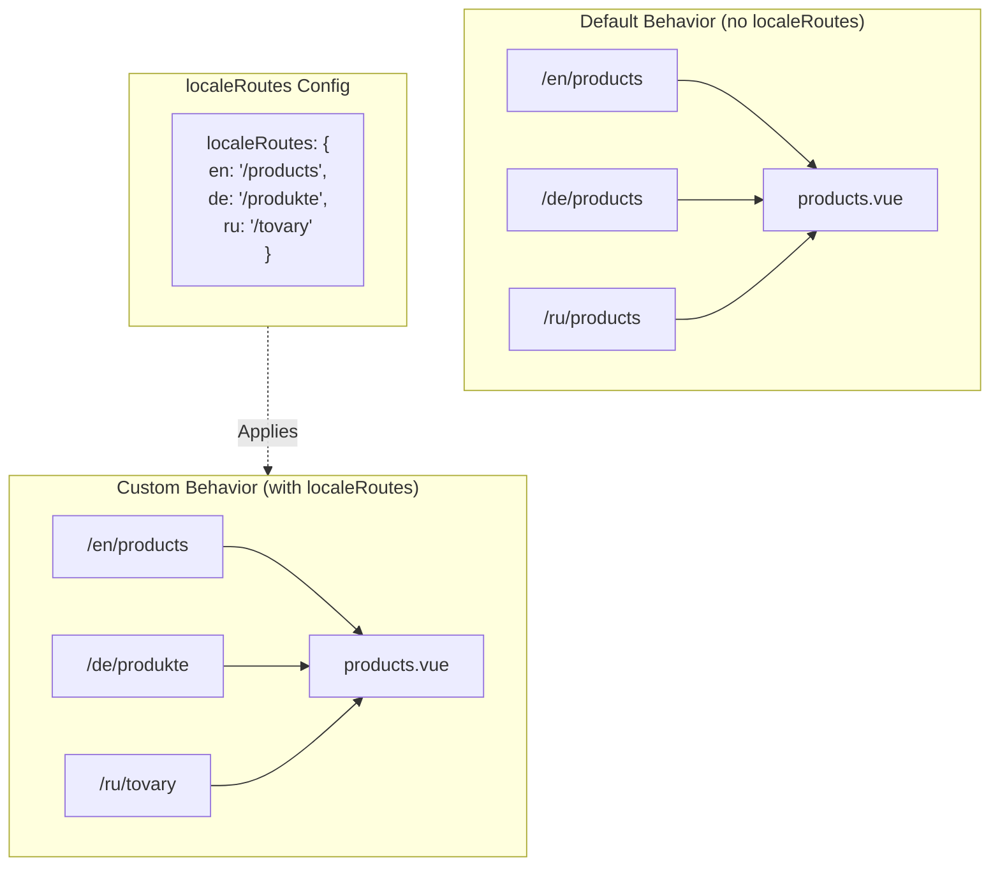

# 🔗 Anpassade lokaliserade rutter med `localeRoutes` i `Nuxt I18n Micro`

## 📖 Introduktion till `localeRoutes`

Funktionen `localeRoutes` i `Nuxt I18n Micro` låter dig definiera anpassade rutter för specifika lokaler och erbjuder flexibilitet och kontroll över applikationens routingstruktur. Denna funktion är särskilt användbar när vissa lokaler kräver olika URL-strukturer, skräddarsydda sökvägar eller behöver följa specifika regionala eller språkliga konventioner.

## 🚀 Primär användning av `localeRoutes`

Den primära användningen av `localeRoutes` är att tillhandahålla distinkta rutter för olika lokaler, vilket förbättrar användarupplevelsen genom att säkerställa att URL:er är intuitiva och relevanta för målgruppen. Du kan till exempel ha olika sökvägar för engelska och ryska versioner av en sida, där den ryska lokalen följer ett lokaliserat URL-format.

### 📄 Exempel: Definiera `localeRoutes` i `$defineI18nRoute`

Här är ett exempel på hur du kan definiera anpassade rutter för specifika lokaler med `localeRoutes` i funktionen `$defineI18nRoute`:

```typescript
import { useNuxtApp } from '#imports'

const { $defineI18nRoute } = useNuxtApp()

$defineI18nRoute({
  localeRoutes: {
    ru: '/localesubpage', // Custom route path for the Russian locale
    de: '/lokaleseite', // Custom route path for the German locale
  },
})
```

> [!IMPORTANT]
> `$defineI18nRoute` är inte en global funktion. I `script setup`, hämta den från `useNuxtApp()` först och anropa den sedan.

### 🔄 Så fungerar `localeRoutes`



- **Standardbeteende**: Utan `localeRoutes` använder alla lokaler en gemensam ruttstruktur som definieras av den primära sökvägen.
- **Anpassat beteende**: Med `localeRoutes` kan specifika lokaler ha egna rutter, som åsidosätter standardsökvägen med lokalspecifika rutter som definieras i konfigurationen.

## 🌱 Användningsfall för `localeRoutes`

### 📄 Exempel: Använda `localeRoutes` på en sida

Här är en enkel Vue-komponent som demonstrerar användningen av `$defineI18nRoute` med `localeRoutes`:

```vue
<template>
  <div>
    <!-- Display greeting message based on the current locale -->
    <p>{{ $t('greeting') }}</p>

    <!-- Navigation links -->
    <div>
      <NuxtLink :to="$localeRoute({ name: 'index' })"> Go to Index </NuxtLink>
      |
      <NuxtLink :to="$localeRoute({ name: 'about' })"> Go to About Page </NuxtLink>
    </div>
  </div>
</template>

<script setup>
import { useNuxtApp } from '#imports'

const { $getLocale, $switchLocale, $getLocales, $localeRoute, $t, $defineI18nRoute } = useNuxtApp()

// Define translations and custom routes for specific locales
$defineI18nRoute({
  localeRoutes: {
    ru: '/localesubpage', // Custom route path for Russian locale
  },
})
</script>
```

### 🛠️ Använda `localeRoutes` i olika kontexter

- **Landningssidor**: Använd anpassade rutter för att lokalisera URL:er för landningssidor och säkerställa att de överensstämmer med marknadsföringskampanjer.
- **Dokumentationssidor**: Tillhandahåll distinkta rutter för varje lokal för att bättre matcha den lokaliserade innehållsstrukturen.
- **E-handelssidor**: Skräddarsy produkt- eller kategori-URL:er per lokal för förbättrad SEO och användarupplevelse.

## Använda navigering med `localeRoutes`

Eftersom lokaliserade rutter inte direkt matchar filnamn i sidkatalogen behöver du referera till din navigering med objekt snarare än med namn.

```vue
<template>
  /**
   * Exemple page: /pages/about-us.vue
   * EN /about-us
   * ES /sobre-nosotros
   * FR /a-propos
   */

  // Using NuxtLink
  <NuxtLink :to="$localeRoute({ name: 'about-us' })">
    Go to About Page
  </NuxtLink>

  // Using I18nLink
  <I18nLink :to="{ name: 'about-us' }">
    Go to About Page
  </NuxtLink>

  // The string literal navigation wouldn't work for any locale but english
  <I18nLink to="/about-us">
    Go to About Page
  </NuxtLink>
</template>
```

### Namngivning av nästlade sidor

Som standard namnges dina sidor baserat på deras fil- och sökvägsnamn. Det innebär:

- `/pages/about-us.vue` kan nås med `$localeRoute(\{ name: 'about-us' \})`
- `/pages/about-us/physical-stores.vue` kan nås med `$localeRoute(\{ name: 'about-us-physical-stores' \})`

För att åsidosätta detta beteende, namnge din sida explicit med `definePageMeta`.

```vue
// /pages/about-us/physical-stores.vue
<script setup>
definePageMeta({
  name: 'our-stores'
})
```

Denna sida kan nu refereras med antingen `$localeRoute` eller `I18nLink` med sitt namn `:to='\{ name: "our-stores" \}'`.

## 🎯 Dynamiska rutter med slugs och `$setI18nRouteParams`

När du arbetar med dynamiska rutter som innehåller slugs eller parametrar kan du använda `localeRoutes` med dynamiska segment och `$setI18nRouteParams` för att tillhandahålla lokalspecifika slugs för varje lokal.

### Dynamiska ruttparametrar i `localeRoutes`

Du kan definiera dynamiska rutter med Nuxts syntax för ruttparametrar (`[...slug]` för catch-all-rutter, `[param]` för enskilda parametrar eller `:param()` för namngivna parametrar):

```vue
<script setup lang="ts">
import { useNuxtApp, useRoute, useFetch, createError } from '#imports'

const { $defineI18nRoute, $setI18nRouteParams } = useNuxtApp()

// Define custom routes with dynamic segments
$defineI18nRoute({
  localeRoutes: {
    en: '/our-products/[...slug]',
    es: '/nuestros-productos/[...slug]',
  },
})
</script>
```

### Sätta lokalspecifika ruttparametrar

Funktionen `$setI18nRouteParams` låter dig sätta olika parametervärden (som slugs) för varje lokal. Detta är särskilt användbart när ditt innehåll har lokalspecifika URL:er.

**Viktigt**: `$setI18nRouteParams` bör anropas efter att data som innehåller lokalspecifika slugs har hämtats, vanligtvis inuti `useFetch` eller `useAsyncData`.

```vue
<script setup lang="ts">
import { useNuxtApp, useRoute, useFetch, createError } from '#imports'

interface Product {
  title: string
  price: string
  urlEn: string // English slug
  urlEs: string // Spanish slug
}

const { $defineI18nRoute, $setI18nRouteParams } = useNuxtApp()

const route = useRoute()
const slug = Array.isArray(route.params.slug) ? route.params.slug[0] : route.params.slug

// Fetch product data that includes locale-specific slugs
const { data: product, error } = await useFetch<Product>(`/api/product/${slug}`)
if (error.value)
  throw createError({
    statusCode: error.value?.statusCode,
    statusMessage: error.value?.statusMessage,
    fatal: true,
  })

// Define custom routes with dynamic segments
$defineI18nRoute({
  localeRoutes: {
    en: '/our-products/[...slug]',
    es: '/nuestros-productos/[...slug]',
  },
})

// Set different slugs for different locales
if (product.value) {
  $setI18nRouteParams({
    en: { slug: product.value.urlEn },
    es: { slug: product.value.urlEs },
  })
}
</script>
```

### Fullständigt exempel: Produktsidor med lokalspecifika slugs

Här är ett fullständigt exempel som visar hur du använder `localeRoutes` och `$setI18nRouteParams` tillsammans för en produktdetaljsida:

```vue
<template>
  <div v-if="product">
    <h1>{{ product.title }}</h1>
    <p>{{ $t('price') }}: {{ product.price }}</p>
    <div class="locale-switcher">
      <a :href="$switchLocalePath('en')">English</a>
      <a :href="$switchLocalePath('es')">Español</a>
    </div>
  </div>
</template>

<script setup lang="ts">
import { useNuxtApp, useRoute, useFetch, createError } from '#imports'

interface Product {
  title: string
  price: string
  urlEn: string
  urlEs: string
}

const { $t, $defineI18nRoute, $setI18nRouteParams, $switchLocalePath } = useNuxtApp()

// Set page name for easier navigation
definePageMeta({ name: 'product-slug' })

const route = useRoute()
const slug = Array.isArray(route.params.slug) ? route.params.slug[0] : route.params.slug

// Fetch product data
const { data: product, error } = await useFetch<Product>(`/api/product/${slug}`)
if (error.value)
  throw createError({
    statusCode: error.value?.statusCode,
    statusMessage: error.value?.statusMessage,
    fatal: true,
  })

// Define locale-specific routes with dynamic segments
$defineI18nRoute({
  localeRoutes: {
    en: '/our-products/[...slug]',
    es: '/nuestros-productos/[...slug]',
  },
})

// Set locale-specific slugs so $switchLocalePath works correctly
if (product.value) {
  $setI18nRouteParams({
    en: { slug: product.value.urlEn },
    es: { slug: product.value.urlEs },
  })
}
</script>
```

### Exempel: Produktlistsida

När du länkar till dynamiska rutter från en listsida, använd ruttnamnet med parametrar:

```vue
<template>
  <div>
    <h1>{{ $t('title') }}</h1>
    <ul>
      <li v-for="product in products?.[$getLocale()] || []" :key="product.id">
        <I18nLink :to="{ name: 'product-slug', params: { slug: product.url } }"> {{ product.title }} – {{ product.price }} </I18nLink>
      </li>
    </ul>
  </div>
</template>

<script setup lang="ts">
import { useNuxtApp, useFetch, createError } from '#imports'

interface Product {
  id: string
  title: string
  price: string
  url: string
}

type ProductsByLocale = Record<string, Product[]>

const { $t, $defineI18nRoute, $getLocale } = useNuxtApp()

const { data: products, error } = await useFetch<ProductsByLocale>('/api/product')
if (error.value)
  throw createError({
    statusCode: error.value?.statusCode,
    statusMessage: error.value?.statusMessage,
    fatal: true,
  })

$defineI18nRoute({
  locales: {
    en: {
      title: 'Our Product Range',
      description: 'Discover our collection of high-quality products.',
    },
    es: {
      title: 'Nuestra Gama de Productos',
      description: 'Descubra nuestra colección de productos de alta calidad.',
    },
  },
  localeRoutes: {
    en: '/our-products',
    es: '/nuestros-productos',
  },
})
</script>
```

### Så fungerar det

1. **Ruttdefinition**: `localeRoutes` definierar bas-sökvägsstrukturen för varje lokal, inklusive dynamiska segment som `[...slug]` eller `[id]`.

2. **Parametersättning**: `$setI18nRouteParams` sätter de faktiska parametervärdena för varje lokal. När en användare byter lokal med `$switchLocalePath` använder modulen dessa parametrar för att konstruera rätt URL.

3. **Parameterformat**: Parameterobjektet ska matcha strukturen:

   ```typescript
   {
     [localeCode]: {
       [paramName]: paramValue
     }
   }
   ```

4. **Navigering**: Använd `I18nLink` eller `$localeRoute` med ruttnamnet och parametrarna för att navigera mellan lokaliserade versioner av dynamiska rutter.

### Viktiga anmärkningar

- **Timing**: `$setI18nRouteParams` bör anropas efter att data som innehåller lokalspecifika slugs har hämtats, vanligtvis inuti `useFetch` eller `useAsyncData`.

- **Parameternamn**: Parameternamnen i `$setI18nRouteParams` måste matcha ruttparameternamnen (till exempel `slug` för `[...slug]` eller `id` för `[id]`).

- **Ruttnamn**: När du använder `definePageMeta(\{ name: 'route-name' \})`, använd detta namn när du länkar till rutten med `I18nLink` eller `$localeRoute`.

- **Catch-all-rutter**: För catch-all-rutter (`[...slug]`) ska slug-parametern vara en array eller en sträng som konverteras till en array.

## 🧩 Programmatiska rutter (`pages:extend`) — #244

Rutter som skapas i `pages:extend` har ingen plats för `defineI18nRoute()`, och flera rutter delar ofta en wrapper-SFC. Filnyckelbaserad skanning kollapsar dem sedan på en enda post.

Placera **inte** lokaliserade sökvägar i `route.meta` (de skulle skickas med i klientens rutt-tabell). Behåll ett register och projicera det två gånger:

1. in i `pages:extend` (skapar Nuxt-rutterna)
2. in i `i18n.globalLocaleRoutes` nyckelat efter ruttens **namn** (inte filsökväg)

Använd `splitLocaleRoutes` från `@i18n-micro/utils/split-locale-routes`:

```typescript
import { splitLocaleRoutes } from '@i18n-micro/utils/split-locale-routes'

const dynamic = splitLocaleRoutes([
  {
    name: 'products_tag',
    path: '/products/:tag',
    file: '~/pages/_dynamic.vue',
    paths: { fr: '/produits/:tag', de: '/produkte/:tag' },
  },
  {
    name: 'products_category',
    path: '/products/category/:category',
    file: '~/pages/_dynamic.vue',
    paths: { fr: '/produits/categorie/:category' },
  },
  // Disable localization for a programmatic route:
  // { name: 'internal', path: '/internal', file: '~/pages/_dynamic.vue', paths: false },
])

export default defineNuxtConfig({
  hooks: {
    'pages:extend'(pages) {
      pages.push(...dynamic.pages)
    },
  },
  i18n: {
    globalLocaleRoutes: dynamic.globalLocaleRoutes,
  },
})
```

Båda halvorna förblir synkade; delade wrappers skriver inte längre över varandra. `globalLocaleRoutes` ensamt räcker inte — det anpassar endast sökvägar för rutter som redan finns i Nuxts sidtabell.

## 📝 Bästa praxis för att använda `localeRoutes`

- **🚀 Använd för relevanta lokaler**: Tillämpa `localeRoutes` främst där URL-strukturen påverkar användarupplevelsen eller SEO betydligt. Undvik överanvändning för mindre skillnader.
- **🔧 Bibehåll konsistens**: Behåll ett konsekvent routingmönster mellan lokaler om det inte finns en stark anledning att avvika. Detta hjälper till att bibehålla tydlighet och minska komplexitet.
- **📚 Dokumentera anpassade rutter**: Dokumentera tydligt eventuella anpassade rutter du definierar med `localeRoutes`, särskilt i modulära applikationer, för att säkerställa att teammedlemmar förstår routinglogiken.
